# 1. Введение

Под термином **операционная система** скрываются 2 определения:

+ *в широком смысле* - весь пакет программ, включающий как функционал по управлению ресурсами компьютера, так и сопроводительные стандартные средства: интерпретатор командной строки, графический интерфейс, утилиты и редакторы;
+ *в узком смысле* - только набор основных модулей, управляющих ресурсами компьютера (оперативная память, хранилища, сеть, процессорное время) и занимающихся их распределением.

Для второго определения также используется термин **ядро (kernel)** операционной системы. У работающей операционной системы имеется всего *одно ядро*. *Ядро* выполняет следующие функции:

+ **управление процессами** - ядро выполняет загрузку программ с диска в оперативную память, запуск их выполнения на процессоре, а также финальное освобождение занимаемых ими ресурсов. Запущенный экземпляр программы называют **процессом**. Помимо *создания и завершения процессов* ядро осуществляет их *диспетчеризацию* - контроль доступа к ограниченному объему общих резделяемых ресурсов системы. Linux является *многозадачной ОС с вытеснением* - одновременно могут выполняться несколько процессов, а их менеджментом занимается *диспетчер процессов ядра*;
+ **управление памятью** - Linux применяет технологию управления **виртуальной памятью**, которая позволяет изолировать процессы и закрыть им доступ к чужим данным. Виртуальная память также повышает эффективность использования имеющегося объема *физической памяти* посредством размещения в нем только тех данных процесса, которые реально требуются ему в текущий момент - в результате в оперативную память одновременно может быть загружено большее число различных программ;
+ **управление устройствами** - ядро предоставляет процессам программные интерфейсы доступа ко всем подключенным периферийным устройствам: устройствам ввода и вывода, накопителям, всевозможным картам расширения, последовательному порту. Также ядро предоставляет унифицированный интерфейс **виртуальной файловой системы**, обеспечивающий единообразный способ обращения к данным на накопителях различной архитектуры;
+ **управление сетью** - ядро включает в себя реализацию стека протоколов TCP/IP и обеспечивает выход в сеть через *интерфейс сокетов*;
+ **управление пользователями** - ядро предоставляет каждому зарегистрированному пользователю собственное независимое рабочее пространство, а также контролирует соблюдение им *прав доступа* к ресурсам ОС и данным других пользователей.
+ **предоставление API ядра** - все описанные выше, а также прочие интерфейсы, предоставляемые ядром, объединяются в общий программный интерфейс **системных вызовов** - своеобразных точек входа в ядро, через которые процесс может запросить у операционной системы выполнение требуемых ему операций.

**Оболочка (shell)** - программа, осуществляющая чтение *пользовательских команд* и использующая функционал ядра для их выполнения. Оболочка НЕ является частью ядра и разрабатывается отдельно. Существует множество различных оболочек: *sh, csh, ksh, bash, zsh*. *Оболочкой входа в систему* называют процесс, создаваемый для запуска программы оболочки при первом входе пользователя в систему.

**Системный вызов** - программная точка входа в ядро, позволяющая процессу запрашивать у операционной системы выполнения желаемых операций. Совокупность системных вызовов, реализованных на языке C, образует *API операционной системы*. При выполнении системный вызов переводит процессор из **пользовательского режима** в **режим ядра**, который открывает ему доступ к *пространству памяти ядра*, содержащему служебные структуры данных операционной системы, а также позволяет вызывать защищенные инструкции (обращение к устройствам, управление памятью, ввод-вывод на устройствах). Каждый системный вызов идентифицируется по *уникальному номеру* и имеет строго определенный набор аргументов.

Выполнение *системного вызова* происходит следующим образом:

1. Прикладная программа инициирует системный вызов, вызвая *функцию-оболочку* из *стандартной библиотеки C*;
2. Функция-оболочка валидирует переданные ей *аргументы системного вызова*, а затем копирует их со своего *стека* в набор регистров процессора, где их ожидает ядро;
3. Функция-оболочка помещает *номер системного вызова* в регистр `eax`;
4. Функция-оболочка выполняет *машинную инструкцию системного прерывания* `int 0x80`, переключающую процессор в *режим ядра* и инициирующую выполнение её *обработчика прерывания*. Современные архитектуры процессоров предоставляют специальную инструкцию `sysenter`, реализующую данный функционал более эффективным способом;
5. Ядро выполняет *обработчик прерывания* `system_call()`, который:
   1. сохраняет текущие значения регистров процессора в *стеке ядра*;
   2. вызывает *функцию обслуживания* переданного *номера системного вызова* `sys_ИМЯ_ВЫЗОВА()`, которая выполняет требуемую операцию, а затем возвращает *код возврата*;
   3. восстанавливает со *стека ядра* значения регистров процессора и помещает *возвращаемое значение* в *стек прикладной программы*;
   4. передаёт управление функции-оболочке, переводя процессор обратно в *пользовательский режим*;
6. Если возвращенное *обработчиком прерывания* значение свидетельствует об ошибке, то оно помещается в глобальную переменную `errno`;
7. Функция-оболочка завершается, возвращая прикладной программе значение, которое указывает на успех (*неотрицательное число*) или неудачу (*отрицательное число*) системного вызова.

**Выполнение** любого **системного вызова** происходит **атомарно**! Ядро гарантирует, что совершаемая им последовательность действий будет представлять собой единую неделимую операцию, которая не может быть прервана другим процессом или *потоком* - системный вызов либо успешно завершается, либо возвращает ошибку.

Помимо непосредственных функций-оболочек *стандартная библиотека С* может предоставлять *библиотечные функции*, зачастую скрывающие системный вызов за более удобным интерфейсом или вообще его не использующие, если это возможно. Очевидно, что выполнение системного вызова сопровождается существенными издержками, превышающими затраты на обычный вызов функции в пользовательском пространстве.

Текущую версию *стандартной библиотеки С* можно узнать, либо выполнив файл библиотеки в командной строке, либо вызвав в программе функцию `gnu_get_libc_version()`.

# 2. Пользователи и группы

Linux является *многопользовательской* операционной системой, поддерживающей наличие множества учетных записей со своим собственным рабочим пространством. Каждый пользователь обладает уникальным **именем** для входа в систему и связанным с ним числовым идентификатором **User ID (UID)**. Привилегированный пользователь (**cуперпользователь**), игнорирующий проверки прав доступа, имеет имя `root` и `UID = 0`. Пользователи могут объединяться в группы, также обладающие уникальным именем и идентификатором **Group ID (GID)**. Создаваемая для *суперпользователя* группа имеет имя `root` и `GID = 0`.

Информация о всех *пользователях* системы хранится в **файле паролей** `/etc/passwd`, содержащем для каждого пользователя по одной строке со следующим списком полей:

`mtk:x:1000:100:Michael Kerrisk:/home/mtk:/bin/bash`

+ *имя пользователя*;
+ *зашифрованный пароль* - единственными действительными значениями данного поля являются либо *хэш пароля* (формат определяется алгоритмом шифрования), либо *пустая строка* (если для входа пользователя не требуется пароль); при использовании **теневого файла паролей** `/etc/shadow` значение данной строки игнорируется (обычно в этом случае она содержит символ `x`);
+ *UID* - уникальный положительный целочисленный идентификатор пользователя;
+ *GID* - идентификатор первой из групп, членом которых является пользователь;
+ *комментарий* - текстовая строка с произвольными сведениями о пользователе;
+ *домашний каталог* - исходный каталог при входе пользователя в систему; передаётся в переменную окружения `HOME`;
+ *оболочка входа в систему* - путевое имя файла программы используемой оболочки, которая получает управление после входа пользователя в систему; передается в переменную окружения `SHELL`.

Обычно имя пользователя и его идентификатор связаны взаимно однозначно, однако система не запрещает *файлу паролей* соотносить *несколько имен* пользователей с *одним и тем же UID* - это позволяет получать доступ к одному ресурсу (ассоциированному как раз с UID) под разными именами и паролями.

Поскольку различные непривилегированные утилиты обращаются к *файлу паролей*, то конфиденциальная информация каждого пользователя была перенесена в отдельный **теневой файл паролей** `/etc/shadow`:

`mtk:$type$salt$hash:18727:0:99999:7:::`

+ *имя пользователя*;
+ *зашифрованный пароль* - данное поле имеет формат `$type$salt$hash` и содежрит *хэш пароля*, полученный одним из возможных алгоритмов шифрования (MD5, Blowfish, SHA и прочие); специальными значениями являются: `*` - запись пользователя не предназначена для входа, `!` - вход по паролю заблокирован (но возможны другие способы), `!!` - пароль пользователя не был установлен;
+ *время последнего изменения пароля* - измеряется в днях, прошедших с *Epoch* (1 января 1970);
+ *минимальный срок действия пароля* - число дней, которое должно пройти перед тем, как пароль снова сможет быть изменен;
+ *максимальный срок действия пароля* - число дней, после истечения которого пароль должен быть изменен;
+ *период предупреждения* - число дней до окончания срока действия пароля, в течение которого пользователь будет получать предупреждения о необходимости смены пароля;
+ *период бездействия* - число дней после окончания срока действия пароля, по истечении которого учетная запись пользователя будет отключена;
+ *дата отключения учетной записи* - измеряется в днях, прошедших с *Epoch*;
+ *резерв* - всегда пусто.

Информация о всех *группах* системы хранится в **файле групп** `/etc/group`:

`jambit:x:106:claus,frank,markus`

+ *имя группы*
+ *зашифрованный пароль группы* - необязательный пароль группы в настоящее время используется крайне редко; содержимое аналогично соответствующему полю из файла паролей; при использовании **теневого файла групп** `/etc/gshadow` значение данной строки игнорируется (обычно в этом случае она содержит символ `x`);
+ *GID* - уникальный положительный целочисленный идентификатор группы;
+ *список членов* - имена всех пользователей, входящих в данную группу.

*Файлу групп* также не запрещается соотносить *несколько имен* групп с *одним и тем же GID*.

## 2.1. Извлечение информации из файла паролей

Одна запись файла паролей `/etc/passwd` представляется следующей структурой (поля приводятся в порядке следования их описаний выше):

```C
struct passwd
{
    char *pw_name;
    char *pw_passwd;
    uid_t pw_uid;
    gid_t pw_gid;
    char *pw_gecos;
    char *pw_dir;
    char *pw_shell;
};
```

---

```C
struct passwd *getpwnam(const char *name);
struct passwd *getpwuid(uid_t uid);
```

Извлекают соответствующую запись из файла паролей по имени пользователя или его UID.

Данные функции являются **нереентерабельными**, поскольку результатом их вызова является указатель на *статически выделенную память*! Реентерабельные аналоги: `getpwnam_r()` и `getpwuid_r()`.

---

```C
struct passwd *getpwent(void);
void setpwent(void);
void endpwent(void);
```

Выполняют последовательный вывод всего содержимого файла паролей:

+ `getpwent()` - последовательно возвращает записи из файла паролей, автоматически открывая его при первом вызове; **нереентерабельна**;
+ `setpwent()` - cбрасывает позицию в открытом файле паролей на начало;
+ `endpwent()` - закрывает файл паролей.

## 2.2. Извлечение информации из теневого файла паролей

Одна запись теневого файла паролей `/etc/shadow` представляется следующей структурой (поля приводятся в порядке следования их описаний выше):

```C
struct spwd
{
    char *sp_namp;
    char *sp_pwdp;
    long sp_lstchg;
    long sp_min;
    long sp_max;
    long sp_warn;
    long sp_inact;
    long sp_expire;
    unsigned long sp_flag;
};
```

---

```C
struct spwd *getspnam(const char *name);
```

Извлекает соответствующую запись из теневого файла паролей по имени пользователя.

Данная функция являются **нереентерабельной**! Реентерабельный аналог: `getspnam_r()`.

---

Выполняют последовательный вывод всего содержимого теневого файла паролей:

```C
struct spwd *getspent(void);
void setspent(void);
void endspent(void);
```

+ `getspent()` - последовательно возвращает записи из теневого файла паролей, автоматически открывая его при первом вызове; **нереентерабельна**;
+ `setspent()` - cбрасывает позицию в открытом теневом файле паролей на начало;
+ `endspent()` - закрывает теневой файл паролей.

## 2.3. Извлечение информации из файла групп

Одна запись файла групп `/etc/group` представляется следующей структурой (поля приводятся в порядке следования их описаний выше):

```C
struct group
{
    char *gr_name;
    char *gr_passwd;
    gid_t gr_gid;
    char **gr_mem;
};
```

---

```C
struct group *getgrnam(const char *name);
struct group *getgrgid(gid_t gid);
```

Извлекают соответствующую запись из файла групп по имени группы или её GID.

Данные функции являются **нереентерабельными**! Реентерабельные аналоги: `getgrnam_r()` и `getgrgid_r()`.

---

```C
struct group *getgrent(void);
void setgrent(void);
void endgrent(void);
```

Выполняют последовательный вывод всего содержимого файла групп:

+ `getgrent()` - последовательно возвращает записи из файла групп, автоматически открывая его при первом вызове; **нереентерабельна**;
+ `setgrent()` - cбрасывает позицию в открытом файле групп на начало;
+ `endgrent()` - закрывает файл групп.

### 2.3.1. Шифрование пароля

```C
char *getpass(const char *prompt);
```

Выводит в терминал указанную строку приглашения `prompt` и затем считывает и возвращает в *статически* выделенной строке *незашифрованный* пароль. На время ввода пароля отключает отображение символов в терминале. **Нереентерабельна**.

---

```C
char *crypt(const char *key, const char *salt);
```

Возвращает *статически* выделенную строку, содержащую результат применения к паролю `key` и аргументу `salt` используемого алгоритма шифрования. **Нереентерабельна**.

# 3. Системные ограничения и возможности

Каждая реализация UNIX-подобной системы накладывает **ограничения** на системные ресурсы, обозначая предел их использования процессом. Реализация обязана поддерживать определенное в стандарте значение ограничения, но также имеет право его ослабить, тем самым предоставив программе большие ресурсы. Каждое ограничение имеет собственное имя - представим его как `XXX`. *Определенное в стандарте* значение ограничения обозначается `_POSIX_XXX_MAX` либо `_POSIX_XXX_MIN` в зависимости от его характера. *Реализованное в конкретной системе* значение ограничения обозначается аналогичным образом: `XXX_MAX` либо `XXX_MIN`. Возможность системы ослабить ограничение выражается в виде соотношений `XXX_MAX >= _POSIX_XXX_MAX` и `XXX_MIN <= _POSIX_XXX_MIN`.

Все *ограничения* системы разбиваются на 3 категории:

+ **неизменяемые ограничения** - их значения строго зафиксированы для заданной реализации системы. Для таких ограничений в заголовочном файле `limits.h` *может* содержаться соответствующая константа - но она может и отсутствовать, если ограничение определяется внешними факторами, находящимися вне зоны ответственности операционной системы (например, конфигурацией железа, на котором установлена система). Значения ограничений данного типа извлекаются вызовом `sysconf()`;

+ **ограничения, связанные с путевым именем** - ограничения, значения которых определяются конкретным путевым именем и могут являться константами реализации либо изменяться в зависимости от типа файловой системы. Значения ограничений данного типа извлекаются вызовом `pathconf()`;

+ **динамически ослабляемые ограничения** - их значения могут быть ослаблены процессом в течение его работы с соблюдением  утвержденного стандартом и реализацией лимита. Значения ограничений данного типа извлекаются вызовом `sysconf()`.

Также реализация может предоставлять определенную в стандарте **возможность**. Каждая возможность имеет собственное имя - представим его как `XXX`. Описанная в соответствующем стандарте возможность обозначается `_POSIX_XXX` или `_XOPEN_XXX`. Реализация *может* (но не обязана) объявить о (не)обеспечении возможности, поместив в заголовочный файл `unistd.h` константу с именем в указанном формате, принимающую следующие значения:

+ `-1` - возможность НЕ поддерживается;
+ `0` - возможность может поддерживаться (нужно проверять во время выполнения программы);
+ `> 0` - возможность поддерживается.

*Возможности* подразделяются на **общесистемные** и **связанные с путевым именем** (в этом случае их наличие определяется типом файловой системы).

Команда оболочки `getconf` выводит в терминале сведения об *ограничениях и возможностях*. Также существует ряд функций, позволяющих получить данную информацию внутри программы.

---

```C
long sysconf(int name);
```

Возвращает значение указанного *неизменяемого или динамически ослабляемого ограничения* либо *общесистемной возможности*. Имя аргумента `name` должно иметь формат `_SC_XXX`.

---

```C
long pathconf(const char *pathname , int name);
long fpathconf(int fd, int name);
```

Возвращает значение указанного *ограничения либо возможности, связанных с файлом (каталогом)*, заданным через путевое имя или дескриптор. Имя аргумента `name` должно иметь формат `_PC_XXX`.

# 4. Файловый ввод-вывод

**Файл** - это поток байтов, представляющих собой данные. В операционной системе с файлом ассоциированы 3 сущности:

1. **таблица индексных дескрипторов** файловой системы;
2. общесистемная **таблица открытых файлов**;
3. **таблица файловых дескрипторов** каждого процесса.

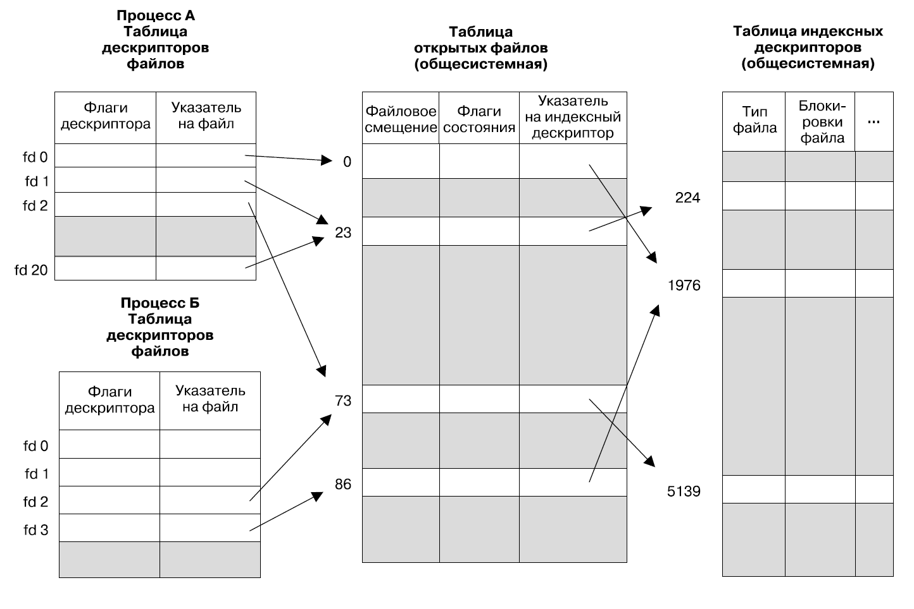

**Дескриптор файла** - это целочисленный идентификатор, присваиваемый файлу при его *открытии* процессом. Чтобы совершить над файлом большинство действий, в первую очередь необходимо получить его дескриптор, а уже затем передать его в качестве аргумента в системный вызов.

Для каждого процесса ядро поддерживает его *собственную* **таблицу дескрипторов файлов**. Её записи содержат:

+ *набор флагов* данного дескриптора, единственным возможным членом которого является флаг *close-on-exec* `FD_CLOEXEC`;
+ ссылку на соответствующую *дескрипцию открытого файла*.

На *общесистемном* уровне ядро поддерживает существующую в единственном экземпляре **таблицу открытых файлов**. Её записи, называемые **дескрипциями открытых файлов**, содержат следующую информацию о файле, над которым было произведено *открытие*:

+ текущее **файловое смещение**, также называемое *файловым указателем*, которое определяет позицию в файле, с которой будет выполняться следующая операция чтения/записи;
+ *флаги состояния* файла;
+ *режим доступа* к файлу;
+ установки механизма *ввода-вывода на основе сигналов*;
+ ссылка на соответствующий *индексный дескриптор* файла;

Само понятие файла как объединения взаимосвязанных данных вводит *файловая система*, которая для обеспечения своих функций (хранение информации) поддерживает реестр, называемый **таблицей индексных дескрипторов**. Её записи содержат:

+ тип файла;
+ *права доступа* к файлу со стороны пользователей ОС;
+ список *блокировок*, удерживаемых на файле;
+ всевозможные свойства файла: размер, метки времени и прочие.

Отдельная *дескрипция файла* создаётся при каждом его *открытии* с помощью системного вызова `open()`. Дескрипция, в свою очередь, порождает связанный с ней единственный *дескриптор файла*. Дополнительные экземпляры *дескрипторов* могут быть получены *дублированием* исходного дескриптора с помощью набора системных вызовов `dup()`, копированием исходного дескриптора в дочерний процесс при его создании, передачей исходного дескриптора через *сокет домена UNIX*. Очевидно, что все *файловые дескрипторы*, ссылающиеся на единственную *дескрипцию*, будут иметь доступ к одним и тем же значениям её полей (в особенности к *смещению* и *флагам состояния*), однако каждый из них будет обладать собственным значением флага *close-on-exec*.

Номера всех файловых дескрипторов начинаются с 0 и следуют друг за другом по возрастанию, причем при создании дескриптора любым способом ему гарантированно назначается *наименьший* доступный на текущий момент номер. Любой процесс, не являющийся *демоном*, будет по умолчанию обладать набором 3 *стандартных дескрипторов*, унаследованных им от своей оболочки:

+ `STDIN_FILENO` - стандартный *ввод*, номер `0`;
+ `STDOUT_FILENO` - стандартный *вывод*, номер `1`;
+ `STDERR_FILENO` - cтандартная *ошибка*, номер `2`.

Для каждого открытого файла ядро хранит **файловое смещение (файловый указатель)**, определяющее позицию в байтах, с которой будет выполняться следующая операция ввода-вывода. При открытии файла смещение устанавливается на его начало (если явно не указано иное), а затем последовательно сдвигается каждым успешно завершенным чтением или записью. Также файловый указатель может быть перемещен на требуемую позицию явным образом, причем его новое положение может располагаться за текущим концом файла - если для такой позиции будет выполнена операция записи, то образуется **файловая дыра**. До тех пор пока файловая дыра пуста (в её пределах отсутствуют явно записанные данные), она не занимает места, и файловая система не выделяет для неё дисковые блоки. Однако с программной точки зрения дыра хранит данные, и чтение из неё будет возращать нулевые байты - это означает, что номинальный объём файла, может превышать его реальный физический размер. Механизм файловых дыр позволяет экономить дисковое пространство, занимаемое слабозаполненными (разреженными, sparce) файлами. *Файлы дампа ядра*, содержащие слепок виртуальной памяти процесса на момент его завершения, являются их харакретными представителями.

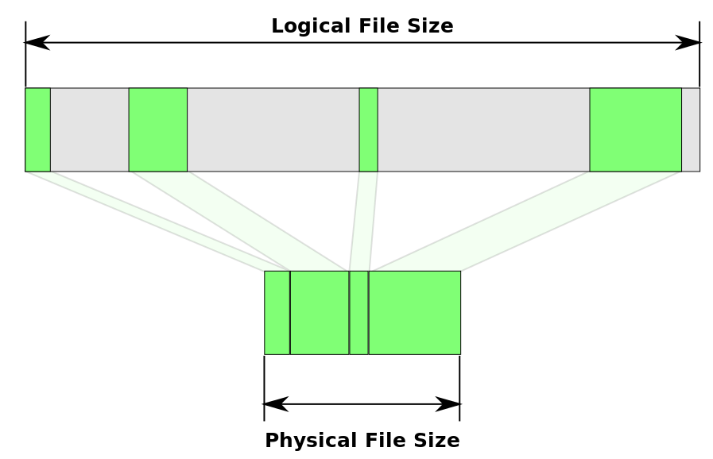

Ядро предоставляет ряд *виртуальных каталогов* с информацией о файловых дескрипторах процессов:

+ `/proc/PID/fdinfo` - для процесса с идентификатором `PID` содержит справочные файлы (смещение, флаги и т.д.) по одному на каждый из его файловых дескрипторов;
+ `/proc/self/fdinfo` - предоставляемая каждому процессу ядром *символьная ссылка* на его собственный каталог `fdinfo`;
+ `/proc/PID/fd` - для процесса с идентификатором `PID` содержит *символьные ссылки* на файлы, открытые им через каждый из своих файловых дескрипторов. В Linux открытие файла из данного каталога приводит к *повторному открытию* (с созданием новой *дескрипции*) исходного файла. Зачастую файлы из данного каталога используются для передачи стандартных потоков ввода/ввывода процесса, не являющихся сущностями файловой системы, в утилиты командной строки, принимающие в качестве аргументов путевые имена;
+ `/proc/self/fd` - предоставляемая каждому процессу ядром *символьная ссылка* на его собственный каталог `fd`;
+ `/dev/fd` - аналог описанной выше *символьной ссылки* на каталог `fd` процесса.

## 4.1. Универсальный интерфейс ввода-вывода

Linux предоставляет **универсальную модель ввода-вывода** - для выполнения чтения/записи во *все типы файлов*, включая устройства, терминалы и IPC, применяется интерфейс системных вызовов `open()/read()/write()/close()`. Данный механизм обеспечивается тем, что каждая файловая система или драйвер устройства самостоятельно реализуют требуемый от них набор операций ввода/вывода, а детали их обработки ядро скрывает внутри себя - в результате при написании прикладных программ можно игнорировать специфику устройства.

---

```C
int open(
    const char *pathname,
    int flags, ...
    /* mode_t mode */);
```

Открывает файл, идентифицированный путевым именем в аргументе `pathname`, и возвращает его *файловый дескриптор*. **Гарантируется, что созданный файловый дескриптор будет иметь НАИМЕНЬШИЙ НЕИСПОЛЬЗУЕМЫЙ номер.** Если имя файла содержит *символьную ссылку*, то она разыменовывается.

Если файл не существует, то он может быть автоматически создан при открытии (это определяется битовой маской флагов). В этом случае аргумент `mode` применяется для установки *прав доступа* к файлу со стороны *владельца*, *группы* и *остальных* (возможные значения описываются далее) - в противном случае он может быть опущен. Фактически установленный набор прав определяется комбинацией значений аргумента mode и маски процесса **umask** (либо **default ACL** - списка контроля доступа по умолчанию родительского каталога).

Аргумент `flags` содержит битовую маску режима доступа к файлу, включающую следующие группы флагов:

+ *Флаги режима доступа к файлу* - впоследствии могут быть извлечены:
  + `O_RDONLY` - открыть файл только для чтения;
  + `O_WRONLY` - открыть файл только для записи;
  + `O_RDWR` - открыть файл для чтения и записи;
+ *Флаги создания файла* - управляют поведением вызова; НЕ могут быть извлечены или изменены;
  + `O_CLOEXEC` - установить флаг файлового дескриптора close-on-exec `FD_CLOEXEC`;
  + `O_CREAT` - создать новый файл, если он не существует; требует обязательного наличия аргумента вызова `mode`;
  + `O_DIRECTORY` - путевое имя `pathname` должно указывать на *каталог*;
  + `O_EXCL` - указывается совместно с `O_CREAT`; создать новый файл либо вернуть ошибку, если он уже существует (*эксклюзивное создание файла*);
  + `O_LARGEFILE` - используется в 32-разрядных системах для открытия больших файлов, по размеру превышающих 2 Гбайта;
  + `O_NOCTTY` - запретить терминалу под путевым именем `pathname` становиться **управляющим терминалом** данного процесса;
  + `O_NOFOLLOW` - не разыменовывать символьные ссылки;
  + `O_TRUNC` - очистить открываемый файл;
+ *Флаги состояния файла* - впоследствии могут извлечены и изменены:
  + `O_APPEND` - перевести *указатель файла (смещение)* в его конец;
  + `O_NONBLOCK` - открыть файл в *неблокируемом режиме*: если операция ввода-вывода над файлом не может *мгновенно* завершиться *полностью*, то она либо целиком отменяется, возвращая синонимичные значения `EAGAIN` или `EWOULDBLOCK` в переменной `errno`, либо выполняется частично, возвращая реально обработанное количество байт;
  + `O_ASYNC` - часть механизма *ввода-вывода на основе сигналов*; отправлять процессу *сигнал*, когда указанный дескриптор становится доступен для выполнения ввода-вывода; может быть установлен только вызовом `fcntl(F_SETFL)`;
  + `O_SYNC` - выполнять над файлом операции *вывода* синхронизированным образом с сохранением *целостности файла*;
  + `O_DSYNC` - выполнять над файлом операции *вывода* синхронизированным образом с сохранением *целостности данных*;
  + `O_RSYNC` - распространить действие указанных выше флагов синхронизированного завершения также на операции *ввода*, применяемые к файлу: чтение будет требовать завершения выполняющихся операций записи;
  + `O_DIRECT` - осуществлять операции ввода-вывода напрямую над файлом *в обход дискового кеша ядра*;
  + `O_NOATIME` - не обновлять время последнего обращения к файлу при его чтении; *действующий UID* процесса должен соответствовать владельцу файла, либо процесс должен быть *привилегированным* (`CAP_FOWNER`).

---

```C
ssize_t read(
    int fd,
    void *buffer,
    size_t count);
```

Считывает из указанного фала максимально `count` байт в заранее выделенный буфер `buffer`. В случае успеха возвращает число *реально прочитанных* байт, которое может оказаться меньше указанного максимального. Попытка чтения за текущим концом файла вернёт 0 байт - данные отсутствуют.

---

```C
ssize_t write(
    int fd,
    const void *buffer,
    size_t count);
```

Записывает в указанный файл максимально `count` байт, хранящихся в буфере `buffer`. В случае успеха возвращает число *реально записанных* байт, которое может оказаться меньше указанного максимального. Завершение данного вызова не гарантирует перенос данных на устройство, поскольку ядро выполняет буферизацию дискового ввода-вывода.

---

```C
off_t lseek(int fd, off_t offset, int whence);
```

Сдвигает файловый указатель на `offset` байт относительно позиции `whence`. В случае успеха возвращает новое полученное значение файлового смещения.

Аргумент `whence` принимает следующие значения:

+ `SEEK_SET` - отправной точкой служит начало файла (нулевая позиция);
+ `SEEK_CUR` - отправной точкой служит текущее положение файлового указателя;
+ `SEEK_END` - отправной точкой служит позиция, *следующая за последним байтом файла*;

Аргумент `offset` является целым числом со знаком: нулевое значение просто вернет текущее смещение, а отрицательное заставит указатель передвинуться в противоположном направлении, однако *выходить за начало файла ЗАПРЕЩЕНО*.

Зачастую данный вызов применяется к обыкновенным файлам данных на диске - он не может быть вызван для *FIFO*, *сокета* и *терминала*. Файловое смещение - это сущность ядра, и его изменение не требует физического доступа к устройству хранения.

---

```C
int close(int fd);
```

Закрывает открытый файловый дескриптор, освобождая его для повторного использования процессом. Завершение процесса также приводит к автоматическому закрытию всех его файловых дескрипторов.

---

```C
int truncate(const char *pathname, off_t length);

int ftruncate(int fd, off_t length);
```

Устанавливают для файла, заданного через путевое имя `pathname` или дескриптор `fd`, новый размер `length`. Если файл *урезается*, то избыточные данные теряются. Если файл *увеличивается* в размере, то добавляются нулевые байты, либо образуется файловая дыра. *НЕ изменяют* значение *файлового смещения*, содержащееся в общесистемной дескрипции файла. При выполнении данного вызова к файлу применяются стандартные проверки режима и прав доступа.

---

```C
int fcntl(int fd, int cmd, ...);
```

Позволяет извлечь либо установить флаги *режима доступа* и *состояния* указанного файлового дескриптора. Аргумента `cmd` определяет выполняемое действие и принимает значения `F_GETFL` или `F_SETFL`. При установке флага вызов принимает дополнительный содержащий их параметр.

---

```C
int ioctl(int fd, int request, ... /* argp */);
```

Вызов общего назначения, позволяющий выполнять над указанным файлом или устройством операции, выходящие за пределы описанной универсальной модели. Аргумент `request`, обозначающий совершаемую операцию, обычно сопровождается набором её входных параметров `argp` любого требуемого типа.

## 4.2. Дополнительные операции ввода-вывода

```C
ssize_t pread(
    int fd,
    void *buf,
    size_t count,
    off_t offset);

ssize_t pwrite(
    int fd,
    const void *buf,
    size_t count,
    off_t offset);
```

Являются аналогами стандартных вызовов, однако осуществляют ввод-вывод с заданного смещения `offset` от начала файла, а не с текущей позиции файлового указателя. *НЕ изменяют* значение *файлового смещения*, содержащееся в общесистемной дескрипции файла. Тип файла, над которым выполняются данные вызовы, должен поддерживать произвольную установку файлового смещения.

---

```C
ssize_t readv(
    int fd,
    const struct iovec *iov,
    int iovcnt);

ssize_t writev(
    int fd,
    const struct iovec *iov,
    int iovcnt);
```

Осуществляют *фрагментированный ввод-вывод (scatter-gather IO)*: считывают или записывают непрерывную последовательность байтов файла в `iovcnt` буферов в порядке их следования в наборе `iov`. Поскольку данные вызовы совершаются *атомарно*, то *любые* операции ввода-вывода над указанным файлом в других процессах или потоках не могут нарушить непрерывность обрабатываемой последовательности данных.

---

```C
ssize_t preadv(
    int fd,
    const struct iovec *iov,
    int iovcnt,
    off_t offset);

ssize_t pwritev(
    int fd,
    const struct iovec *iov,
    int iovcnt,
    off_t offset);
```

Фрагментированный ввод-вывод по заданному смещению - являются комбинацией описанных выше вызовов.

## 4.3. Дублирование файловых дескрипторов

```C
int dup(int oldfd);
```

Создает дубликат исходного дескриптора `oldfd`, указывающий на ту же дескрипцию файла в общесистемной таблице.

---

```C
int dup2(int oldfd, int newfd);
```

Создает дубликат исходного дескриптора `oldfd`, указывающий на ту же дескрипцию файла в общесистемной таблице, присваивая ему номер дескриптора `newfd`. Если `newfd` уже существует, то сначала он будет **закрыт**, причем закрытие и повторное открытие будут выполнены *атомарно*. Если в аргументы вызова передан один и тот же дескриптор, то никаких действий не совершается.

---

```C
int dup3(int oldfd, int newfd, int flags);
```

Аналог вызова `dup2()`, дополнительно позволяющий с помощью значения `O_CLOEXEC` аргумента `flags` сразу установить в результирующем дескрипторе флаг close-on-exec.

## 4.4. Создание временных файлов

Если программе на время работы требуются временные файлы, которые будут уничтожены по её завершении, то она может воспользоваться набором библиотечных функций.

---

```C
int mkstemp(char *template);
```

Создаёт, открывает для чтения/записи и возвращает дескриптор файла, шаблон `template` путевого имени которого обязан заканчиваться символьной последовательностью `XXXXXX` - она будет перезаписана ядром на строку, придующую имени уникальность. Открываемый файл получает права чтения/записи для владельца, а также флаг `O_EXCL`, гарантирующий эксклюзивный доступ. Обычно сразу после создания файла его запись в файловой системе уничтожают вызовом `unlink()` - он продолжит быть доступен процессу через свой дескриптор и будет окончательно удален при его закрытии.

---

```C
FILE *tmpfile(void);
```

Создаёт и эксклюзивно (`O_EXCL`) открывает для чтения/записи временный файл с уникальным именем, возвращая его *файловый поток* библиотеки stdio языка C. При закрытии он будет автоматически удалён.

## 4.5. Буферизация ввода-вывода

Для повышения скорости ввода-вывода при работе с дисковыми файлами ядро применяет *буферизацию* данных, позволяющую выполнить чтение или запись файла без ожидания завершения долгой (по сравнению со скоростью работы оперативной памяти и процессора) дисковой операции.

Вызовы `read()` и `write()` не ининциируют непосредственный доступ к диску, а вместо это копируют данные из пользовательского пространства памяти в **буферы дискового кеша ядра**. Ядро НЕ накладывает ограничений на размер дисковых буферов: оно выделяет ровно столько страниц памяти, сколько требуется процессу. Вызов `write()` возвращается сразу же после выполнения переноса данных. Вызов `read()` в первую очередь ищет запрошенный диапазон байтов в дисковом кеше и в случае его отсутствия выполняет чтение с диска данных с запасом в кеш  - *упреждающее чтение*.


### 4.5.1. Буферизация в библиотеке stdio

Функции ввода-вывода стандартной библиотеки С stdio применяют буферизацию в *пользовательском пространстве* памяти для сокращения количества реально выполняемых системных вызовов. Данная буферизация применяется функциями:

+ `fprintf()`;
+ `fscanf()`;
+ `fgets()`;
+ `fputs()`;
+ `fputc()`;
+ `fgetc()`.

Сброс буферов stdio может выполняться явно вызовом функции `fflush()` либо автоматические при закрытии потока ввода-вывода stdio.

Также стандарт языка C устанавливает следующие требования к функционированию буферов в реализациях потоков ввода-вывода:

+ за операциями *вывода* не может непосредственно следовать *ввод* без промежуточного сброса буфера `fflush()` или позиционирования файлового указателя `fseek()/fsetpos()/rewind()`;
+ за операцией *ввода* не может непосредственно следовать *вывод* без промежуточного позиционирования файлового указателя `fseek()/fsetpos()/rewind()` (если только *ввод* не столкнулся с окончанием файла).

При совместном использовании библиотечных функций ввода-вывода и системных вызовов нужно с повышенным вниманием относиться к *порядку опустошения буферов пользователя и ядра*, чтобы не допускать нарушения *очередности вывода* данных!

---

```C
FILE *fdopen(int fd, const char *mode);
```

Для указанного файлового дескриптора возвращает соответствующий ему *файловый поток* с учетом флагов открытия `mode` (должны соответствовать флагам открытия дескриптора), который может быть использован в функциях ввода-вывода стандартной библиотеки С.

---

```C
int setvbuf(
    FILE *stream,
    char *buf,
    int mode,
    size_t size);
```

Устанавливает режим буферизации, применяемый к *файловому потоку* `stream` библиотекой stdio:

+ `_IONBF` - НЕ выполнять буферизацию; вызовы функций stdio будут приводить к немедленному выполнению системных вызовов; *по умолчанию* используется для потока *stderr*;
+ `_IOLBF` - применять *построчную буферизацию*: накопление символов продолжается до появления символа новой строки либо переполнения буфера; *по умолчанию* используется для *терминальных устройств*;
+ `_IOFBF` - использовать *полную буферизацию*: данные будут записываться и считываться блоками, по размеру равными используемому буферу; *по умолчанию* применяется для *дисковых файлов*.

Аргумент `buf` может содержать либо заранее выделенный буфер, либо `NULL` - в этом случае библиотека самостоятельно выделит буфер некоторого оптимального размера.

Данный вызов имеет 2 аналога:

```C
void setbuf(
    FILE *stream,
    char *buf);

void setbuffer(
    FILE *stream,
    char *buf,
    size_t size);
```

Если `buf` содержит `NULL`, то буферизация не используется. Значения отсутствующих аругментов заполняются библиотекой stdio самостоятельно.

---

```C
int fflush(FILE *stream);
```

Принудительно сбрасывают в дисковый кеш буфер библиотеки stdio, хранящий данные указанного *файлового потока* `stream`. Если значение аргумента равняется `NULL`, то сбрасывает *все* буферы пользовательского пространства.

### 4.5.2. Синхронизированный ввод-вывод ядра

Процесс может в любой момент потребовать принудительный сброс дисковых буферов ядра, содержащих закешированные данные используемых им файлов - т.е. завершить операцию ввода-вывода **синхронизированным образом**. Такой принудительный сброс либо приведет к успешному переносу данных на диск, либо будет сообщён как неудавшийся.

Существует 2 типа синхронизированного завершения операций ввода-вывода:

+ **завершение с целостностью данных** - при обновлении файла должен быть обеспечен перенос всей информации, достаточной для последующего успешного извлечения данных файла:
  + *для операций записи* - на диск должно быть перенесено содержимое файла, а также все *необходимые метаданные* (например, результирующий размер файла, но не обязательно метки времени);
  + *для операций чтения* - с диска в процесс должно быть перенесено содержимое файла с предварительным завершением всех отложенных операций записи;
+ **завершение с целостностью файла** - более строгий тип, требующий переноса *абсолютно всех метаданных* в дополнение к содержимому файла.

---

```C
int fdatasync(int fd);
```

Принудительно сбрасывает дисковый кеш ядра для указанного файла и завершает ожидающие операции ввода-вывода с сохранением *целостности данных*.

---

```C
int fsync(int fd);
```

Принудительно сбрасывает дисковый кеш ядра для указанного файла и завершает ожидающие операции ввода-вывода с сохранением *целостности файла*.

---

```C
void sync(void);
```

Принудительно сбрасывает все дисковые буферы ядра, используемые данным процессом, и завершает ожидающие операции ввода-вывода с сохранением *целостности файла*.

---

Автоматический сброс дискового кеша через равные промежутки времени (порядка 30 сек) осуществляется процессом системы **pdflush**. Вручную период сброса буферов ядра может быть установлен в файле `/proc/sys/vm/dirty_expire_centisecs`.

Также существуют набор флагов открытия файла, передаваемых в вызов `open()`, который позволяет активировать автоматическое синхронизированное завершение операцией ввод-вывода для данной *дескрипции файла*:

+ `O_SYNC` - выполнять операции *вывода* синхронизированным образом с сохранением *целостности файла*;
+ `O_DSYNC` - выполнять операции *вывода* синхронизированным образом с сохранением *целостности данных*;
+ `O_RSYNC` - распространить действие указанных выше флагов синхронизированного завершения также на операции *ввода*: чтение будет требовать завершения выполняющихся операций записи;
+ `O_DIRECT` - осуществлять операции ввода-вывода напрямую над файлом *в обход дискового кеша ядра* (например, может применяться в программах СУБД); *одновременное* открытие файла (через разные дескрипции) в *прямом И буферизированном* режимах приведет к ПОВРЕЖДЕНИЮ данных; при работе в данном режиме адреса памяти и размер данных должны быть кратны размеру дискового блока.

Ядро предоставляет процессу возможность проинформировать ядро о предполагаемом характере обращения к содержимому указанного файла, что позволит в данном конкретном случае оптимизовать работу механизма дисковых буферов. Однако не даётся никаких гарантий, что ядро воспользуется предоставленными ему сведениями.

---

```C
int posix_fadvise(
    int fd,
    off_t offset,
    off_t len,
    int advice);
```

Информирует ядро о предполагаемом способе обращения к данным указанного своим дескриптором `fd` файла, располагающимся по смещению `offset` и занимающим `len` байт. Аргумент `advice` определяет характер использования файла:

+ `POSIX_FADV_NORMAL` - нет особого уведомления; вариант *по умолчанию*; устанавливает *стандартный* (`128 Кбайт`) размер *окна упреждающего считывания*;
+ `POSIX_FADV_SEQUENTIAL` - *последовательное считывание* данных файла; устанавливает *двойной* размер *окна упреждающего считывания*;
+ `POSIX_FADV_RANDOM` - *произвольное обращение* к данным файла; *отключает упреждающее считывание*;
+ `POSIX_FADV_WILLNEED` - указанный диапазон данных *понадобится в ближайшее время*, поэтому его следует заранее считать в дисковый кеш;
+ `POSIX_FADV_DONTNEED` - указанный диапазон данных *НЕ потребуется в ближайшее время*, поэтому занимаемое им место в дисковом кеше можно освободить, но только если эти данные в настоящее время не используется в других операциях.
+ `POSIX_FADV_NOREUSE` - *однократное обращение* к данным файла; ядро может освобождать дисковые кеши указанного файла после первого обращения к ним со стороны процесса.

# 5. Файловая система

## 5.1. Устройства и драйверы

Linux подразделяет все подключенные к системе устройства на 2 типа:

+ **символьные** - обрабатывают данные посимвольно: терминалы, клавиатуры и т.д.;
+ **блочные** - обрабатывают данные блоками байт фиксированного размера. *Накопители (диски)* относятся к данному типу устройств.

По своей природе устройство может являться *реальным* либо *виртуальным* - в этом случае оно будет являться абстракцией ядра с функционалом, аналогичным реальному устройству.

Любое устройство должно предоставлять операционной системе требуемый набор операций в заданном формате - т.е. должно реализовывать определенный интерфейс, которым зачастую является универсальный интерфейс ввода-вывода, позволяющий добиться единообразия коммуникации с устройствами различных типов. Реализацию требуемого интерфейса осуществляет **драйвер устройства** - модуль ядра, зачастую разработанный производителем устройства, который сопрягает функционал операционной системы с реальными возможностями устройства.

Связь устройства и его драйвера выполняется на основе **файла устройства** - специальной сущности файловой системы, содержащегося в **каталоге `/dev`** по одному экземпляру для каждого подключенного к системе устройства.
*Индексный дескриптор* файла устройства содержит:

+ **старший идентификационный номер устройства (major)** - обозначает *класс устройства*; администрированием данных идентификаторов занимается организация *Linux Assigned Names and Numbers Authority (LANANA)*;
+ **младший идентификационный номер устройства (minor)** - помогает уникальным образом определить устройство внутри его класса.

При установке *драйвер* регистрирует свою *привязку* к конкретному *старшему идентификатору* и таким образом информирует ядро о видах устройств, за обработку которых он отвечает. В момент поиска требуемого драйвера имя файла устройства значения не имеет.

Различная сервисная информация об устройствах системы содержится в **виртуальной файловой системе `/sys`**.

## 5.2. Диски и разделы

Пространство диска образовано *физическими блоками*, являющимися наименьшей единицей чтения и записи информациии. Все блоки имеют одинаковый заданный размер, кратный 512 байтам. Логически блоки группируются в непересекающиеся **разделы (partitions)**. Для каждого раздела в каталоге `/dev` существует свой собственный файл, а файл `/proc/partitions` перечисляет все доступные системе разделы. Для администрирования разделов дисков используется утилита `fdisk`.

*Раздел* диска может содержать информацию одного из следующих типов:

+ **файловая система** - упорядоченный набор файлов и каталогов (метаинформация + данные);
+ **область данных** - память, допускающая обращение в режиме *прямого доступа*;
+ **область подкачки** - копии не используемыех в настоящих момент физических страниц, которые не уместились в имеющемся объеме оперативной памяти. За создание файлов подкачки отвечают утилиты `mkswap` и `swapon/swapoff` (существует аналогичный системный вызов, требующий привилегии процесса `CAP_SYS_ADMIN`). Файл `/proc/swaps` перечисляет все имеющиеся в системе файлы подкачки.

## 5.3. Файловые системы

**Файловая система** - упорядоченный набор файлов и каталогов. Linux поддерживает самые разные файловые системы, обладающие своими собственными характерными особенностями:

+ сетевые: NFS;
+ журналируемые: XFS, ext3, ext4 - фиксируют все изменения метаданных (а также при необходимости и данных) в файле журнала - применяют механизм *транзакций*; данный тип файловых систем позволяет выполнять проверку только журнала транзакций, а не всех хранящихся данных, что ускоряет восстановление после сбоя;
+ виртуальная файловая система: **tmpfs** - размещается не на диске, а в оперативной памяти и файле подкачки;
+ родные для Linux: ext2, ext3, ext4;
+ за авторством Microsoft: FAT, FAT32, NTFS.

Такое многообразие поддерживаемых реализаций достигается тем, что операционная система обязывает каждую из них предоставлять унифицированный интерфейс **виртуальной файловой системы (VFS)**, включающий в себя стандартные операции для работы с файлами и каталогами. Ядро оперирует только VFS-интерфейсом и игнорирует детали конкретных используемых файловых систем. Если данная файловая система не поддерживает какие-либо операции из набора, то они просто возвращают ошибку.

Наименьшей единицей выделения пространства в файловой системе является *логический блок*, представляющий собой совокупность смежных *физических дисковых блоков* заданного размера. Типичная файловая система включает в себя следующие компоненты:

+ **блок начальной загрузки** - *всегда самый первый блок* в файловой системе, в котором содержится информация, требуемая для загрузки файловой системы; *каждая файловая система*, располагающаяся в своем разделе диска, обладает *собственным блоком начальной* загрузки;
+ **суперблок** - метаинформация о файловой системе:
  + размер логического блока в байтах;
  + размер *таблицы индексных дескрипторов*;
  + размер файловой системы в логических блоках;
+ **таблица индексных дескрипторов** - индекс файлов и каталогов данной файловой системы, записи которого хранят метаинформацию о них;
+ **блок данных** - содержимое файлов и каталогов файловой системы, распределенное по логическим блокам; файл не обязан *целиком* содержаться в *смежных блоках* - это достигается только выполнением *дефрагментации*;

**Индексный дескриптор (i-node)** - структура данных, содержащая метаинформацию (атрибуты) о связанном с ней файле или каталоге. Все индексные дескрипторы однозначным образом идентифицируются по своему порядковому номеру в данной таблице. Индексный дескриптор содержит следующие поля:

+ **тип файла** - указывает конкретный тип файла из набора поддерживаемых операционной системой;
+ **владелец файла** - UID, присвоенный файлу;
+ **группа файла** - GID, присвоенный файлу;
+ **права доступа** к файлу для *владельца*, *группы* и *остальных*;
+ **метки времени** - последний доступ к файлу, последнее изменение данных файла, последнее изменение индексного дескриптора;
+ **количество жестких ссылок** на данный файл;
+ **размер файла в байтах**;
+ **размер файла в логических блоках** - количество блоков, фактически хранящих файл; может не соответствовать размеру в байтах, если файл содержит *файловые дыры*;
+ **список указателей на блоки данных** - указатели делятся на 2 вида:
  + *прямые* - непосредственно указывают на блок с данными файла;
  + *косвенные* - указывают на блок, содержащий другой список указателей; косвенность может быть *двойной* либо *тройной*; количество указателей в косвенном списке варьируется от 256 до 1024 в зависимости от используемого размера логического блока; использование косвенных указателей позволяет экономно хранить метаинформацию о файлах размером до нескольких терабайт.


### 5.3.1. Монтирование файловых систем

В Linux все файлы и каталоги располагаются в **едином дереве каталогов**, в основании которого находится **корневой каталог `/`**. Файловые системы, физически располагающиеся в различных *разделах*, указывают в данной иерархии свою точку входа (**точку монтирования**) и добавляются в неё как поддеревья.


Информация о смонтированных в настоящий момент файловых системах приводится в следующих текстовых файлах (их содержимое также можно просмотреть с помощью вызовов `getfsent()`, `getmntent()`):

+ `/proc/mounts` - список смонтированных файловых систем;
+ `/etc/mtab` - аналог предыдущего файла, заполняемый командой оболочки `mount` и содержащий более детализированную информацию;
+ `/etc/fstab` - аналог предыдущего файла.

Данные файлы содержат строки указанного вида со следующим набором полей:

`/dev/sda9 /boot ext3 rw`

+ имя файловой системы (зачастую путевое имя файла устройства);
+ точка монтирования файловой системы данного устройства;
+ тип файловой системы;
+ флаги монтирования.

---

```C
int mount(
    const char *source,
    const char *target,
    const char *fstype,
    unsigned long mountflags,
    const void *data);
```

Монтирует файловую систему устройства, файл которого имеет путевое имя `source`, в каталог `target`, называемый *точкой монтирования*. Процесс должен обладать привилегией `CAP_SYS_ADMIN`.

Аргумент `fstype` содержит строку, определяющую тип файловой системы: ext4, btrfs и т.д.

Аргумент `mountflags` содержит битовую маску флагов, определяющих выполняемые вызовом действия, а аргумент `data` - параметры монтирования:

+ `MS_BIND` - создать **связанную точку монтирования** для указанного файла или каталога;
+ `MS_MOVE` - переместить точку монтирования в другое место; выполняет *размонтирование*;
+ `MS_REMOUNT` - изменяет параметры уже смонтированной файловой системы; *НЕ* выполяет *размонтирование*;
+ `MS_NODEV` - запрещает доступ к устройстам (блочным и символьным) в данной файловой системе;
+ `MS_NOEXEC` - запрещает выполнение программ и скриптов в данной файловой системе;
+ `MS_NOSUID` - запрещает выполнение программ с полномочиями *set-UID* и *set-GID* в данной файловой системе;
+ `MS_RDONLY` - смонтировать файловую систему только для чтения (изменять файлы и каталоги нельзя);
+ `MS_REC` - применяется совместно с другими флагами и выполняет рекурсивное монтирование вложенных точек монтирования;
+ `MS_DIRSYNC` - делает операции обновления каталогов данной файловой системе синхронными;
+ `MS_SYNCHRONOUS` - делает операции обновления каталогов и файлов данной файловой системе синхронными;
+ `MS_RELATIME`, `MS_STRICTATIME`, `MS_NOATIME`, `MS_NODIRATIME` - управляют обновлением времени последнего доступа к файлам и каталогам;
+ `MS_MANDLOCK` - разрешить обязательную блокировку файлов.

---

```C
int umount(const char *target);
```

Размонтирует файловую систему, указанную по своей точке монтирования `target`. Файловая система не может быть размонтирована, если она *занята*: какой-либо из содержащихся в ней *файлов открыт* в настоящее время, либо в ней установлен *рабочий каталог* некоторого *процесса* - ошибка `EBUSY`.

---

```C
int umount2(const char *target, int flags);
```

Является аналогом вызова `umount()`, позволяющим указывать битовую маску дополнительных опций размонтирования `flags`:

+ `MNT_DETACH` - выполнить *ленивое размонтирование*: фактическое размонтирование произойдет в тот момент, когда завершится текущее использование данной файловой системы существующими процессами; обращение к файловой системе со стороны новых процессов запрещено;
+ `MNT_EXPIRE` - *первый вызов* помечает *незанятую* точку монтирования как *просроченную* и завершает вызов с ошибкой `EAGAIN`; точка монтирования будет оставаться просроченной до тех пор, пока её не начнет использовать какой-либо процесс; *последующий вызов*, применяемый к *просроченной* точке монтирования, окончательно её размонтирует; нельзя указывать совместно с `MNT_DETACH` и `MNT_FORCE`; данный механизм позволяет отслеживать и размонтировать файловые системы, которые не используются в течение некоторого периода времени;
+ `MNT_FORCE` - выполняет принудительное размонтирование, даже если устройство в настоящее время используется; применим только к файловой системе NFS и может вызвать повреждение данных;
+ `UMOUNT_NOFOLLOW` - если `target` является символической ссылкой, то НЕ разыменовывать её.

---

Заданная файловая система может одновременно иметь *несколько точек монтирования* - все они будут вести к единственному экземпляру поддерева. Каждая из точек монтирования может иметь *собственные значения* следующих флагов монтирования `mountflags`: `MS_NODEV`, `MS_NOEXEC`, `MS_NOSUID`, `MS_RDONLY`, `MS_RELATIME`, `MS_NOATIME`, `MS_NODIRATIME` - это позволяет обращаться к одной и той же файловой системе с различными разрешениями.

Создание **связанной точки монтирования** с помощью флага `MS_BIND` позволяет смонтировать указанный *каталог или файл* в какое-либо еще место в иерархии ТОЙ ЖЕ файловой системы. Чтобы через связанную точку монтирования исходного каталога были также доступны его подкаталоги, необходимо дополнительно указывать флаг `MS_REC`. Создание связанной точки монтирования аналогично созданию *жесткой ссылки*, однако обладает рядом особенностей:

+ может быть применен к каталогам - жесткая ссылка создается только для файлов;
+ может быть применен даже к файлам и каталогам, изолированным в **клетке chroot**.

По местоположению единственной точки монтирования могут быть смонтированы несколько файловый систем - это создаст в ней **стек монтирования**. Каждая последующая операция монтирования в заданной точке будет скрывать существующее поддерево каталогов новым - размонтирование вершины стека, в свою очередь, снова откроет доступ к подлежащему поддереву файловой системы. Сокрытие существующей файловой системы никак не затронет использующие её процессы - они продолжат работать с видимым им поддеревом.

### 5.3.2. Извлечение информации о файловой системе

```C
int statvfs(
    const char *pathname,
    struct statvfs *statvfsbuf);

int fstatvfs(
    int fd,
    struct statvfs *statvfsbuf);

struct statvfs
{
    unsigned long f_bsize;
    unsigned long f_frsize;
    fsblkcnt_t f_blocks;
    fsblkcnt_t f_bfree;
    fsblkcnt_t f_bavail;
    fsfilcnt_t f_files;
    fsfilcnt_t f_ffree;
    fsfilcnt_t f_favail;
    unsigned long f_fsid;
    unsigned long f_flag;
    unsigned long f_namemax;
};
```

Возвращает информацию о файловой системе по путевому имени `pathname` или файловому дескриптору `fd` расположенного в ней файла.

Структура `statvfs` содержит следующие поля:

+ `f_bsize` - размер логического блока в байтах;
+ `f_frsize` - фундаментальный размер логического блока в байтах; обычно совпадает со значением `f_bsize`, однако для файловых систем, допускающих фрагментирование блоков, содержит размер такого фрагмента;
+ `f_blocks` - общее количество логических блоков в файловой системе;
+ `f_bfree` - количество свободных логических блоков;
+ `f_bavail` - количество свободных логических блоков, доступных непривилегированному процессу; может отличаться от значения `f_bfree` для файловых систем, резервирующих некоторый объем дискового пространства для использования суперпользователем;
+ `f_files` - общее количество индексных дескрипторов;
+ `f_ffree` - количество свободных индексных дескрипторов;
+ `f_favail` - количество свободных индексных дескрипторов, доступных непривилегированному процессу;
+ `f_fsid` - уникальный идентификатор файловой системы; в родных для Linux файловых системах равен `0`;
+ `f_flag` - флаги монтирования;
+ `f_namemax` - максимальная длина имени файлов для данной файловой системы.

### 5.3.3. Виртуальная файловая система `/proc`

**Виртуальная файловая система `/proc`** содержит набор каталогов, предоставляющих статистику о работе системы. Она не хранится на диске, а её файлы и каталоги генерируются ядром на лету при обращении к ним процессов.

Каталог `/proc/PID` предоставляет информацию о конкретном процессе:

+ `status` - файл общих сведений о процессе;
+ `cmdline` - файл с аргументами командной строки;
+ `cwd` - символьная ссылка на данный каталог `/proc/PID`;
+ `environ` - файл с переменными окружения;
+ `exe` - символьная ссылка на файл программы, выполняемой в процессе;
+ `fd` - каталог, содержащий символьные ссылки на файлы, открытые через соответствующие файловые дескрипторы;
+ `maps` - файл со списком созданных процессом *отображений памяти*;
+ `mem` - файл, предоставляющий доступ к **виртуальной памяти** процесса;
+ `mounts` - файл со списком *точек монтирования* процесса;
+ `root` - символьная ссылка на корневой каталог;
+ `task` - каталог, содержащий по подкаталогу с аналогичной информацией для каждого **потока** процесса;

Для каждого процесса ядром также создаётся символьная ссылка `/proc/self` на его собственный каталог `/proc/PID`.

Cледующие подкаталоги `/proc` предоставляют сведения о системе в целом:

+ `net` - состояние сети и сокетов;
+ `sys/kernel` - общие настройки ядра;
+ `sys/fs` - настройки файловых систем;
+ `sys/net` - настройки сети;
+ `sys/vm` - настройки системы управления памятью.

---

```C
int uname(struct utsname *utsbuf);

struct utsname
{
    char sysname[_UTSNAME_LENGTH];
    char nodename[_UTSNAME_LENGTH];
    char release[_UTSNAME_LENGTH];
    char version[_UTSNAME_LENGTH];
    char machine[_UTSNAME_LENGTH];
};
```

Возвращает справку о системе в виде структуры типа `utsname`, содержащей следующие поля:

+ `sysname` - название реализации системы;
+ `nodename` - имя узла в сети;
+ `release` - идентификатор выпуска системы;
+ `version` - версия системы;
+ `machine` - железо, на котором
запущена системы.

Команда оболочки `uname -a` выполняет аналогичную функцию.

## 5.4. Файлы

**Файл** - единица данных на носителе, с которой работает операционная система. Все сущности файловой системы, расположенные в её иерархии, являются файлами различных типов:

+ *обычный файл*;
+ *каталог*;
+ *символическая ссылка*;
+ *символьное устройство*;
+ *блочное устройство*;
+ *FIFO или pipe*;
+ *сокет*.

### 5.4.1. Принадлежность

С каждым файлом связаны *идентификатор пользователя UID* и *идентификатор группы GID*, которым он принадлежит. При создании нового файла его идентификатор пользователя наследуется от *действующего UID процесса*. Идентификатор группы файла наследуется либо от *действующего GID процесса*, либо от *идентификатора группы родительского каталога* - это определяется параметрами монтирования файловой системы:

+ если файловая система смонтирована командой `mount -o grpid`, то группа файла всегда наследуется от группы родительского каталога;
+ если файловая система смонтирована командой `mount -o nogrpid` (по умолчанию), то группа файла наследуется от действующего GID процесса, если для *родительского каталога* НЕ установлен бит *set-group-ID* - в противном случае группа файла будет наследоваться от родительского каталога.

---

```C
int chown(
    const char *pathname,
    uid_t owner,
    gid_t group);

int lchown(
    const char *pathname,
    uid_t owner,
    gid_t group);

int fchown(
    int fd,
    uid_t owner,
    gid_t group);
```

Устанавливают нового пользователя и/или группу файла. Если `pathname` является символической ссылкой, то вызов `lchown()` её не разыменует. Аргументам идентификаторов, значения которых изменять не требуется, можно присвоить `-1`.

Владельца файла может изменить только привилегированный (`CAP_CHOWN`) процесс. Группу файла может изменить только его владелец, причем только на одну из тех, членом которой он является.

При изменении владельца или группы значения установленных битов **set-user-ID и set-group-ID сбрасываются** - это сделано **по соображениям безопасности**! Бит set-group-ID сохраняется только в случае отсутствия права на исполнение группой, либо если типом файла является каталог.

### 5.4.2. Права доступа

Права доступа задаются для трёх *категорий*:

+ **владелец**;
+ **группа**;
+ **остальные**.

Права доступа делятся на три *типа*:

+ **чтение**;
+ **запись**;
+ **выполнение**.

Для *файлов* значение каждого типа является самоочевидным. Скомпилированные двоичные программы требуют право на выполнение. Текстовые скрипты, передаваемые в соответствующий интерпретатор, требуют права на чтение и выполнение.

Для *каталогов* типы прав доступа имеют следующий смысл:

+ *чтение* - разрешен просмотр списка имен содержимого каталога;
+ *запись* - разрешено создание и удаление файлов внутри каталога;
+ *выполнение* - также называется разрешением на *поиск*; разрешено непосредственное обращение к файлам, переход в подкаталоги.

Т.к. информация о правах доступа содержится в индексных дескрипторах, то все *ссылки* на одну сущность будут разделять её права.

*Привилегированному пользователю (root)* разрешено *выполнять любой каталог*, однако файл он может выполнить, только если это разрешено хотя бы одной категории.

Для извлечения прав доступа к сущности в коде программы используется набор вызов `stat()`. В оболочке права доступа извлекаются командой `ls` (может являться псевдонимом; оригинальная команда `/bin/ls`).

Пример вывода для каталога: `drwxrw-r--`.

#### 5.4.2.1. Порядок проверки прав доступа

При обращении процесса к сущности файловой системы по её путевому имени проверки прав доступа выполняются в следующей очередности с остановкой в момент нахождения *первого соответствия идентификаторов*:

1. Если процесс *привилегированный (root)*, то он имеет полный доступ;
2. Если действующий UID процесса совпадает с пользователем файла (каталога), то проверяются права владельца;
3. Если действующий GID процесса или GID любой из его добавочных групп совпадает с идентификатором группы файла (каталога), то проверяются права группы;
4. Иначе проверяются права остальных.

В реальности вместо действующих идентификаторов процесса используются его идентификаторы файловой системы, однако они всегда имеют то же самое значение.

#### 5.4.2.2. Биты set-user-ID, set-group-ID и sticky

Биты **set-user-ID** и **set-group-ID** используются для присвоения процессам идентификаторов принадлежности выполняемых ими файлов программ (подробнее смотреть в разделе, описывающем процессы).

Также бит *set-group-ID*:

+ установлен *для каталога* - значение группы новых создаваемых в нем каталоге файлов и подкаталогов будет копироваться из его группы; файловая система должна быть при этом смонтирована с параметром `nogrpid`;
+ установлен *для файла* - разрешена принудительная блокировка файла.

**Sticky** бит (также называемый *saved text*) в настоящее время устанавливается *только для каталогов* и ограничивает изменение их содержимого:

+ непривилегированный процесс может *удалять и переименовывать* файлы и подкаталоги родительского каталога, только если он является *владельцем файла, подкаталога или всего родительского каталога*;
+ непривилегированный процесс может назначать каталогу расширенные атрибуты `user`, только если он является его владельцем;

#### 5.4.2.3. Изменение прав доступа

```C
mode_t umask(mode_t mask);
```

Устанавливает атрибут процесса **umask**, определяющий, какие биты прав доступа к новому файлу (каталогу) должны быть *отключены при его создании* процессом. Процесс наследует маску прав доступа от своего *родительского процесса*. Аргумент `mask` принимает константы типа `mode_t` (список приводится в описании вызова `stat()`).

---

```C
int chmod(const char *pathname, mode_t mode);
int fchmod(int fd, mode_t mode);
```

Устанавливает права доступа к файлу (каталогу), заданному своим путевым именем `pathname` или файловым дескриптором `fd`. Если `pathname` является символической ссылкой, то она будет разыменована.

Процесс должен быть привилегированным (`CAP_FOWNER`) либо являться владельцем файла.

**По соображениям безопасности** непривилегированный (не `CAP_FSETID`) процесс **НЕ может установить бит set-group-ID** для файла (каталога), группа которого не совпадает с действующим GID процесса либо с GID любой из его дополнительных групп.

#### 5.4.2.4. Тестирование прав доступа

```C
int access(const char *pathname, int mode);
```

Проверяет права доступа процесса к файлу (каталогу) на основе *реальных* и дополнительных групповых идентификаторов. Если `pathname` является символической ссылкой, то она будет разыменована.

Аргумент `mode` является битовой маской разрешенных действий:

+ `F_OK` - объект существует;
+ `R_OK` - разрешено чтение;
+ `W_OK` - разрешена запись;
+ `X_OK` - разрешено выполнение.

### 5.4.3. Метки времени

```C
int utime(
    const char *pathname,
    const struct utimbuf *buf);

struct utimbuf
{
    time_t actime;
    time_t modtime;
};
```

Устанавливает время последнего доступа и последнего изменения данных с *секундной точностью*. Время последнего изменения индексного дескриптора автоматически устанавливается в текущее время системы. Если `pathname` является символической ссылкой, то она будет разыменована.

Структура `utimbuf` содержит следующие поля:

+ `actime` - время последнего доступа;
+ `modtime` - время последнего изменения данных.

Аргумент `buf` может быть равен `NULL` - в этом случае для обеих меток будет использовано текущее время системы.

Процесс должен быть владельцем, либо ему достаточно иметь *право на запись*, если `buf` равняется `NULL`, .

---

```C
int utimes(
    const char *pathname,
    const struct timeval tv[2]);

int lutimes(
    const char *pathname,
    const struct timeval tv[2]);

int futimes(
    int fd,
    const struct timeval tv[2]);

struct timeval
{
    time_t tv_sec;
    suseconds_t tv_usec;
};
```

Устанавливают время последнего доступа и последнего изменения данных с *микросекундной точностью*. Время последнего изменения индексного дескриптора автоматически устанавливается в текущее время системы.
Если `pathname` является символической ссылкой, то вызов `lutimes()` её НЕ разыменует.

Структура `timeval` содержит следующие поля:

+ `tv_sec` - количество секунд с *Epoch*;
+ `tv_usec` - дополнительные микросекунды.

Первый элемент массива `tv` содержит время последнего доступа, второй - последнего изменения данных. Если `tv` равен `NULL`, то для обеих меток будет использовано текущее время системы.

Процесс должен быть владельцем, либо, если `buf` равняется `NULL`, ему достаточно иметь *право на запись*.

---

```C
int utimensat(
    int dirfd,
    const char *pathname,
    const struct timespec times[2],
    int flags);

int futimens(
    int fd,
    const struct timespec times[2]);

struct timespec
{
    time_t tv_sec;
    long tv_nsec;
};
```

Устанавливают время последнего доступа и/или последнего изменения данных с *наносекундной тоностью*.

Структура `timespec` содержит следующие поля:

+ `tv_sec` - количество секунд с *Epoch*;
+ `tv_nsec` - дополнительные наносекунды.

Первый элемент массива `times` содержит время последнего доступа, второй - последнего изменения данных. Если `times` равен `NULL`, то для обеих меток будет использовано текущее время системы. Если поле `tv_nsec` любой метки равняется `UTIME_NOW`, то для неё используется текущее время. Если `UTIME_OMIT`, то данная метка игнорируется.

Аргумент `flags` может содержать единственный флаг `AT_SYMLINK_NOFOLLOW` - при его использовании `pathname` не будет разыменован, если он является символической ссылкой.

Аргумент `dirfd` может содержать либо значение `AT_FDCWD` - в этом случае для разрешения *относительного* путевого имени `pathname` будет применяться текущий *рабочий каталог* процесса. Либо `dirfd` может содержать файловый дескриптор открытого *каталога* - в этом случае вместо вместо рабочего каталога процесса будет применяться он.

### 5.4.4. Извлечение атрибутов индексного дескриптора

```C
int stat(
    const char *pathname,
    struct stat *statbuf);

int lstat(
    const char *pathname,
    struct stat *statbuf);

int fstat(
    int fd,
    struct stat *statbuf);

struct stat
{
    dev_t st_dev;
    ino_t st_ino;
    mode_t st_mode;
    nlink_t st_nlink;
    uid_t st_uid;
    gid_t st_gid;
    dev_t st_rdev;
    off_t st_size;
    blksize_t st_blksize;
    blkcnt_t st_blocks;
    time_t st_atime;
    time_t st_mtime;
    time_t st_ctime;
};
```

Извлекают из *индексного дескриптора* атрибуты файла (каталога), заданного своим путевым именем `pathname` или файловым дескриптором `fd`.

Если файл `pathname` является символической ссылкой, то вызов `lstat()` не выполняет разыменование и возвращает атрибуты самой ссылки, а не её цели.

На результат вызовов `stat()` и `lstat()` не влияют права доступа к файлу, однако они требуют, чтобы все каталоги в составе путевого имени имели право на *выполнение*. Вызов `fstat()` всегда возвращает результат, если ему передан корректный файловый дескриптор.

Структура `stat` содержит следующие поля:

+ `st_dev` - если файл НЕ является файлом устройства, то содержит *старший и младший идентификаторы устройства*, которые могут быть извлечены макросами `major()` и `minor()` соответственно;
+ `st_rdev` - если файл является файлом устройства, то тогда *старший и младший идентификаторы устройства* содержатся в данном поле;
+ `st_ino` - номер индексного дескриптора файла;
+ `st_mode` - битовая маска содержащая *тип файла* и *права доступа* к нему;

    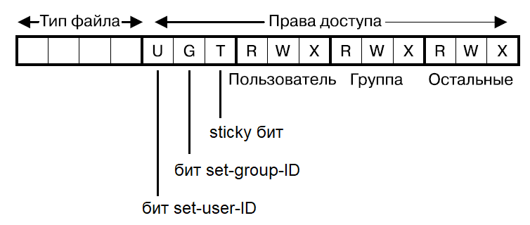

    *Тип файла* извлекается маской `S_IFMT` и сравнивается со значением константы, либо ко всей маске целиком применяется соответствующий макрос:

    | Константа | Макрос     | Тип файла             |
    | :-------- | :--------- | :-------------------- |
    | S_IFREG   | S_ISREG()  | Обычный файл          |
    | S_IFDIR   | S_ISDIR()  | Каталог               |
    | S_IFLNK   | S_ISLNK()  | Символическая ссылка  |
    | S_IFCHR   | S_ISCHR()  | Символьное устройство |
    | S_IFBLK   | S_ISBLK()  | Блочное устройство    |
    | S_IFIFO   | S_ISFIFO() | FIFO или pipe         |
    | S_IFSOCK  | S_ISSOCK() | Сокет                 |

    *Права доступа* извлекаются следующими масками:

    | Маска   | Значение | Право доступа            |
    | :------ | :------- | :----------------------- |
    | S_ISUID | 04000    | Set-user-ID бит          |
    | S_ISGID | 02000    | Set-group-ID бит         |
    | S_ISVTX | 01000    | Sticky бит (saved text)  |
    | S_IRUSR | 0400     | Пользователь: чтение     |
    | S_IWUSR | 0200     | Пользователь: запись     |
    | S_IXUSR | 0100     | Пользователь: выполнение |
    | S_IRWXU | 0700     | Пользователь: всё        |
    | S_IRGRP | 040      | Группа: чтение           |
    | S_IWGRP | 020      | Группа: запись           |
    | S_IXGRP | 010      | Группа: выполнение       |
    | S_IRWXG | 070      | Группа: всё              |
    | S_IROTH | 04       | Остальные: чтение        |
    | S_IWOTH | 02       | Остальные: запись        |
    | S_IXOTH | 01       | Остальные: выполнение    |
    | S_IRWXO | 07       | Остальные: всё           |

+ `st_nlink` - количество **жестких ссылок** на файл в данной файловой системе;
+ `st_uid` - UID, владелец файла;
+ `st_gid` - GID, группа файла
+ `st_size` - размер файла в байтах;
+ `st_blocks` - реальный размер файла в блоках по 512 байт; может отличаться от значения `st_size`, если файл содержит *дыры*;
+ `st_blksize` - оптимальный размер блока для операций ввода-вывода в данной файловой системе;
+ `st_atime` - время последнего доступа к файлу;
+ `st_mtime` - время последнего изменения данных файла;
+ `st_ctime` - время последнего изменения атрибутов индексного дескриптора файла.

### 5.4.5. Флаги индексного дескриптора

Флаги индексного дескриптора, впервые появившиеся в файловой системе ext2 как дополнительные, но впоследствии ставшие стандартными для Unix-систем.

В коде программы устанавливаются вызовом `ioctl(FS_IOC_SETFLAGS)`, а извлекаются - `ioctl(FS_IOC_GETFLAGS)`. В оболочке устанавливаются командой `chattr` с соответствующим аргументом, а извлекаются - `lsattr`.

Флаги, установленные *для каталога*, наследуются создаваемыми в нем файлами и подкаталогами. Устанавливать и изменять флаги может владелец или привилегированный процесс.

Возможные флаги:

+ `FS_APPEND_FL`, `-a` - файл открывается для записи только с параметром `O_APPEND`;
+ `FS_COMPR_FL`, `-c` - сжимать файл на диске;
+ `FS_DIRSYNC_FL`, `-D` - делает операции обновления каталога синхронными;
+ `FS_SYNC_FL`, `-S` - делает операции обновления файла синхронными;
+ `FS_IMMUTABLE_FL`, `-i` - запретить изменение содержимого файла и метаданных его индексного дескриптора;
+ `FS_JOURNAL_DATA_FL`, `-j` - включить журналирование изменений файла; поддерживает режимы: journal, ordered, writeback;
+ `FS_NOATIME_FL`, `-A` - отключить обновление метки времени последнего доступа к файлу;
+ `FS_NODUMP_FL`, `-d` - не включать файл в резервные копии, создаваемые командой `dump`;
+ `FS_SECRM_FL`, `-s` - удалить файл БЕЗ возможности его восстановления на диске;
+ `FS_UNRM_FL`, `-u` - удалить файл С возможностью его восстановления на диске.

## 5.5. Каталоги

**Каталог** является одним из типов файлов в UNIX-системах, поэтому для работы с ним может использоваться больше число вызовов, принимающих в качестве аргумента файловый дескриптор или путевое.

Однако каталоги имеют ряд особенностей:

+ имеют свой отдельный тип файла, записанный в индексном дескрипторе;
+ имеют особую структуру содержимого: содержат таблицу, записи которой представляют собой пары из *символьного имени файла* и соответствующего ему *номера индексного дескриптора* - **жесткие ссылки**;
+ каталог может быть открыт через `open()` (например, для установки владельца или прав доступа через его файлового дескриптора), однако читать и изменять его содержимое можно только с помощью специальных вызовов, а не унифицированного интерфейса ввода-вывода.

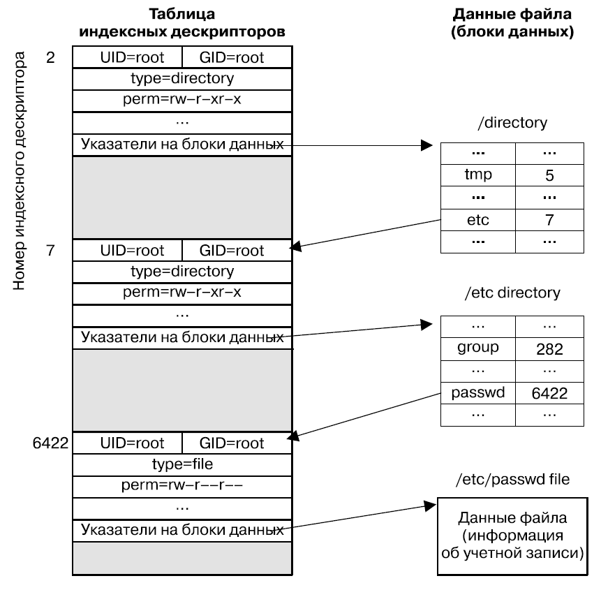

*Корню единого дерева каталогов* Linux всегда соответствует индексный дескриптор под номером `2`.

Каждый процесс имеет 2 атрибута, которые он *наследует* от родительского процесса:

+ **корневой каталог**, относительно которого интерпретируются *абсолютные путевые имена*; по умолчанию совпадает с *корнем единого дерева каталогов*;
+ **рабочий каталог**, относительно которого интерпретируются *относительные путевые имена*.

Только что созданный каталог содержит 2 записи:

+ `.` - ссылка на данный каталог;
+ `..` - ссылка на родительский каталог;

---

```C
int mkdir(const char *pathname, mode_t mode);
```

Создает новый каталог с правами доступа, определенными аргументом типа `mode_t` (принимает константы, список которых приводится в описании вызова `stat()`). Создание НЕ является рекурсивным: все промежуточные каталоги, содержащиеся в путевом имени, должны существовать к моменту вызова.

Аргумент `mode` имеет ряд особенностей, касающихся битов доступа:

+ установленный бит *set-user-ID* игнорируется, т.к. он не используется для каталогов;
+ установленный *sticky-бит* обрабатывается верным образом;
+ установленный бит *set-group-ID* игнорируется и его значение заимствуется из родительского каталога.

---

```C
int rmdir(const char *pathname);
```

Удаляет каталог, если он *пустой*. Если `pathname` является символической ссылкой, то она НЕ будет разыменована.

---

```C
int remove(const char *pathname);
```

Библиотечная функция удаляющая файл или *пустой* каталог. Внутри себя вызывает `unlink()` либо `rmdir()`. Если `pathname` является символической ссылкой, то она НЕ будет разыменована.

---

```C
char *getcwd(char *cwdbuf, size_t size);
```

Извлекает текущий *рабочий каталог* процесса в заранее выделенный буфер `cwdbuf`.

Аналогом данной функции является чтение цели символьной ссылки `/proc/PID/cwd` с помощью вызова `readlink()`.

---

```C
int chdir(const char *pathname);
int fchdir(int fd);
```

Изменяет текущий *рабочий каталог* процесса на переданный.
Если `pathname` является символьной ссылкой, то она будет разыменована. Аргумент `fd` должен быть файловым дескриптором каталога.

---

```C
int chroot(const char *pathname);
```

Изменяет *корневой каталог* процесса на переданный. Если `pathname` является символьной ссылкой, то она будет разыменована.

Также называется **заключением в клетку root**.

---

```C
char *realpath(
    const char *pathname,
    char *resolved_path);
```

Возвращает *каноническое абсолютное путевое имя* `resolved_path`, соответствующее переданному имени `pathname`: разрешает все символьные ссылки, а также ссылки `.` и `..`.

---

```C
char *dirname(char *pathname);
char *basename(char *pathname);
```

Возвращают для переданного путевого имени части c именем каталога и именем файла.

### 5.5.1. Библиотечные функции потоков каталогов

```C
DIR *opendir(const char *dirpath);
```

Открывает каталог, определенный своим путевым именем `dirpath`, и возвращает его описатель - *поток каталога*.

```C
DIR *fdopendir(int fd);
```

Открывает каталог, определенный своим файловым дескриптором `fd`, и возвращает его описатель - *поток каталога*. После успешного завершения вызова файловый дескриптор находится под управлением системы, и обращаться к нему иным образом нельзя!

```C
int dirfd(DIR *dirp);
```

Получает файловый дескриптор каталога по его потоку.

---

```C
struct dirent *readdir(DIR *dirp);

struct dirent
{
    ino_t d_ino;
    char d_name[];
};
```

Последовательно считывает записи из каталога, возвращая указатель на *статически* выделенную структуру. Если содержимое каталога поменяется во время последовательного сканирования, то функция НЕ заметит изменений!

Структура типа `dirent` содержит следующий набор полей:

+ `d_ino` - номер индексного дескриптора;
+ `d_name` - имя файла;

Дальнейшую информацию о расположенных в каталоге файлах можно узнать вызовом `stat()`.

Реентерабельный аналог - `readdir_r`.

---

```C
void rewinddir(DIR *dirp);
```

Перемещает поток каталога на первую запись.

---

```C
int closedir(DIR *dirp);
```

Закрывает поток, освобождая занимаемые им ресурсы.

### 5.5.2. Обход дерева каталогов: `nftw()`

```C
int nftw(
    const char *dirpath,
    NFTW_FUNC func,
    int nopenfd,
    int flags);

typedef int (*NFTW_FUNC) (
    const char *pathname,
    const struct stat *statbuf,
    int typeflag,
    struct FTW *ftwbuf);

struct FTW
{
    int base;
    int level;
}
```

Выполняет обход дерева каталога `dirpath` и вызывает указанную функцию `func` для каждой записи в дереве. Обход выполняется в несортированном порядке, причем сначала обходится сам каталог, а затем его дочерние подкаталоги.

В аргументе `nopenfd` указывается максимальное количество файловых дескрипторов, которые могут быть оставлены открытыми - при превышении данного лимита неиспользуемые дескрипторы будут закрыты и при необходимости открыты вновь.

Аргумент `flags` является битовой маской, определяющей поведение функции:

+ `FTW_CHDIR` - выполнять `chdir()` в каждом каталоге перед началом обхода содержащихся в нем записей;
+ `FTW_DEPTH` - сначала выполнять заданную функцию `func` для содержимого каталога, а затем для него самого. Иначе `func` будет сначала выполняться для каталога, а только затем для располагающихся в нем записей;
+ `FTW_MOUNT` - при обходе не заходить внутрь других файловых систем: если подкаталог является *точкой монтирования*, то он не будет посещен;
+ `FTW_PHYS` - НЕ разыменовывать сиволически ссылки.

В аргументы функции-коллбека `func` системой передаются:

+ `pathname` - путевое имя текущей записи;
+ `statbuf` - метаинформация из индексного дескриптора текущей записи;
+ `typeflag` - поле справочных флагов, принимающее одно из следующих значений:
  + `FTW_D` - является каталогом;
  + `FTW_DNR` - каталог, содержимое которого не удалось прочитать;
  + `FTW_DP` - содержимое каталога уже было обработано ранее;
  + `FTW_F` - файл любога типа, кроме каталога и символической ссылки;
  + `FTW_NS` - вызов `stat()` завершился ошибкой;
  + `FTW_SL` - символическая ссылка (если был установлен флаг `FTW_PHYS`);
+ `ftwbuf` - глубина текущей записи относительно точки старта обхода.

### 5.5.3. Аналоги вызовов, принимающие файловый дескриптор каталога

Для ряда вызовов, работающих с файловой системой, существуют их аналоги, которые в дополнение к путевому имени первым аргументом также принимают файловый дескриптор каталога:

| Новый интерфейс | Традиционный аналог |
| :-------------- | :------------------ |
| faccessat()     | access()            |
| fchmodat()      | chmod()             |
| fchownat()      | chown()             |
| fstatat()       | stat()              |
| linkat()        | link()              |
| mkdirat()       | mkdir()             |
| mkfifoat()      | mkfifo()            |
| mknodat()       | mknod()             |
| openat()        | open()              |
| readlinkat()    | readlink()          |
| renameat()      | rename()            |
| symlinkat()     | symlink()           |
| unlinkat()      | unlink()            |
| utimensat()     | utimes()            |

Если в данный набор вызовов передаётся *относительный путь*, то он разрешается на основе указанного каталога, а не рабочего каталога процесса. Если при этом указанному дескриптору каталога присвоено значение `AT_FDCWD`, то путь всё-таки будет разрешен на основе рабочего каталога.

Если в данный набор вызовов передаётся *абсолютный путь*, то указанный дескриптор каталога игнорируется.

## 5.6. Ссылки

### 5.6.1. Жесткие ссылки

**Жесткая ссылка** - это запись в файле каталога, которая содержит некоторое *символьное имя* и связанный с ним *номер индексного дескриптора*. С несколькими символьными именами может быть связан единственный идексный дескриптор - на дескриптор него могут указывать несколько *жестких ссылок*.  *Полное путевое имя* файла любого типа формируется последовательностью таких символьных имен, указывающих на индексные дескрипторы все более вложенных каталогов и в конечном счете завершающихся индексным дескриптором искомого файла.

*Жесткая ссылка* должна находить в *той же файловой системе*, что и файл, на который она указывет. Причина - номера индексных дескрипторов уникальны только в пределах одной файловой системы.

**Нельзя создать жесткую ссылку на каталог**. Причина - предотвращение создания циклических ссылок, когда некоторое имя в одном каталоге указывает на другой каталог, который в свою очередь содержит имя, указывающее на первый каталог. **Однако можно создать для каталога связанную точку монтирования**.

При удалении файла происходит стирание соответствующей записи в каталоге и уменьшение счетчика жестких ссылок в индексном дескрипторе. Реальное удаление файла, включающее освобождение индексного дескриптора и логических блоков, будет выполнено только в тот момент, когда значение счетчика ссылок опустится до 0. Также следует помнить, что если какие-либо процессы удерживают файл открытым, то он будет удален только после закрытия своего последнего файлового дескриптора.

В оболочке жесткие ссылки создаются командой `ln`.

---

```C
int link(
    const char *oldpath,
    const char *newpath);
```

Создает новую жесткую ссылку для указанного путевого имени. Если `newpath` уже занято, то вызов завершится с ошибкой. Если `oldpath` является символической ссылкой, то она НЕ будет разыменована.

---

```C
int unlink(const char *pathname);
```

Удаляет жесткую ссылку и, если она была последней, также удаляет файл. Если `pathname` является символической ссылкой, то она НЕ будет разыменована.

---

```C
int rename(
    const char *oldpath,
    const char *newpath);
```

Переименовывает файл (каталог), причем новое имя может находиться в другом каталоге той же файловой системы (можно переносить файлы).

Особенности данного вызова:

+ если `newpath` уже занято, то существующий файл перезаписывается;
+ если `oldpath` и `newpath` ссылаются на один и тот же файл, то никаких действий не производится;
+ если `oldpath` или `newpath` являются символическими ссылками, то они НЕ будут разыменованы;
+ если `oldpath` не являлся каталогом, то и `newpath` не может им быть;
+ если `oldpath` является каталогом, то `newpath` либо не должен еще существовать, либо должен быть пустым каталогом;
+ если `oldpath` является каталогом, то `newpath` НЕ может быть вложенным в него каталогом.

### 5.6.2. Символические (мягкие) ссылки

**Символическая (мягкая) ссылка** - это отдельный файл специального типа, содержащий ПУТЕВОЕ ИМЯ другого файла (*целевого объекта*), на который данная ссылка указывает.

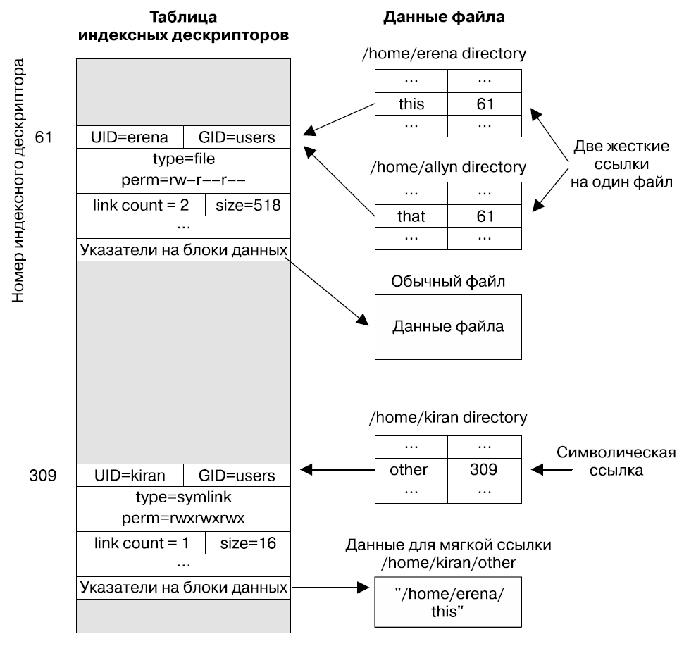

Путевое имя в теле ссылки может быть как абсолютным, так и относительным. Поскольку символическая ссылка содержит ПУТЕВОЕ ИМЯ, а НЕ номер индексного дескриптора в таблице, уникальной для каждой файловой системы, то символическая ссылка **может пересекать границы файловых систем**.

Символические ссылки всегда создаются с полными правами доступа для всех категорий. Принадлежность и права доступа исходного файла ссылки игнорируются *большинством* вызовов - вместо этого проверки выполняются для целевого файла. Принадлежность файла ссылки, например, может иметь значение в каталогах, для которых выставлен *sticky-бит*.

Символические ссылки на *промежуточные каталоги* в теле путевого имени зачастую *автоматически разыменовываются* системными вызовами. Факт разрешения *конечного файла ссылки* определяется логикой системного вызова. При этом на общее и индивидуальное для каждого компонента пути количество разыменований (`POSIX_SYMLOOP_MAX`) наложены ограничения - 40 и 8 соответственно.

В оболочке символические ссылки создаются командой `ln -s`.

---

```C
int symlink(
    const char *linkpath,
    const char *linkpath);
```

Создает символическую ссылку с именем `linkpath` для имени `linkpath`. Если `linkpath` уже занято, то вызов завершается с ошибкой.

---

```C
ssize_t readlink(
    const char *pathname,
    char *buffer,
    size_t bufsiz);
```

Извлекает в заранее выделенный буфер `buffer` путевое имя, содержащееся в символической ссылке `pathname`. В качестве значения аргумента `bufsiz` рекомендуется использовать `PATH_MAX`.

## 5.7. Расширенные атрибуты

**Расширенные атрибуты** - это дополнительные ассоциированные с индексным дескриптором метаданные, представляющие собой пары *имя-значение*. В основном используются для реализации списков контроля доступа (ACL) и возможностей (capabilities) файла.

Имена расширенных атрибутов имеют вид `namespace.name`:

+ `namespace` - служит для разбиения атрибутов на *классы*;
+ `name` - уникальным образом идентифицирует атрибут внутри класса.

Существуют следующие *классы атрибутов*:

+ `user` - могут управляться НЕпривилегированными пользовательскими процессами. Для извлечения атрибута требуется право на чтение, для установки - право на запись. Файловая система должна быть смонтирована с параметром `user_xattr`;
+ `trusted` - могут управляться привилегированными пользовательскими процессами (`CAP_SYS_ADMIN`);
+ `system` - используются ядром для привязки системных объектов к файлу (например, списков ACL);
+ `security` - используются модулями защиты операционной системы.

В пространствах `user` и `trusted` именами могут быть любые строки. В пространстве `system` - только имена, определенные ядром.

Расширенные атрибуты `user` могут быть назначены только *обыкновенным файлам и каталогам* - расширенные атрибуты НЕЛЬЗЯ применять к символической ссылке, файлам устройств, сокетам, FIFO. Непривилегированный пользователь может назначить атрибуты `user` каталогу с установленным sticky-битом, только если он является его владельцем.

Также на все расширенные атрибуты накладываются следующие ограничения:

+ длина имени ограничена 255 байт;
+ длина значения ограничена 64000 байт;
+ общее количество байт, отводимых на хранение всех расширенных атрибутов одного файла, ограничено собственным значением в каждой файловой системе (в ext - размер блока).

### 5.7.1. Манипулирование расширенными атрибутами

В оболочке расширенные атрибуты устанавливаются командой `setfattr`, а извлекаются - `getfattr`.

---

```C
int setxattr(
    const char *pathname,
    const char *name,
    const void *value,
    size_t size,
    int flags);

int lsetxattr(
    const char *pathname,
    const char *name,
    const void *value,
    size_t size,
    int flags);

int fsetxattr(
    int fd,
    const char *name,
    const void *value,
    size_t size,
    int flags);
```

Устанавливают имя и значение расширенного атрибута. Если `pathname` является символической ссылкой, то вызов `lsetxattr()` её НЕ разыменует. Аргумент `flags` принимает значения `XATTR_CREATE` и `XATTR_REPLACE`, смысл которых очевиден.

---

```C
ssize_t getxattr(
    const char *pathname,
    const char *name,
    void *value,
    size_t size);

ssize_t lgetxattr(
    const char *pathname,
    const char *name,
    void *value,
    size_t size);

ssize_t fgetxattr(
    int fd,
    const char *name,
    void *value,
    size_t size);
```

Извлекают значение указанного расширенного атрибута в предварительно выделенный буфер `value`. Для определения размера атрибута предварительно в `size` можно передать 0. Если `pathname` является символической ссылкой, то вызов `lgetxattr()` её НЕ разыменует.

---

```C
int removexattr(
    const char *pathname,
    const char *name);

int lremovexattr(
    const char *pathname,
    const char *name);

int fremovexattr(
    int fd,
    const char *name);
```

Удаляют указанный расширенный атрибут заданного файла, если он существует. Если `pathname` является символической ссылкой, то вызов `lremovexattr()` её НЕ разыменует.

---

```C
ssize_t listxattr(
    const char *pathname,
    char *list,
    size_t size);

ssize_t llistxattr(
    const char *pathname,
    char *list,
    size_t size);

ssize_t flistxattr(
    int fd,
    char *list,
    size_t size);
```

Извлекают список всех имен расширенных атрибутов (завершающихся нулевым байтом) заданного файла в предварительно выделенный буфер `list`. Если `pathname` является символической ссылкой, то вызов `llistxattr()` её НЕ разыменует.

Права на доступ к самому файлу не требуются - достаточно только прав на выполнение всех каталогов, составляющих путевое имя. Из списка будут исключены атрибуты, для доступа к которым у процесса нет прав (например, `trusted`).

## 5.8. Списки контроля доступа

**Списки контроля доступа (access control lists, ACL)** являются расширением традиционной системы прав UNIX-систем и позволяют настраивать доступ к объектам файловой системы более гибким образом. ACL могут быть созданы для обычных файлов и каталогов, при этом для каталога существует 2 различных типа списков: *access ACL* и *default ACL*.

Любой ACL-список представляет собой ряд записей, каждая из которых задаёт права доступа к файлу с точностью вплоть до отдельного пользователя или группы.

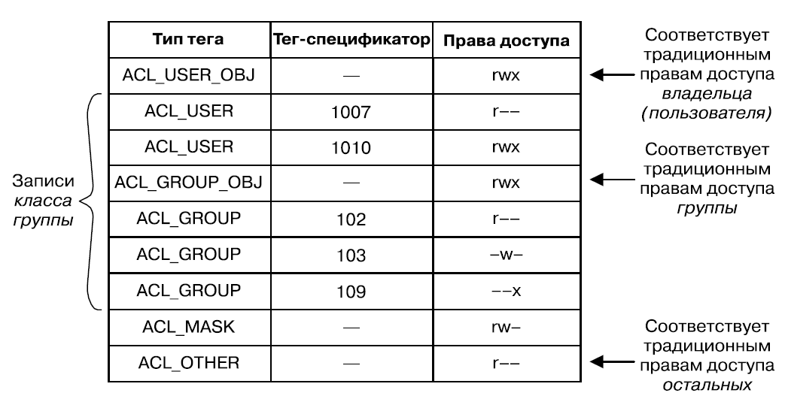

Запись включает в себя следующие компоненты:

+ *тип тега* - указывает категорию применения данной записи;
+ *тег-спецификатор* - при необходимости идентифицирует конкретного пользователя или группу;
+ *набор прав доступа* - определяют права доступа (чтение, запись, выполнение), установленные для данной записи.

*Тип тега* может принимать одно из следующих значений:

+ `ACL_USER_OBJ` - права владельца файла. Любой ACL-список содержит **ровно одну** такую запись;
+ `ACL_USER` - права пользователя c указанным UID;
+ `ACL_GROUP_OBJ` - права группы файла. Любой ACL-список содержит **ровно одну** такую запись;
+ `ACL_GROUP` - права группы с указанным GID;
+ `ACL_MASK` - маска с верхней границей права доступа, предоставленных записям *класса группы*: `ACL_USER`, `ACL_GROUP_OBJ`, `ACL_GROUP`. Любой ACL-список содержит **не более одной** такой записи. Если имеются записи, определяющие права для конкретных пользователей и групп, то её наличие становится обязательным.

    Причина существования маски - предоставить стандартную логику проверки прав для программ, не использующих интерфейс ACL-списков, без повреждения содержимого записей и с минимальными накладными расходами.

    При наличии маски в ACL-списке:

  + изменение *прав группы* вызовом `chmod()` будет применяться к правам доступа в записи маски (а НЕ `ACL_GROUP_OBJ`);
  + вызов `stat()` будет возвращать *права группы* из записи маски (а НЕ `ACL_GROUP_OBJ`);

+ `ACL_OTHER` - права остальных. Любой ACL-список содержит **ровно одну** такую запись.

В зависимости от своего содержимого списки *access ACL* делятся на:

+ *минимальный* - содержат только записи `ACL_USER_OBJ`, `ACL_GROUP_OBJ`, `ACL_OTHER`. Фактически реализованы как традиционные биты прав доступа внутри индексного дескриптора;
+ *расширенный* - включают маску и поля конкретных пользователей или групп. Реализуются как *расширенный атрибут* `system.posix_acl_access`. На них накладываются все ограничения расширенных атрибутов. Также время сканирование списка в поисках нужной записи **линейно пропорционально** его длине.

Для каталогов существует еще один тип списков - **default ACL**. Он реализуются как расширенный атрибут `system.posix_acl_default` и определяют содержимое ACL-списков файлов и подкаталогов, создаваемых в данном родительском каталоге.

Если каталог имеет *default ACL*:

+ создаваемый подкаталог наследует свой *default ACL* от родительского каталога;
+ создаваемый файл или подкаталог формируют свой *access ACL* на основе *default ACL* родительского каталога, накладывая на его записи `ACL_USER_OBJ`, `ACL_MASK` (в случае её отсутствия - на `ACL_GROUP_OBJ`) и `ACL_OTHER` аргумент режимов доступа `mode_t`, переданный в вызов `open()`.

При наличии *default ACL* маска процесс *umask* НЕ используется!

### 5.8.1. Порядок проверки прав доступа ACL

Проверка прав доступа к файлу (каталогу), для которого создан ACL-список, осуществляется в следующей очередности с остановкой в момент нахождения *первого соответствия идентификаторов*:

1. Если процесс привилегирован, то он имеет полный доступ;
2. Если действующий UID процесса совпадает с владельцем файла, то проверяются права записи `ACL_USER_OBJ`;
3. Если для действующего UID процесса существует запись `ACL_USER`, то проверяются её права с наложенной на них маской `ACL_MASK`;
4. Если действующий GID процесса или GID любой из его дополнительных групп совпадает с группой файла, то проверяются права записи `ACL_GROUP_OBJ` с наложенной на них маской `ACL_MASK`;
5. Если для действующего GID процесса или для GID любой из его дополнительных групп существует запись `ACL_GROUP`, то проверяются её права с наложенной на них маской `ACL_MASK`;
6. Иначе проверяются права записи `ACL_OTHER`.

ACL просто ищет на основе одного заданного идентификатора процесса первую подходящую запись. Если, допустим, полный набор предоставляемых прав разбит на части и рассредоточен по различным записям (например, основной группе процесса разрешено писать, а дополнительной - читать), то в случае запроса полного набора прав (например, основной группе требуется запись И чтение) ACL не будет собирать полное множество возможных прав на основе нескольких записей, а просто вернет ошибку превышения запрошенных прав над частично предоставленными одной найденной записью.

### 5.8.2. Манипулирование ACL-списками

В оболочке ACL-списки извлекаются командой `getfacl`, а устанавливаются - `setfacl`.

Записи представляются в формате:

`tag-type:[tag-qualifier]:permissions`

Например:

`u::rw,u:paulh:rw,g::r,g:teach:rw,m::rwx,o::-`

В коде программы для управления ACL-списками применяется соответствующий API, реализованный в библиотеке `libacl` и имеющий следующую схему использования:

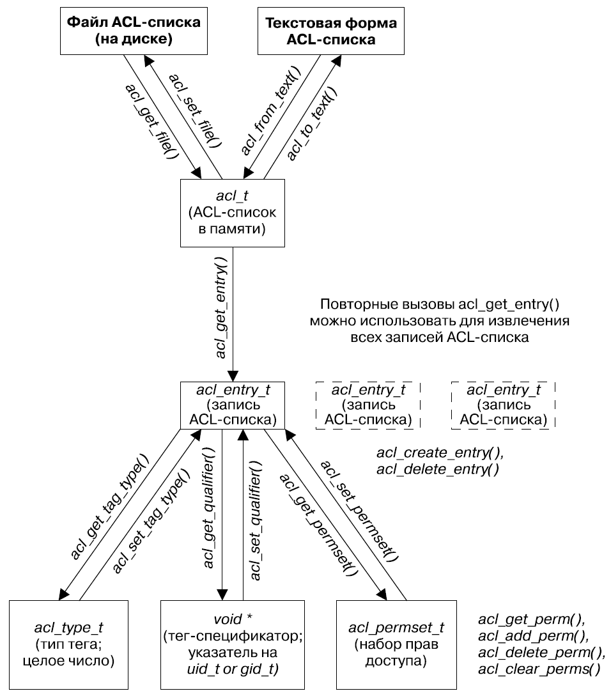

---

```C
acl_t acl_get_file(pathname, type);
```

Извлекает ACL-список из указанного файла на диске в память. Аргумент `type` принимает значения `ACL_TYPE_ACCESS` и `ACL_TYPE_DEFAULT`, смысл которых очевиден.

```C
int acl_set_file(pathname, type, acl);
```

Переносит заданный ACL-список из памяти в указанный файл на диске. Аргумент `type` принимает значения `ACL_TYPE_ACCESS` и `ACL_TYPE_DEFAULT`, смысл которых очевиден.

---

```C
int acl_get_entry(acl, entry_id, &entry);
```

Извлекает заданную *запись* и указанного ACL-списка, расположенного в памяти. Аргумент `entry_id` определяет извлекаемую запись и принимает значения `ACL_FIRST_ENTRY` и `ACL_NEXT_ENTRY`, смысл которых очевиден.

```C
int acl_create_entry(&acl, &entry)
```

Создает и возвращает пустую *запись* в указанном ACL-списке.

```C
int acl_delete_entry(acl, entry);
```

Удаляет указанную *запись* из ACL-списка.

---

```C
int acl_get_tag_type(entry, &tag_type);
int acl_set_tag_type(entry, tag_type);
```

Извлекает из указанной записи или устанавливает в ней значение поля *тип тега*.

```C
uid_t acl_get_qualifier(entry);
int acl_set_qualifier(entry, qualp);
```

Извлекает из указанной записи или устанавливает в ней значение поля *тега-спецификатора*. Тег-спецификатор действителен, только если он поддерживается типом тега данной записи.

```C
int acl_get_permset(entry, &permset);
int acl_set_permset(entry, permset);
```

Извлекает из указанной записи или устанавливает в ней значение поля *набора прав доступа*.

---

```C
int acl_get_perm(permset, perm);
int acl_add_perm(permset, perm);
int acl_delete_perm(permset, perm);
int acl_clear_perms(permset);
```

Проверяет наличие, устанавливает, удаляет *конкретное право доступа* в указанном наборе или полностью очищает набор. Аргумент `perm` принимает значения `ACL_READ`, `ACL_WRITE` или `ACL_EXECUTE`, смысл которых очевиден.

---

```C
char *acl_to_text(acl, &len);
acl_t acl_from_text(acl_string);
```

Преобразует расположенный в памяти ACL-список в строковое представление и обратно.

---

Другие функции помощники:

+ `acl_calc_mask()` - вычисляет маску `ACL_MASK` на основе всех записей *класса группы*;
+ `acl_valid()` - проверяет правильность ACL-списка;
+ `acl_delete_def_file()` - удаляет default ACL каталога;
+ `acl_init()` - создает пустой ACL-список;
+ `acl_dup()` - дублирует ACL-список;
+ `acl_free()` - очищает память, занимаемую передаваемой ей ACL-структурой.

## 5.9. Мониторинг событий файлов: inotify

Механизм **inotify** позволяет приложению получать уведомления от операционной системы о возникновении тех или иных событий над интересующими приложение *файлами и каталогами*.

Схема использования механизма **inotify**:

1. Вызываем `inotify_init()` и получаем файловый дескриптор *объекта inotify*, через который и будет осуществляться всё отслеживание;
2. Вызываем `inotify_add_watch()` для добавления интересующих сущностей файловой системы в *список наблюдения* объекта inotify. Элемент списка наблюдения содержит путевое имя сущности и битовую маску отслеживаемых для неё событий. Манипулирование созданным элементом списка осуществляется через возвращенный вызовом *дескриптор наблюдения*. Если сущность перестала нас интересовать, то она может быть удалена из списка вызовом `inotify_rm_watch()`;
3. Для начала отслеживания всех интересующих событий над объектом inotify выполняется операция *чтения*: либо через обыкновенный `read()`, либо с использованием *асинхронных* механизмов *select/poll/epoll*;
4. При окончании работы *закрываем* файловый дескриптор объекта inotify - это освободит все системные ресурсы.

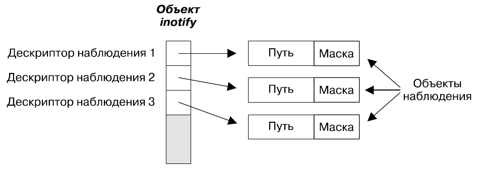

---

```C
int inotify_init(void);
```

Создает *объект inotify* и возвращает его файловый дескриптор.

---

```C
int inotify_add_watch(
    int fd,
    const char *pathname,
    uint32_t mask);
```

Добавляет новое путевое имя `pathname` в список наблюдения объекта inotify и задаёт для него битовую маску отслеживаемых событий `mask`. Вызов возвращает *дескриптор наблюдения*, соответствующий созданному элементу списка наблюдения. Если путевое имя УЖЕ находилось в списке наблюдения, то вызов ИЗМЕНЯЕТ маску событий СУЩЕСТВУЮЩЕГО элемента.

```C
int inotify_rm_watch(int fd, uint32_t wd);
```

Удаляет существующий элемент списка наблюдения указанного объекта inotify, заданный через его дескриптор наблюдения `wd`.

### 5.9.1. Флаги битовой маски событий

Флаги битовой маски, с которыми работает механизм inotify, подразделяются на передаваемые в вызов - *входные*, определяющие событие для отслеживания или особенности вызова - и/или возвращаемые из вызова - *выходные*, определяющие произошедшее событие.

| Флаги                                                   | Тип флага        | Описание                                                                                        |
| :------------------------------------------------------ | :--------------- | :---------------------------------------------------------------------------------------------- |
| `IN_ACCESS`                                             | входной/выходной | файл прочитан                                                                                   |
| `IN_ATTRIB`                                             | входной/выходной | метаданные изменены                                                                             |
| `IN_CLOSE_WRITE`, `IN_CLOSE_NOWRITE`                    | входной/выходной | файл открыт для записи, а затем закрыт                                                          |
| `IN_CREATE`, `IN_MODIFY`, `IN_DELETE`, `IN_DELETE_SELF` | входной/выходной | файл/каталог создан, изменен, удален                                                            |
| `IN_MOVE_SELF`, `IN_MOVED_FROM`, `IN_MOVED_TO`          | входной/выходной | файл/каталог перемещен                                                                          |
| `IN_OPEN`                                               | входной/выходной | файл открыт                                                                                     |
| `IN_ALL_EVENTS`, `IN_MOVE`, `IN_CLOSE`                  | входной          | сокращения, группирующие описанные выше события                                                 |
| `IN_DONT_FOLLOW`                                        | входной          | НЕ разыменовывать путевое имя `pathname`, если оно является символьной ссылкой                  |
| `IN_MASK_ADD`                                           | входной          | добавить переданные флаги в существующую маску                                                  |
| `IN_ONESHOT`                                            | входной          | продолжать отслеживание только до генерации первого уведомления - после прекратить отслеживание |
| `IN_ONLYDIR`                                            | входной          | путевое имя `pathname` должно являться каталогом - иначе генерировать ошибку                    |
| `IN_IGNORED`                                            | выходной         | элемент был удален из списка наблюдения                                                         |
| `IN_ISDIR`                                              | выходной         | дополнительно устанавливается, если возвращенное событие произошло для каталога                 |
| `IN_Q_OVERFLOW`                                         | выходной         | переполнение очереди событий                                                                    |
| `IN_UNMOUNT`                                            | выходной         | файловая система размонтирована                                                                 |

### 5.9.2. Чтение уведомлений о произошедших событиях

Чтение файлового дескриптора объекта inotify при возникновении событий возвращает буфер байтов, заполненный структурами `inotify_event`:

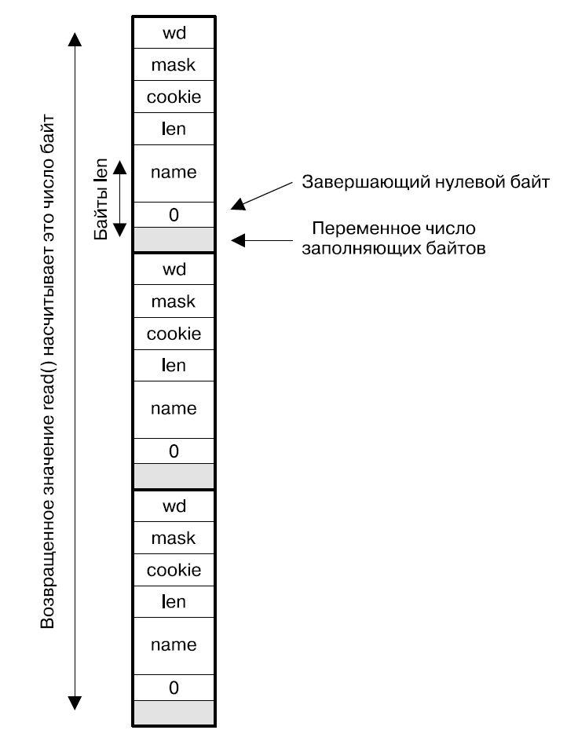

Структура `inotify_event` содержит следующие поля:

```C
struct inotify_event
{
    int wd;
    uint32_t mask;
    uint32_t cookie;
    uint32_t len;
    char name[];
};
```

+ `wd` - *дескриптор наблюдения*, для которого произошло событие;
+ `mask` - битовая маска флагов отслеживаемых событий, фактически произошедших для данного элемента списка наблюдения;
+ `cookie` - некоторый числовой идентификатор, значение которого совпадает для связанный между собой событий; например, перенос файла между каталогами генерирует два связанных события `IN_MOVED_FROM` и `IN_MOVED_TO`;
+ `name` и `len` - определяют путевое имя отслеживаемой сущности файловой системы, для которой произошло событие; путевое имя завершается *нулевым байтом* и размещается в буфере вслед за своей структурой; за именем может следовать переменное число байтов выравнивания (оно учтено в `len`).

Уведомления в возвращенном чтением из файлового дескриптора inotify буфере упорядочены в очередь - исходный **порядок событий сохраняется**! Однако **повторяющися события** (имеющие одинаковые значения полей `wd`, `mask`, `cookie` и `name`) при добавлении **в конец очереди** будут **объединяются** вместе - механизм inotify НЕЛЬЗЯ использовать для определения ТОЧНОГО КОЛИЧЕСТВА произошедших событий!

### 5.9.3. Системные ограничения на механизм inotify

Следующие позволяющие редактирование файлы, располагающиеся в каталоге `/proc/sys/fs/inotify`, определяют ограничения ресурсов, накладываемые системой на механизм inotify:

+ `max_user_instances` - максимальное количество объектов inotify, которое может создать *один* РЕАЛЬНЫЙ UID; по умолчанию `128`;
+ `max_user_watches` - максимальное *суммарное* количество элементов списков наблюдения, которое может создать *один* РЕАЛЬНЫЙ UID; по умолчанию `8192`;
+ `max_queued_events` - максимальное количество уведомлений, которое может быть помещено в очередь *одного* объекта inotify; по умолчанию `16384`.

# 6. Процессы

**Программа** - файл, содержащий следующую информацию о том, как при его выполнении конструировать *процесс*:

+ **идентификатор двоичного формата** - используется ядром для верной интерпретации содержимого файла программы. Linux применяет формат исполняемых и компонуемых файлов - **Executable and Linking Format (ELF)**;
+ **машинный код** - алгоритм программы;
+ **данные** - числовые и сомвольные константы, указанные в программе при её компиляции;
+ **адрес входа в программу** - местоположение первой инструкции, с которой должно начаться выполнение программы;
+ **таблица имен и переадресации** - определяет имена и расположение функций и переменных в файле программы;
+ **информация о библиотеках и компоновщике** - набор полей, определяющий путевые имена используемых динамических библиотек и компоновщика.

**Процесс** - абстракция, являющаяся совокупностью всех ресурсов системы, выделенных ядром для выполнения данного экземпляра программы. Единственный файл программы служит для построения на его основе множества процессов. Физически *процесс* представляет собой некоторый объем оперативной памяти, содержащий в себе загруженные из файла программы машинные инструкции прикладного алгоритма и необходимые ему переменные (в *пользовательском пространстве памяти* процесса), а также инструкции кода ядра и служебные структуры данных (в *пространстве памяти ядра* процесса), управляющие функционированием данного процесса и его взаимодействием с системой и другими процессами. Инструкциям процесса (как прикладным, так и ядра) для их выполнения периодически выделяется доля времени центрального процессора. Системой накладываются ограничения на каждый тип ресурсов процесса, и она следит за соблюдением лимитов. При завершении процесса все занимаемые им ресурсы освобождаются и становятся доступными другим процессам.

Любой процесс обладает создавшим его **родительским процессом**. Корневым предком всех процессов системы является **процесс `init`**. Родителями процессов пользовательских программ являются процессы командных оболочек. Если процесс по некоторой причине **сиротеет** (его родитель полностью завершает своё выполнение), то его новым родителем напрямую становится процесс `init`.

## 6.1. Идентификаторы процесса

Каждый процесс обладает набором связанных с ним идентификаторов.

### 6.1.1. Cобственный идентификатор процесса - PID

**Process ID (PID)** - уникальный идентификатор, позволяющий однозначным образом отличить заданный процесс. Является целом положительном числом. Пользовательский процесс минимально может получить идентификатор с номером `300` - меньшие значения занимаются системными процессами. Максимально возможное значение PID в Linux определяется файлом `/proc/sys/kernel/pid_max` и на 64-х разрядной системе составляет $2^{22}$ (около 4 миллионов).

**Parent PID (PPID)** - PID родителя данного процесса.

Для процесса `init`, являющегося родителем всех процессов системы, `PID = 1`. Сам `init` не имеет родителя - его`PPID = 0`.

---

```C
pid_t getpid(void);
```

Возвращает PID процесса, выполнившего данный вызов.

---

```C
pid_t getppid(void);
```

Возвращает идентификатор родителя PPID процесса, выполнившего данный вызов.

### 6.1.2. Идентификаторы владельца процесса

Процесс хранит несколько идентификаторов, обозначающих, какому пользователю он принадлжеит:

+ **реальные (real) UID и GID** - идентификаторы пользователя и группы, которым *принадлежит процесс*. Процесс *наследует* данные идентификаторы от своего *родителя*. Процесс *оболочки входа* пользователя, являющийся родителем всех процессов прикладных программ, получает их из *файла паролей* `/etc/passwd`;
+ **действующие (effective) UID и GID** - идентификаторы пользователя и группы, реально используемые в *проверках разрешений* на доступ процесса к ресурсам ядра. Могут изменяться во время работы процесса;
+ **сохраненные (saved) set-user-ID и set-group-ID** - идентификаторы пользователя и группы процесса, содержащие значения *владельца и группы* исполняемого *файла программы*, для которого установлены **биты set-user-ID и set-group-ID**.

    Запуске файла программы с установленными *битами set-user-ID и set-group-ID* сопровождается следующей последовательностью действий:

    1. *реальные ID* процесса наследуются им от своего родителя;
    2. *действующими ID* процесса становятся владелец и группа файла;
    3. *сохраненным ID* присваиваются копии значений действующих ID.

    Далее во время работы процесс, выполняя соответствующие системные вызовы, может переключать значения своих действующих идентификаторов между реальными и сохраненными значениями.

    В терминале битовые флаги set-user-ID и set-group-ID файла программы могут быть установлены командами:

    ```bash
    chmod u+s program
    chmod g+s program
    ```

    Установленные флаги отображаются символом `S` в позициях *полномочия выполнения владельцем и группой* `-rwSrwSrwx`;
+ **идентификаторы файловой системы** - идентификаторы UID и GID, используемые при выполнении процессом *операций в файловой системе*. Существуют по историческим причинам и практически всегда *автоматически дублируют* значения *действующих идентификаторов*;
+ **дополнительные идентификаторы групп** - набор идентификаторов GID групп, в которых состоит процесс. Максимальное количество групп процесса определяется ограничением `_SC_NGROUPS_MAX`. Процесс *наследует* дополнительные групповые идентификаторы от своего *родителя*. Процесс *оболочки входа* пользователя, являющийся родителем всех процессов прикладных программ, получает их из *файла групп* `/etc/group`.

Управление идентификаторами процесса осуществляется через набор системных вызовов. При изменении идентификаторов необходимо *сначала* менять *групповые* ID, а только *затем пользовательские* ID: преждевременная смена пользователя может привести к утрате возможности установить желаемый групповой идентификатор. Привилегиями, позволяющими процессу *произвольно изменять* своего пользователя и группа, являются `CAP_SETUID` и `CAP_SETGID`.

Также все идентификаторы данного процесса могут быть просмотрены в предоставляемом ядром файле `/proc/PID/status`.

---

```C
uid_t getuid(void);
gid_t getgid(void);
```

Возвращают *реальный* идентификатор.

---

```C
uid_t geteuid(void);
gid_t getegid(void);
```

Возвращают *действующий* идентификатор.

---

```C
int getresuid(
    uid_t *ruid,
    uid_t *euid,
    uid_t *suid);

int getresgid(
    gid_t *rgid,
    gid_t *egid,
    gid_t *sgid);
```

Возвращают *реальный, действующий и сохраненный* идентификаторы.

---

```C
int setuid(uid_t uid);
int setgid(gid_t gid);
```

Изменяют идентификаторы процесса следующим образом:

+ если вызваны *обыкновенным процессом*, то изменяют только *действующий идентификатор*, причем значение аргумента должно совпадать с *реальным или сохраненным* ID;
+ если вызваны *привилегированным процессом*, то изменяют все идентификаторы - *реальный, действующий и сохраненный*; применяется для **окончательного сброса привилегий**.

---

```C
int seteuid(uid_t euid);
int setegid(gid_t egid);
```

Изменяют *действующий* идентификатор следующим образом:

+ если вызваны *обыкновенным процессом*, то значение аргумента должно совпадать с совпадать с *реальным или сохраненным* ID;
+ если вызваны *привилегированным процессом*, то аргумент может принимать любые значения; применяется для **временного сброса привилегий**, т.к. действующий ID по прежнему может быть восстановлен из реального или сохраненного.

---

```C
int setreuid(uid_t ruid, uid_t euid);
int setregid(gid_t rgid, gid_t egid);
```

Изменяют *реальный и действующий* идентификаторы следующим образом:

+ если вызваны *обыкновенным процессом*, то значение аргумента *нового реального* ID должно совпадать с *действующим* ID; значение аргумента *нового действующего* ID - c *реальным или сохраненным* ID;
+ если вызваны *привилегированным процессом*, то оба аргумента могут принимать любые значения;
+ также для *любого типа процесса* *сохраненному* ID присваивается значение *нового действующего* ID при выполнении любого условия:
  + аргумент *реального* ID не равен `-1`;
  + *новый действующий* ID отличается от *изначального реального ID*;

Если изменение какого-то идентификатора не требуется, то его аргументу присваивается значение `-1`.

---

```C
int setresuid(
    uid_t ruid,
    uid_t euid,
    uid_t suid);

int setresgid(
    gid_t rgid,
    gid_t egid,
    gid_t sgid);
```

Изменяют *реальный, действующий и сохраненный* идентификаторы следующим образом:

+ если вызваны *обыкновенным процессом*, то значением аргумента *любого нового* ID может являться *любой из текущих* ID - *реальный, действующий или сохраненный*;
+ если вызваны *привилегированным процессом*, то все аргументы могут принимать любые значения;

Если изменение какого-то идентификатора не требуется, то его аргументу присваивается значение `-1`.

---

```C
int setfsuid(uid_t fsuid);
int setfsgid(gid_t fsgid);
```

Изменяет идентификаторы *файловой системы* следующим образом:

+ если вызваны *обыкновенным процессом*, то значением аргумента может являться *любой из текущих* ID - *реальный, действующий или сохраненный*;
+ если вызваны *привилегированным процессом*, то аргумент может принимать любые значения;

---

```C
int getgroups(
    int gidsetsize,
    gid_t grouplist[]);
```

Возвращает в заранее выделенном аргументе `grouplist` список *дополнительных групповых* идентификаторов.

---

```C
int setgroups(
    size_t gidsetsize,
    const gid_t *grouplist);
```

Заменяет *дополнительные групповые* идентификаторы на переданный в `grouplist` набор.

---

```C
int initgroups(const char *user, gid_t group);
```

Заменяет *дополнительные групповые* идентификаторы, выполняя просмотр файла групп `/etc/group` для указанного в `user` имени пользователя и добавляя к прочитанному набору GID, переданный в аргументе `group`.

## 6.2. Модель памяти процесса

Пространоство адресов памяти, выделенной процессу, *логически* подразделяется на несколько отдельных *сегментов*:

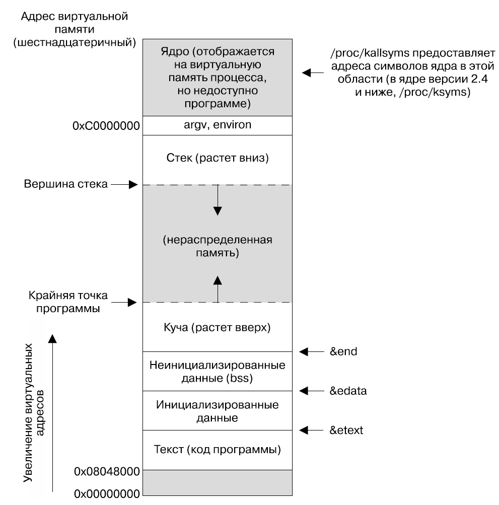

+ **текстовый сегмент** - машинные инструкции пользовательской программы; доступен *только для чтения*; создаётся с возможностью *совместного использования*, в результате единственный экземпляр кода программы с диска проецируется в память множества процессов;
+ **инициализированные данные** - глобальные и статические переменные, инициализированные в коде программы явным образом;
+ **неинициализированные данные** - глобальные и статические переменные *встроенных типов*, НЕ инициализированные явным образом; система автоматически заполняет данную область 0 при страте процесса;
+ **динамическая память (куча)** - область, из которой в ходе работы программы выделяется память под переменнные; верхнюю границу кучи называют *program break*;
+ **стек** - динамически увеличивающаяся и уменьшающаяся последовательность **стековых кадров (фреймов)**; каждой вызванной на данный момент *функции* соответствует собственный фрейм, содержащий её аргументы, локальные переменные, возвращаемое значение;
+ общая область для **аргументов командной строки** и **переменных окружения**.

Физически память, занимаемая инструкциями и переменными процесса, представляет собой набор блоков фиксированного размера - **страничных кадров (фреймов)**. Однако диапазон доступной процессу памяти НЕ образован реальными адресами оперативной памяти - в Linux используется **механизм управления виртуальной памятью**. Каждому процессу выделяется непрерывное, доступное только ему **виртуальное адресное пространство**, простирающееся от нулевого адреса до $2^{32}$ или $2^{64}$ (определяется разрядностью процессора и операционной системы). Выделение виртуальной памяти аналогично происходит фиксированными блоками, называемыми **страницами**. Во время своей работы процесс оперирует виртуальными адресами, однако в реальности каждая *виртуальная страница* представляется *физическим страничным кадром* - информация о соответствии хранится в  **таблице страниц процесса**, а самим отображением виртуальных адресов в реальные занимается специализированный блок центрального процессора *Paged Memory Management Unit (PMMU)*, содержащий кеш *Translation Lookaside Buffer (TLB)*, ускоряющий данную операцию.

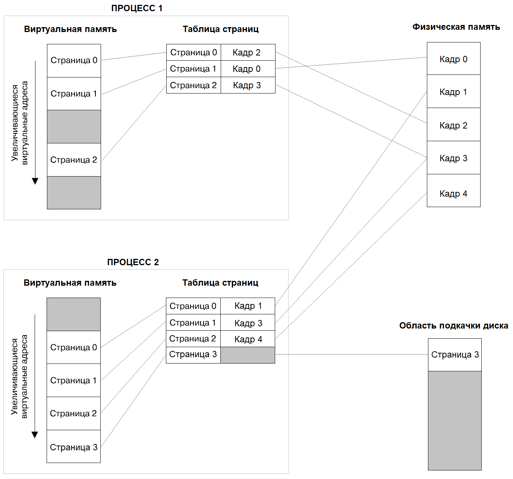

В любой момент в *страничных кадрах* НЕ требуется наличие ВСЕХ *виртуальных страниц* процесса - реально располагающийся в оперативной памяти набор называется **резидентным набором**. Неиспользуемые страницы при исчерпании всей физической памяти могут размещаться в зарезервированной области диска - **файле подкачки**. Применение данной техники возможно благодаря тому, что программам присуще *свойство локальности* - они демонстрируют тенденцию обращаться в ближайшем будущем к тем же либо близким адресам памяти, к которым было обращение в недавнем прошлом.

Применение операционной системой механизма виртуальной памяти предоставляет следующие преимущества:

+ *процессы изолированы* друг от друга и от ядра, поскольку через таблицу страниц имеют доступ только к собственным кадрам - это не позволяет им прочитать или испортить чужие данные;
+ при необходимости процессы могут *совместно использовать* одну и ту же *физическую память*: виртуальные страницы каждого будут отображаться на одни и те же физические кадры; наиболее характерные примеры - выполнение разными процессами кода одной программы, либо явное выделение *разделяемой памяти* (средство IPC);
+ возможна реализация гибких *схем защиты памяти*, позволяющих для каждой отдельной страницы указывать список действий, которые данный процес может совершать с данным блоком памяти;
+ используемое программой *виртуальное пространство* может существенно *превышать* доступный *физический объем* - страницы будут загружаться в память и выгружаться из неё по мере необходимости; например, программа СУБД может целиком отобразить файл базы в память - так поступает *MongoDB*.

### 6.2.1. Сегмент стека

В Linux на архитектуре процессоров x86 программный **стек** располагается в верхней части памяти и растет вниз. Динамическую вершину стека называют **указателем стека**. При вызове функции ей системой автоматически выделяется один **стековый кадр**, содержащий:

+ *аргументы функции*;
+ *локальные переменные*;
+ *возвращаемое значение*;
+ копии значений *регистров процессора*, которые должны быть восстановлены при возврате из функции.

После завершения функции её стековый кадр автоматически удаляется системой простым сдвигом указателя вершины стека.

В реальности любой процесс содержит 2 стека:

+ **пользовательский стек** - используется алгоритмом прикладной программы;
+ **стек ядра** - хранится в *пространстве памяти ядра* и выделяется каждому процессу для выполнения всех действий *системного вызова*.

#### 6.2.1.1. Нелокальный переход - longjmp()

Совершение *нелокального перехода* представляет собой возврат к выполнению заранее отмеченной инструкции, находящейся за пределами исполняемой в данный момент функции.

---

```C
int setjmp(jmp_buf env);
```

Устанавливает место в коде, к которому впоследствии можно совершить переход из выполняемой на тот момент функции, расположенной на вершине пользовательского стека. Совершение перехода через вызов `longjmp()` для процесса выглядит как повторное возвращение значения из `setjmp()`. Первичную установку цели перехода и его фактическое завершение можно различить по возвращаемому результату `setjump()`: оригинальный вызов завершается со значением `0`, фиктивный - с любым другим значением, указанном в соответствующем аргументе `longjmp()`.

Аргумент `env` является выходным параметром, в котором сохраняется копия состояния процесса на момент вызова. В частности, он содержит указатель вершины стека и значения других регистры процессора. Данная информация будет использована в `longjmp()` для возвращения процесса в требуемое состояние.

---

```C
void longjmp(jmp_buf env, int val);
```

Выполняет нелокальный переходит на инструкцию, отмеченную вызовом `setjmp()`. Результатом данного вызова является сброс состояния процесса до указанного в аргументе `env`. Перезапись указателя вершины стека, в частности, приводит к удалению всех стековых кадров, созданных позднее содержащего в себе цель перехода. Аргумент `val` определяет произвольное ненулевое значение, которое будет возвращено при повторном фиктивном завершении вызова `setjmp()`.

---

Обязательным требованием является возвращение выполнения из `longjmp()` в реально существующий на стеке фрейм - цель перехода должна содержаться в некоторой *внешней* по отношению к инициировавшей переход функции, не завершившей свое выполнение.

Вызов `setjmp()` может присутствовать только в следующих контекстах:

+ цельное управляющее выражение инструкции выбора или итерации (`if`, `switch`, `while` и т.д.);
+ операнд унарного отрицания `!`, являющегося цельным управляющим выражением инструкции выбора или итерации;
+ операнд операции сравнения (`==`, `<` и т.д.) при условии, что второй операнд является целочисленной константой, а сама операция является цельным управляющим выражением инструкции выбора или итерации;
+ отдельный вызов функции, не являющийся частью какого-либо выражения.

Выполнение нелокального перехода может испортить реальные значения локальных переменных функции, содержащей цель перехода, вследствие возникновения конфликта с произведенной компилятором оптимизацией (в частности, изменение порядка следования инструкций). По этой причине такие локальные переменные в программах на языке С должны помечаться ключевым словом `volatile`, явно запрещающим их оптимизацию.

#### 6.2.1.2. Расширение стекового кадра - alloca()

```C
void *alloca(size_t size);
```

Выделяет на стеке объем памяти `size`, тем самым расширяя стековый кадр текущей выполняющейся функции с вершины пользовательского стека. Выделенную таким образом память не надо явным образом освобождать (в отличие от `malloc()`), т.к. это происходит автоматически при сворачии стека при завершении функции. В случае *переполнения стека* последствия данного вызова непредсказуемы!

### 6.2.2. Сегмент кучи

Помимо создания автоматических переменных на стеке процессу доступно динамическое выделение памяти в **сегменте кучи**. Данная память существовует независимо от порядка выполнения функций на стеке и требует явной очистки во избежание *утечек памяти*.

#### 6.2.2.1. Системный вызов brk()

Вершина кучи называется **крайней точкой программы (program break)**. Выделение и освобождение памяти в куче сводится к передвижению её вершины, результатом которого является изменение доступного процессу диапазона адресов. В процессе работы программы вершине кучи запрещено оказываться ниже своего первоначального значения, определенного границей сегмента неинициализированнных данных - это привет к ошибке сегментации `SEGFAULT`.

---

```C
int brk(void *end_data_segment);
```

Устанавливает вершину кучи на заданный в аргументе `end_data_segment` адрес с округлением до границы страницы памяти.

---

```C
void *sbrk(intptr_t increment);
```

Изменяет значение адреса вершины кучи, добавляя или отнимая от него заданное аргументом `increment` смещение (определяется знаком указанного приращения).

#### 6.2.2.2. Интерфейс malloc()/free()

Для использования в прикладных программах предназначен библиотечный интерфейс `malloc()/free()`, в частности решающий проблему повторного использования расположенных в глубине куче диапазонов адресов, освобождения которых не может быть произведено обыкновенным сдвигом вершины кучи. Данный интерфейс поддерживает внутри доступного куче пространства *логический двунаправленный список блоков памяти*. Блок состоит из тела (доступный пользовательской программе объем памяти), а также дополнительных полей размера и указателей на соседей. Блок может быть занятым (содержит данные, помещенные в него программой) либо свободным.

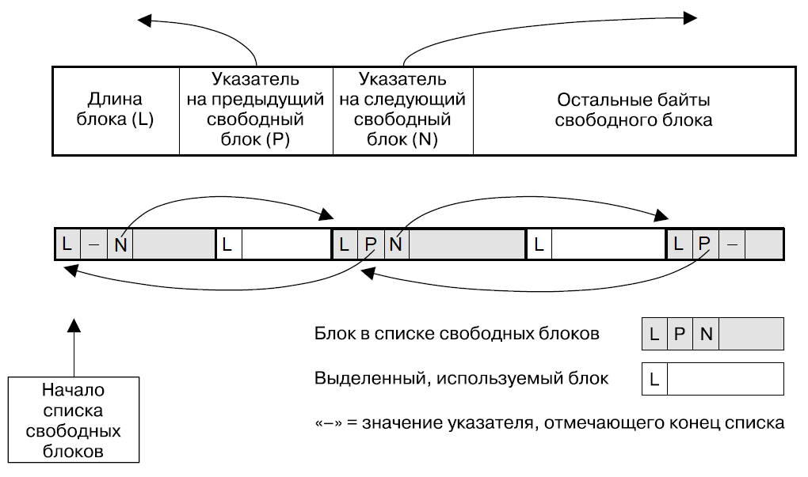

Выделение памяти осуществляется функцией `malloc()`, которая в первую очередь сканирует список свободных блоков:

+ может быть найден свободный блок в точности требуемого размера;
+ если все существующие блоки имеют избыточный размер, то один из них дробится с созданием нового блока требуемого разера;
+ если все существующие блоки имеют недостаточный размер (либо список вообще пуст), то происходит вызов `sbrk()`, который расширяет кучу на некоторый избыточный объем памяти, и в нем создается новый блок требуемого размера.

При создании блока в самом его начале размещается поле с размером, а пользовательской программе возвращается адрес расположенного далее первого байта тела запрошенного объема.

Освобождение памяти осуществляется функцией `free()`, которая добавляет указанный блок в список свободных, анализируя поле его размера и создавая в его теле указатели на соседние элементы списка. Если освобождаемый блок является граничным, то данная функция может удалить его из списка и выполнить вызов `sbrk()`, который сожмет кучу и вернет системе занимаемое свободными блоками место.

Интерфейс `malloc()/free()` требует аккуратного использования:

+ коду пользовательской программы запрещено обращаться к байтам вне выделенных ей блоков, поскольку их изменение может повредить служебные поля блоков;
+ запрещено высвобождение блока через `free()` *более одного раза*, поскольку в этом случае повреждается структура списка блоков;
+ запрещен вызов функции `free()`, аргумент которой не является адресом первого байта тела освобождаемого блока.

Данный интерфейс включает следующие функции.

---

```C
void *malloc(size_t size);
```

Выделяет в куче блок *неинициализированной* памяти заданного размера и возвращает указатель на первый байт его тела.

---

```C
void free(void *ptr);
```

Высвобождает блок памяти, на первый байт тела которого указывает аргумент `ptr`.

---

```C
void *calloc(size_t numitems, size_t size);
```

Выделяет блок памяти под массив длины `numitems`, содержащий элементы размера `size`. Выделяемая память инициализируется *нулевыми байтами*.

---

```C
void *realloc(void *ptr, size_t size);
```

Устанавливает новый размер `size` ранее выделенного блока памяти, определенного указателем `ptr`. Если происходит расширение блока, то он может быть целиком перемещен на новый адрес, либо новая память будет добавлена в конец существующего тела - значения новых байтов в любом случае *НЕ инициализируются*.

---

```C
void *memalign(
    size_t boundary,
    size_t size);

int posix_memalign(
    void **memptr,
    size_t alignment,
    size_t size);
```

Выделяют *выровненный неинициализированный* блок памяти заданного размера, начинающийся с адреса, *кратного* степени двойки.

---
Различные параметры работы интерфейса `malloc()/free()` могут быть просмотрены и изменены служебными функциями `mallopt()` и `mallinfo()`.

### 6.2.3. Аргументы командной строки и переменные окружения

*Аргументы командной строки* наряду с *переменными среды (окружения)* представляют собой средство передачи информации от родительского процесса его дочернему. И те, и другие размещаются в одной области над пользовательским стеком процесса. Максимально допустимый размер данной области определяется ограничением ресурса процесса `RLIMIT_STACK`.

**Аргументы командной строки** представляют из себя массив символьных строк параметров, переданных процессу при запуске его программы в *оболочке*. *Имя программы*, используемое для запуска программы (можно создать ссылки под различным названием на единственный файл программы), всегда является самым первым аргументом. В коде программы на языке С *аргументы командной строки* доступны через аргументы `argc` и `argv` функции `main()`. Также в Linux они могут быть прочитаны из предоставленного каждому процессу файла `/proc/PID/cmdline`.

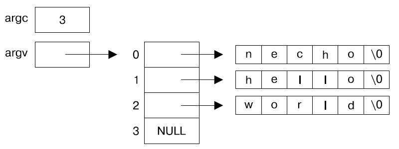

Список **переменных среды** - связанный с каждым процессом массив, содержащий строки параметров вида `имя=значение`. В момент создания процесс наследует КОПИЮ *окружения* от своей *оболочки*. Оболочка также предоставляет ряд команд для работы с окружением:

+ `export NAME=value` - *навсегда* добавить указанную переменную окружения к среде используемой оболочки; добавленное значение будет в составе среды наследоваться всеми процессами, запускаемыми из данной оболочки впоследствии;
+ `NAME=value program` - добавить указанную переменную окружения только к среде процесса, выполняющего заданную программу;
+ `unset` - удалить переменную окружения из среды оболочки;
+ `printenv` - вывести список переменных окружения в среде оболочки;
+ `env` - позволяет запускать процессы, манипулируя их окружением; поддерживает богатый функционал.

В коде программы на языке С *переменные окружения* доступны через глобальную переменную `environ`. Также в Linux они могут быть прочитаны из предоставленного каждому процессу файла `/proc/PID/environ`.

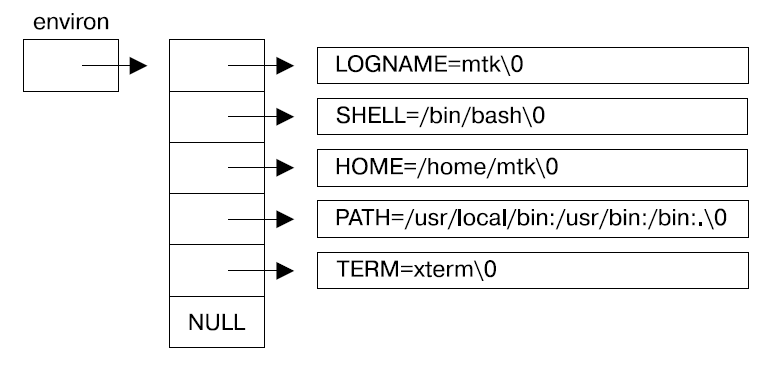

Существует удобный библиотечный интерфейс по работе с переменными окружения в коде программы.

---

```C
char *getenv(const char *name);
```

Возвращает значение переменной окружения по её имени. Полученную строку НЕЛЬЗЯ изменять и желательно скопировать в отдельный буфер.

---

```C
int putenv(char *str);
```

Добавляет к среде новую переменную окружения или изменяет значение существующей переменной. Строка с переменной не переносится в сегмент памяти, содержащий окружение - среда просто начинает указывать на переданную строку. По этой причине строка `str` не должна изменяться или завершать свой период жизни.

---

```C
int setenv(
    const char *name,
    const char *value,
    int overwrite);
```

Создает в сегменте памяти среды новую переменную окружения с заданным именем и значением. Если аргумент `overwrite` ненулевой, то переменная перезаписывается, если уже существует.

---

```C
int unsetenv(const char *name);
```

Удаляет из среды переменную окружения с заданным именем, очищая занимаемое ей место.

---

```C
int clearenv(void);
```

Обнуляет окружение, присваивая указателю `environ` значение `NULL`.

Поскольку физически не очищает место, занимаемое переменными, то приводит к *утечкам памяти* - альтернативой является явный вызов `unsetenv()` для каждой существующей переменной.

# 7. Сигналы

**Сигнал** - оповещение процесса о некотором событии.

*Процесс* может отправить сигнал *другому процессу* (а также *самому себе*) в *любой требуемый момент*.

*Ядро* отправляет сигнал процессу в следующих случаях:

+ *аппаратное исключение* - оборудование зафиксировало выполнение недопустимой операции и уведомило ядро, а ядро оповестило процесс; например, обращение к недопустимому участку памяти, передача ошибочной инструкции и т.д.;
+ *определённое программное событие*; например, завершение дочернего процесса, срабатывание таймера, возможность ввода/вывода в файловом дескрипторе и т.д.;
+ *ввода символа, генерирующего сигнал*; например, *прерывание* `Ctrl+C`, *выход* `Ctrl+\` и т.д.

Все сигналы подразделяются на 2 группы:

+ **Стандартные** - стандарт четко перечисляет их список и назначение. Используются ядром для оповещения процесса и управления его периодом жизни. Процессы также могут отправлять стандартные сигналы. Каждому сигналу из этой группы присвоен *уникальный номер* в пределах `1 - 31`;
+ **Реального времени** - пользователь сам определяет их назначение, условия генерации и номер. Такие сигналы могут нести с собой дополнительные данные.

Независимо от типа сигнала его *жизненный цикл* состоит из следующих этапов:

1. *Генерация*;
2. *Ожидание доставки*;
3. *Доставка в процесс* - передача сигнала процессу, вызывающая выполнение процессом ответных действий.

Для каждого сигнала заранее определено **действие по умолчанию**, которое выполняется при его получении процессом:

+ *Игнорирование сигнала* - сигнал отбрасывается ядром без уведомления процесса;
+ *Мгновенное завершение* процесса - процесса завершается в обход логики выполняемой им программы;
+ *Мгновенное завершение с файлом дампа ядра* - при завершении процесса дополнительно будет создан файл дампа ядра, содержащий слепок его *виртуальной памяти*. Файл дампа может быть загружен в *отладчик* для последующего анализа;
+ *Приостановка* процесса;
+ *Возобновление* процесса.

Также процесс может явно определить, какое действие должно выполняться при получении указанного сигнала - установить **диспозицию сигнала**:

+ *Действие по умолчанию*;
+ *Игнорирование сигнала*;
+ *Перехват сигнала в обработчик*.

## 7.1. Список стандартных сигналов

| Сигнал               | Действие по умолчанию   | Генерация                                                                                                                                           |
| :------------------- | :---------------------- | :-------------------------------------------------------------------------------------------------------------------------------------------------- |
| `SIGTERM`            | завершает               | *корректное завершение* процесса; сигнализирует процессу, что тот должен освободить ресурсы и завершиться                                           |
| `SIGKILL`            | завершает               | *принудительное завершение* процесса; **НЕ может быть проигнорирован, заблокирован или перехвачен обработчиком**                                    |
| `SIGABRT`            | завершает с дампом ядра | *завершение* процесса *для отладки*; генерируется вызовом `abort()` для последующего анализа созданного *дампа ядра*                                |
| `SIGINT`             | завершает               | завершение процесса вводом *символа прерывания* `Ctrl+C`                                                                                            |
| `SIGQUIT`            | завершает с дампом ядра | завершение процесса вводом *символа выхода* `Ctrl+\`                                                                                                |
| `SIGCONT`            | возобновляет            | *принудительное возобновление* приостановленного процесса; может быть перехвачен обработчиком, однако всё равно запустит процесс                    |
| `SIGSTOP`            | приостанавливает        | *принудительная приостановка* выполняющегося процесса; **НЕ может быть проигнорирован, заблокирован или перехвачен обработчиком**                   |
| `SIGTSTP`            | приостанавливает        | используется в оболочке, поддерживающей *управление заданиями*; приостанавливает *активную группу процессов* вводом *символа приостановки* `Ctrl+Z` |
| `SIGTTIN`            | приостанавливает        | используется в оболочке, поддерживающей *управление заданиями*; приостанавливает *фоновую группу процессов* при её попытке *чтения* с терминала     |
| `SIGTTOU`            | приостанавливает        | используется в оболочке, поддерживающей *управление заданиями*; приостанавливает *фоновую группу процессов* при её попытке *записи* в терминал      |
| `SIGCHLD`            | игнорируется            | генерируется при завершении дочернего процесса                                                                                                      |
| `SIGIO`              | завершает               | генерируется при появлении возможности ввода/вывода в файловом дескрипторе                                                                          |
| `SIGHUP`             | завершает               | генерируется ядром при потере соединения; **ручная генерация используется для перезагрузки процессов-демонов**                                        |
| `SIGALRM`            | завершает               | генерируется таймером `alarm()`                                                                                                                     |
| `SIGPROF`            | завершает               | генерируется *профилирующим таймером* `setitimer()`, измеряющим время работы процесса в *режимах пользователя и ядра*                               |
| `SIGVTALRM`          | завершает               | генерируется *виртуальным таймером* `setitimer()`, измеряющим время работы процесса в *режиме пользователя*                                         |
| `SIXCPU`             | завершает с дампом ядра | отправляется прицессу при *превышении ограничения* на время ЦПУ `RLIMIT_CPU`                                                                        |
| `SIGXFSZ`            | завершает с дампом ядра | отправляется прицессу при *превышении ограничения* на размер файла `RLIMIT_FSIZE`                                                                   |
| `SIGPIPE`            | завершает               | генерируется при записи в пайп, fifo или сокет, который никто не читает                                                                             |
| `SIGSEGV`            | завершает с дампом ядра | генерируется при доступе к недопустимому адресу виртуальной памяти процесса                                                                         |
| `SIGBUS`             | завершает с дампом ядра | генерируется при ошибках доступа к оперативной памяти                                                                                               |
| `SIGFPE`             | завершает с дампом ядра | генерируется при выполнении недопустимых арифметических операций                                                                                    |
| `SIGSYS`             | завершает с дампом ядра | генерируется при выполнении недопустимого системного вызова                                                                                         |
| `SIGILL`             | завершает с дампом ядра | генерируется при выполнении недопустимой машинной инструкции                                                                                        |
| `SIGEMT`             | завершает               | генерируется при некоторых аппаратных ошибках                                                                                                       |
| `SIGUSR1`, `SIGUSR1` | завершает               | сигналы пользователя, смысл которых он может определить самостоятельно                                                                              |
| `SIGWINCH`           | игнорируется            | генерируется при изменении окна терминала                                                                                                           |
| `SIGURG`             | игнорируется            | генерируется при появлении в сокете *срочных (urgent)* данных                                                                                       |
| `SIGPWR`             | завершает               | сигнал *сбоя подачи питания*, который может генерироваться вручную для уведомления процессов о низком заряде батареи системы                        |

## 7.2. Наборы сигналов

Многие функции по работе с сигналами способны принимать их номера не по одиночке, а сразу целым *набором*.

---

Для создания *набора сигналов* используются следующие функции:

```C
int sigemptyset(sigset_t *set);
```

Создает *пустой* набор сигналов.

```C
int sigfillset(sigset_t *set);
```

Создает набор сигналов, содержащий *все* сигналы (включая сигналы реального времени).

---

За манипулирование содержимым набора сигналов отвечают следующие функции:

```C
int sigaddset(sigset_t *set, int sig);
```

Добавляет указанный сигнал в набор.

```C
int sigdelset(sigset_t *set, int sig);
```

Удаляет указанный сигнал из набора.

```C
int sigandset(
    sigset_t *set,
    sigset_t *left,
    sigset_t *right);
```

Находит *пересечение* двух наборов сигналов.

```C
int sigorset(
    sigset_t *set,
    sigset_t *left,
    sigset_t *right);
```

Находит *объединение* двух наборов сигналов.

```C
int sigismember(sigset_t *set, int sig);
```

Проверяет членство указанного сигнала в наборе.

```C
int sigisemptyset(const sigset_t *set);
```

Проверяет набор сигналов на пустоту.

## 7.3. Генерация сигналов

При отправке сигнала *процессом* происходит проверка прав доступа:

+ привилегированный процесс (`CAP_KILL`) может послать сигнал в любой процесс;
+ непривилегированный процесс может послать сигнал только в процесс, *реальный или сохраненный UID* которого совпадают с *реальным или действующим UID* процесса-отправителя;
+ в процесс `init` (PID = 1) можно посылать только те сигналы, для которых он установил обработчики;
+ сигнал `SIGCONT` может свободно отправляться процессами *в рамках одной сессии* (проверки прав не выполняются).

---

```C
int kill(pid_t pid, int sig);
```

Отправляет сигнал `sig` в другой процесс на основании значения аргумента `pid`:

+ если `pid > 0`, то сигнал отправляется в указанный процесс;
+ если `pid = 0`, то сигнал отправляется во все процессы *данной группы*, включая вызывающий процесс;
+ если `pid < -1`, то сигнал отправляется во все процессы той группы, идентификатор которой равняется абсолютному значению аргумента `pid`;
+ если `pid = -1`, то сигнал отправляется во все процессы, в которые вызывающий процесс может отправлять сигналы (за исключением процесса `init` и самого вызывающего процесса).

Если значение `sig = 0`, то никакой сигнал не отправляется, а вместо этого выполняется описанная выше проверка прав доступа.

Если сигнал получен *хотя бы одним* получателем из набора, заданного аргументом `pid`, то вызов считается успешным.

---

```C
int raise(int sig);
```

Отправляет сигнал самому `sig` вызывающему процессу (а точнее *потому*). Доставка сигнала происходит *мгновенно* - до завершения данного вызова!

---

```C
int killpg(pid_t pgrp, int sig);
```

Отправляет сигнал `sig` во все процессы указанной группы `pgrp`. Если значение `pgrp = 0`, то сигнал отправляется в группу вызывающего процесса (включая его самого).


## 7.4. Блокировка и ожидание сигналов

### 7.4.1. Заблокированные и ожидающие сигналы

Процесс может *заблокировать* доставку нежелательных для него сигналов - для этого они должны быть добавлены в **сигнальную маску** процесса (в реальности *собственная сигнальная маска* есть у каждого *потока* данного процесса).

Сигнал может оказаться в маске следующими путями:

+ сигнальная маска может быть явно задана вызовом `sigprogmask()`;
+ при активации *обработчика* сигнал, послуживший этому причиной, может быть автоматически добавлен в маску - это определяется флагом вызова `sigaction()`;
+ при активации *обработчика* дополнительно могут быть заблокированы прочие сигналы - это определяется флагом вызова `sigaction()`.

---

```C
int sigprogmask(
    int how,
    const sigset_t *set,
    sigset_t *oldset);
```

Изменяет сигнальную маску процесса определенным в аргументе `how` образом:

+ `SIG_BLOCK` - добавляет набор сигналов `set` в сигнальную маску;
+ `SIG_UNBLOCK` - удаляет набор сигналов `set` из сигнальной маски;
+ `SIG_SETMASK` - устанавливает набор сигналов `set` в качестве сигнальной маски.

Прошлое значение сигнальной маски возвращается в аргументе `oldset`. Для получения текущего значения маски в `oldset` без его изменения можно в аргумент `set` передать `NULL`.

---

Если процесс получает заблокированный им сигнал, то такой сигнал добавляется в расположенный в ядре набор **ожидающих сигналов**. Также сигнал может оказаться в ожидающем наборе, если процесс, для которого он предназначен, еще *не запланирован для выполнения* на процессоре ядром.

Для *стандартных* сигналов ожидающий набор представляет из себя *МАСКУ* - невозможно определить порядок и количество дубликатов поступивших сигналов.

---

```C
int sigpending(sigset_t *set);
```

Возвращает набор ожидающих *стандартных* сигналов.


### 7.4.2. Момент доставки сигнала в процесс

Если сигнал является ожидающим по причине своей блокировки, то он будет доставлен в процесс после удаления из сигнальной маски. Если сигнал является ожидающим по причине приостановки своего процесса, то он будет доставлен после возобновления выполнения процесса. При доставке сигнал в любом случае обрабатывается в соответствии с *диспозицией*, установленной для него на текущий момент.


### 7.4.3. Приостановка процесса в ожидании сигнала

```C
int pause();
```

*Приостанавливает* выполнение процесса до тех пор, пока данный вызов не будет прерван доставкой сигнала, приводящей к выполнению обработчика или завершению процесса.


## 7.5. Обработка сигналов

**Обработчик сигнала** - функция, вызываемая процессом при получении сигнала.

Поступление сигнала, для которого зарегистрирован обработчик, приводит к следующей последовательности событий:

1. приостановка текущего выполняемого процессом кода;
2. выполнение обработчика *ядром от имени процесса* в *пространстве пользователя*;
3. возобновление выполнения кода программы с места его приостановки.


Естественно, обработчик внутри себя может вызывать другие функции, однако НЕ любая функция может быть свободно вызвана внутри обработчика.

Функция является *реентерабельной*, если она может быть повторно вызвана ДО своего завершения, и это НЕ повлияет на результаты её вызовов. Также говорят, что функция *реентерабельна*, если результаты её изначального и повторного, начатого ДО завершения изначального, вызовов совпадают с результатами последовательных (по порядку) вызовов данной функции. (Более мягким требованием к функции является *потоковая безопасность* - результаты одновременных вызовов функции *в разных потоках* совпадают с результатами последовательных вызовов функции *в одном потоке*.) Функция может стать *нереентерабельной*, если она модифицирует значения переменных *в своём окружении*. Если функция модифицирует только свои внутренние переменные (такие, к которым нет доступа НЕ из кода ДАННОГО КОНКРЕТНОГО вызова), то она ГАРАНТИРОВАННО является *реентерабельной*.


---

```C
typedef void(*sighandler_t)(int);

sighandler_t signal(
    int sig,
    sighandler_t handler);
```

Устанавливает для указанного сигнала `sig` новую *диспозицию* `handler` и возвращает его предыдущую *диспозицию*.

Аргумент `handler` определяет одну из возможных диспозиций сигнала и может содержать:

+ указатель на *функцию-обработчик* сигнала;
+ константа `SIG_DFL` - *поведение по умолчанию*;
+ константа `SIG_IGN` - *игнорирование* сигнала.

Данный вызов **НЕ ПЕРЕНОСИМ** - вместо него следует использовать вызов `sigaction()`.

---

```C
struct sigaction
{
    void (*sa_handler)(int);
    sigset_t sa_mask;
    int sa_flags;
    void (*sa_restorer)(void);
};

int sigaction(
    int sig,
    const struct sigaction *act,
    struct sigaction *oldact);
```

Устанавливает для указанного сигнала `sig` новую *диспозицию* `act` и возвращает его предыдущую *диспозицию* `oldact`.

Структура `sigaction`, описывающая диспозицию сигнала, содержит следующий набор полей:

+ `sa_handler` - содержит одну из возможных диспозиций сигнала:
  + указатель на *функцию-обработчик* сигнала;
  + *поведение по умолчанию* `SIG_DFL`;
  + *игнорирование* сигнала `SIG_IGN`;
+ `sa_mask` - маска сигналов, дополнительно *блокируемых* на время выполнения обработчика; сигнал, вызвавший срабатывание обработчика, блокируется автоматически;
+ `sa_flags` - маска флагов, управляющих поведением вызова:
  + `SA_NOCLDSTOP` - если сигналом `sig` является `SIGCHILD`, то не генерировать `SIGCHILD` при *приостановке/возобновлении* **дочернего** процесса;
  + `SA_NOCLDWAIT` - если сигналом `sig` является `SIGCHILD`, то не превращать *дочерние* процессы в **зомби** при их *завершении*;
  + `SA_NODEFER` - не блокировать автоматически сигнал `sig` на время выполнения его обработчика;
  + `SA_ONSTACK` - активировать обработчик сигнала, используя **альтернативный стек** `signalstack()`;
  + `SA_RESETHAND` - сбросить диспозицию сигнала на *действие по умолчанию* ПЕРЕД активацией его обработчика;
  + `SA_RESTART` - автоматически *перезапустить* системный вызов, выполнение которого было прервано доставкой сигнала (не все вызовы поддерживают перезапуск - подробнее см. далее);
  + `SA_SIGINFO` - активировать *дополнительные аргументы* функции-обработчика, позволяющие передавать вместе с сигналом сопровождающие его данные;
+ `sa_restorer` - служебное поле, используемое ядром для восстановления контекста процесса после обработки сигнала.


## 7.6. Отображение описаний сигналов

Текстовое описание всех стандартных сигналов содержится в специальном массиве, проиндексированном номерами сигналов:

```C
extern const char *const sys_siglist[];
```

Также описание сигналов может быть получено в результате вызова ряда функций.

---

```C
char *strsingnal(int sig);
```

Возвращает текстовое описание сигнала `sig`. Формат описания подчиняется настройкам установленной *локали*.

---

```C
void psignal(int sig, const char *msg);
```

Выводит в *стандартное устройство ошибок* `stderr` сообщение `msg`, сопровождаемое описанием сигнала `sig`. Формат вывода подчиняется настройкам установленной *локали*.

# 8. Время

При выполнении процесса может представлять интерес замер двух различных типов времени:

+ **календарное время** - длительность реального временного промежутка, отсчитываемого от некоторого фиксированного момента в прошлом. Зачастую точкой отсчета является **Epoch (00:00, 1 января 1970 по UTC)** либо момент старта процесса;
+ **время процесса** - продолжительность использования процессом центрального процессора с момента своего создания.

Реальная точность различных связанных со временем системных вызовов ограничена частотой *программных системных часов*, которые измеряют отрезки времени в единицах, называемых *мгновениями (jiffies)*. *Частота программных* часов ядра определяется его настройкой *Processor type and features:Timer frequency*.

## 8.1. Календарное время

Ядро предоставляет обширный набор функций по определению и изменению (требуется привилегия процесса `CAP_SYS_TIME`) установленного в системе календарного времени в различных форматах.


### 8.1.1. Формат timeval

Данный формат представляет собой структуру данных типа `timeval`:

```C
struct timeval
{
    time_t tv_sec;
    suseconds_t tv_usec;
};
```

+ `tv_sec` - количество секунд, прошедших с *Epoch* (формат *unix time*);
+ `tv_usec` - дополнительное количество микросекунд.

---

```C
int gettimeofday(
    struct timeval *tv,
    struct timezone *tz);
```

Возвращает в аргументе типа `timeval` календарное время системы.

Аргумент типа `timezone` является историческим рудиментом и должен принимать значение `NULL`.

---

```C
int settimeofday(
    const struct timeval *tv,
    const struct timezone *tz);
```

Устанавливает календарное время системы на основе переданного в аргументе типа `timeval` значения.

Аргумент типа `timezone` является историческим рудиментом и должен принимать значение `NULL`.

---

```C
int adjtime(
    struct timeval *delta,
    struct timeval *olddelta);
```

Подстраивает календарное время системы, **постепенно** добавляя к системным часам переданное в аргументе `delta` смещение. Если предыдущий процесс подстройки не был завершен, то в аргументе `olddelta` возвращается количество оставшегося недобавленного времени. Если какой-либо из аргументов не требуется, то ему можно присвоить значение `NULL`.

### 8.1.2. Формат unix time

Формат *unix time* представляет собой количество секунд, прошедших с *Epoch*.

---

```C
time_t time(time_t *timep);
```

Возвращает календарное время системы в формате *unix time*.

---

```C
int stime(const time_t *timeptr);
```

Устанавливает календарное время системы на основе переданного в формате *unix time* значения.

---

```C
char *ctime(const time_t *timep);
```

Преобразует календарное время из формата *unix time* в строковое представление вида `Wed Jun 8 14:22:34 2011`.

Возвращенная строка является *статически* выделенной, поэтому данная функция **нереентерабельна**! Реентерабельный аналог: `ctime_r()`.

### 8.1.3. Формат broken-down time

Формат *broken-down time* представляет собой структуру данных типа `tm`:

```C
struct tm
{
    int tm_sec;
    int tm_min;
    int tm_hour;
    int tm_mday;
    int tm_mon;
    int tm_year;
    int tm_wday;
    int tm_yday;
    int tm_isdst;
};
```

+ `tm_sec` - секунды (0–60);
+ `tm_min` - минуты (0–59);
+ `tm_hour` - часы (0–23);
+ `tm_mday` - день месяца (1–31);
+ `tm_mon` - месяц (0–11);
+ `tm_year` - год с 1900;
+ `tm_wday` - день недели (воскресенье = 0);
+ `tm_yday` - день в году (0–365; 1 января = 0);
+ `tm_isdst` - флаг летнего времени:
  + `> 0` - летнее время действует;
  + `= 0` - летнее время НЕ действует;
  + `< 0` - информация о летнем времени недоступна.

---

```C
struct tm *gmtime(const time_t *timep);
struct tm *localtime(const time_t *timep);
```

Преобразуют календарное время из формата *unix time* в формат *broken-down time*. Функция `gmtime()` возвращает время в *UTC*, а `localtime()` учитывает *часовой пояс и летнее время*.

Возвращенная структура является *статически* выделенной, поэтому данные функции **нереентерабельны**! Реентерабельный аналоги: `gmtime_r()` и `localtime_r()`.

---

```C
time_t mktime(struct tm *timeptr);
```

Преобразует календарное время из формата *broken-down time* в формат *unix time*. В процессе работы данной функции значения полей аргумента типа `tm` могут быть преобразованы для приведения к указанным в их описании диапазонам - это позволяет передавать в данную функцию аргумент, над которым были выполнены операции временной арифметики.

---

```C
char *asctime(const struct tm *timeptr);
```

Преобразуют календарное время из формата *broken-down time* в строковое представление вида `Wed Jun 8 14:22:34 2011`.

Возвращенная строка является *статически* выделенной, поэтому данная функция **нереентерабельна**! Реентерабельный аналог: `asctime_r()`.

---

```C
size_t strftime(
    char *outstr,
    size_t maxsize,
    const char *format,
    const struct tm *timeptr);
```

Преобразует календарное время из формата *broken-down time* в произвольное строковое представление `outstr`, указанного формата `format`. Аргумент `format` содержит заданные последовательности символов вида `%X` (*спецификаторы*), на место которых происходит подстановка значений структуры `timeptr`.

---

```C
char *strptime(
    const char *str,
    const char *format,
    struct tm *timeptr);
```

Преобразует календарное время из произвольного строкового представления `str` формата `format` в формат *broken-down time*. Аргумент `format` содержит заданные последовательности символов вида `%X` (*спецификаторы*) и определяет способ заполнения полей структуры типа `tm` на основе содержимого переданной строки. Желательно указывать в `str` строку, содержащую информацию о значениях *всех* полей структуры типа `tm`.

### 8.1.4. Часовые пояса

Программы, которым для работы требуется учитывать **часовой пояс** системы и **режим летнего времени**, могут получить данную информацию из файлов каталога `/usr/share/zoneinfo`. Он содержит по одному файлу с соответствующим именем на каждый часовой пояс: EST, CET, UTC, Iran и т.д. Формат файлов часовых поясов описывается в руководстве `tzfile(5)`, а для их создания используется утилита `zic`. **Местное время** системы определяется файлом `/etc/localtime`, являющимся ссылкой на один из файлов часовых поясов.

Чтобы указать часовой пояс системы при выполнении программы, следует в первую очередь присвоить **переменной окружения `TZ`** строку одного из следующих видов:

+ `:tzfile`

    Содержит относительное путевое имя файла часового пояса `tzfile` в каталоге `zoneinfo`. Пример:

    `$ TZ=":Europe/Berlin"`

+ `std offset [ dst [ offset ][ , start-date [ /time ] , end-date [ /time ]]]`

    Содержит следующий набор полей:

  + `std` и `offset` - стандартный часовой пояс и его смещение от UTC;
  + `dst` и `offset` - часовой пояс с учетом режима летнего времени и его смещение от UTC;
  + `start-date` и `end-date` - даты перехода со стандартного на летнее время.

    Пример:

    `$ TZ="CET-1:00:00CEST-2:00:00,M3.5.0,M10.5.0"`

Затем программа осуществляет вызов функции `tzset()`, считывающей информацию из переменной окружения `TZ`.

---

```C
void tzset(void);
```

Проверяет значение переменной среды `TZ` и на её основе инициализирует значения следующих глобальных переменных:

+ `tzname` - названия стандартного и летнего часовых поясов;
+ `daylight` - ненулевое значение, если активен режим летнего времени;
+ `timezone` - смещение в секундах местного времени от UTC.

Если переменная среда `TZ` не была установлена, то данная функция заполняет её значение на основе файла `localtime`. Если переменная среды пустая или недействительная, то будет использован пояс UTC.

## 8.2. Время процесса

Время использования процессом центрального процессора подразделяется на две категории:

+ **время в пользовательском режиме** - потраченное на выполнения иструкций прикладного алгоритмы программы;
+ **время в режиме ядра** - потраченное на выполнение системных вызовов, инициированных процессом.

Команда оболочки `time` позволяет вывести в терминале значения обеих категорий времени процесса.

---

```C
clock_t times(struct tms *buf);

struct tms
{
    clock_t tms_utime;
    clock_t tms_stime;
    clock_t tms_cutime;
    clock_t tms_cstime;
};


```

Возвращает в аргументе длительности времени процесса, выраженные в количестве *тиков часов*, произошедших с **некоторого момента в прошлом**.

Структура типа `tms` содержит следующие поля:

+ `tms_utime` - время ЦП в пользовательском режиме;
+ `tms_stime` - время ЦП в режиме ядра;
+ `tms_cutime` - время ЦП в пользовательском режиме, потраченное на ожидание завершения всех дочерних процессов;
+ `tms_cstime` - время ЦП в режиме ядра, потраченное на ожидание завершения всех дочерних процессов.

Длительность одного тика в секундах определяется значением `sysconf(_SC_CLK_TCK)`. Значение количества тиков типа `clock_t` не застраховано от переполнения - в этом случае отсчет начнется с 0!

---

```C
clock_t clock(void);
```

Возвращает общее время процесса в режимах пользователя и ядра, выраженное в `CLOCKS_PER_SEC` (равняется $10^6$).

# 9. Локализация

**Локаль** - совокупность параметров системы, определяемых языковыми и культурными нормами. Информация о всех имеющихся в системе локалях размещается в каталоге `/usr/share/locale` (либо `/usr/lib/locale`). Он содержит набор каталогов, каждый из которых описывает локаль определенной географической территории. Каталоги локалей имеют название следующего вида:

`language[_territory[.codeset]][@modifier]`

+ `language` - ISO-код языка;
+ `territory` - ISO-код территории (страны);
+ `codeset` - используемая кодировка символов;
+ `modifier` - уникальный признак, позволяющий отличать каталоги с совпадающими названиями.

Пример названия каталога локали: `de_DE.utf-8@euro`. Стандартная локаль UNIX-систем, определяющая их исторически сложившееся поведения, имеет название `POSIX` (либо синонимичное `C`). Полный список альтернативных имен локалей находится в файле `/usr/share/locale/locale.alias`.

Команда оболочки `locale` позволяет вывести различную информацию о локалях системы.

Cгруппированный по своему назначению набор требующих локализации параметров системы образует *категорию локали*:

+ `LC_CTYPE` - классификация символов (существующие буквы и цифры), правила преобразования верхнего и нижнего регистров;
+ `LC_COLLATE` - правила сортировки символов;
+ `LC_MONETARY` - правила форматирования денежных величин;
+ `LC_NUMERIC` - правила форматирования чисел;
+ `LC_TIME` - правила форматирования даты;
+ `LC_MESSAGES` - форматы сообщений, выводимых программой (например, утвердительные и отрицательные выражения).
+ `LC_ALL` - категория, объединяющая в себе все возможные категории локали.

---

```C
char *setlocale(int category, const char *locale);
```

Устанавливает для процесса в качестве используемой категорию `category` локали `locale`.

Если аргумент `locale` является пустой строкой, то в качестве используемых будут установлены те категории, которые были переданы в процесс в соответствующих переменных окружения. Например:

`LC_TIME=it_IT LC_NUMERIC=de_DE program`

Если аргумент `locale` имеет значение `NULL`, то функция только возвращает текущее используемое значение указанной категории.
