# 1. Введение

Под термином **операционная система** скрываются 2 определения:

+ *в широком смысле* - весь пакет программ, включающий как функционал по управлению ресурсами компьютера, так и сопроводительные стандартные средства: интерпретатор командной строки, графический интерфейс, утилиты и редакторы;
+ *в узком смысле* - только набор основных модулей, управляющих ресурсами компьютера (оперативная память, хранилища, сеть, процессорное время) и занимающихся их распределением.

Для второго определения также используется термин **ядро (kernel)** операционной системы. У работающей операционной системы имеется всего *одно ядро*. *Ядро* выполняет следующие функции:

+ **управление процессами** - ядро выполняет загрузку программ с диска в оперативную память, запуск их выполнения на процессоре, а также финальное освобождение занимаемых ими ресурсов. Запущенный экземпляр программы называют **процессом**. Помимо *создания и завершения процессов* ядро осуществляет их *диспетчеризацию* - контроль доступа к ограниченному объему общих резделяемых ресурсов системы. Linux является *многозадачной ОС с вытеснением* - одновременно могут выполняться несколько процессов, а их менеджментом занимается *диспетчер процессов ядра*;
+ **управление памятью** - Linux применяет технологию управления **виртуальной памятью**, которая позволяет изолировать процессы и закрыть им доступ к чужим данным. Виртуальная память также повышает эффективность использования имеющегося объема *физической памяти* посредством размещения в нем только тех данных процесса, которые реально требуются ему в текущий момент - в результате в оперативную память одновременно может быть загружено большее число различных программ;
+ **управление устройствами** - ядро предоставляет процессам программные интерфейсы доступа ко всем подключенным периферийным устройствам: устройствам ввода и вывода, накопителям, всевозможным картам расширения, последовательному порту. Также ядро предоставляет унифицированный интерфейс **виртуальной файловой системы**, обеспечивающий единообразный способ обращения к данным на накопителях различной архитектуры;
+ **управление сетью** - ядро включает в себя реализацию стека протоколов TCP/IP и обеспечивает выход в сеть через *интерфейс сокетов*;
+ **управление пользователями** - ядро предоставляет каждому зарегистрированному пользователю собственное независимое рабочее пространство, а также контролирует соблюдение им *прав доступа* к ресурсам ОС и данным других пользователей.
+ **предоставление API ядра** - все описанные выше, а также прочие интерфейсы, предоставляемые ядром, объединяются в общий программный интерфейс **системных вызовов** - своеобразных точек входа в ядро, через которые процесс может запросить у операционной системы выполнение требуемых ему операций.

**Оболочка (shell)** - программа, осуществляющая чтение *пользовательских команд* и использующая функционал ядра для их выполнения. Оболочка НЕ является частью ядра и разрабатывается отдельно. Существует множество различных оболочек: *sh, csh, ksh, bash, zsh*. *Оболочкой входа в систему* называют процесс, создаваемый для запуска программы оболочки при первом входе пользователя в систему.

**Системный вызов** - программная точка входа в ядро, позволяющая процессу запрашивать у операционной системы выполнения желаемых операций. Совокупность системных вызовов, реализованных на языке C, образует *API операционной системы*. При выполнении системный вызов переводит процессор из **пользовательского режима** в **режим ядра**, который открывает ему доступ к *пространству памяти ядра*, содержащему служебные структуры данных операционной системы, а также позволяет вызывать защищенные инструкции (обращение к устройствам, управление памятью, ввод-вывод на устройствах). Каждый системный вызов идентифицируется по *уникальному номеру* и имеет строго определенный набор аргументов.

Выполнение *системного вызова* происходит следующим образом:

1. Прикладная программа инициирует системный вызов, вызвая *функцию-оболочку* из *стандартной библиотеки C*;
2. Функция-оболочка валидирует переданные ей *аргументы системного вызова*, а затем копирует их со своего *стека* в набор регистров процессора, где их ожидает ядро;
3. Функция-оболочка помещает *номер системного вызова* в регистр `eax`;
4. Функция-оболочка выполняет *машинную инструкцию системного прерывания* `int 0x80`, переключающую процессор в *режим ядра* и инициирующую выполнение её *обработчика прерывания*. Современные архитектуры процессоров предоставляют специальную инструкцию `sysenter`, реализующую данный функционал более эффективным способом;
5. Ядро выполняет *обработчик прерывания* `system_call()`, который:
   1. сохраняет текущие значения регистров процессора в *стеке ядра*;
   2. вызывает *функцию обслуживания* переданного *номера системного вызова* `sys_ИМЯ_ВЫЗОВА()`, которая выполняет требуемую операцию, а затем возвращает *код возврата*;
   3. восстанавливает со *стека ядра* значения регистров процессора и помещает *возвращаемое значение* в *стек прикладной программы*;
   4. передаёт управление функции-оболочке, переводя процессор обратно в *пользовательский режим*;
6. Если возвращенное *обработчиком прерывания* значение свидетельствует об ошибке, то оно помещается в глобальную переменную `errno`;
7. Функция-оболочка завершается, возвращая прикладной программе значение, которое указывает на успех (*неотрицательное число*) или неудачу (*отрицательное число*) системного вызова.

**Выполнение** любого **системного вызова** происходит **атомарно**! Ядро гарантирует, что совершаемая им последовательность действий будет представлять собой единую неделимую операцию, которая не может быть прервана другим процессом или *потоком* - системный вызов либо успешно завершается, либо возвращает ошибку.

Помимо непосредственных функций-оболочек *стандартная библиотека С* может предоставлять *библиотечные функции*, зачастую скрывающие системный вызов за более удобным интерфейсом или вообще его не использующие, если это возможно. Очевидно, что выполнение системного вызова сопровождается существенными издержками, превышающими затраты на обычный вызов функции в пользовательском пространстве.

Текущую версию *стандартной библиотеки С* можно узнать, либо выполнив файл библиотеки в командной строке, либо вызвав в программе функцию `gnu_get_libc_version()`.

# 2. Пользователи и группы

Linux является *многопользовательской* операционной системой, поддерживающей наличие множества учетных записей со своим собственным рабочим пространством. Каждый пользователь обладает уникальным **именем** для входа в систему и связанным с ним числовым идентификатором **User ID (UID)**. Привилегированный пользователь (**cуперпользователь**), игнорирующий проверки прав доступа, имеет имя `root` и `UID = 0`. Пользователи могут объединяться в группы, также обладающие уникальным именем и идентификатором **Group ID (GID)**. Создаваемая для *суперпользователя* группа имеет имя `root` и `GID = 0`.

Информация о всех *пользователях* системы хранится в **файле паролей** `/etc/passwd`, содержащем для каждого пользователя по одной строке со следующим списком полей:

`mtk:x:1000:100:Michael Kerrisk:/home/mtk:/bin/bash`

+ *имя пользователя*;
+ *зашифрованный пароль* - единственными действительными значениями данного поля являются либо *хэш пароля* (формат определяется алгоритмом шифрования), либо *пустая строка* (если для входа пользователя не требуется пароль); при использовании **теневого файла паролей** `/etc/shadow` значение данной строки игнорируется (обычно в этом случае она содержит символ `x`);
+ *UID* - уникальный положительный целочисленный идентификатор пользователя;
+ *GID* - идентификатор первой из групп, членом которых является пользователь;
+ *комментарий* - текстовая строка с произвольными сведениями о пользователе;
+ *домашний каталог* - исходный каталог при входе пользователя в систему; передаётся в переменную окружения `HOME`;
+ *оболочка входа в систему* - путевое имя файла программы используемой оболочки, которая получает управление после входа пользователя в систему; передается в переменную окружения `SHELL`.

Обычно имя пользователя и его идентификатор связаны взаимно однозначно, однако система не запрещает *файлу паролей* соотносить *несколько имен* пользователей с *одним и тем же UID* - это позволяет получать доступ к одному ресурсу (ассоциированному как раз с UID) под разными именами и паролями.

Поскольку различные непривилегированные утилиты обращаются к *файлу паролей*, то конфиденциальная информация каждого пользователя была перенесена в отдельный **теневой файл паролей** `/etc/shadow`:

`mtk:$type$salt$hash:18727:0:99999:7:::`

+ *имя пользователя*;
+ *зашифрованный пароль* - данное поле имеет формат `$type$salt$hash` и содежрит *хэш пароля*, полученный одним из возможных алгоритмов шифрования (MD5, Blowfish, SHA и прочие); специальными значениями являются: `*` - запись пользователя не предназначена для входа, `!` - вход по паролю заблокирован (но возможны другие способы), `!!` - пароль пользователя не был установлен;
+ *время последнего изменения пароля* - измеряется в днях, прошедших с *Epoch* (1 января 1970);
+ *минимальный срок действия пароля* - число дней, которое должно пройти перед тем, как пароль снова сможет быть изменен;
+ *максимальный срок действия пароля* - число дней, после истечения которого пароль должен быть изменен;
+ *период предупреждения* - число дней до окончания срока действия пароля, в течение которого пользователь будет получать предупреждения о необходимости смены пароля;
+ *период бездействия* - число дней после окончания срока действия пароля, по истечении которого учетная запись пользователя будет отключена;
+ *дата отключения учетной записи* - измеряется в днях, прошедших с *Epoch*;
+ *резерв* - всегда пусто.

Информация о всех *группах* системы хранится в **файле групп** `/etc/group`:

`jambit:x:106:claus,frank,markus`

+ *имя группы*
+ *зашифрованный пароль группы* - необязательный пароль группы в настоящее время используется крайне редко; содержимое аналогично соответствующему полю из файла паролей; при использовании **теневого файла групп** `/etc/gshadow` значение данной строки игнорируется (обычно в этом случае она содержит символ `x`);
+ *GID* - уникальный положительный целочисленный идентификатор группы;
+ *список членов* - имена всех пользователей, входящих в данную группу.

*Файлу групп* также не запрещается соотносить *несколько имен* групп с *одним и тем же GID*.

## 2.1. Извлечение информации из файла паролей

Одна запись файла паролей `/etc/passwd` представляется следующей структурой (поля приводятся в порядке следования их описаний выше):

```C
struct passwd
{
    char *pw_name;
    char *pw_passwd;
    uid_t pw_uid;
    gid_t pw_gid;
    char *pw_gecos;
    char *pw_dir;
    char *pw_shell;
};
```

---

```C
struct passwd *getpwnam(const char *name);
struct passwd *getpwuid(uid_t uid);
```

Извлекают соответствующую запись из файла паролей по имени пользователя или его UID.

Данные функции являются **нереентерабельными**, поскольку результатом их вызова является указатель на *статически выделенную память*! Реентерабельные аналоги: `getpwnam_r()` и `getpwuid_r()`.

---

```C
struct passwd *getpwent(void);
void setpwent(void);
void endpwent(void);
```

Выполняют последовательный вывод всего содержимого файла паролей:

+ `getpwent()` - последовательно возвращает записи из файла паролей, автоматически открывая его при первом вызове; **нереентерабельна**;
+ `setpwent()` - cбрасывает позицию в открытом файле паролей на начало;
+ `endpwent()` - закрывает файл паролей.

## 2.2. Извлечение информации из теневого файла паролей

Одна запись теневого файла паролей `/etc/shadow` представляется следующей структурой (поля приводятся в порядке следования их описаний выше):

```C
struct spwd
{
    char *sp_namp;
    char *sp_pwdp;
    long sp_lstchg;
    long sp_min;
    long sp_max;
    long sp_warn;
    long sp_inact;
    long sp_expire;
    unsigned long sp_flag;
};
```

---

```C
struct spwd *getspnam(const char *name);
```

Извлекает соответствующую запись из теневого файла паролей по имени пользователя.

Данная функция являются **нереентерабельной**! Реентерабельный аналог: `getspnam_r()`.

---

Выполняют последовательный вывод всего содержимого теневого файла паролей:

```C
struct spwd *getspent(void);
void setspent(void);
void endspent(void);
```

+ `getspent()` - последовательно возвращает записи из теневого файла паролей, автоматически открывая его при первом вызове; **нереентерабельна**;
+ `setspent()` - cбрасывает позицию в открытом теневом файле паролей на начало;
+ `endspent()` - закрывает теневой файл паролей.

## 2.3. Извлечение информации из файла групп

Одна запись файла групп `/etc/group` представляется следующей структурой (поля приводятся в порядке следования их описаний выше):

```C
struct group
{
    char *gr_name;
    char *gr_passwd;
    gid_t gr_gid;
    char **gr_mem;
};
```

---

```C
struct group *getgrnam(const char *name);
struct group *getgrgid(gid_t gid);
```

Извлекают соответствующую запись из файла групп по имени группы или её GID.

Данные функции являются **нереентерабельными**! Реентерабельные аналоги: `getgrnam_r()` и `getgrgid_r()`.

---

```C
struct group *getgrent(void);
void setgrent(void);
void endgrent(void);
```

Выполняют последовательный вывод всего содержимого файла групп:

+ `getgrent()` - последовательно возвращает записи из файла групп, автоматически открывая его при первом вызове; **нереентерабельна**;
+ `setgrent()` - cбрасывает позицию в открытом файле групп на начало;
+ `endgrent()` - закрывает файл групп.

### 2.3.1. Шифрование пароля

```C
char *getpass(const char *prompt);
```

Выводит в терминал указанную строку приглашения `prompt` и затем считывает и возвращает в *статически* выделенной строке *незашифрованный* пароль. На время ввода пароля отключает отображение символов в терминале. **Нереентерабельна**.

---

```C
char *crypt(const char *key, const char *salt);
```

Возвращает *статически* выделенную строку, содержащую результат применения к паролю `key` и аргументу `salt` используемого алгоритма шифрования. **Нереентерабельна**.

# 3. Системные ограничения и возможности

Каждая реализация UNIX-подобной системы накладывает **ограничения** на системные ресурсы, обозначая предел их использования процессом. Реализация обязана поддерживать определенное в стандарте значение ограничения, но также имеет право его ослабить, тем самым предоставив программе большие ресурсы. Каждое ограничение имеет собственное имя - представим его как `XXX`. *Определенное в стандарте* значение ограничения обозначается `_POSIX_XXX_MAX` либо `_POSIX_XXX_MIN` в зависимости от его характера. *Реализованное в конкретной системе* значение ограничения обозначается аналогичным образом: `XXX_MAX` либо `XXX_MIN`. Возможность системы ослабить ограничение выражается в виде соотношений `XXX_MAX >= _POSIX_XXX_MAX` и `XXX_MIN <= _POSIX_XXX_MIN`.

Все *ограничения* системы разбиваются на 3 категории:

+ **неизменяемые ограничения** - их значения строго зафиксированы для заданной реализации системы. Для таких ограничений в заголовочном файле `limits.h` *может* содержаться соответствующая константа - но она может и отсутствовать, если ограничение определяется внешними факторами, находящимися вне зоны ответственности операционной системы (например, конфигурацией железа, на котором установлена система). Значения ограничений данного типа извлекаются вызовом `sysconf()`;

+ **ограничения, связанные с путевым именем** - ограничения, значения которых определяются конкретным путевым именем и могут являться константами реализации либо изменяться в зависимости от типа файловой системы. Значения ограничений данного типа извлекаются вызовом `pathconf()`;

+ **динамически ослабляемые ограничения** - их значения могут быть ослаблены процессом в течение его работы с соблюдением  утвержденного стандартом и реализацией лимита. Значения ограничений данного типа извлекаются вызовом `sysconf()`.

Также реализация может предоставлять определенную в стандарте **возможность**. Каждая возможность имеет собственное имя - представим его как `XXX`. Описанная в соответствующем стандарте возможность обозначается `_POSIX_XXX` или `_XOPEN_XXX`. Реализация *может* (но не обязана) объявить о (не)обеспечении возможности, поместив в заголовочный файл `unistd.h` константу с именем в указанном формате, принимающую следующие значения:

+ `-1` - возможность НЕ поддерживается;
+ `0` - возможность может поддерживаться (нужно проверять во время выполнения программы);
+ `> 0` - возможность поддерживается.

*Возможности* подразделяются на **общесистемные** и **связанные с путевым именем** (в этом случае их наличие определяется типом файловой системы).

Команда оболочки `getconf` выводит в терминале сведения об *ограничениях и возможностях*. Также существует ряд функций, позволяющих получить данную информацию внутри программы.

---

```C
long sysconf(int name);
```

Возвращает значение указанного *неизменяемого или динамически ослабляемого ограничения* либо *общесистемной возможности*. Имя аргумента `name` должно иметь формат `_SC_XXX`.

---

```C
long pathconf(const char *pathname , int name);
long fpathconf(int fd, int name);
```

Возвращает значение указанного *ограничения либо возможности, связанных с файлом (каталогом)*, заданным через путевое имя или дескриптор. Имя аргумента `name` должно иметь формат `_PC_XXX`.

# 4. Файловый ввод-вывод

**Файл** - это поток байтов, представляющих собой данные. В операционной системе с файлом ассоциированы 3 сущности:

1. **таблица индексных дескрипторов** файловой системы;
2. общесистемная **таблица открытых файлов**;
3. **таблица файловых дескрипторов** каждого процесса.

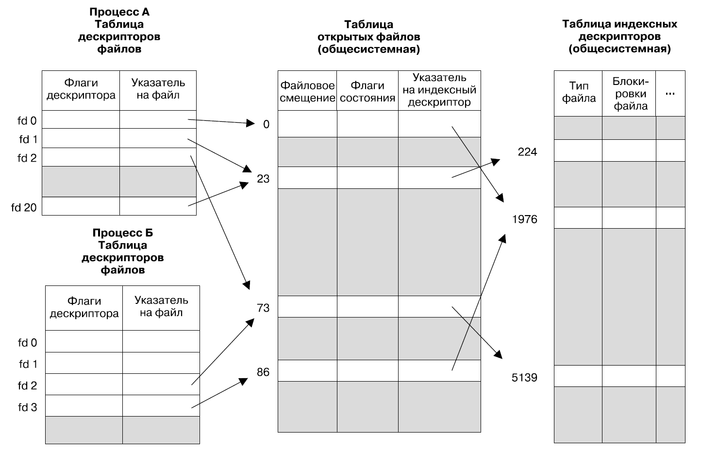

**Дескриптор файла** - это целочисленный идентификатор, присваиваемый файлу при его *открытии* процессом. Чтобы совершить над файлом большинство действий, в первую очередь необходимо получить его дескриптор, а уже затем передать его в качестве аргумента в системный вызов.

Для каждого процесса ядро поддерживает его *собственную* **таблицу дескрипторов файлов**. Её записи содержат:

+ *набор флагов* данного дескриптора, единственным возможным членом которого является флаг *close-on-exec* `FD_CLOEXEC`;
+ ссылку на соответствующую *дескрипцию открытого файла*.

На *общесистемном* уровне ядро поддерживает существующую в единственном экземпляре **таблицу открытых файлов**. Её записи, называемые **дескрипциями открытых файлов**, содержат следующую информацию о файле, над которым было произведено *открытие*:

+ текущее **файловое смещение**, также называемое *файловым указателем*, которое определяет позицию в файле, с которой будет выполняться следующая операция чтения/записи;
+ *флаги состояния* файла;
+ *режим доступа* к файлу;
+ установки механизма *ввода-вывода на основе сигналов*;
+ ссылка на соответствующий *индексный дескриптор* файла;

Само понятие файла как объединения взаимосвязанных данных вводит *файловая система*, которая для обеспечения своих функций (хранение информации) поддерживает реестр, называемый **таблицей индексных дескрипторов**. Её записи содержат:

+ тип файла;
+ *права доступа* к файлу со стороны пользователей ОС;
+ список *блокировок*, удерживаемых на файле;
+ всевозможные свойства файла: размер, метки времени и прочие.

Отдельная *дескрипция файла* создаётся при каждом его *открытии* с помощью системного вызова `open()`. Дескрипция, в свою очередь, порождает связанный с ней единственный *дескриптор файла*. Дополнительные экземпляры *дескрипторов* могут быть получены *дублированием* исходного дескриптора с помощью набора системных вызовов `dup()`, копированием исходного дескриптора в дочерний процесс при его создании, передачей исходного дескриптора через *сокет домена UNIX*. Очевидно, что все *файловые дескрипторы*, ссылающиеся на единственную *дескрипцию*, будут иметь доступ к одним и тем же значениям её полей (в особенности к *смещению* и *флагам состояния*), однако каждый из них будет обладать собственным значением флага *close-on-exec*.

Номера всех файловых дескрипторов начинаются с 0 и следуют друг за другом по возрастанию, причем при создании дескриптора любым способом ему гарантированно назначается *наименьший* доступный на текущий момент номер. Любой процесс, не являющийся *демоном*, будет по умолчанию обладать набором 3 *стандартных дескрипторов*, унаследованных им от своей оболочки:

+ `STDIN_FILENO` - стандартный *ввод*, номер `0`;
+ `STDOUT_FILENO` - стандартный *вывод*, номер `1`;
+ `STDERR_FILENO` - cтандартная *ошибка*, номер `2`.

Для каждого открытого файла ядро хранит **файловое смещение (файловый указатель)**, определяющее позицию в байтах, с которой будет выполняться следующая операция ввода-вывода. При открытии файла смещение устанавливается на его начало (если явно не указано иное), а затем последовательно сдвигается каждым успешно завершенным чтением или записью. Также файловый указатель может быть перемещен на требуемую позицию явным образом, причем его новое положение может располагаться за текущим концом файла - если для такой позиции будет выполнена операция записи, то образуется **файловая дыра**. До тех пор пока файловая дыра пуста (в её пределах отсутствуют явно записанные данные), она не занимает места, и файловая система не выделяет для неё дисковые блоки. Однако с программной точки зрения дыра хранит данные, и чтение из неё будет возращать нулевые байты - это означает, что номинальный объём файла, может превышать его реальный физический размер. Механизм файловых дыр позволяет экономить дисковое пространство, занимаемое слабозаполненными (разреженными, sparce) файлами. *Файлы дампа ядра*, содержащие слепок виртуальной памяти процесса на момент его завершения, являются их харакретными представителями.

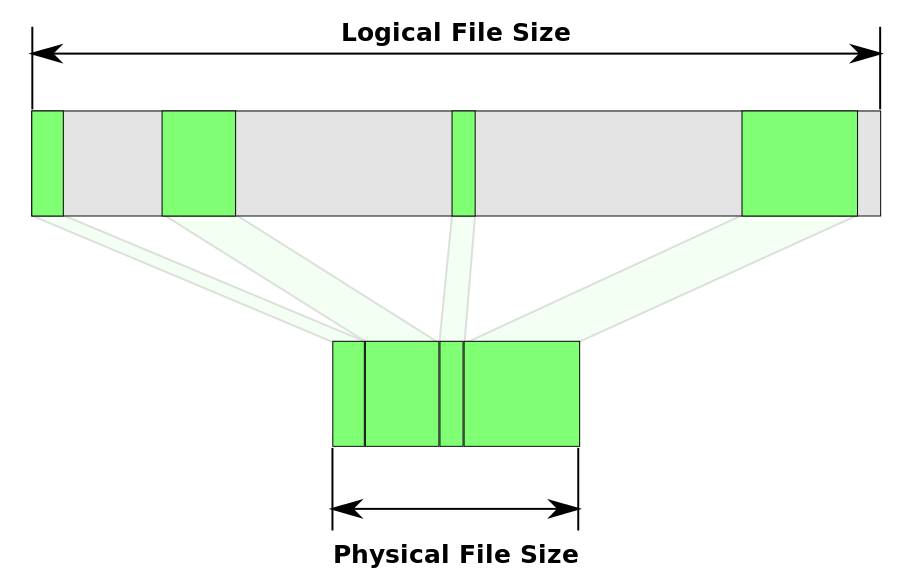

Ядро предоставляет ряд *виртуальных каталогов* с информацией о файловых дескрипторах процессов:

+ `/proc/PID/fdinfo` - для процесса с идентификатором `PID` содержит справочные файлы (смещение, флаги и т.д.) по одному на каждый из его файловых дескрипторов;
+ `/proc/self/fdinfo` - предоставляемая каждому процессу ядром *символьная ссылка* на его собственный каталог `fdinfo`;
+ `/proc/PID/fd` - для процесса с идентификатором `PID` содержит *символьные ссылки* на файлы, открытые им через каждый из своих файловых дескрипторов. В Linux открытие файла из данного каталога приводит к *повторному открытию* (с созданием новой *дескрипции*) исходного файла. Зачастую файлы из данного каталога используются для передачи стандартных потоков ввода/ввывода процесса, не являющихся сущностями файловой системы, в утилиты командной строки, принимающие в качестве аргументов путевые имена;
+ `/proc/self/fd` - предоставляемая каждому процессу ядром *символьная ссылка* на его собственный каталог `fd`;
+ `/dev/fd` - аналог описанной выше *символьной ссылки* на каталог `fd` процесса.

## 4.1. Универсальный интерфейс ввода-вывода

Linux предоставляет **универсальную модель ввода-вывода** - для выполнения чтения/записи во *все типы файлов*, включая устройства, терминалы и IPC, применяется интерфейс системных вызовов `open()/read()/write()/close()`. Данный механизм обеспечивается тем, что каждая файловая система или драйвер устройства самостоятельно реализуют требуемый от них набор операций ввода/вывода, а детали их обработки ядро скрывает внутри себя - в результате при написании прикладных программ можно игнорировать специфику устройства.

---

```C
int open(
    const char *pathname,
    int flags, ...
    /* mode_t mode */);
```

Открывает файл, идентифицированный путевым именем в аргументе `pathname`, и возвращает его *файловый дескриптор*. **Гарантируется, что созданный файловый дескриптор будет иметь НАИМЕНЬШИЙ НЕИСПОЛЬЗУЕМЫЙ номер.** Если имя файла содержит *символьную ссылку*, то она разыменовывается.

Если файл не существует, то он может быть автоматически создан при открытии (это определяется битовой маской флагов). В этом случае аргумент `mode` применяется для установки *прав доступа* к файлу со стороны *владельца*, *группы* и *остальных* (возможные значения описываются далее) - в противном случае он может быть опущен. Фактически установленный набор прав определяется комбинацией значений аргумента mode и маски процесса **umask** (либо **default ACL** - списка контроля доступа по умолчанию родительского каталога).

Аргумент `flags` содержит битовую маску режима доступа к файлу, включающую следующие группы флагов:

+ *Флаги режима доступа к файлу* - впоследствии могут быть извлечены:
  + `O_RDONLY` - открыть файл только для чтения;
  + `O_WRONLY` - открыть файл только для записи;
  + `O_RDWR` - открыть файл для чтения и записи;
+ *Флаги создания файла* - управляют поведением вызова; НЕ могут быть извлечены или изменены;
  + `O_CLOEXEC` - установить флаг файлового дескриптора close-on-exec `FD_CLOEXEC`;
  + `O_CREAT` - создать новый файл, если он не существует; требует обязательного наличия аргумента вызова `mode`;
  + `O_DIRECTORY` - путевое имя `pathname` должно указывать на *каталог*;
  + `O_EXCL` - указывается совместно с `O_CREAT`; создать новый файл либо вернуть ошибку, если он уже существует (*эксклюзивное создание файла*);
  + `O_LARGEFILE` - используется в 32-разрядных системах для открытия больших файлов, по размеру превышающих 2 Гбайта;
  + `O_NOCTTY` - запретить терминалу под путевым именем `pathname` становиться **управляющим терминалом** данного процесса;
  + `O_NOFOLLOW` - не разыменовывать символьные ссылки;
  + `O_TRUNC` - очистить открываемый файл;
+ *Флаги состояния файла* - впоследствии могут извлечены и изменены:
  + `O_APPEND` - перевести *указатель файла (смещение)* в его конец;
  + `O_NONBLOCK` - открыть файл в *неблокируемом режиме*: если операция ввода-вывода над файлом не может *мгновенно* завершиться *полностью*, то она либо целиком отменяется, возвращая синонимичные значения `EAGAIN` или `EWOULDBLOCK` в переменной `errno`, либо выполняется частично, возвращая реально обработанное количество байт;
  + `O_ASYNC` - часть механизма *ввода-вывода на основе сигналов*; отправлять процессу *сигнал*, когда указанный дескриптор становится доступен для выполнения ввода-вывода; может быть установлен только вызовом `fcntl(F_SETFL)`;
  + `O_SYNC` - выполнять над файлом операции *вывода* синхронизированным образом с сохранением *целостности файла*;
  + `O_DSYNC` - выполнять над файлом операции *вывода* синхронизированным образом с сохранением *целостности данных*;
  + `O_RSYNC` - распространить действие указанных выше флагов синхронизированного завершения также на операции *ввода*, применяемые к файлу: чтение будет требовать завершения выполняющихся операций записи;
  + `O_DIRECT` - осуществлять операции ввода-вывода напрямую над файлом *в обход дискового кеша ядра*;
  + `O_NOATIME` - не обновлять время последнего обращения к файлу при его чтении; *действующий UID* процесса должен соответствовать владельцу файла, либо процесс должен быть *привилегированным* (`CAP_FOWNER`).

---

```C
ssize_t read(
    int fd,
    void *buffer,
    size_t count);
```

Считывает из указанного фала максимально `count` байт в заранее выделенный буфер `buffer`. В случае успеха возвращает число *реально прочитанных* байт, которое может оказаться меньше указанного максимального. Попытка чтения за текущим концом файла вернёт 0 байт - данные отсутствуют.

---

```C
ssize_t write(
    int fd,
    const void *buffer,
    size_t count);
```

Записывает в указанный файл максимально `count` байт, хранящихся в буфере `buffer`. В случае успеха возвращает число *реально записанных* байт, которое может оказаться меньше указанного максимального. Завершение данного вызова не гарантирует перенос данных на устройство, поскольку ядро выполняет буферизацию дискового ввода-вывода.

---

```C
off_t lseek(int fd, off_t offset, int whence);
```

Сдвигает файловый указатель на `offset` байт относительно позиции `whence`. В случае успеха возвращает новое полученное значение файлового смещения.

Аргумент `whence` принимает следующие значения:

+ `SEEK_SET` - отправной точкой служит начало файла (нулевая позиция);
+ `SEEK_CUR` - отправной точкой служит текущее положение файлового указателя;
+ `SEEK_END` - отправной точкой служит позиция, *следующая за последним байтом файла*;

Аргумент `offset` является целым числом со знаком: нулевое значение просто вернет текущее смещение, а отрицательное заставит указатель передвинуться в противоположном направлении, однако *выходить за начало файла ЗАПРЕЩЕНО*.

Зачастую данный вызов применяется к обыкновенным файлам данных на диске - он не может быть вызван для *FIFO*, *сокета* и *терминала*. Файловое смещение - это сущность ядра, и его изменение не требует физического доступа к устройству хранения.

---

```C
int close(int fd);
```

Закрывает открытый файловый дескриптор, освобождая его для повторного использования процессом. Завершение процесса также приводит к автоматическому закрытию всех его файловых дескрипторов.

---

```C
int truncate(const char *pathname, off_t length);

int ftruncate(int fd, off_t length);
```

Устанавливают для файла, заданного через путевое имя `pathname` или дескриптор `fd`, новый размер `length`. Если файл *урезается*, то избыточные данные теряются. Если файл *увеличивается* в размере, то добавляются нулевые байты, либо образуется файловая дыра. *НЕ изменяют* значение *файлового смещения*, содержащееся в общесистемной дескрипции файла. При выполнении данного вызова к файлу применяются стандартные проверки режима и прав доступа.

---

```C
int fcntl(int fd, int cmd, ...);
```

Позволяет извлечь либо установить флаги *режима доступа* и *состояния* указанного файлового дескриптора. Аргумента `cmd` определяет выполняемое действие и принимает значения `F_GETFL` или `F_SETFL`. При установке флага вызов принимает дополнительный содержащий их параметр.

---

```C
int ioctl(int fd, int request, ... /* argp */);
```

Вызов общего назначения, позволяющий выполнять над указанным файлом или устройством операции, выходящие за пределы описанной универсальной модели. Аргумент `request`, обозначающий совершаемую операцию, обычно сопровождается набором её входных параметров `argp` любого требуемого типа.

## 4.2. Дополнительные операции ввода-вывода

```C
ssize_t pread(
    int fd,
    void *buf,
    size_t count,
    off_t offset);

ssize_t pwrite(
    int fd,
    const void *buf,
    size_t count,
    off_t offset);
```

Являются аналогами стандартных вызовов, однако осуществляют ввод-вывод с заданного смещения `offset` от начала файла, а не с текущей позиции файлового указателя. *НЕ изменяют* значение *файлового смещения*, содержащееся в общесистемной дескрипции файла. Тип файла, над которым выполняются данные вызовы, должен поддерживать произвольную установку файлового смещения.

---

```C
ssize_t readv(
    int fd,
    const struct iovec *iov,
    int iovcnt);

ssize_t writev(
    int fd,
    const struct iovec *iov,
    int iovcnt);
```

Осуществляют *фрагментированный ввод-вывод (scatter-gather IO)*: считывают или записывают непрерывную последовательность байтов файла в `iovcnt` буферов в порядке их следования в наборе `iov`. Поскольку данные вызовы совершаются *атомарно*, то *любые* операции ввода-вывода над указанным файлом в других процессах или потоках не могут нарушить непрерывность обрабатываемой последовательности данных.

---

```C
ssize_t preadv(
    int fd,
    const struct iovec *iov,
    int iovcnt,
    off_t offset);

ssize_t pwritev(
    int fd,
    const struct iovec *iov,
    int iovcnt,
    off_t offset);
```

Фрагментированный ввод-вывод по заданному смещению - являются комбинацией описанных выше вызовов.

## 4.3. Дублирование файловых дескрипторов

```C
int dup(int oldfd);
```

Создает дубликат исходного дескриптора `oldfd`, указывающий на ту же дескрипцию файла в общесистемной таблице.

---

```C
int dup2(int oldfd, int newfd);
```

Создает дубликат исходного дескриптора `oldfd`, указывающий на ту же дескрипцию файла в общесистемной таблице, присваивая ему номер дескриптора `newfd`. Если `newfd` уже существует, то сначала он будет **закрыт**, причем закрытие и повторное открытие будут выполнены *атомарно*. Если в аргументы вызова передан один и тот же дескриптор, то никаких действий не совершается.

---

```C
int dup3(int oldfd, int newfd, int flags);
```

Аналог вызова `dup2()`, дополнительно позволяющий с помощью значения `O_CLOEXEC` аргумента `flags` сразу установить в результирующем дескрипторе флаг close-on-exec.

## 4.4. Создание временных файлов

Если программе на время работы требуются временные файлы, которые будут уничтожены по её завершении, то она может воспользоваться набором библиотечных функций.

---

```C
int mkstemp(char *template);
```

Создаёт, открывает для чтения/записи и возвращает дескриптор файла, шаблон `template` путевого имени которого обязан заканчиваться символьной последовательностью `XXXXXX` - она будет перезаписана ядром на строку, придующую имени уникальность. Открываемый файл получает права чтения/записи для владельца, а также флаг `O_EXCL`, гарантирующий эксклюзивный доступ. Обычно сразу после создания файла его запись в файловой системе уничтожают вызовом `unlink()` - он продолжит быть доступен процессу через свой дескриптор и будет окончательно удален при его закрытии.

---

```C
FILE *tmpfile(void);
```

Создаёт и эксклюзивно (`O_EXCL`) открывает для чтения/записи временный файл с уникальным именем, возвращая его *файловый поток* библиотеки stdio языка C. При закрытии он будет автоматически удалён.

## 4.5. Буферизация ввода-вывода

Для повышения скорости ввода-вывода при работе с дисковыми файлами ядро применяет *буферизацию* данных, позволяющую выполнить чтение или запись файла без ожидания завершения долгой (по сравнению со скоростью работы оперативной памяти и процессора) дисковой операции.

Вызовы `read()` и `write()` не ининциируют непосредственный доступ к диску, а вместо это копируют данные из пользовательского пространства памяти в **буферы дискового кеша ядра**. Ядро НЕ накладывает ограничений на размер дисковых буферов: оно выделяет ровно столько страниц памяти, сколько требуется процессу. Вызов `write()` возвращается сразу же после выполнения переноса данных. Вызов `read()` в первую очередь ищет запрошенный диапазон байтов в дисковом кеше и в случае его отсутствия выполняет чтение с диска данных с запасом в кеш  - *упреждающее чтение*.

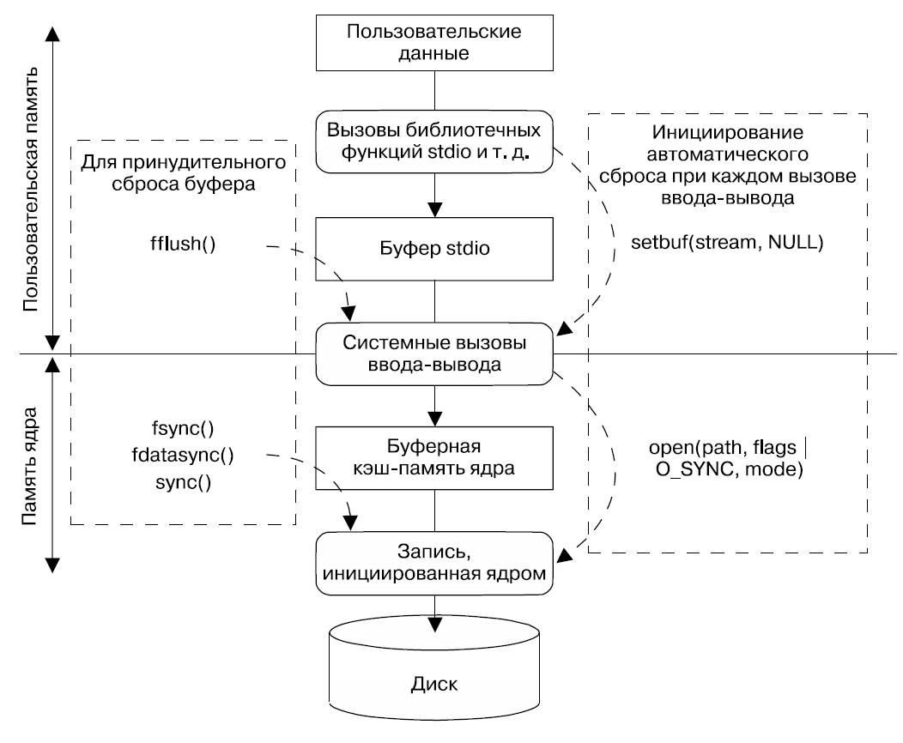

### 4.5.1. Буферизация в библиотеке stdio

Функции ввода-вывода стандартной библиотеки С stdio применяют буферизацию в *пользовательском пространстве* памяти для сокращения количества реально выполняемых системных вызовов. Данная буферизация применяется функциями:

+ `fprintf()`;
+ `fscanf()`;
+ `fgets()`;
+ `fputs()`;
+ `fputc()`;
+ `fgetc()`.

Сброс буферов stdio может выполняться явно вызовом функции `fflush()` либо автоматические при закрытии потока ввода-вывода stdio.

Также стандарт языка C устанавливает следующие требования к функционированию буферов в реализациях потоков ввода-вывода:

+ за операциями *вывода* не может непосредственно следовать *ввод* без промежуточного сброса буфера `fflush()` или позиционирования файлового указателя `fseek()/fsetpos()/rewind()`;
+ за операцией *ввода* не может непосредственно следовать *вывод* без промежуточного позиционирования файлового указателя `fseek()/fsetpos()/rewind()` (если только *ввод* не столкнулся с окончанием файла).

При совместном использовании библиотечных функций stdio ввода-вывода и системных вызовов нужно с повышенным вниманием относиться к *порядку опустошения буферов пользователя и ядра*, чтобы не допускать нарушения *очередности вывода* данных: вывод через библиотеку stdio, даже если он находится раньше по коду программы, без явного сброса пользовательских буферов всё равно будет отставать от вывода через чистый системный вызов!

---

```C
FILE *fdopen(int fd, const char *mode);
```

Для указанного файлового дескриптора возвращает соответствующий ему *файловый поток* с учетом флагов открытия `mode` (должны соответствовать флагам открытия дескриптора), который может быть использован в функциях ввода-вывода стандартной библиотеки С.

---

```C
int setvbuf(
    FILE *stream,
    char *buf,
    int mode,
    size_t size);
```

Устанавливает режим буферизации, применяемый к *файловому потоку* `stream` библиотекой stdio:

+ `_IONBF` - НЕ выполнять буферизацию; вызовы функций stdio будут приводить к немедленному выполнению системных вызовов; *по умолчанию* используется для потока *stderr*;
+ `_IOLBF` - применять *построчную буферизацию*: накопление символов продолжается до появления символа новой строки либо переполнения буфера; *по умолчанию* используется для *терминальных устройств*;
+ `_IOFBF` - использовать *полную буферизацию*: данные будут записываться и считываться блоками, по размеру равными используемому буферу; *по умолчанию* применяется для *дисковых файлов*.

Аргумент `buf` может содержать либо заранее выделенный буфер, либо `NULL` - в этом случае библиотека самостоятельно выделит буфер некоторого оптимального размера.

Данный вызов имеет 2 аналога:

```C
void setbuf(
    FILE *stream,
    char *buf);

void setbuffer(
    FILE *stream,
    char *buf,
    size_t size);
```

Если `buf` содержит `NULL`, то буферизация не используется. Значения отсутствующих аругментов заполняются библиотекой stdio самостоятельно.

---

```C
int fflush(FILE *stream);
```

Принудительно сбрасывают в дисковый кеш буфер библиотеки stdio, хранящий данные указанного *файлового потока* `stream`. Если значение аргумента равняется `NULL`, то сбрасывает *все* буферы пользовательского пространства.

### 4.5.2. Синхронизированный ввод-вывод ядра

Процесс может в любой момент потребовать принудительный сброс дисковых буферов ядра, содержащих закешированные данные используемых им файлов - т.е. завершить операцию ввода-вывода **синхронизированным образом**. Такой принудительный сброс либо приведет к успешному переносу данных на диск, либо будет сообщён как неудавшийся.

Существует 2 типа синхронизированного завершения операций ввода-вывода:

+ **завершение с целостностью данных** - при обновлении файла должен быть обеспечен перенос всей информации, достаточной для последующего успешного извлечения данных файла:
  + *для операций записи* - на диск должно быть перенесено содержимое файла, а также все *необходимые метаданные* (например, результирующий размер файла, но не обязательно метки времени);
  + *для операций чтения* - с диска в процесс должно быть перенесено содержимое файла с предварительным завершением всех отложенных операций записи;
+ **завершение с целостностью файла** - более строгий тип, требующий переноса *абсолютно всех метаданных* в дополнение к содержимому файла.

---

```C
int fdatasync(int fd);
```

Принудительно сбрасывает дисковый кеш ядра для указанного файла и завершает ожидающие операции ввода-вывода с сохранением *целостности данных*.

---

```C
int fsync(int fd);
```

Принудительно сбрасывает дисковый кеш ядра для указанного файла и завершает ожидающие операции ввода-вывода с сохранением *целостности файла*.

---

```C
void sync(void);
```

Принудительно сбрасывает все дисковые буферы ядра, используемые данным процессом, и завершает ожидающие операции ввода-вывода с сохранением *целостности файла*.

---

Автоматический сброс дискового кеша через равные промежутки времени (порядка 30 сек) осуществляется процессом системы **pdflush**. Вручную период сброса буферов ядра может быть установлен в файле `/proc/sys/vm/dirty_expire_centisecs`.

Также существуют набор флагов открытия файла, передаваемых в вызов `open()`, который позволяет активировать автоматическое синхронизированное завершение операцией ввод-вывода для данной *дескрипции файла*:

+ `O_SYNC` - выполнять операции *вывода* синхронизированным образом с сохранением *целостности файла*;
+ `O_DSYNC` - выполнять операции *вывода* синхронизированным образом с сохранением *целостности данных*;
+ `O_RSYNC` - распространить действие указанных выше флагов синхронизированного завершения также на операции *ввода*: чтение будет требовать завершения выполняющихся операций записи;
+ `O_DIRECT` - осуществлять операции ввода-вывода напрямую над файлом *в обход дискового кеша ядра* (например, может применяться в программах СУБД); *одновременное* открытие файла (через разные дескрипции) в *прямом И буферизированном* режимах приведет к ПОВРЕЖДЕНИЮ данных; при работе в данном режиме адреса памяти и размер данных должны быть кратны размеру дискового блока.

Ядро предоставляет процессу возможность проинформировать ядро о предполагаемом характере обращения к содержимому указанного файла, что позволит в данном конкретном случае оптимизовать работу механизма дисковых буферов. Однако не даётся никаких гарантий, что ядро воспользуется предоставленными ему сведениями.

---

```C
int posix_fadvise(
    int fd,
    off_t offset,
    off_t len,
    int advice);
```

Информирует ядро о предполагаемом способе обращения к данным указанного своим дескриптором `fd` файла, располагающимся по смещению `offset` и занимающим `len` байт. Аргумент `advice` определяет характер использования файла:

+ `POSIX_FADV_NORMAL` - нет особого уведомления; вариант *по умолчанию*; устанавливает *стандартный* (`128 Кбайт`) размер *окна упреждающего считывания*;
+ `POSIX_FADV_SEQUENTIAL` - *последовательное считывание* данных файла; устанавливает *двойной* размер *окна упреждающего считывания*;
+ `POSIX_FADV_RANDOM` - *произвольное обращение* к данным файла; *отключает упреждающее считывание*;
+ `POSIX_FADV_WILLNEED` - указанный диапазон данных *понадобится в ближайшее время*, поэтому его следует заранее считать в дисковый кеш;
+ `POSIX_FADV_DONTNEED` - указанный диапазон данных *НЕ потребуется в ближайшее время*, поэтому занимаемое им место в дисковом кеше можно освободить, но только если эти данные в настоящее время не используется в других операциях.
+ `POSIX_FADV_NOREUSE` - *однократное обращение* к данным файла; ядро может освобождать дисковые кеши указанного файла после первого обращения к ним со стороны процесса.

# 5. Файловая система

## 5.1. Устройства и драйверы

Linux подразделяет все подключенные к системе устройства на 2 типа:

+ **символьные** - обрабатывают данные посимвольно: терминалы, клавиатуры и т.д.;
+ **блочные** - обрабатывают данные блоками байт фиксированного размера. *Накопители (диски)* относятся к данному типу устройств.

По своей природе устройство может являться *реальным* либо *виртуальным* - в этом случае оно будет являться абстракцией ядра с функционалом, аналогичным реальному устройству.

Любое устройство должно предоставлять операционной системе требуемый набор операций в заданном формате - т.е. должно реализовывать определенный интерфейс, которым зачастую является универсальный интерфейс ввода-вывода, позволяющий добиться единообразия коммуникации с устройствами различных типов. Реализацию требуемого интерфейса осуществляет **драйвер устройства** - модуль ядра, разработанный производителем устройства, который сопрягает функционал операционной системы с реальными возможностями устройства.

Связь устройства и его драйвера выполняется на основе **файла устройства** - специальной сущности файловой системы, содержащейся в **каталоге `/dev`** по одному экземпляру для каждого подключенного к системе устройства.
*Индексный дескриптор* файла устройства содержит:

+ **старший идентификационный номер устройства (major)** - обозначает *класс устройства*; администрированием данных идентификаторов занимается организация *Linux Assigned Names and Numbers Authority (LANANA)*;
+ **младший идентификационный номер устройства (minor)** - помогает уникальным образом определить устройство внутри его класса.

При установке *драйвер* регистрирует свою *привязку* к конкретному *старшему идентификатору* и таким образом информирует ядро о видах устройств, за обработку которых он отвечает. В момент поиска требуемого драйвера имя файла устройства значения не имеет.

Различная сервисная информация об устройствах системы содержится в **виртуальной файловой системе `/sys`**.

## 5.2. Диски и разделы

Пространство диска образовано *физическими блоками*, являющимися наименьшей единицей чтения и записи информациии. Все блоки имеют одинаковый заданный размер, кратный 512 байтам. Логически блоки группируются в непересекающиеся **разделы (partitions)**. Для каждого раздела в каталоге `/dev` существует свой собственный файл, а файл `/proc/partitions` перечисляет все доступные системе разделы. Для администрирования разделов дисков используется утилита `fdisk`.

*Раздел* диска может содержать информацию одного из следующих типов:

+ **файловая система** - упорядоченный набор файлов и каталогов (метаинформация + данные);
+ **область данных** - память, допускающая обращение в режиме *прямого доступа*;
+ **область подкачки** - копии не используемых в настоящих момент физических страниц памяти, которые не уместились в имеющемся объеме оперативной памяти. За создание файлов подкачки отвечают утилиты `mkswap` и `swapon/swapoff` (существует аналогичный системный вызов, требующий привилегии процесса `CAP_SYS_ADMIN`). Файл `/proc/swaps` перечисляет все имеющиеся в системе файлы подкачки.

## 5.3. Файловые системы

**Файловая система** - упорядоченный набор файлов и каталогов. Linux поддерживает самые разные файловые системы, обладающие своими собственными характерными особенностями:

+ сетевые: NFS;
+ журналируемые: XFS, ext3, ext4 - фиксируют все изменения метаданных (а также при необходимости и данных) в файле журнала - применяют механизм *транзакций*; данный тип файловых систем позволяет выполнять проверку только журнала транзакций, а не всех хранящихся данных, что ускоряет восстановление после сбоя;
+ виртуальная файловая система: **tmpfs** - размещается не на диске, а в оперативной памяти и файле подкачки;
+ родные для Linux: ext2, ext3, ext4;
+ за авторством Microsoft: FAT, FAT32, NTFS.

Такое многообразие поддерживаемых реализаций достигается тем, что операционная система обязывает каждую из них предоставлять унифицированный интерфейс **виртуальной файловой системы (VFS)**, включающий в себя стандартные операции для работы с файлами и каталогами. Ядро оперирует только VFS-интерфейсом и игнорирует детали конкретных используемых файловых систем. Если данная файловая система не поддерживает какие-либо операции из набора, то они просто возвращают ошибку.

Наименьшей единицей выделения пространства в файловой системе является *логический блок*, представляющий собой совокупность смежных *физических дисковых блоков* заданного размера. Типичная файловая система включает в себя следующие компоненты:

+ **блок начальной загрузки** - *всегда самый первый блок* в файловой системе, в котором содержится информация, требуемая для загрузки файловой системы; *каждая файловая система*, располагающаяся в своем разделе диска, обладает *собственным блоком начальной* загрузки;
+ **суперблок** - метаинформация о файловой системе:
  + размер логического блока в байтах;
  + размер *таблицы индексных дескрипторов*;
  + размер файловой системы в логических блоках;
+ **таблица индексных дескрипторов** - индекс файлов и каталогов данной файловой системы, записи которого хранят их метаинформацию;
+ **блок данных** - содержимое файлов и каталогов файловой системы, распределенное по логическим блокам; файл не обязан *целиком* содержаться в *смежных блоках* - это достигается только выполнением *дефрагментации*;

**Индексный дескриптор (i-node)** - структура данных, содержащая метаинформацию (атрибуты) о связанном с ней файле или каталоге. Все индексные дескрипторы однозначным образом идентифицируются по своему порядковому номеру в данной таблице. Индексный дескриптор содержит следующие поля:

+ **тип файла** - указывает конкретный тип файла из набора поддерживаемых операционной системой;
+ **владелец файла** - UID, присвоенный файлу;
+ **группа файла** - GID, присвоенный файлу;
+ **права доступа** к файлу для *владельца*, *группы* и *остальных*;
+ **метки времени** - последний доступ к файлу, последнее изменение данных файла, последнее изменение индексного дескриптора;
+ **количество жестких ссылок** на данный файл;
+ **размер файла в байтах**;
+ **размер файла в логических блоках** - количество блоков, фактически хранящих файл; может не соответствовать размеру в байтах, если файл содержит *файловые дыры*;
+ **список указателей на блоки данных** - указатели делятся на 2 вида:
  + *прямые* - непосредственно указывают на блок с данными файла;
  + *косвенные* - указывают на блок, содержащий другой список указателей; косвенность может быть *двойной* либо *тройной*; количество указателей в косвенном списке варьируется от 256 до 1024 в зависимости от используемого размера логического блока; использование косвенных указателей позволяет экономно хранить метаинформацию о файлах размером до нескольких терабайт.

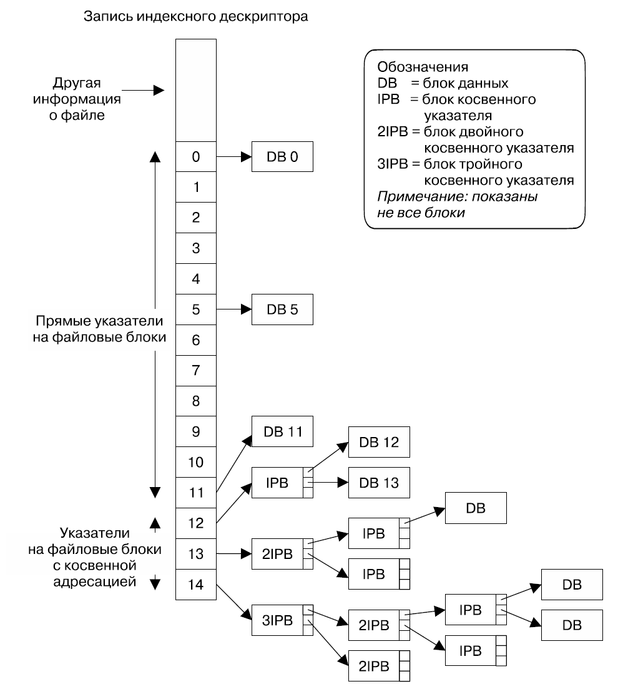

### 5.3.1. Монтирование файловых систем

В Linux все файлы и каталоги располагаются в **едином дереве каталогов**, в основании которого находится **корневой каталог `/`**. Файловые системы, физически располагающиеся в различных *разделах*, указывают в данной иерархии свою точку входа (**точку монтирования**) и добавляются в неё как поддеревья.

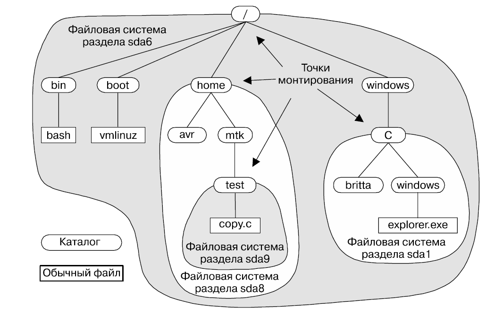

Информация о смонтированных в настоящий момент файловых системах приводится в следующих текстовых файлах (их содержимое также можно просмотреть с помощью вызовов `getfsent()`, `getmntent()`):

+ `/proc/mounts` - список смонтированных файловых систем;
+ `/etc/mtab` - аналог предыдущего файла, заполняемый командой оболочки `mount` и содержащий более детализированную информацию;
+ `/etc/fstab` - аналог предыдущего файла.

Данные файлы содержат строки указанного вида со следующим набором полей:

`/dev/sda9 /boot ext3 rw`

+ имя файловой системы (зачастую путевое имя файла устройства);
+ точка монтирования файловой системы данного устройства;
+ тип файловой системы;
+ флаги монтирования.

---

```C
int mount(
    const char *source,
    const char *target,
    const char *fstype,
    unsigned long mountflags,
    const void *data);
```

Монтирует файловую систему устройства, файл которого имеет путевое имя `source`, в каталог `target`, называемый *точкой монтирования*. Процесс должен обладать привилегией `CAP_SYS_ADMIN`.

Аргумент `fstype` содержит строку, определяющую тип файловой системы: ext4, btrfs и т.д.

Аргумент `mountflags` содержит битовую маску флагов, определяющих выполняемые вызовом действия, а аргумент `data` - параметры монтирования:

+ `MS_BIND` - создать **связанную точку монтирования** для указанного файла или каталога;
+ `MS_MOVE` - переместить точку монтирования в другое место; выполняет *размонтирование*;
+ `MS_REMOUNT` - изменяет параметры уже смонтированной файловой системы; *НЕ* выполяет *размонтирование*;
+ `MS_NODEV` - запрещает доступ к устройстам (блочным и символьным) в данной файловой системе;
+ `MS_NOEXEC` - запрещает выполнение программ и скриптов в данной файловой системе;
+ `MS_NOSUID` - запрещает выполнение программ с полномочиями *set-UID* и *set-GID* в данной файловой системе;
+ `MS_RDONLY` - смонтировать файловую систему только для чтения (изменять файлы и каталоги нельзя);
+ `MS_REC` - применяется совместно с другими флагами и выполняет рекурсивное монтирование вложенных точек монтирования;
+ `MS_DIRSYNC` - делает операции обновления каталогов данной файловой системе синхронными;
+ `MS_SYNCHRONOUS` - делает операции обновления каталогов и файлов данной файловой системе синхронными;
+ `MS_RELATIME`, `MS_STRICTATIME`, `MS_NOATIME`, `MS_NODIRATIME` - управляют обновлением времени последнего доступа к файлам и каталогам;
+ `MS_MANDLOCK` - разрешить обязательную блокировку файлов.

---

```C
int umount(const char *target);
```

Размонтирует файловую систему, указанную по своей точке монтирования `target`. Файловая система не может быть размонтирована, если она *занята*: какой-либо из содержащихся в ней *файлов открыт* в настоящее время, либо в ней установлен *рабочий каталог* некоторого *процесса* - ошибка `EBUSY`.

---

```C
int umount2(const char *target, int flags);
```

Является аналогом вызова `umount()`, позволяющим указывать битовую маску дополнительных опций размонтирования `flags`:

+ `MNT_DETACH` - выполнить *ленивое размонтирование*: фактическое размонтирование произойдет в тот момент, когда завершится текущее использование данной файловой системы существующими процессами; обращение к файловой системе со стороны новых процессов запрещено;
+ `MNT_EXPIRE` - *первый вызов* помечает *незанятую* точку монтирования как *просроченную* и завершает вызов с ошибкой `EAGAIN`; точка монтирования будет оставаться просроченной до тех пор, пока её не начнет использовать какой-либо процесс; *последующий вызов*, применяемый к *просроченной* точке монтирования, окончательно её размонтирует; нельзя указывать совместно с `MNT_DETACH` и `MNT_FORCE`; данный механизм позволяет отслеживать и размонтировать файловые системы, которые не используются в течение некоторого периода времени;
+ `MNT_FORCE` - выполняет принудительное размонтирование, даже если устройство в настоящее время используется; применим только к файловой системе NFS и может вызвать повреждение данных;
+ `UMOUNT_NOFOLLOW` - если `target` является символической ссылкой, то НЕ разыменовывать её.

---

Заданная файловая система может одновременно иметь *несколько точек монтирования* - все они будут вести к единственному экземпляру поддерева. Каждая из точек монтирования может иметь *собственные значения* следующих флагов монтирования `mountflags`: `MS_NODEV`, `MS_NOEXEC`, `MS_NOSUID`, `MS_RDONLY`, `MS_RELATIME`, `MS_NOATIME`, `MS_NODIRATIME` - это позволяет обращаться к одной и той же файловой системе с различными разрешениями.

Создание **связанной точки монтирования** с помощью флага `MS_BIND` позволяет смонтировать указанный *каталог или файл* в какое-либо еще место в иерархии ТОЙ ЖЕ файловой системы. Чтобы через связанную точку монтирования исходного каталога были также доступны его подкаталоги, необходимо дополнительно указывать флаг `MS_REC`. Создание связанной точки монтирования аналогично созданию *жесткой ссылки*, однако обладает рядом особенностей:

+ может быть применен к каталогам - жесткая ссылка создается только для файлов;
+ может быть применен даже к файлам и каталогам, изолированным в **клетке chroot**.

По местоположению единственной точки монтирования могут быть смонтированы несколько файловый систем - это создаст в ней **стек монтирования**. Каждая последующая операция монтирования в заданной точке будет скрывать существующее поддерево каталогов новым - размонтирование вершины стека, в свою очередь, снова откроет доступ к подлежащему поддереву файловой системы. Сокрытие существующей файловой системы никак не затронет использующие её процессы - они продолжат работать с видимым им поддеревом.

### 5.3.2. Извлечение информации о файловой системе

```C
int statvfs(
    const char *pathname,
    struct statvfs *statvfsbuf);

int fstatvfs(
    int fd,
    struct statvfs *statvfsbuf);

struct statvfs
{
    unsigned long f_bsize;
    unsigned long f_frsize;
    fsblkcnt_t f_blocks;
    fsblkcnt_t f_bfree;
    fsblkcnt_t f_bavail;
    fsfilcnt_t f_files;
    fsfilcnt_t f_ffree;
    fsfilcnt_t f_favail;
    unsigned long f_fsid;
    unsigned long f_flag;
    unsigned long f_namemax;
};
```

Возвращает информацию о файловой системе по путевому имени `pathname` или файловому дескриптору `fd` расположенного в ней файла.

Структура `statvfs` содержит следующие поля:

+ `f_bsize` - размер логического блока в байтах;
+ `f_frsize` - фундаментальный размер логического блока в байтах; обычно совпадает со значением `f_bsize`, однако для файловых систем, допускающих фрагментирование блоков, содержит размер такого фрагмента;
+ `f_blocks` - общее количество логических блоков в файловой системе;
+ `f_bfree` - количество свободных логических блоков;
+ `f_bavail` - количество свободных логических блоков, доступных непривилегированному процессу; может отличаться от значения `f_bfree` для файловых систем, резервирующих некоторый объем дискового пространства для использования суперпользователем;
+ `f_files` - общее количество индексных дескрипторов;
+ `f_ffree` - количество свободных индексных дескрипторов;
+ `f_favail` - количество свободных индексных дескрипторов, доступных непривилегированному процессу;
+ `f_fsid` - уникальный идентификатор файловой системы; в родных для Linux файловых системах равен `0`;
+ `f_flag` - флаги монтирования;
+ `f_namemax` - максимальная длина имени файлов для данной файловой системы.

### 5.3.3. Виртуальная файловая система `/proc`

**Виртуальная файловая система `/proc`** содержит набор каталогов, предоставляющих статистику о работе системы. Она не хранится на диске, а её файлы и каталоги генерируются ядром на лету при обращении к ним процессов.

Каталог `/proc/PID` предоставляет информацию о конкретном процессе:

+ `status` - файл общих сведений о процессе;
+ `cmdline` - файл с аргументами командной строки;
+ `cwd` - символьная ссылка на текущий рабочий каталог;
+ `environ` - файл с переменными окружения;
+ `exe` - символьная ссылка на файл программы, выполняемой в процессе;
+ `fd` - каталог, содержащий символьные ссылки на файлы, открытые через соответствующие файловые дескрипторы;
+ `maps` - файл со списком созданных процессом *отображений памяти*;
+ `mem` - файл, предоставляющий доступ к **виртуальной памяти** процесса;
+ `mounts` - файл со списком *точек монтирования* процесса;
+ `root` - символьная ссылка на корневой каталог;
+ `task` - каталог, содержащий по подкаталогу с аналогичной информацией для каждого **потока** процесса;

Для каждого процесса ядром также создаётся символьная ссылка `/proc/self` на его собственный каталог `/proc/PID`.

Cледующие подкаталоги `/proc` предоставляют сведения о системе в целом:

+ `net` - состояние сети и сокетов;
+ `sys/kernel` - общие настройки ядра;
+ `sys/fs` - настройки файловых систем;
+ `sys/net` - настройки сети;
+ `sys/vm` - настройки системы управления памятью.

---

```C
int uname(struct utsname *utsbuf);

struct utsname
{
    char sysname[_UTSNAME_LENGTH];
    char nodename[_UTSNAME_LENGTH];
    char release[_UTSNAME_LENGTH];
    char version[_UTSNAME_LENGTH];
    char machine[_UTSNAME_LENGTH];
};
```

Возвращает справку о системе в виде структуры типа `utsname`, содержащей следующие поля:

+ `sysname` - название реализации системы;
+ `nodename` - имя узла в сети;
+ `release` - идентификатор выпуска системы;
+ `version` - версия системы;
+ `machine` - железо, на котором
запущена система.

Команда оболочки `uname -a` выполняет аналогичную функцию.

## 5.4. Файлы

**Файл** - единица данных на носителе, с которой работает операционная система. Все сущности файловой системы, расположенные в её иерархии, являются файлами различных типов:

+ *обычный файл*;
+ *каталог*;
+ *символическая ссылка*;
+ *символьное устройство*;
+ *блочное устройство*;
+ *FIFO или pipe*;
+ *сокет*.

### 5.4.1. Принадлежность

С каждым файлом связаны *идентификатор пользователя UID* и *идентификатор группы GID*, которым он принадлежит. При создании нового файла его идентификатор пользователя наследуется от *действующего UID процесса*. Идентификатор группы файла наследуется либо от *действующего GID процесса*, либо от *идентификатора группы родительского каталога* - это определяется параметрами монтирования файловой системы:

+ если файловая система смонтирована командой `mount -o grpid`, то группа файла всегда наследуется от группы родительского каталога;
+ если файловая система смонтирована командой `mount -o nogrpid` (по умолчанию), то группа файла наследуется от действующего GID процесса, если для *родительского каталога* НЕ установлен бит *set-group-ID* - в противном случае группа файла будет наследоваться от родительского каталога.

---

```C
int chown(
    const char *pathname,
    uid_t owner,
    gid_t group);

int lchown(
    const char *pathname,
    uid_t owner,
    gid_t group);

int fchown(
    int fd,
    uid_t owner,
    gid_t group);
```

Устанавливают нового пользователя и/или группу файла. Если `pathname` является символической ссылкой, то вызов `lchown()` её не разыменует. Аргументам идентификаторов, значения которых изменять не требуется, можно присвоить `-1`.

Владельца файла может изменить только привилегированный (`CAP_CHOWN`) процесс. Группу файла может изменить только его владелец, причем только на одну из тех, членом которой он является.

При изменении владельца или группы значения установленных битов **set-user-ID и set-group-ID сбрасываются** - это сделано **по соображениям безопасности**! Бит set-group-ID сохраняется только в случае отсутствия права на исполнение группой, либо если типом файла является каталог.

### 5.4.2. Права доступа

Права доступа задаются для трёх *категорий*:

+ **владелец**;
+ **группа**;
+ **остальные**.

Права доступа делятся на три *типа*:

+ **чтение**;
+ **запись**;
+ **выполнение**.

Для *файлов* значение каждого типа является самоочевидным. Скомпилированные двоичные программы требуют право на выполнение. Текстовые скрипты, передаваемые в соответствующий интерпретатор, требуют права на чтение и выполнение.

Для *каталогов* типы прав доступа имеют следующий смысл:

+ *чтение* - разрешен просмотр списка имен содержимого каталога;
+ *запись* - разрешено создание и удаление файлов внутри каталога;
+ *выполнение* - также называется разрешением на *поиск*; разрешено непосредственное обращение к файлам, переход в подкаталоги.

Т.к. информация о правах доступа содержится в индексных дескрипторах, то все *ссылки* на одну сущность будут разделять её права.

*Привилегированному пользователю (root)* разрешено *выполнять любой каталог*, однако файл он может выполнить, только если это разрешено хотя бы одной категории.

Для извлечения прав доступа к сущности в коде программы используется набор вызов `stat()`. В оболочке права доступа извлекаются командой `ls` (может являться псевдонимом; оригинальная команда `/bin/ls`).

Пример вывода для каталога: `drwxrw-r--`.

#### 5.4.2.1. Порядок проверки прав доступа

При обращении процесса к сущности файловой системы по её путевому имени проверка прав доступа выполняется в следующей очередности с остановкой в момент нахождения *первого соответствия идентификаторов*:

1. Если процесс *привилегированный (root)*, то он имеет полный доступ;
2. Если действующий UID процесса совпадает с пользователем файла (каталога), то проверяются права владельца;
3. Если действующий GID процесса или GID любой из его добавочных групп совпадает с идентификатором группы файла (каталога), то проверяются права группы;
4. Иначе проверяются права остальных.

В реальности вместо действующих идентификаторов процесса используются идентификаторы файловой системы, однако они всегда имеют те же значения.

#### 5.4.2.2. Биты set-user-ID, set-group-ID и sticky

Биты **set-user-ID** и **set-group-ID** используются для присвоения процессам идентификаторов принадлежности выполняемых ими файлов программ (подробнее смотреть в разделе о процессах).

Также если бит *set-group-ID*:

+ установлен *для каталога* - значение группы новых создаваемых в нем файлов и подкаталогов будет копироваться из группы каталога; файловая система должна при этом быть смонтирована с параметром `nogrpid`;
+ установлен *для файла* - разрешена принудительная блокировка файла.

**Sticky** бит (также называемый *saved text*) в настоящее время устанавливается *только для каталогов* и ограничивает изменение их содержимого:

+ непривилегированный процесс может *удалять и переименовывать* файлы и подкаталоги родительского каталога, только если он является *владельцем файла, подкаталога или всего родительского каталога*;
+ непривилегированный процесс может назначать каталогу расширенные атрибуты `user`, только если он является его владельцем;

#### 5.4.2.3. Изменение прав доступа

```C
mode_t umask(mode_t mask);
```

Устанавливает атрибут процесса **umask**, определяющий, какие биты прав доступа к новому файлу (каталогу) должны быть *отключены при его создании* процессом. Процесс наследует маску прав доступа от своего *родительского процесса*. Аргумент `mask` принимает константы типа `mode_t` (список приводится в описании вызова `stat()`).

---

```C
int chmod(const char *pathname, mode_t mode);
int fchmod(int fd, mode_t mode);
```

Устанавливает права доступа к файлу (каталогу), заданному своим путевым именем `pathname` или файловым дескриптором `fd`. Если `pathname` является символической ссылкой, то она будет разыменована.

Процесс должен быть привилегированным (`CAP_FOWNER`) либо являться владельцем файла.

**По соображениям безопасности** непривилегированный (не `CAP_FSETID`) процесс **НЕ может установить бит set-group-ID** для файла (каталога), группа которого не совпадает с действующим GID процесса либо с GID любой из его дополнительных групп.

#### 5.4.2.4. Тестирование прав доступа

```C
int access(const char *pathname, int mode);
```

Проверяет права доступа процесса к файлу (каталогу) на основе *реальных* и дополнительных групповых идентификаторов. Если `pathname` является символической ссылкой, то она будет разыменована.

Аргумент `mode` является битовой маской разрешенных действий:

+ `F_OK` - объект существует;
+ `R_OK` - разрешено чтение;
+ `W_OK` - разрешена запись;
+ `X_OK` - разрешено выполнение.

### 5.4.3. Метки времени

```C
int utime(
    const char *pathname,
    const struct utimbuf *buf);

struct utimbuf
{
    time_t actime;
    time_t modtime;
};
```

Устанавливает время последнего доступа и последнего изменения данных с *секундной точностью*. Время последнего изменения индексного дескриптора автоматически устанавливается в текущее время системы. Если `pathname` является символической ссылкой, то она будет разыменована.

Структура `utimbuf` содержит следующие поля:

+ `actime` - время последнего доступа;
+ `modtime` - время последнего изменения данных.

Аргумент `buf` может быть равен `NULL` - в этом случае для обеих меток будет использовано текущее время системы.

Процесс должен быть владельцем, либо ему достаточно иметь *право на запись*, если `buf` равняется `NULL`, .

---

```C
int utimes(
    const char *pathname,
    const struct timeval tv[2]);

int lutimes(
    const char *pathname,
    const struct timeval tv[2]);

int futimes(
    int fd,
    const struct timeval tv[2]);
```

Устанавливают время последнего доступа и последнего изменения данных с *микросекундной точностью*. Время последнего изменения индексного дескриптора автоматически устанавливается в текущее время системы.
Если `pathname` является символической ссылкой, то вызов `lutimes()` её НЕ разыменует.

Структура `timeval` содержит следующие поля:

+ `tv_sec` - количество секунд с **Epoch**;
+ `tv_usec` - дополнительные микросекунды.

Первый элемент массива `tv` содержит время последнего доступа, второй - последнего изменения данных. Если `tv` равен `NULL`, то для обеих меток будет использовано текущее время системы.

Процесс должен быть владельцем, либо, если `buf` равняется `NULL`, ему достаточно иметь *право на запись*.

---

```C
int utimensat(
    int dirfd,
    const char *pathname,
    const struct timespec times[2],
    int flags);

int futimens(
    int fd,
    const struct timespec times[2]);
```

Устанавливают время последнего доступа и/или последнего изменения данных с *наносекундной тоностью*.

Структура `timespec` содержит следующие поля:

+ `tv_sec` - количество секунд с **Epoch**;
+ `tv_nsec` - дополнительные наносекунды.

Первый элемент массива `times` содержит время последнего доступа, второй - последнего изменения данных. Если `times` равен `NULL`, то для обеих меток будет использовано текущее время системы. Если поле `tv_nsec` любой метки равняется `UTIME_NOW`, то для неё используется текущее время. Если `UTIME_OMIT`, то данная метка игнорируется.

Аргумент `flags` может содержать единственный флаг `AT_SYMLINK_NOFOLLOW` - при его использовании `pathname` не будет разыменован, если он является символической ссылкой.

Аргумент `dirfd` может содержать либо значение `AT_FDCWD` - в этом случае для разрешения *относительного* путевого имени `pathname` будет применяться текущий *рабочий каталог* процесса. Либо `dirfd` может содержать файловый дескриптор открытого *каталога* - в этом случае вместо вместо рабочего каталога процесса будет применяться он.

### 5.4.4. Извлечение атрибутов индексного дескриптора

```C
int stat(
    const char *pathname,
    struct stat *statbuf);

int lstat(
    const char *pathname,
    struct stat *statbuf);

int fstat(
    int fd,
    struct stat *statbuf);

struct stat
{
    dev_t st_dev;
    ino_t st_ino;
    mode_t st_mode;
    nlink_t st_nlink;
    uid_t st_uid;
    gid_t st_gid;
    dev_t st_rdev;
    off_t st_size;
    blksize_t st_blksize;
    blkcnt_t st_blocks;
    time_t st_atime;
    time_t st_mtime;
    time_t st_ctime;
};
```

Извлекают из *индексного дескриптора* атрибуты файла (каталога), заданного своим путевым именем `pathname` или файловым дескриптором `fd`.

Если файл `pathname` является символической ссылкой, то вызов `lstat()` не выполняет разыменование и возвращает атрибуты самой ссылки, а не её цели.

На результат вызовов `stat()` и `lstat()` не влияют права доступа к файлу, однако они требуют, чтобы все каталоги в составе путевого имени имели право на *выполнение*. Вызов `fstat()` всегда возвращает результат, если ему передан корректный файловый дескриптор.

Структура `stat` содержит следующие поля:

+ `st_dev` - если файл НЕ является файлом устройства, то содержит *старший и младший идентификаторы устройства*, на котором он располагается; данные идентификаторы могут быть извлечены, соответственно, макросами `major()` и `minor()`;
+ `st_rdev` - если файл является файлом устройства, то тогда *старший и младший идентификаторы устройства* содержатся в данном поле;
+ `st_ino` - номер индексного дескриптора файла;
+ `st_mode` - битовая маска содержащая *тип файла* и *права доступа* к нему;

    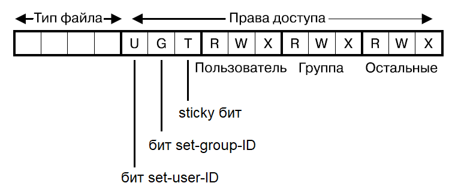

    *Тип файла* извлекается маской `S_IFMT` и сравнивается со значением константы, либо ко всей маске целиком применяется соответствующий макрос:

    | Константа | Макрос     | Тип файла             |
    | :-------- | :--------- | :-------------------- |
    | S_IFREG   | S_ISREG()  | Обычный файл          |
    | S_IFDIR   | S_ISDIR()  | Каталог               |
    | S_IFLNK   | S_ISLNK()  | Символическая ссылка  |
    | S_IFCHR   | S_ISCHR()  | Символьное устройство |
    | S_IFBLK   | S_ISBLK()  | Блочное устройство    |
    | S_IFIFO   | S_ISFIFO() | FIFO или pipe         |
    | S_IFSOCK  | S_ISSOCK() | Сокет                 |

    *Права доступа* извлекаются следующими масками:

    | Маска   | Значение | Право доступа            |
    | :------ | :------- | :----------------------- |
    | S_ISUID | 04000    | Set-user-ID бит          |
    | S_ISGID | 02000    | Set-group-ID бит         |
    | S_ISVTX | 01000    | Sticky бит (saved text)  |
    | S_IRUSR | 0400     | Пользователь: чтение     |
    | S_IWUSR | 0200     | Пользователь: запись     |
    | S_IXUSR | 0100     | Пользователь: выполнение |
    | S_IRWXU | 0700     | Пользователь: всё        |
    | S_IRGRP | 040      | Группа: чтение           |
    | S_IWGRP | 020      | Группа: запись           |
    | S_IXGRP | 010      | Группа: выполнение       |
    | S_IRWXG | 070      | Группа: всё              |
    | S_IROTH | 04       | Остальные: чтение        |
    | S_IWOTH | 02       | Остальные: запись        |
    | S_IXOTH | 01       | Остальные: выполнение    |
    | S_IRWXO | 07       | Остальные: всё           |

+ `st_nlink` - количество **жестких ссылок** на файл в данной файловой системе;
+ `st_uid` - UID, владелец файла;
+ `st_gid` - GID, группа файла
+ `st_size` - размер файла в байтах;
+ `st_blocks` - реальный размер файла в блоках по 512 байт; может отличаться от значения `st_size`, если файл содержит *дыры*;
+ `st_blksize` - оптимальный размер блока для операций ввода-вывода в данной файловой системе;
+ `st_atime` - время последнего доступа к файлу;
+ `st_mtime` - время последнего изменения данных файла;
+ `st_ctime` - время последнего изменения атрибутов индексного дескриптора файла.

### 5.4.5. Флаги индексного дескриптора

Флаги индексного дескриптора, впервые появившиеся в файловой системе ext2 как дополнительные, но впоследствии ставшие стандартными для Unix-систем.

В коде программы устанавливаются вызовом `ioctl(FS_IOC_SETFLAGS)`, а извлекаются - `ioctl(FS_IOC_GETFLAGS)`. В оболочке устанавливаются командой `chattr` с соответствующим аргументом, а извлекаются - `lsattr`.

Флаги, установленные *для каталога*, наследуются создаваемыми в нем файлами и подкаталогами. Устанавливать и изменять флаги может владелец или привилегированный процесс.

Возможные флаги:

+ `FS_APPEND_FL`, `-a` - файл открывается для записи только с параметром `O_APPEND`;
+ `FS_COMPR_FL`, `-c` - сжимать файл на диске;
+ `FS_DIRSYNC_FL`, `-D` - делает операции обновления каталога синхронными;
+ `FS_SYNC_FL`, `-S` - делает операции обновления файла синхронными;
+ `FS_IMMUTABLE_FL`, `-i` - запретить изменение содержимого файла и метаданных его индексного дескриптора;
+ `FS_JOURNAL_DATA_FL`, `-j` - включить журналирование изменений файла; поддерживает режимы: journal, ordered, writeback;
+ `FS_NOATIME_FL`, `-A` - отключить обновление метки времени последнего доступа к файлу;
+ `FS_NODUMP_FL`, `-d` - не включать файл в резервные копии, создаваемые командой `dump`;
+ `FS_SECRM_FL`, `-s` - удалить файл БЕЗ возможности его восстановления на диске;
+ `FS_UNRM_FL`, `-u` - удалить файл С возможностью его восстановления на диске.

### 5.4.6. Файл дампа ядра

**Файл дампа ядра** - это файл со слепком виртуальной памяти процесса в момент его завершения (очевидно, что он содержит огромные *файловые дыры*), который затем может быть проанализирован в отладчике.

Шаблон для имени любого дампа описывается в файле `/proc/sys/kernel/core_pattern`, может содержать спецификаторы формата (`%p`, `%u` и т.д.) и представляет из себя относительное (разрешается в рабочем каталоге процесса) или абсолютное путевое имя. Ограничение на длину - 128 символов. Если шаблон начинается с символа *конвеера* `|`, то он интерпретируется как команда, которая будет запускаться при завершении процесса и принимать его дамп в *стандартный ввод*.

Файлы дампа НЕ могут быть созданы, если:

+ используемый для дампа каталог не существует, или у процесса нет в нём права на запись;
+ файл с таким именем существует, но он недоступен для записи, не является обычным файлом, на него есть несколько *жестких ссылок*;
+ достигнуто ограничение на размер дампа `RLIMIT_CORE` и размер создаваемого файла `RLIMIT_FSIZE`;
+ бинарный испольняемый файл программы недоступен для чтения;
+ файловая система, содержащая используемый для дампа каталог, смонтирована только для чтения, или в ней закончилось место;
+ программа с *set-UID* или *set-GID* битами выполняется не владельцем или группой файла. Операция `prctl(PB_SET_DUMPABLE)` или файл `/proc/sys/fs/suid_dumpable` позволяют обходить это ограничение!

Файл `/proc/PID/coredump_filter` позволяет указывать для каждого процесса, какие конкретные типы отображений памяти могут записываться в файл дампа.

## 5.5. Каталоги

**Каталог** является одним из типов файлов в UNIX-системах, поэтому для работы с ним может использоваться большое число вызовов, принимающих в качестве аргумента файловый дескриптор или путевое имя.

Однако каталоги имеют ряд особенностей:

+ имеют свой отдельный тип файла, записанный в индексном дескрипторе;
+ имеют особую структуру содержимого: содержат таблицу, записи которой представляют собой пары из *символьного имени файла* и соответствующего ему *номера индексного дескриптора* - **жесткие ссылки**;
+ каталог может быть открыт через `open()` (например, для установки владельца или прав доступа через его файлового дескриптора), однако читать и изменять его содержимое можно только с помощью специальных вызовов, а не унифицированного интерфейса ввода-вывода.

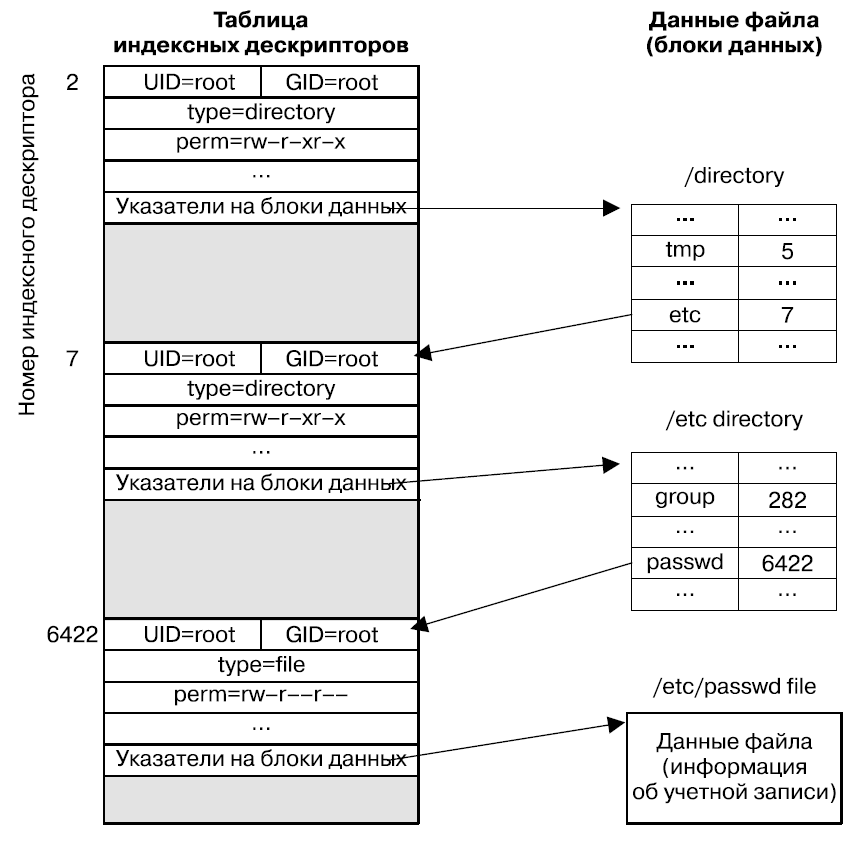

*Корню единого дерева каталогов* Linux всегда соответствует индексный дескриптор под номером `2`.

Каждый процесс имеет 2 атрибута, которые он *наследует* от родительского процесса:

+ **корневой каталог**, относительно которого интерпретируются *абсолютные путевые имена*; по умолчанию совпадает с *корнем единого дерева каталогов*;
+ **рабочий каталог**, относительно которого интерпретируются *относительные путевые имена*.

Только что созданный каталог содержит 2 записи:

+ `.` - ссылка на данный каталог;
+ `..` - ссылка на родительский каталог;

---

```C
int mkdir(const char *pathname, mode_t mode);
```

Создает новый каталог с правами доступа, определенными аргументом типа `mode_t` (принимает константы, список которых приводится в описании вызова `stat()`). Создание НЕ является рекурсивным: все промежуточные каталоги, содержащиеся в путевом имени, должны существовать к моменту вызова.

Аргумент `mode` имеет ряд особенностей, касающихся битов доступа:

+ установленный бит *set-user-ID* игнорируется, т.к. он не используется для каталогов;
+ установленный *sticky-бит* обрабатывается верным образом;
+ установленный бит *set-group-ID* игнорируется и его значение заимствуется из родительского каталога.

---

```C
int rmdir(const char *pathname);
```

Удаляет каталог, если он *пустой*. Если `pathname` является символической ссылкой, то она НЕ будет разыменована.

---

```C
int remove(const char *pathname);
```

Библиотечная функция удаляющая файл или *пустой* каталог. Внутри себя вызывает `unlink()` либо `rmdir()`. Если `pathname` является символической ссылкой, то она НЕ будет разыменована.

---

```C
char *getcwd(char *cwdbuf, size_t size);
```

Извлекает текущий *рабочий каталог* процесса в заранее выделенный буфер `cwdbuf`.

Аналогом данной функции является чтение цели символьной ссылки `/proc/PID/cwd` с помощью вызова `readlink()`.

---

```C
int chdir(const char *pathname);
int fchdir(int fd);
```

Изменяет текущий *рабочий каталог* процесса на переданный.
Если `pathname` является символьной ссылкой, то она будет разыменована. Аргумент `fd` должен быть файловым дескриптором каталога.

---

```C
int chroot(const char *pathname);
```

Изменяет *корневой каталог* процесса на переданный. Если `pathname` является символьной ссылкой, то она будет разыменована.

Также называется **заключением в клетку root**.

---

```C
char *realpath(
    const char *pathname,
    char *resolved_path);
```

Возвращает *каноническое абсолютное путевое имя* `resolved_path`, соответствующее переданному имени `pathname`: разрешает все символьные ссылки, а также ссылки `.` и `..`.

---

```C
char *dirname(char *pathname);
char *basename(char *pathname);
```

Возвращают для переданного путевого имени части c именем каталога и именем файла.

### 5.5.1. Библиотечные функции потоков каталогов

```C
DIR *opendir(const char *dirpath);
```

Открывает каталог, определенный своим путевым именем `dirpath`, и возвращает его описатель - *поток каталога*.

```C
DIR *fdopendir(int fd);
```

Открывает каталог, определенный своим файловым дескриптором `fd`, и возвращает его описатель - *поток каталога*. После успешного завершения вызова файловый дескриптор находится под управлением системы, и обращаться к нему иным образом нельзя!

```C
int dirfd(DIR *dirp);
```

Получает файловый дескриптор каталога по его потоку.

---

```C
struct dirent *readdir(DIR *dirp);

struct dirent
{
    ino_t d_ino;
    char d_name[];
};
```

Последовательно считывает записи из каталога, возвращая указатель на *статически* выделенную структуру. Если содержимое каталога поменяется во время последовательного сканирования, то функция НЕ заметит изменений!

Структура типа `dirent` содержит следующий набор полей:

+ `d_ino` - номер индексного дескриптора;
+ `d_name` - имя файла;

Дальнейшую информацию о расположенных в каталоге файлах можно узнать вызовом `stat()`.

Реентерабельный аналог - `readdir_r`.

---

```C
void rewinddir(DIR *dirp);
```

Перемещает поток каталога на первую запись.

---

```C
int closedir(DIR *dirp);
```

Закрывает поток, освобождая занимаемые им ресурсы.

### 5.5.2. Обход дерева каталогов: `nftw()`

```C
struct FTW {
    int base;
    int level;
}

typedef int(*NFTW_FUNC)(
    const char *pathname,
    const stat *statbuf,
    int typeflag,
    FTW *ftwbuf);

int nftw(
    const char *dirpath,
    NFTW_FUNC func,
    int nopenfd,
    int flags);
```

Выполняет обход дерева каталога `dirpath` и вызывает указанную функцию `func` для каждой записи в дереве. Обход выполняется в несортированном порядке, причем сначала обходится сам каталог, а затем его дочерние подкаталоги.

В аргументе `nopenfd` указывается максимальное количество файловых дескрипторов, которые могут быть оставлены открытыми - при превышении данного лимита неиспользуемые дескрипторы будут закрыты и при необходимости открыты вновь.

Аргумент `flags` является битовой маской, определяющей поведение функции:

+ `FTW_CHDIR` - выполнять `chdir()` в каждом каталоге перед началом обхода содержащихся в нем записей;
+ `FTW_DEPTH` - сначала выполнять заданную функцию `func` для содержимого каталога, а затем для него самого. Иначе `func` будет сначала выполняться для каталога, а только затем для располагающихся в нем записей;
+ `FTW_MOUNT` - при обходе не заходить внутрь других файловых систем: если подкаталог является *точкой монтирования*, то он не будет посещен;
+ `FTW_PHYS` - НЕ разыменовывать сиволически ссылки.

В аргументы функции-коллбека `func` системой передаются:

+ `pathname` - путевое имя текущей записи;
+ `statbuf` - метаинформация из индексного дескриптора текущей записи;
+ `typeflag` - поле справочных флагов, принимающее одно из следующих значений:
  + `FTW_D` - является каталогом;
  + `FTW_DNR` - каталог, содержимое которого не удалось прочитать;
  + `FTW_DP` - содержимое каталога уже было обработано ранее;
  + `FTW_F` - файл любога типа, кроме каталога и символической ссылки;
  + `FTW_NS` - вызов `stat()` завершился ошибкой;
  + `FTW_SL` - символическая ссылка (если был установлен флаг `FTW_PHYS`);
+ `ftwbuf` - глубина текущей записи относительно точки старта обхода.

### 5.5.3. Аналоги вызовов, принимающие файловый дескриптор каталога

Для ряда вызовов, работающих с файловой системой, существуют их аналоги, которые в дополнение к путевому имени первым аргументом также принимают файловый дескриптор каталога:

| Новый интерфейс | Традиционный аналог |
| :-------------- | :------------------ |
| faccessat()     | access()            |
| fchmodat()      | chmod()             |
| fchownat()      | chown()             |
| fstatat()       | stat()              |
| linkat()        | link()              |
| mkdirat()       | mkdir()             |
| mkfifoat()      | mkfifo()            |
| mknodat()       | mknod()             |
| openat()        | open()              |
| readlinkat()    | readlink()          |
| renameat()      | rename()            |
| symlinkat()     | symlink()           |
| unlinkat()      | unlink()            |
| utimensat()     | utimes()            |

Если в данный набор вызовов передаётся *относительный путь*, то он разрешается на основе указанного каталога, а не рабочего каталога процесса. Если при этом указанному дескриптору каталога присвоено значение `AT_FDCWD`, то путь всё-таки будет разрешен на основе рабочего каталога.

Если в данный набор вызовов передаётся *абсолютный путь*, то указанный дескриптор каталога игнорируется.

## 5.6. Ссылки

### 5.6.1. Жесткие ссылки

**Жесткая ссылка** - это запись в файле каталога, которая содержит некоторое *символьное имя* и связанный с ним *номер индексного дескриптора*. С несколькими символьными именами может быть связан единственный идексный дескриптор - на дескриптор могут указывать несколько *жестких ссылок*.  *Полное путевое имя* файла любого типа формируется последовательностью таких символьных имен, указывающих на индексные дескрипторы все более вложенных каталогов и в конечном счете завершающихся индексным дескриптором искомого файла.

*Жесткая ссылка* должна находить в **той же файловой системе**, что и файл, на который она указывет: номера индексных дескрипторов уникальны только в пределах одной файловой системы.

**Нельзя** создать жесткую ссылку **на каталог**. Причина - предотвращение создания циклических ссылок, когда некоторое имя в одном каталоге указывает на другой каталог, который в свою очередь содержит имя, указывающее на первый каталог. Однако для каталога **можно** создать **связанную точку монтирования**.

При удалении файла происходит стирание соответствующей записи в каталоге и уменьшение счетчика жестких ссылок в индексном дескрипторе. Реальное удаление файла, включающее освобождение индексного дескриптора и логических блоков, будет выполнено только в тот момент, когда значение счетчика ссылок опустится до 0. Также следует помнить, что если какие-либо процессы удерживают файл открытым, то он будет удален только после закрытия своего последнего файлового дескриптора.

В оболочке жесткие ссылки создаются командой `ln`.

---

```C
int link(
    const char *oldpath,
    const char *newpath);
```

Создает новую жесткую ссылку для указанного путевого имени. Если `newpath` уже занято, то вызов завершится с ошибкой. Если `oldpath` является символической ссылкой, то она НЕ будет разыменована.

---

```C
int unlink(const char *pathname);
```

Удаляет жесткую ссылку и, если она была последней, также удаляет файл. Если `pathname` является символической ссылкой, то она НЕ будет разыменована.

---

```C
int rename(
    const char *oldpath,
    const char *newpath);
```

Переименовывает файл (каталог), причем новое имя может находиться в другом каталоге той же файловой системы (можно переносить файлы).

Особенности данного вызова:

+ если `newpath` уже занято, то существующий файл перезаписывается;
+ если `oldpath` и `newpath` ссылаются на один и тот же файл, то никаких действий не производится;
+ если `oldpath` или `newpath` являются символическими ссылками, то они НЕ будут разыменованы;
+ если `oldpath` не являлся каталогом, то и `newpath` не может им быть;
+ если `oldpath` является каталогом, то `newpath` либо не должен еще существовать, либо должен быть пустым каталогом;
+ если `oldpath` является каталогом, то `newpath` НЕ может быть вложенным в него каталогом.

### 5.6.2. Символические (мягкие) ссылки

**Символическая (мягкая) ссылка** - это отдельный файл специального типа, содержащий ПУТЕВОЕ ИМЯ другого файла (*целевого объекта*), на который данная ссылка указывает.

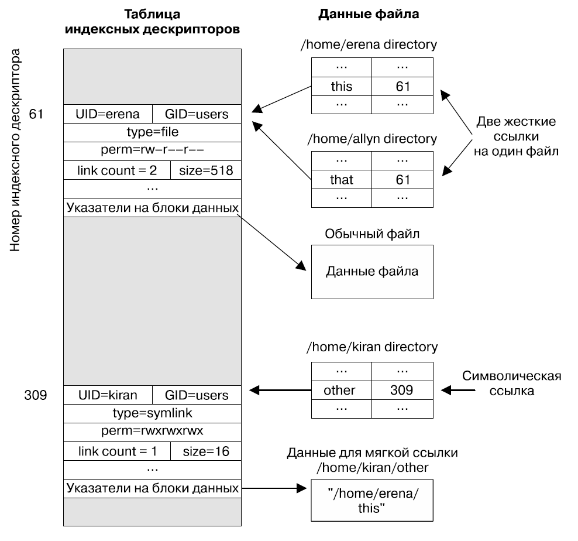

Путевое имя в теле ссылки может быть как абсолютным, так и относительным. Поскольку символическая ссылка содержит ПУТЕВОЕ ИМЯ, а НЕ номер индексного дескриптора в таблице, уникальной для каждой файловой системы, то символическая ссылка **может пересекать границы файловых систем**.

Символические ссылки всегда создаются с полными правами доступа для всех категорий. Принадлежность и права доступа исходного файла ссылки игнорируются *большинством* вызовов - вместо этого проверки выполняются для целевого файла. Принадлежность файла ссылки, например, может иметь значение в каталогах, для которых выставлен *sticky-бит*.

Символические ссылки на *промежуточные каталоги* в теле путевого имени зачастую *автоматически разыменовываются* системными вызовами. Факт разрешения *конечного файла ссылки* определяется логикой системного вызова. При этом общее количество разыменований ссылок в путевом имени и глубина разыменования конкретной символической ссылки ограничены в системе единым параметром: `POSIX_SYMLOOP_MAX` = 8 по стандарту; `SYMLOOP_MAX` = 40 в реальности.

В оболочке символические ссылки создаются командой `ln -s`.

---

```C
int symlink(
    const char *filepath,
    const char *linkpath);
```

Создает символическую ссылку с именем `linkpath` для имени `filepath`. Если `linkpath` уже занято, то вызов завершается с ошибкой. `filepath` не обязано существовать на момент вызова, а также впоследствии оно может быть удалено.

---

```C
ssize_t readlink(
    const char *pathname,
    char *buffer,
    size_t bufsiz);
```

Извлекает в заранее выделенный буфер `buffer` путевое имя, содержащееся в символической ссылке `pathname`. В качестве значения аргумента `bufsiz` рекомендуется использовать `PATH_MAX`.

## 5.7. Расширенные атрибуты

**Расширенные атрибуты** - это дополнительные ассоциированные с индексным дескриптором метаданные, представляющие собой пары *имя-значение*. В основном используются для реализации списков контроля доступа (ACL) и возможностей (capabilities) файла.

Имена расширенных атрибутов имеют вид `namespace.name`:

+ `namespace` - служит для разбиения атрибутов на *классы*;
+ `name` - уникальным образом идентифицирует атрибут внутри класса.

Существуют следующие *классы атрибутов*:

+ `user` - могут управляться НЕпривилегированными пользовательскими процессами. Для извлечения атрибута требуется право на чтение, для установки - право на запись. Файловая система должна быть смонтирована с параметром `user_xattr`;
+ `trusted` - могут управляться привилегированными пользовательскими процессами (`CAP_SYS_ADMIN`);
+ `system` - используются ядром для привязки системных объектов к файлу (например, списков ACL);
+ `security` - используются модулями защиты операционной системы.

В пространствах `user` и `trusted` именами могут быть любые строки. В пространстве `system` - только имена, определенные ядром.

Расширенные атрибуты `user` могут быть назначены только *обыкновенным файлам и каталогам* - расширенные атрибуты НЕЛЬЗЯ применять к символической ссылке, файлам устройств, сокетам, FIFO. Непривилегированный пользователь может назначить атрибуты `user` каталогу с установленным sticky-битом, только если он является его владельцем.

Также на все расширенные атрибуты накладываются следующие ограничения:

+ длина имени ограничена 255 байт;
+ длина значения ограничена 64000 байт;
+ общее количество байт, отводимых на хранение всех расширенных атрибутов одного файла, ограничено собственным значением в каждой файловой системе (в ext - размер блока).

### 5.7.1. Манипулирование расширенными атрибутами

В оболочке расширенные атрибуты устанавливаются командой `setfattr`, а извлекаются - `getfattr`.

---

```C
int setxattr(
    const char *pathname,
    const char *name,
    const void *value,
    size_t size,
    int flags);

int lsetxattr(
    const char *pathname,
    const char *name,
    const void *value,
    size_t size,
    int flags);

int fsetxattr(
    int fd,
    const char *name,
    const void *value,
    size_t size,
    int flags);
```

Устанавливают имя и значение расширенного атрибута. Если `pathname` является символической ссылкой, то вызов `lsetxattr()` её НЕ разыменует. Аргумент `flags` принимает значения `XATTR_CREATE` и `XATTR_REPLACE`, смысл которых очевиден.

---

```C
ssize_t getxattr(
    const char *pathname,
    const char *name,
    void *value,
    size_t size);

ssize_t lgetxattr(
    const char *pathname,
    const char *name,
    void *value,
    size_t size);

ssize_t fgetxattr(
    int fd,
    const char *name,
    void *value,
    size_t size);
```

Извлекают значение указанного расширенного атрибута в предварительно выделенный буфер `value`. Для определения размера атрибута предварительно в `size` можно передать 0. Если `pathname` является символической ссылкой, то вызов `lgetxattr()` её НЕ разыменует.

---

```C
int removexattr(
    const char *pathname,
    const char *name);

int lremovexattr(
    const char *pathname,
    const char *name);

int fremovexattr(
    int fd,
    const char *name);
```

Удаляют указанный расширенный атрибут заданного файла, если он существует. Если `pathname` является символической ссылкой, то вызов `lremovexattr()` её НЕ разыменует.

---

```C
ssize_t listxattr(
    const char *pathname,
    char *list,
    size_t size);

ssize_t llistxattr(
    const char *pathname,
    char *list,
    size_t size);

ssize_t flistxattr(
    int fd,
    char *list,
    size_t size);
```

Извлекают список всех имен расширенных атрибутов (завершающихся нулевым байтом) заданного файла в предварительно выделенный буфер `list`. Если `pathname` является символической ссылкой, то вызов `llistxattr()` её НЕ разыменует.

Права на доступ к самому файлу не требуются - достаточно только прав на выполнение всех каталогов, составляющих путевое имя. Из списка будут исключены атрибуты, для доступа к которым у процесса нет прав (например, `trusted`).

## 5.8. Списки контроля доступа

**Списки контроля доступа (access control lists, ACL)** являются расширением традиционной системы прав UNIX-систем и позволяют настраивать доступ к объектам файловой системы более гибким образом. ACL могут быть созданы для обычных файлов и каталогов, при этом для каталога существует 2 различных типа списков: *access ACL* и *default ACL*.

Любой ACL-список представляет собой ряд записей, каждая из которых задаёт права доступа к файлу с точностью вплоть до отдельного пользователя или группы.

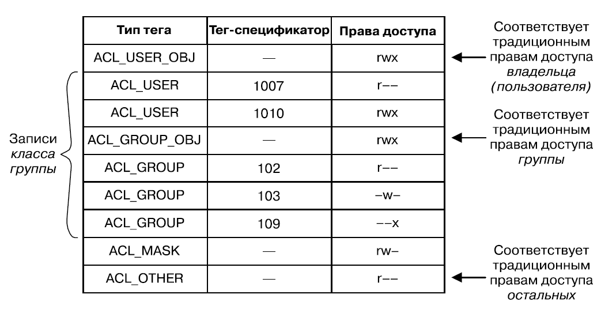

Запись включает в себя следующие компоненты:

+ *тип тега* - указывает категорию применения данной записи;
+ *тег-спецификатор* - при необходимости идентифицирует конкретного пользователя или группу;
+ *набор прав доступа* - определяют права доступа (чтение, запись, выполнение), установленные для данной записи.

*Тип тега* может принимать одно из следующих значений:

+ `ACL_USER_OBJ` - права владельца файла. Любой ACL-список содержит **ровно одну** такую запись;
+ `ACL_USER` - права пользователя c указанным UID;
+ `ACL_GROUP_OBJ` - права группы файла. Любой ACL-список содержит **ровно одну** такую запись;
+ `ACL_GROUP` - права группы с указанным GID;
+ `ACL_MASK` - маска с верхней границей права доступа, предоставленных записям *класса группы*: `ACL_USER`, `ACL_GROUP_OBJ`, `ACL_GROUP`. Любой ACL-список содержит **не более одной** такой записи. Если имеются записи, определяющие права для конкретных пользователей и групп, то её наличие становится обязательным.

    Причина существования маски - предоставить стандартную логику проверки прав для программ, не использующих интерфейс ACL-списков, без повреждения содержимого записей и с минимальными накладными расходами.

    При наличии маски в ACL-списке:

  + изменение *прав группы* вызовом `chmod()` будет применяться к правам доступа в записи маски (а НЕ `ACL_GROUP_OBJ`);
  + вызов `stat()` будет возвращать *права группы* из записи маски (а НЕ `ACL_GROUP_OBJ`);

+ `ACL_OTHER` - права остальных. Любой ACL-список содержит **ровно одну** такую запись.

В зависимости от своего содержимого списки *access ACL* делятся на:

+ *минимальный* - содержат только записи `ACL_USER_OBJ`, `ACL_GROUP_OBJ`, `ACL_OTHER`. Фактически реализованы как традиционные биты прав доступа внутри индексного дескриптора;
+ *расширенный* - включают маску и поля конкретных пользователей или групп. Реализуются как *расширенный атрибут* `system.posix_acl_access`. На них накладываются все ограничения расширенных атрибутов. Также время сканирование списка в поисках нужной записи **линейно пропорционально** его длине.

Для каталогов существует еще один тип списков - **default ACL**. Он реализуются как расширенный атрибут `system.posix_acl_default` и определяют содержимое ACL-списков файлов и подкаталогов, создаваемых в данном родительском каталоге.

Если каталог имеет *default ACL*:

+ создаваемый подкаталог наследует свой *default ACL* от родительского каталога;
+ создаваемый файл или подкаталог формируют свой *access ACL* на основе *default ACL* родительского каталога, накладывая на его записи `ACL_USER_OBJ`, `ACL_MASK` (в случае её отсутствия - на `ACL_GROUP_OBJ`) и `ACL_OTHER` аргумент режимов доступа `mode_t`, переданный в вызов `open()`.

При наличии *default ACL* маска процесса *umask* НЕ используется!

### 5.8.1. Порядок проверки прав доступа ACL

Проверка прав доступа к файлу (каталогу), для которого создан ACL-список, осуществляется в следующей очередности с остановкой в момент нахождения *первого соответствия идентификаторов*:

1. Если процесс привилегирован, то он имеет полный доступ;
2. Если действующий UID процесса совпадает с владельцем файла, то проверяются права записи `ACL_USER_OBJ`;
3. Если для действующего UID процесса существует запись `ACL_USER`, то проверяются её права с наложенной на них маской `ACL_MASK`;
4. Если действующий GID процесса или GID любой из его дополнительных групп совпадает с группой файла, то проверяются права записи `ACL_GROUP_OBJ` с наложенной на них маской `ACL_MASK`;
5. Если для действующего GID процесса или для GID любой из его дополнительных групп существует запись `ACL_GROUP`, то проверяются её права с наложенной на них маской `ACL_MASK`;
6. Иначе проверяются права записи `ACL_OTHER`.

ACL просто ищет на основе одного заданного идентификатора процесса первую подходящую запись. Если, допустим, полный набор предоставляемых прав разбит на части и рассредоточен по различным записям (например, основной группе процесса разрешено писать, а дополнительной - читать), то в случае запроса полного набора прав (например, основной группе требуется запись И чтение) ACL не будет собирать полное множество возможных прав на основе нескольких записей, а просто вернет ошибку превышения запрошенных прав над частично предоставленными одной найденной записью.

### 5.8.2. Манипулирование ACL-списками

В оболочке ACL-списки извлекаются командой `getfacl`, а устанавливаются - `setfacl`.

Записи представляются в формате:

`tag-type:[tag-qualifier]:permissions`

Например:

`u::rw,u:paulh:rw,g::r,g:teach:rw,m::rwx,o::-`

В коде программы для управления ACL-списками применяется соответствующий API, реализованный в библиотеке `libacl` и имеющий следующую схему использования:

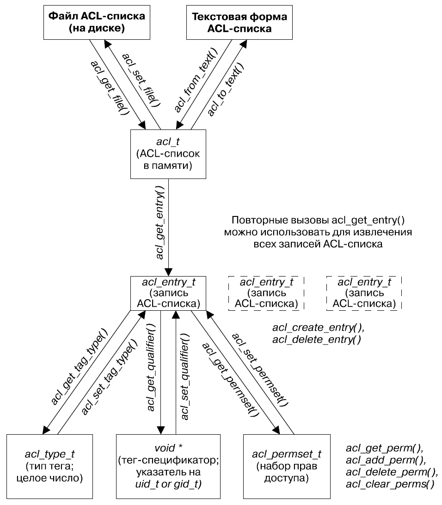

---

```C
acl_t acl_get_file(pathname, type);
```

Извлекает ACL-список из указанного файла на диске в память. Аргумент `type` принимает значения `ACL_TYPE_ACCESS` и `ACL_TYPE_DEFAULT`, смысл которых очевиден.

```C
int acl_set_file(pathname, type, acl);
```

Переносит заданный ACL-список из памяти в указанный файл на диске. Аргумент `type` принимает значения `ACL_TYPE_ACCESS` и `ACL_TYPE_DEFAULT`, смысл которых очевиден.

---

```C
int acl_get_entry(acl, entry_id, &entry);
```

Извлекает заданную *запись* из указанного ACL-списка, расположенного в памяти. Аргумент `entry_id` определяет извлекаемую запись и принимает значения `ACL_FIRST_ENTRY` и `ACL_NEXT_ENTRY`, смысл которых очевиден.

```C
int acl_create_entry(&acl, &entry)
```

Создает и возвращает пустую *запись* в указанном ACL-списке.

```C
int acl_delete_entry(acl, entry);
```

Удаляет указанную *запись* из ACL-списка.

---

```C
int acl_get_tag_type(entry, &tag_type);
int acl_set_tag_type(entry, tag_type);
```

Извлекает из указанной записи или устанавливает в ней значение поля *тип тега*.

```C
uid_t acl_get_qualifier(entry);
int acl_set_qualifier(entry, qualp);
```

Извлекает из указанной записи или устанавливает в ней значение поля *тега-спецификатора*. Тег-спецификатор действителен, только если он поддерживается типом тега данной записи.

```C
int acl_get_permset(entry, &permset);
int acl_set_permset(entry, permset);
```

Извлекает из указанной записи или устанавливает в ней значение поля *набора прав доступа*.

---

```C
int acl_get_perm(permset, perm);
int acl_add_perm(permset, perm);
int acl_delete_perm(permset, perm);
int acl_clear_perms(permset);
```

Проверяет наличие, устанавливает, удаляет *конкретное право доступа* в указанном наборе или полностью очищает набор. Аргумент `perm` принимает значения `ACL_READ`, `ACL_WRITE` или `ACL_EXECUTE`, смысл которых очевиден.

---

```C
char *acl_to_text(acl, &len);
acl_t acl_from_text(acl_string);
```

Преобразует расположенный в памяти ACL-список в строковое представление и обратно.

---

Другие функции помощники:

+ `acl_calc_mask()` - вычисляет маску `ACL_MASK` на основе всех записей *класса группы*;
+ `acl_valid()` - проверяет правильность ACL-списка;
+ `acl_delete_def_file()` - удаляет default ACL каталога;
+ `acl_init()` - создает пустой ACL-список;
+ `acl_dup()` - дублирует ACL-список;
+ `acl_free()` - очищает память, занимаемую передаваемой ей ACL-структурой.

## 5.9. Мониторинг событий файлов: inotify

Механизм **inotify** позволяет приложению получать уведомления от операционной системы о возникновении тех или иных событий над интересующими приложение *файлами и каталогами*.

Схема использования механизма **inotify**:

1. Вызываем `inotify_init()` и получаем файловый дескриптор *объекта inotify*, через который и будет осуществляться всё отслеживание;
2. Вызываем `inotify_add_watch()` для добавления интересующих сущностей файловой системы в *список наблюдения* объекта inotify. Элемент списка наблюдения содержит путевое имя сущности и битовую маску отслеживаемых для неё событий. Манипулирование созданным элементом списка осуществляется через возвращенный вызовом *дескриптор наблюдения*. Если сущность перестала нас интересовать, то она может быть удалена из списка вызовом `inotify_rm_watch()`;
3. Для начала отслеживания всех интересующих событий над объектом inotify выполняется операция *чтения*: либо через обыкновенный `read()`, либо с использованием *асинхронных* механизмов мультиплексирования ввода/вывода `select()/poll()/epoll()`;
4. При окончании работы *закрываем* файловый дескриптор объекта inotify - это освободит все системные ресурсы.

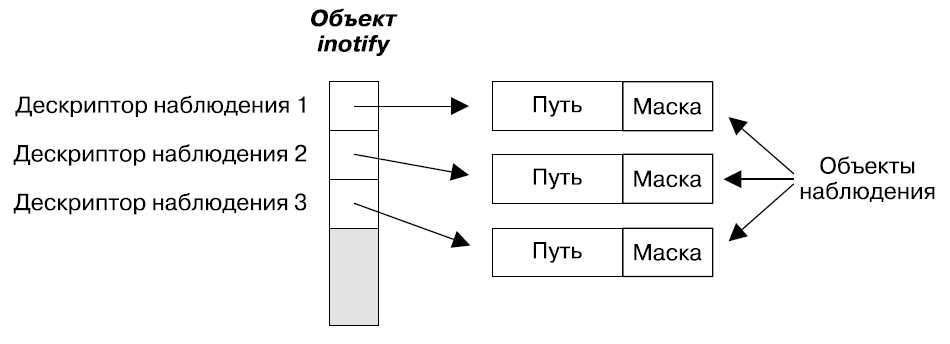

---

```C
int inotify_init(void);
```

Создает *объект inotify* и возвращает его файловый дескриптор.

---

```C
int inotify_add_watch(
    int fd,
    const char *pathname,
    uint32_t mask);
```

Добавляет новое путевое имя `pathname` в список наблюдения объекта inotify и задаёт для него битовую маску отслеживаемых событий `mask`. Вызов возвращает *дескриптор наблюдения*, соответствующий созданному элементу списка наблюдения. Если путевое имя УЖЕ находилось в списке наблюдения, то вызов ИЗМЕНЯЕТ маску событий СУЩЕСТВУЮЩЕГО элемента.

```C
int inotify_rm_watch(int fd, uint32_t wd);
```

Удаляет существующий элемент списка наблюдения указанного объекта inotify, заданный через его дескриптор наблюдения `wd`.

### 5.9.1. Флаги битовой маски событий

Флаги битовой маски, с которыми работает механизм inotify, подразделяются на передаваемые в вызов - *входные*, определяющие событие для отслеживания или особенности вызова - и/или возвращаемые из вызова - *выходные*, определяющие произошедшее событие.

| Флаги                                                   | Тип флага        | Описание                                                                                        |
| :------------------------------------------------------ | :--------------- | :---------------------------------------------------------------------------------------------- |
| `IN_ACCESS`                                             | входной/выходной | файл прочитан                                                                                   |
| `IN_ATTRIB`                                             | входной/выходной | метаданные изменены                                                                             |
| `IN_CLOSE_WRITE`, `IN_CLOSE_NOWRITE`                    | входной/выходной | файл открыт для записи, а затем закрыт                                                          |
| `IN_CREATE`, `IN_MODIFY`, `IN_DELETE`, `IN_DELETE_SELF` | входной/выходной | файл/каталог создан, изменен, удален                                                            |
| `IN_MOVE_SELF`, `IN_MOVED_FROM`, `IN_MOVED_TO`          | входной/выходной | файл/каталог перемещен                                                                          |
| `IN_OPEN`                                               | входной/выходной | файл открыт                                                                                     |
| `IN_ALL_EVENTS`, `IN_MOVE`, `IN_CLOSE`                  | входной          | сокращения, группирующие описанные выше события                                                 |
| `IN_DONT_FOLLOW`                                        | входной          | НЕ разыменовывать путевое имя `pathname`, если оно является символьной ссылкой                  |
| `IN_MASK_ADD`                                           | входной          | добавить переданные флаги в существующую маску                                                  |
| `IN_ONESHOT`                                            | входной          | продолжать отслеживание только до генерации первого уведомления - после прекратить отслеживание |
| `IN_ONLYDIR`                                            | входной          | путевое имя `pathname` должно являться каталогом - иначе генерировать ошибку                    |
| `IN_IGNORED`                                            | выходной         | элемент был удален из списка наблюдения                                                         |
| `IN_ISDIR`                                              | выходной         | дополнительно устанавливается, если возвращенное событие произошло для каталога                 |
| `IN_Q_OVERFLOW`                                         | выходной         | переполнение очереди событий                                                                    |
| `IN_UNMOUNT`                                            | выходной         | файловая система размонтирована                                                                 |

### 5.9.2. Чтение уведомлений о произошедших событиях

Чтение файлового дескриптора объекта inotify при возникновении событий возвращает буфер байтов, заполненный структурами `inotify_event`:

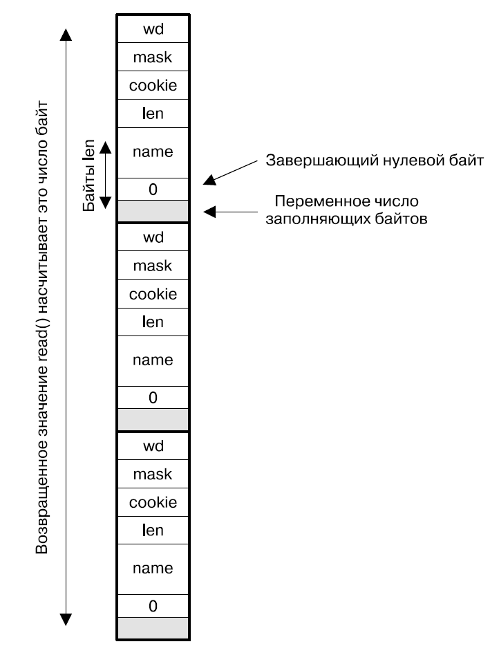

Структура `inotify_event` содержит следующие поля:

```C
struct inotify_event
{
    int wd;
    uint32_t mask;
    uint32_t cookie;
    uint32_t len;
    char name[];
};
```

+ `wd` - *дескриптор наблюдения*, для которого произошло событие;
+ `mask` - битовая маска флагов отслеживаемых событий, фактически произошедших для данного элемента списка наблюдения;
+ `cookie` - некоторый числовой идентификатор, значение которого совпадает для связанных между собой событий; например, перенос файла между каталогами генерирует два связанных события `IN_MOVED_FROM` и `IN_MOVED_TO`;
+ `name` и `len` - определяют путевое имя отслеживаемой сущности файловой системы, для которой произошло событие; путевое имя завершается *нулевым байтом* и размещается в буфере вслед за своей структурой; за именем может следовать переменное число байтов выравнивания (оно учтено в `len`).

Уведомления в возвращенном чтением из файлового дескриптора inotify буфере упорядочены в очередь - исходный **порядок событий сохраняется**! Однако **повторяющися события** (имеющие одинаковые значения полей `wd`, `mask`, `cookie` и `name`) при добавлении **в конец очереди** будут **объединяются** вместе - механизм inotify НЕЛЬЗЯ использовать для определения ТОЧНОГО КОЛИЧЕСТВА произошедших событий!

### 5.9.3. Системные ограничения на механизм inotify

Следующие позволяющие редактирование файлы, располагающиеся в каталоге `/proc/sys/fs/inotify`, определяют ограничения ресурсов, накладываемые системой на механизм inotify:

+ `max_user_instances` - максимальное количество объектов inotify, которое может создать *один* РЕАЛЬНЫЙ UID; по умолчанию `128`;
+ `max_user_watches` - максимальное *суммарное* количество элементов списков наблюдения, которое может создать *один* РЕАЛЬНЫЙ UID; по умолчанию `8192`;
+ `max_queued_events` - максимальное количество уведомлений, которое может быть помещено в очередь *одного* объекта inotify; по умолчанию `16384`.

# 6. Процессы

**Программа** - файл, содержащий следующую информацию о том, как при его выполнении конструировать *процесс*:

+ **идентификатор двоичного формата** - используется ядром для верной интерпретации содержимого файла программы. Linux применяет формат исполняемых и компонуемых файлов - **Executable and Linkable Format (ELF)**;
+ **машинный код** - алгоритм программы;
+ **данные** - числовые и сомвольные константы, указанные в программе при её компиляции;
+ **адрес входа в программу** - местоположение первой инструкции, с которой должно начаться выполнение программы;
+ **таблица имен и переадресации** - определяет имена и расположение функций и переменных в файле программы;
+ **информация о библиотеках и компоновщике** - набор полей, определяющий путевые имена используемых динамических библиотек и компоновщика.

**Процесс** - абстракция, являющаяся совокупностью всех ресурсов системы, выделенных ядром для выполнения данного экземпляра программы. Единственный файл программы служит для построения на его основе множества процессов. Физически *процесс* представляет собой некоторый объем оперативной памяти, содержащий в себе загруженные из файла программы машинные инструкции прикладного алгоритма и необходимые ему переменные (в *пользовательском пространстве памяти* процесса), а также инструкции кода ядра и служебные структуры данных (в *пространстве памяти ядра* процесса), управляющие функционированием данного процесса и его взаимодействием с системой и другими процессами. Инструкциям процесса (как прикладным, так и ядра) для их выполнения периодически выделяется доля времени центрального процессора. Системой накладываются ограничения на каждый тип ресурсов процесса, и она следит за соблюдением лимитов. При завершении процесса все занимаемые им ресурсы освобождаются и становятся доступными другим процессам.

Любой процесс обладает создавшим его **родительским процессом**. Корневым предком всех процессов системы является **процесс `init`**. Родителями процессов пользовательских программ являются процессы командных оболочек. Если процесс по некоторой причине **сиротеет** (его родитель полностью завершает своё выполнение), то его новым родителем напрямую становится процесс `init`.

## 6.1. Идентификаторы процесса

Каждый процесс обладает набором связанных с ним идентификаторов.

### 6.1.1. Cобственный идентификатор процесса - PID

**Process ID (PID)** - уникальный идентификатор, позволяющий однозначным образом отличить заданный процесс. Является целом положительном числом. Пользовательский процесс минимально может получить идентификатор с номером `300` - меньшие значения занимаются системными процессами. Максимально возможное значение PID в Linux определяется файлом `/proc/sys/kernel/pid_max` и на 64-х разрядной системе составляет $2^{22}$ (около 4 миллионов).

**Parent PID (PPID)** - PID родителя данного процесса.

Для процесса `init`, являющегося родителем всех процессов системы, `PID = 1`. Сам `init` не имеет родителя - его `PPID = 0`.

---

```C
pid_t getpid(void);
```

Возвращает PID процесса, выполнившего данный вызов.

---

```C
pid_t getppid(void);
```

Возвращает идентификатор родителя PPID процесса, выполнившего данный вызов.

### 6.1.2. Идентификаторы владельца процесса

Процесс хранит несколько идентификаторов, обозначающих, какому пользователю он принадлжеит:

+ **реальные (real) UID и GID** - идентификаторы пользователя и группы, которым *принадлежит процесс*. Процесс *наследует* данные идентификаторы от своего *родителя*. Процесс *оболочки входа* пользователя, являющийся родителем всех процессов прикладных программ, получает их из *файла паролей* `/etc/passwd`;
+ **действующие (effective) UID и GID** - идентификаторы пользователя и группы, реально используемые в *проверках разрешений* на доступ процесса к ресурсам ядра. Могут изменяться во время работы процесса;
+ **сохраненные (saved) set-UID и set-GID** - идентификаторы пользователя и группы процесса, содержащие значения *владельца и группы* исполняемого *файла программы*, для которого установлены **биты set-user-ID и set-group-ID**.

    Запуск файла программы с установленными *битами set-UID и set-GID* сопровождается следующей последовательностью действий:

    1. *реальные ID* процесса наследуются им от своего родителя;
    2. *действующими ID* процесса становятся владелец и группа файла;
    3. *сохраненным ID* присваиваются копии значений действующих ID.

    Далее во время работы процесс, выполняя соответствующие системные вызовы, может переключать значения своих действующих идентификаторов между реальными и сохраненными значениями.

    В терминале битовые флаги set-user-ID и set-group-ID файла программы могут быть установлены командами:

    ```bash
    chmod u+s program
    chmod g+s program
    ```

    Установленные флаги отображаются символом `S` в позициях *полномочия выполнения владельцем и группой* `-rwSrwSrwx`;
+ **идентификаторы файловой системы** - идентификаторы UID и GID, используемые при выполнении процессом *операций в файловой системе*. Существуют по историческим причинам и практически всегда *автоматически дублируют* значения *действующих идентификаторов*;
+ **дополнительные идентификаторы групп** - набор идентификаторов GID групп, в которых состоит процесс. Максимальное количество групп процесса определяется ограничением `_SC_NGROUPS_MAX`. Процесс *наследует* дополнительные групповые идентификаторы от своего *родителя*. Процесс *оболочки входа* пользователя, являющийся родителем всех процессов прикладных программ, получает их из *файла групп* `/etc/group`.

Управление идентификаторами процесса осуществляется через набор системных вызовов. При изменении идентификаторов необходимо *сначала* менять *групповые* ID, а только *затем пользовательские* ID: преждевременная смена пользователя может привести к утрате возможности установить желаемый групповой идентификатор. Привилегиями, позволяющими процессу *произвольно изменять* своего пользователя и группу, являются `CAP_SETUID` и `CAP_SETGID`.

Также все идентификаторы данного процесса могут быть просмотрены в предоставляемом ядром файле `/proc/PID/status`.

---

```C
uid_t getuid(void);
gid_t getgid(void);
```

Возвращают *реальный* идентификатор.

---

```C
uid_t geteuid(void);
gid_t getegid(void);
```

Возвращают *действующий* идентификатор.

---

```C
int getresuid(
    uid_t *ruid,
    uid_t *euid,
    uid_t *suid);

int getresgid(
    gid_t *rgid,
    gid_t *egid,
    gid_t *sgid);
```

Возвращают *реальный, действующий и сохраненный* идентификаторы.

---

```C
int setuid(uid_t uid);
int setgid(gid_t gid);
```

Изменяют идентификаторы процесса следующим образом:

+ если вызваны *обыкновенным процессом*, то изменяют только *действующий идентификатор*, причем значение аргумента должно совпадать с *реальным или сохраненным* ID;
+ если вызваны *привилегированным процессом*, то изменяют все идентификаторы - *реальный, действующий и сохраненный*; применяется для **окончательного сброса привилегий**.

---

```C
int seteuid(uid_t euid);
int setegid(gid_t egid);
```

Изменяют *действующий* идентификатор следующим образом:

+ если вызваны *обыкновенным процессом*, то значение аргумента должно совпадать с совпадать с *реальным или сохраненным* ID;
+ если вызваны *привилегированным процессом*, то аргумент может принимать любые значения; применяется для **временного сброса привилегий**, т.к. действующий ID по прежнему может быть восстановлен из реального или сохраненного.

---

```C
int setreuid(uid_t ruid, uid_t euid);
int setregid(gid_t rgid, gid_t egid);
```

Изменяют *реальный и действующий* идентификаторы следующим образом:

+ если вызваны *обыкновенным процессом*, то значение аргумента *нового реального* ID должно совпадать с *действующим* ID; значение аргумента *нового действующего* ID - c *реальным или сохраненным* ID;
+ если вызваны *привилегированным процессом*, то оба аргумента могут принимать любые значения;
+ также для *любого типа процесса* *сохраненному* ID присваивается значение *нового действующего* ID при выполнении любого условия:
  + аргумент *реального* ID не равен `-1`;
  + *новый действующий* ID отличается от *изначального реального ID*;

Если изменение какого-то идентификатора не требуется, то его аргументу присваивается значение `-1`.

---

```C
int setresuid(
    uid_t ruid,
    uid_t euid,
    uid_t suid);

int setresgid(
    gid_t rgid,
    gid_t egid,
    gid_t sgid);
```

Изменяют *реальный, действующий и сохраненный* идентификаторы следующим образом:

+ если вызваны *обыкновенным процессом*, то значением аргумента *любого нового* ID может являться *любой из текущих* ID - *реальный, действующий или сохраненный*;
+ если вызваны *привилегированным процессом*, то все аргументы могут принимать любые значения;

Если изменение какого-то идентификатора не требуется, то его аргументу присваивается значение `-1`.

---

```C
int setfsuid(uid_t fsuid);
int setfsgid(gid_t fsgid);
```

Изменяет идентификаторы *файловой системы* следующим образом:

+ если вызваны *обыкновенным процессом*, то значением аргумента может являться *любой из текущих* ID - *реальный, действующий или сохраненный*;
+ если вызваны *привилегированным процессом*, то аргумент может принимать любые значения;

---

```C
int getgroups(
    int gidsetsize,
    gid_t grouplist[]);
```

Возвращает в заранее выделенном аргументе `grouplist` список *дополнительных групповых* идентификаторов.

---

```C
int setgroups(
    size_t gidsetsize,
    const gid_t *grouplist);
```

Заменяет *дополнительные групповые* идентификаторы на переданный в `grouplist` набор.

---

```C
int initgroups(const char *user, gid_t group);
```

Заменяет *дополнительные групповые* идентификаторы, выполняя просмотр файла групп `/etc/group` для указанного в `user` имени пользователя и добавляя к прочитанному набору GID, переданный в аргументе `group`.

## 6.2. Модель памяти процесса

Пространоство адресов памяти, выделенной процессу, *логически* подразделяется на несколько отдельных *сегментов*:

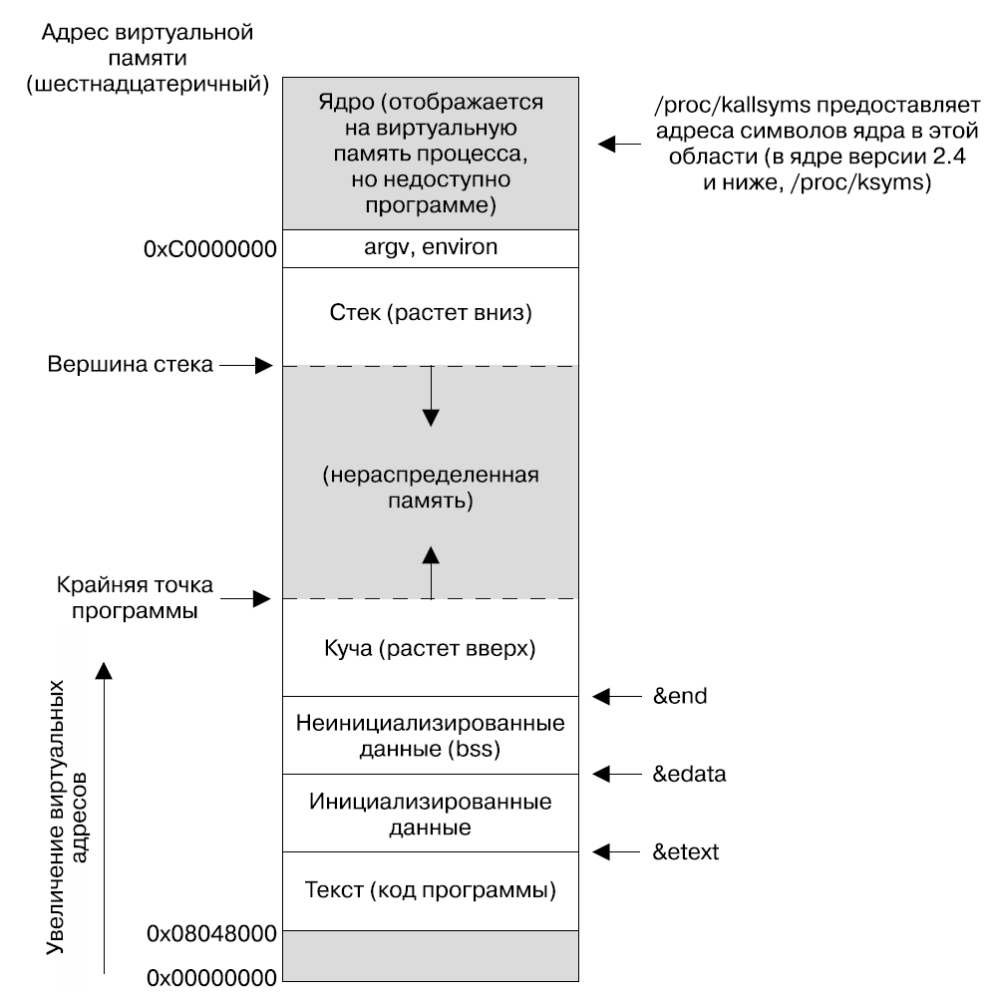

+ **текстовый сегмент** - машинные инструкции пользовательской программы; доступен *только для чтения*; создаётся с возможностью *совместного использования*, в результате единственный экземпляр кода программы с диска проецируется в память множества процессов;
+ **инициализированные данные** - глобальные и статические переменные, инициализированные в коде программы явным образом;
+ **неинициализированные данные** - глобальные и статические переменные *встроенных типов*, НЕ инициализированные явным образом; система автоматически заполняет данную область 0 при страте процесса;
+ **динамическая память (куча)** - область, из которой в ходе работы программы выделяется память под переменнные; верхнюю границу кучи называют *program break*;
+ **стек** - динамически увеличивающаяся и уменьшающаяся последовательность **стековых кадров (фреймов)**; каждой вызванной на данный момент *функции* соответствует собственный фрейм, содержащий её аргументы, локальные переменные, возвращаемое значение;
+ общая область для **аргументов командной строки** и **переменных окружения**.

Физически память, занимаемая инструкциями и переменными процесса, представляет собой набор блоков фиксированного размера - **страничных кадров (фреймов)**. Однако диапазон доступной процессу памяти НЕ образован реальными адресами оперативной памяти - в Linux используется **механизм управления виртуальной памятью**. Каждому процессу выделяется непрерывное, доступное только ему **виртуальное адресное пространство**, простирающееся от нулевого адреса до $2^{32}$ или $2^{64}$ (определяется разрядностью процессора и операционной системы). Выделение виртуальной памяти аналогично происходит фиксированными блоками, называемыми **страницами**. Во время своей работы процесс оперирует виртуальными адресами, однако в реальности каждая *виртуальная страница* представляется *физическим страничным кадром* - информация о соответствии хранится в  **таблице страниц процесса**, а самим отображением виртуальных адресов в реальные занимается специализированный блок центрального процессора *Paged Memory Management Unit (PMMU)*, содержащий кеш *Translation Lookaside Buffer (TLB)*, ускоряющий данную операцию.

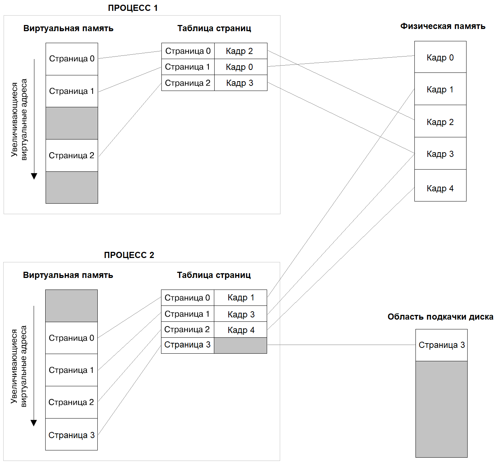

В любой момент в *страничных кадрах* НЕ требуется наличие ВСЕХ *виртуальных страниц* процесса - реально располагающийся в оперативной памяти набор называется **резидентным набором**. Неиспользуемые страницы при исчерпании всей физической памяти могут размещаться в зарезервированной области диска - **файле подкачки**. Применение данной техники возможно благодаря тому, что программам присуще *свойство локальности* - они демонстрируют тенденцию обращаться в ближайшем будущем к тем же либо близким адресам памяти, к которым было обращение в недавнем прошлом.

Применение операционной системой механизма виртуальной памяти предоставляет следующие преимущества:

+ *процессы изолированы* друг от друга и от ядра, поскольку через таблицу страниц имеют доступ только к собственным кадрам - это не позволяет им прочитать или испортить чужие данные;
+ при необходимости процессы могут *совместно использовать* одну и ту же *физическую память*: виртуальные страницы каждого будут отображаться на одни и те же физические кадры; наиболее характерные примеры - выполнение разными процессами кода одной программы, либо явное выделение *разделяемой памяти* (средство IPC);
+ возможна реализация гибких *схем защиты памяти*, позволяющих для каждой отдельной страницы указывать список действий, которые данный процес может совершать с данным блоком памяти;
+ используемое программой *виртуальное пространство* может существенно *превышать* доступный *физический объем* - страницы будут загружаться в память и выгружаться из неё по мере необходимости; например, программа СУБД может целиком отобразить файл базы в память - так поступает *MongoDB*.

### 6.2.1. Сегмент стека

В Linux на архитектуре процессоров x86 программный **стек** располагается в верхней части памяти и растет вниз. Динамическую вершину стека называют **указателем стека**. При вызове функции ей системой автоматически выделяется один **стековый кадр**, содержащий:

+ *аргументы функции*;
+ *локальные переменные*;
+ *возвращаемое значение*;
+ копии значений *регистров процессора*, которые должны быть восстановлены при возврате из функции.

После завершения функции её стековый кадр автоматически удаляется системой простым сдвигом указателя вершины стека.

В реальности любой процесс содержит 2 стека:

+ **пользовательский стек** - используется алгоритмом прикладной программы;
+ **стек ядра** - хранится в *пространстве памяти ядра* и выделяется каждому процессу для выполнения всех действий *системного вызова*.

#### 6.2.1.1. Нелокальный переход - longjmp()

Совершение *нелокального перехода* представляет собой возврат к выполнению заранее отмеченной инструкции, находящейся за пределами исполняемой в данный момент функции.

---

```C
int setjmp(jmp_buf env);
```

Устанавливает место в коде, к которому впоследствии можно совершить переход из выполняемой на тот момент функции, расположенной на вершине пользовательского стека. Совершение перехода через вызов `longjmp()` для процесса выглядит как повторное возвращение значения из `setjmp()`. Первичную установку цели перехода и его фактическое завершение можно различить по возвращаемому результату `setjump()`: оригинальный вызов завершается со значением `0`, фиктивный - с любым другим значением, указанным в соответствующем аргументе `longjmp()`.

Аргумент `env` является выходным параметром, в котором сохраняется копия состояния процесса на момент вызова. В частности, он содержит указатель вершины стека и значения других регистры процессора. Данная информация будет использована в `longjmp()` для возвращения процесса в требуемое состояние.

---

```C
void longjmp(jmp_buf env, int val);
```

Выполняет нелокальный переходит на инструкцию, отмеченную вызовом `setjmp()`. Результатом данного вызова является сброс состояния процесса до указанного в аргументе `env`. Перезапись указателя вершины стека, в частности, приводит к удалению всех стековых кадров, созданных позднее содержащего в себе цель перехода. Аргумент `val` определяет произвольное ненулевое значение, которое будет возвращено при повторном фиктивном завершении вызова `setjmp()`.

---

Обязательным требованием является возвращение выполнения из `longjmp()` в реально существующий на стеке фрейм - цель перехода должна содержаться в некоторой *внешней* по отношению к инициировавшей переход функции, не завершившей свое выполнение.

Вызов `setjmp()` может присутствовать только в следующих контекстах:

+ цельное управляющее выражение инструкции выбора или итерации (`if`, `switch`, `while` и т.д.);
+ операнд унарного отрицания `!` в составе цельного управляющего выражения инструкции выбора или итерации;
+ операнд операции сравнения (`==`, `<` и т.д.) при условии, что второй операнд является целочисленной константой, а сама операция является цельным управляющим выражением инструкции выбора или итерации;
+ отдельный вызов функции, не являющийся частью какого-либо выражения.

Из-за оптимизаций компилятора выполнение нелокального перехода может испортить реальные значения локальных переменных в функции, содержащей в себе цель перехода (например, вследствие изменения порядка следования инструкций). По этой причине такие локальные переменные в программах на языке С должны помечаться ключевым словом `volatile`, явно запрещающим их оптимизацию.

#### 6.2.1.2. Расширение стекового кадра - alloca()

```C
void *alloca(size_t size);
```

Выделяет на стеке объем памяти `size`, тем самым расширяя стековый кадр текущей выполняющейся функции. Выделенную таким образом память не надо явным образом освобождать (в отличие от `malloc()`), т.к. это происходит автоматически при сворачии стека после завершения функции. В случае *переполнения стека* последствия данного вызова непредсказуемы!

### 6.2.2. Сегмент кучи

Помимо создания автоматических переменных на стеке процессу доступно динамическое выделение памяти в **сегменте кучи**. Данная память существует независимо от порядка выполнения функций на стеке и требует явной очистки во избежание *утечек памяти*.

#### 6.2.2.1. Системный вызов brk()

Вершина кучи называется **крайней точкой программы (program break)**. Выделение и освобождение памяти в куче сводится к перемещению её вершины, результатом которого является изменение доступного процессу диапазона адресов. В течение работы программы вершине кучи запрещено оказываться ниже своего первоначального значения, определенного границей сегмента неинициализированнных данных - это привет к ошибке сегментации `SEGFAULT`.

---

```C
int brk(void *end_data_segment);
```

Устанавливает вершину кучи на заданный в аргументе `end_data_segment` адрес с округлением до границы страницы памяти.

---

```C
void *sbrk(intptr_t increment);
```

Изменяет значение адреса вершины кучи, добавляя или отнимая от него заданное аргументом `increment` смещение (определяется знаком указанного приращения).

#### 6.2.2.2. Интерфейс malloc()/free()

Для использования в прикладных программах предназначен библиотечный интерфейс `malloc()/free()`, в частности решающий проблему повторного использования расположенных в глубине кучи диапазонов адресов, освобождения которых не может быть произведено обыкновенным сдвигом вершины кучи. Данный интерфейс поддерживает внутри доступного куче пространства *логический двунаправленный список блоков памяти*. Блок состоит из тела (доступный пользовательской программе объем памяти), а также дополнительных полей размера и указателей на соседей. Блок может быть занятым (содержит данные, помещенные в него программой) либо свободным.

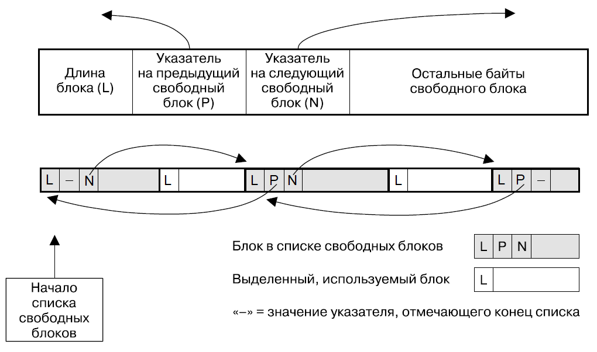

Выделение памяти осуществляется функцией `malloc()`, которая в первую очередь сканирует список свободных блоков:

+ может быть найден свободный блок в точности требуемого размера;
+ если все существующие блоки имеют избыточный размер, то один из них дробится с созданием нового блока требуемого разера;
+ если все существующие блоки имеют недостаточный размер (либо список вообще пуст), то происходит вызов `sbrk()`, который расширяет кучу на некоторый избыточный объем памяти, и в нем создается новый блок требуемого размера.

При создании блока в самом его начале размещается поле с размером, а пользовательской программе возвращается адрес расположенного далее первого байта тела запрошенного объема.

Освобождение памяти осуществляется функцией `free()`, которая добавляет указанный блок в список свободных, анализируя поле его размера и создавая в его теле указатели на соседние элементы списка. Если освобождаемый блок является граничным, то данная функция может удалить его из списка и выполнить вызов `sbrk()`, который сожмет кучу и вернет системе занимаемое свободными блоками место.

Интерфейс `malloc()/free()` требует аккуратного использования:

+ коду пользовательской программы запрещено обращаться к байтам вне выделенных ей блоков, поскольку их изменение может повредить служебные поля блоков;
+ запрещено высвобождение блока через `free()` *более одного раза*, поскольку в этом случае повреждается структура списка блоков;
+ запрещен вызов функции `free()`, аргумент которой не является адресом первого байта тела освобождаемого блока.

Данный интерфейс включает следующие функции.

---

```C
void *malloc(size_t size);
```

Выделяет в куче блок *неинициализированной* памяти заданного размера и возвращает указатель на первый байт его тела.

---

```C
void free(void *ptr);
```

Высвобождает блок памяти, на первый байт тела которого указывает аргумент `ptr`.

---

```C
void *calloc(size_t numitems, size_t size);
```

Выделяет блок памяти под массив длины `numitems`, содержащий элементы размера `size`. Выделяемая память инициализируется *нулевыми байтами*.

---

```C
void *realloc(void *ptr, size_t size);
```

Устанавливает новый размер `size` ранее выделенного блока памяти, определенного указателем `ptr`. Если происходит расширение блока, то он может быть целиком перемещен на новый адрес, либо новая память будет добавлена в конец существующего тела - значения новых байтов в любом случае *НЕ инициализируются*.

---

```C
void *memalign(
    size_t boundary,
    size_t size);

int posix_memalign(
    void **memptr,
    size_t alignment,
    size_t size);
```

Выделяют *выровненный неинициализированный* блок памяти заданного размера, начинающийся с адреса, *кратного* степени двойки.

---
Различные параметры работы интерфейса `malloc()/free()` могут быть просмотрены и изменены служебными функциями `mallopt()` и `mallinfo()`.

### 6.2.3. Аргументы командной строки и переменные окружения

*Аргументы командной строки* наряду с *переменными среды (окружения)* представляют собой средство передачи информации от родительского процесса его дочернему. И те, и другие размещаются в одной области над пользовательским стеком процесса. Максимально допустимый размер данной области определяется ограничением ресурса процесса `RLIMIT_STACK`.

**Аргументы командной строки** представляют из себя массив символьных строк параметров, переданных процессу при запуске его программы в *оболочке*. *Имя программы*, используемое для запуска программы (можно создать ссылки под различным названием на единственный файл программы), всегда является самым первым аргументом. В коде программы на языке С *аргументы командной строки* доступны через аргументы `argc` и `argv` функции `main()`. Также в Linux они могут быть прочитаны из предоставленного каждому процессу файла `/proc/PID/cmdline`.

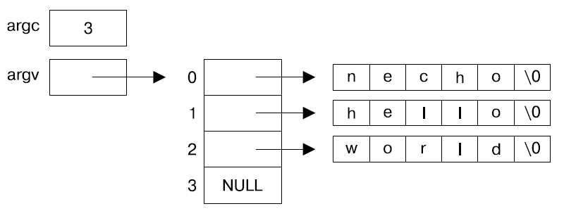

Список **переменных среды** - связанный с каждым процессом массив, содержащий строки параметров вида `имя=значение`. В момент создания процесс наследует КОПИЮ *окружения* от своей *оболочки*. Оболочка также предоставляет ряд команд для работы с окружением:

+ `export NAME=value` - *навсегда* добавить указанную переменную окружения к среде используемой оболочки; добавленное значение будет в составе среды наследоваться всеми процессами, запускаемыми из данной оболочки впоследствии;
+ `NAME=value program` - добавить указанную переменную окружения только к среде процесса, выполняющего заданную программу;
+ `unset` - удалить переменную окружения из среды оболочки;
+ `printenv` - вывести список переменных окружения в среде оболочки;
+ `env` - позволяет запускать процессы, манипулируя их окружением; поддерживает богатый функционал.

В коде программы на языке С *переменные окружения* доступны через глобальную переменную `environ`. Также в Linux они могут быть прочитаны из предоставленного каждому процессу файла `/proc/PID/environ`.

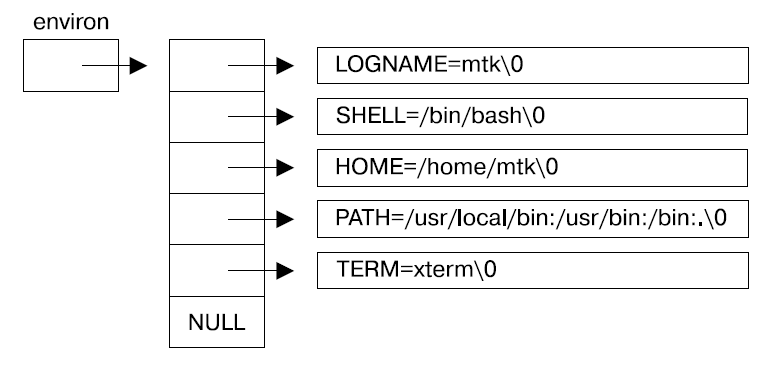

Существует удобный библиотечный интерфейс по работе с переменными окружения в коде программы.

---

```C
char *getenv(const char *name);
```

Возвращает значение переменной окружения по её имени. Полученную строку НЕЛЬЗЯ изменять и желательно скопировать в отдельный буфер.

---

```C
int putenv(char *str);
```

Добавляет к среде новую переменную окружения или изменяет значение существующей переменной. Строка с переменной не переносится в сегмент памяти, содержащий окружение - среда просто начинает указывать на переданную строку. По этой причине строка `str` не должна изменяться или завершать свой период жизни.

---

```C
int setenv(
    const char *name,
    const char *value,
    int overwrite);
```

Создает в сегменте памяти среды новую переменную окружения с заданным именем и значением. Если аргумент `overwrite` ненулевой, то переменная перезаписывается, если уже существует.

---

```C
int unsetenv(const char *name);
```

Удаляет из среды переменную окружения с заданным именем, очищая занимаемое ей место.

---

```C
int clearenv(void);
```

Обнуляет окружение, присваивая указателю `environ` значение `NULL`.

Поскольку физически не очищает место, занимаемое переменными, то приводит к *утечкам памяти* - альтернативой является явный вызов `unsetenv()` для каждой существующей переменной.

#### 6.2.3.1. Переменная окружения `PATH`

Переменная окружения `PATH` содержит список разделенных символом двоеточия `:` *имен каталогов* (префиксов путей), в которых должен осуществляться поиск исполняемых файлов программ. Путевые имена каталогов могут абсолютными или относительными. При входе в систему значение `PATH` настраивается общесистемными или пользовательскими скриптами, а затем наследуется запускаемыми процессами из *оболочки*.

> В качестве меры предосторожности для пользователя `root` текущий рабочий каталог (указывается символом `.`) обычно исключается из `PATH`, чтобы администратор не мог выполнить вредоносную подмененную утилиту с общепринятым названием из текущего каталога.

## 6.3. Жизненный цикл процесса

Основные элементы механизма создания процессов:

1. `fork()` - создаёт *дочерний* процесс как копию вызывающего *процесса-родителя*;
2. `exec()` - загружает в память *(дочернего)* процесса новую *программу* и начинает её выполнение;
3. `wait()` - приостанавливает *родительский* процесс, пока не будет завершен один из его *дочерних* процессов, и возвращает *код* его *завершения*.
4. `exit()` - завершает процесс, освобождая все занимаемые им ресурсы, и передаёт в систему указанный *код завершения*.

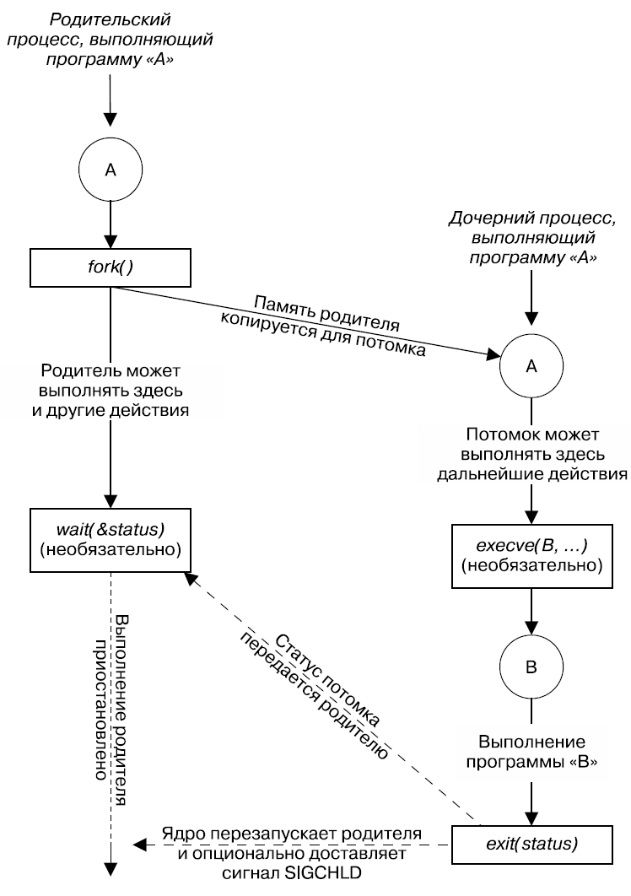

### 6.3.1. Влияние `fork()` и `exec()` на атрибуты процесса

| **Адресное пространство** | `exec()`                           | `fork()`    |
| :------------------------ | :--------------------------------- | :---------- |
| Текстовый сегмент         | DEL                                | SHARE       |
| Сегменты данных           | DEL                                | COPY        |
| Стек                      | DEL                                | COPY        |
| Куча                      | DEL                                | COPY        |
| Переменные окружения      | SAVE or set by `execle()/execve()` | COPY        |
| Отображение в память      | DEL                                | DEL or COPY |
| Блокировки памяти         | DEL                                | DEL         |

| **Идентификаторы и привилегии**   | `exec()`                        | `fork()` |
| :-------------------------------- | :------------------------------ | :------- |
| PID                               | SAVE                            | NEW      |
| PPID                              | SAVE                            | NEW      |
| Группа процесса PGID              | SAVE                            | COPY     |
| Сессия SID                        | SAVE                            | COPY     |
| Реальные UID/GID                  | SAVE                            | COPY     |
| Действующие и сохраненные UID/GID | loaded into *saved-set-UID/GID* | COPY     |
| Дополнительные GID                | SAVE                            | COPY     |

| **Файловый ввод/вывод** | `exec()`             | `fork()` |
| :---------------------- | :------------------- | :------- |
| Файловые дескрипторы    | SAVE or `FD_CLOEXEC` | COPY     |
| Флаг `FD_CLOEXEC`       | DEL                  | COPY     |
| Позиция в файле         | SAVE                 | SHARE    |
| Флаги открытия файла    | SAVE                 | SHARE    |
| Асинхронный ввод/вывод  | DEL                  | DEL      |
| Потоки каталогов        | DEL                  | COPY     |

| **Файловая система**     | `exec()` | `fork()` |
| :----------------------- | :------- | :------- |
| Текущий каталог          | SAVE     | COPY     |
| Корневой каталог         | SAVE     | COPY     |
| Маска прав файла `umask` | SAVE     | COPY     |

| **Сигналы**                         | `exec()`                                  | `fork()` |
| :---------------------------------- | :---------------------------------------- | :------- |
| Диспозиции сигналов                 | handlers set to `SIG_DFL`, otherwise SAVE | COPY     |
| Сигнальная маска `sigprocmask()`    | SAVE                                      | COPY     |
| Ожидающие сигналы `sigpending`      | SAVE                                      | DEL      |
| Альтернативный стек `signalstack()` | DEL                                       | COPY     |

| **Таймеры**                       | `exec()`              | `fork()` |
| :-------------------------------- | :-------------------- | :------- |
| Сигнальные `setitimer()`          | SAVE                  | DEL      |
| Сигнальный POSIX `timer_create()` | DEL                   | DEL      |
| `timerfd_create()`                | SAVE or `TFD_CLOEXEC` | COPY     |

| **POSIX-потоки**               | `exec()` | `fork()`                |
| :----------------------------- | :------- | :---------------------- |
| Потоки                         | DEL      | COPY only caller thread |
| Отменяемость потока            | DEL      | COPY                    |
| Мьютексы и условные переменные | DEL      | COPY                    |

| **Приоритет и планирование процесса** | `exec()` | `fork()` |
| :------------------------------------ | :------- | :------- |
| Значение `nice`                       | SAVE     | COPY     |
| Политика планирования                 | SAVE     | COPY     |

| **Ресурсы процесса**                          | `exec()` | `fork()` |
| :-------------------------------------------- | :------- | :------- |
| Ограничения ресурсов `setrlimit()`            | SAVE     | COPY     |
| Статистика процессорного времени `times()`    | SAVE     | DEL      |
| Статистика потребления ресурсов `getrusage()` | SAVE     | DEL      |

| **IPC**                             | `exec()`             | `fork()`                               |
| :---------------------------------- | :------------------- | :------------------------------------- |
| Разделяемая память System V         | DEL                  | COPY                                   |
| Разделяемая память POSIX            | DEL                  | COPY                                   |
| Очереди сообщений POSIX             | DEL                  | COPY                                   |
| Именованные семафоры POSIX          | DEL                  | SHARE                                  |
| Неименованные семафоры POSIX        | DEL                  | SHARE if shared memory, otherwise COPY |
| Семафоры System V                   | SAVE                 | DEL                                    |
| Блокировки файлов                   | SAVE                 | COPY                                   |
| Блокировки записей `fcntl(F_SETLK)` | SAVE or `FD_CLOEXEC` | DEL                                    |

| **Разное**                       | `exec()` | `fork()` |
| :------------------------------- | :------- | :------- |
| Локализация                      | DEL      | COPY     |
| Управляющий терминал             | SAVE     | COPY     |
| Обработчики `atexit()/on_exit()` | DEL      | COPY     |
| Настройки плавающей запятой      | DEL      | COPY     |

| **Характерное для Linux**            | `exec()`                                     | `fork()` |
| :----------------------------------- | :------------------------------------------- | :------- |
| File system UID/GID                  | set from *effective UID/GID*                 | COPY     |
| `coredump_filter`                    | SAVE                                         | COPY     |
| `SCHED_RESET_ON_FORK`                | SAVE                                         | DEL      |
| `PR_SET_DUMPABLE`                    | DEL if bits *set-UID/set-GID*, otherwise SET | COPY     |
| `PR_SET_PDEATHSIG`                   | SAVE                                         | DEL      |
| `PR_SET_NAME`                        | DEL                                          | SAVE     |
| Возможности (Capabilities)           | `capset()`                                   | SAVE     |
| Привязки для возможностей            | SAVE                                         | SAVE     |
| Securebits для возможностей          | SAVE, `SECBIT_KEEP_CAPS` DEL                 | SAVE     |
| Аренда файлов `F_SETLEASE`           | SAVE                                         | SAVE     |
| Уведомления о каталоге `dnotify`     | SAVE                                         | DEL      |
| Привязка к ЦПУ `sched_setaffinity()` | SAVE                                         | COPY     |
| Разрешенные ЦПУ `cpuset()`           | SAVE                                         | COPY     |
| Разрешенные узлы памяти `cpuset()`   | SAVE                                         | COPY     |
| Политика памяти `set_mempolicy()`    | SAVE                                         | COPY     |

### 6.3.2. Создание процесса: `fork()`

Создание *дочернего* процесса реализовано *раздвоением* родительского процесса с практически полным копированием его содержимого в наследника:

+ **пользовательская виртуальная память**: текст, данные, куча, стек;
+ открытые **файловые дескрипторы**;
+ **рабочий и корневой каталоги**;
+ **маска прав файлов** `umask`;
+ **диспозиции сигналов и сигнальная маска**;
+ идентификаторы процесса: все **идентификаторы владельца** (*real, effective, saved-set, file system*), **группа процессов PGID**, **сессия SID**;
+ **терминал**;
+ **обработчики выхода** `exit()`;

После раздвоения оба процесса могут изменять свою память независимым образом. Чтобы избежать чрезмерных расходов ресурсов на полное физические копирование всей *виртуальной памяти*, ядро применяет оптимизации памяти:

+ *Текстовый сегмент* с кодом программы является доступным только для чтения и сформирован отображением *виртуальных страниц* каждого процесса на одни и те же физические страницы оперативной памяти;
+ Для *сегментов стека*, *кучи* и *данных* используется *копирование при записи*: новая физическая страница выделяется под виртуальную, только когда процесс пытается произвести в неё запись.

После порождения дочернего процесса невозможно сказать, кто первым будет запланирован на выполнение - родитель или потомок.

---

```C
pid_t fork();
```

Раздваивает *родительский* процесс, порождая как копию *дочерний*, который продолжает своё выполнение с места вызова. В *родительский* процесс позвращается **PID потомка**, в *дочерний* процесс возвращается 0.

---

```C
pid_t vfork();
```

Альтернатива вызову `fork()`, особенности реализации которой позволяют эффективно порождать те дочерние процессы, которые сразу же делают вызов `exec()`, загружая для выполнения новую программу:

+ *дочерний* процессы **разделяет виртуальную память** родителя, пока не вызовет `exec()` или `_exit()`;
+ *родитель* приостанавливается, пока потомок не вызовет `exec()` или `_exit()`;

Данный вызов был нужен в раннем Unix, не применявшем описанные оптимизации памяти, и позволял потомку, сразу же вызывающему `exec()`, не выполнять ненужное копирование памяти родителя.

#### 6.3.2.1. Обработчики создания процесса

**Обработчики создания процесса** вызываются при выполнении вызова `fork()`.

Обработчики создания процесса **наследуются** в дочерние процессы в результате `fork()`, но **очищаются** вызовом `exec()`.

```C
typedef void(*prepare_func_t)();
typedef void(*parent_func_t)();
typedef void(*child_func_t)();

int pthread_atfork(
    prepare_func_t prepare_func,
    parent_func_t parent_func,
    child_func_t child_func);
```

Регистрирует обработчики создания процесса `fork()` при каждом использовании:

+ `prepare_func` - выполняются в *обратном порядке* перед созданием дочернего процесса;
+ `parent_func` - выполняются в *прямом порядке* перед возвращением из `fork()` в процессе-родителе;
+ `child_func` - выполняются в *прямом порядке* перед возвращением из `fork()` в процессе-потомке;

### 6.3.3. Гибкое создание процессов и потоков: `clone()`

`clone()` - уникальный для Linux системный вызов, позволяющий с большей точностью управлять инициализацией атрибутов создаваемого *дочернего процесса* и даже превращать его в *поток*.

`clone()` может являться фактической базой для вызова `fork()`, однако он не является переносимым, поэтому следует избегать его прямого использования в прикладных программах.

```C
typedef int(*child_func_t)(void*);

int clone(
    child_func_t func,
    void *child_stack,
    int flags,
    void *func_arg, ...
    /* pid_t *ptid, user_desc *tls, pid_t *ctid */);
```

Создаёт дочерний *процесс*, выполняющий функцию `func` на указанном *стеке* `child_stack` и *разделяющий* с родителем указанные во `flags` атрибуты процесса. Для всех неразделенных атрибутов потомку передаются его собственные отдельные копии.

Дочерняя функция `func` должна завершаться либо возвратом через `return`, либо вызовом `_exit()`.

Поскольку в адресном пространстве процесса *стек* обычно растёт сверху вниз, то `child_stack` должен указывать на конец (верхний адрес) выделенного непрерывного буфера.

Аргумент `flags` в *нижнем байте* хранит *сигнал*, отправляемый вызывающему родителю по завершении потомка (заполняется через побитовое ИЛИ `|` с константой сигнала). Если же потомок умирает по сигналу, то родителю отправляется `SIGCHLD`. Остальные байты представляют собой битовую маску, управляющую инициализацией атрибутов потомка:

+ `CLONE_VM` - потомок разделяет виртуальное адресное пространство родителя;
+ `CLONE_FILES` - потомок разделяет таблицу открытых *файловых дескрипторов* родителя;
+ `CLONE_SIGHAND` - потомок разделяет диспозиции сигналов родителя. *Сигнальная маска* `sigprocmask()` и *набор ожидающих сигналов* `sigpending` никогда не разделяются - потомок всегда получает собственные копии. Требует наличия флага `CLONE_VM`;
+ `CLONE_SYSVSEM` - потомок разделяет семафоры System V родителя;
+ `CLONE_FS` - потомок разделяет атрибуты файловой системы родителя: корневой и рабочий каталоги, маску прав создаваемых файлов `umask`;
+ `CLONE_NEWNS` - потомок получает *копию* родительского *пространства имен файловой системы* (иначе используется общее) - набора точек монитрования, обслуживаемого вызовами `mount()/umount()`. Оно определяет, каким образом путевые имена разрешаются в конкретные файлы, управляет сменой каталогов `chdir()/chroot()`. Флаг несовместим с флагом `CLONE_FS`;
+ `CLONE_IO/NEWIPC/NEWNET/NEWPID/NEWUSER/NEWUTS` - создают для потомка изолированные среды в указанных доменах. Данные флаги используются при реализации систем *контейнеризации* - легковесной разновидности *виртуализации*, которые позволяют создавать изолированные группы процессов, работающие поверх единственного ядра;
+ `CLONE_THREAD` - потомок будет создан в **группе потоков** родителя, иначе он будет помещен в свою отдельную группу. Требует наличия флага `CLONE_SIGHAND`.
+ `CLONE_PARENT` - родителем потомка станет родитель вызывающего процесса-родителя (в противном случае родителем стал бы сам вызывающий процесс). Родительский статус определяет адресата сигнала завершения потомка. После появления `CLONE_THREAD` необходимость в данном флаге пропала;
+ `CLONE_VFORK` - родитель приостанавливается, пока потомок не вызовет `exec()` или не завершится;
+ `CLONE_PARENT_SETTID/CHILD_SETTID/CHILD_CLEARTID` - определяют установку значений аргументов `ptid` и `ctid` ядром:

  + `CLONE_PARENT_SETTID` - записывает *TID* потомка в аргумент `ptid` до завершения вызова; запись происходит перед (возможным) дублированием памяти - в результате значение доступно и родителю, и потомку;
  + `CLONE_CHILD_SETTID` - записывает *TID* потомка в `ctid` до завершения вызова; запись происходит в памяти потомка (доступна родителю, если используется разделение общего просранства адресов);
  + `CLONE_CHILD_CLEARTID` - очищает значение `ctid` при завершении потомка; используется в библиотеках, реализующих многопоточность, для отслеживания возможности *присоединения* потока;

+ `CLONE_SETTLS` - аргумент `tls` указывает на структуру `user_desc`, описывающую буфер **локального хранилища** потомка;
+ `CLONE_PTRACE/CLONE_UNTRACED` - позволяет/запрещает трассировку потомка вызовом `ptrace()`;

---

> Созданию **процесса** через `fork()` соответствует `clone(SIGCHLD)`.
>
> Созданию **процесса** через `vfork()` соответствует `clone(SIGCHLD | CLONE_VM | CLONE_VFORK)`.
>
> Созданию **потока** соответствует `clone(CLONE_VM | CLONE_FILES | CLONE_FS | CLONE_SIGHAND | CLONE_THREAD | CLONE_SETTLS | CLONE_PARENT_SETTID | CLONE_CHILD_CLEARTID | CLONE_SYSVSEM)`.

### 6.3.4. Выполнение новой программы: `exec()`

```C
int execve(
    const char *pathname,
    char *const argv[],
    char *const envp[]);
```

Загружает в память процесса новую программу, заменяя *сегменты текста, данных, кучи, стека*, а также *параметры командной строки* `argv` и список *переменных окружения* `envp`. Путь `pathname` до программы может быть *абсолютным или относительным*. В случае успеха вызов никогда не вернет управление, т.к. сразу же начнется выполнение новой программы.

По закрепленному в стандарте POSIX соглашению на первом месте в списке аргументов `argv`, передаваемых ядром процессу в вызов `main(argc, argv)`, должно располагаться *имя выполняемой программы*. По этой причине в вызов `execve()` в качестве `argv[0]` всегда должна передаваться завершающая часть аргумента `pathname`, содержащая непосредственно имя исполняемого файла.

---

```C
int execle(const char *pathname, const char *arg, ...);
int execlp(const char *filename, const char *arg, ...);
int execvp(const char *filename, char *const argv[]);
int execl(const char *pathname, const char *arg, ...);
int execv(const char *pathname, char *const argv[]);
```

Набор интерфейсов над вызовом `execve`, отличающихся набором принимаемых параметров (определяются суффиксами):

+ `p - PATH` - для *программы* достаточно указать только имя исполняемого файла, поиск которого будет произведен в каталогах переменной окружения `PATH`. Если имя содержит *символ-разделитель* `/`, то оно интерпретируется как путевое, и поиск не выполняется. Если переменная `PATH` не определена, то используется список `.:/usr/bin:/bin`;
+ `l - list` - *параметры командной строки* передаются как произвольное число аргументов вызова и должны завершаться аргументом `(char*)NULL`;
+ `v - vector` - *параметры командной строки* передаются в виде массива строк;
+ `e - environment` - *переменные окружения* передаются в виде массива строк. В противном случае они берутся из глобальной переменной `environ` вызывающего процесса.

---

```C
int fexecve(
    int fd,
    char *const argv[],
    char *const envp[]);
```

Аналог `execve()`, позволяющий загрузить для выполнения программу по предварительно открытому *файловому дескриптору* `fd`.

Данный вызов полезен приложениям, которые перед выполнением файла хотят проверить контрольную сумму его содержимого: он не оставляет возможного окна для подмены файла между рассчетом его хэша и передачей его пути в вызов семейства `exec()`.

---

```C
int system(const char *command);
```

Создаёт дочерний процесс для выполнения в *командной оболочке* указанной команды `command` и ожидает его завершения.

Возвращаемые значения:

+ если `command = NULL`, то возвращает ненулевое значение, если оболочка доступна, или 0 в противном случае;
+ если нельзя создать дочерний процесс или получить его *код завершения*, то возвращает -1;
+ если оболочку невозможно завершить, то в формате вызова `wait()` возвращает аналог `_exit(127)`;
+ в случае успеха в формате вызова `wait()` возвращает код завершения дочерней оболочки: совпадает с кодом команды или равен $128+signum$, если *команда* завершилась по сигналу.

Программы, явно установившие диспозицию игнорирования `SIGCHLD` не должны применять `system()`, т.к. у него не будет возможности дождаться в `wait()` дочерний процесс оболочки.

> Программы с битами *set-UID/set-GID* не должны применять `system()` для выполнения команд, чтобы исключить появление брешей в безопасности: командная оболочка полагается на различные переменные среды, которые могут иметь скомпрометированное значение.

#### 6.3.4.1. Файловые дескрипторы и `exec()`

Открытые **дескрипторы файлов переживают** вызов `exec()` и остаются доступными в новой программе. Эта особенность активно используется командными оболочками для перенаправления ввода/вывода в конвейеры `|` и файлы:

+ родительская оболочка считывает команду запуску приложения с перенаправленным вводом/выводом;
+ создаёт через `fork()` дочерний процесс оболочки, наследующий *дескрипторы стандартного ввода/вывода*: `stdin, stdout, stderr`;
+ дочерняя оболочка открывает требуемый файл/пайп и получает его дескриптор;
+ с помощью вызова `dup2()` дублирует интересующий дескриптор в стандартный ввод/вывод и закрывает его;
+ вызывает `exec()` с файлом программы и запускает новый процесс, который уже работает с перенаправленными стандартными дескрипторами, не зная об этом.

Флаг дескриптора `fcntl(FD_CLOEXEC)` заставляет его автоматически закрываться при успешном выполнении процессом вызова `exec()` - при ошибке вызова дескриптор остаётся без изменений. При создании *дубликата* файлового дескриптора любым возможным способом данный флаг *в полученной копии* всегда *сбрасывается*.

#### 6.3.4.2. Сигналы и `exec()`

Т.к. при выполнении `exec()` текст текущей программы удаляется, то *диспозиция* всех *сигналов*, для которых были установлены обработчики сбрасывается на `SIG_DFL`. Диспозиции остальных сигналов (`SIG_DFL/SIG_IGN`) не изменяются.

*Установленная вручную* диспозиция игнорирования `SIGCHLD` после `exec()` в Linux **сохраняется**.

*Сигнальная маска* `sigprocmask()` и ожидающие сигналы `sigpending` после `exec()` **сохраняются**.

*Алтернативный сигнальный стек* `signalstack()` после `exec()` **удаляется**.

#### 6.3.4.3. Выполнение интерпретируемых скриптов через `exec()`

Чтобы текстовый *скрипт* могут быть исполнен как программа, требуется соблюдение следующих условий:

+ файл скрипта должен иметь *право на выполнение*;
+ в начале скрипта должна находиться специальная текстовая последовательность, называемая *shebang*, указывающая на требуемый интерпретатор: `#! <interpreter-path> [<args>]`.

Максимальная длина *shebang* - 128 символов. Переменная окружения `PATH` не используется при анализе пути до интерпретатора. Весь список аргументов вызова передаётся в интерпретатор одним словом, несмотря на разделяющие его пробелы.

Когда функция `exec()` обнаруживает в начале файла скрипта *shebang*, то она вызывает указанный интерпретатор, передавая ему опциональные аргументы интерпретатора и аргументы вызова самого скрипта.

Если *shebang* в начале файла отсутствует, и при этом скрипт передаётся в вызовы `execlp()/execvp()`, то они пытаются выполнить его в *командной оболочке* системы.

### 6.3.5. Ожидание дочернего процесса: `wait()`

Завершенный *дочерний* процесс становится **зомби**, и его *код завершения* должен быть явно прочитан *родителем*.

Если родитель устанавливает *запрет* на создание *зомби*, то он *теряет возможность ожидать* своих потомков.

---

```C
pid_t wait(int *status);
```

Ожидает завершения *любого* дочернего процесса и возвращает в аргументе `status` его *код завершения*:

+ блокирует выполнение вызывающего процесса-родителя, пока какой-либо потомок не завершится;
+ помещает код завершения потомка в `status`, если он не `NULL`;
+ ядро добавляет *процессорное время* и статистику ресурсов конкретного завершенного потомка к *общим затратам потомков* вызывающего процесса-родителя;
+ вызов возвращает идентификатор процесса-потомка `pid_t`.

При одновременно завершении нескольких потомков порядок, с которым они будут возвращаться родителю в вызове `wait()`, НЕ определен.

---

```C
pid_t waitpid(
    pid_t pid,
    int *status,
    int options);

pid_t wait3(
    int *status,
    int options,
    rusage *rusage);

pid_t wait4(
    pid_t pid,
    int *status,
    int options,
    rusage *rusage);
```

Ожидает *завершения/приостановки/возобновления* *указанного* в `pid` потомка и возвращает в аргументе `status` его код завершения.

Аргумент `pid` прнимает следующие значения:

+ `pid > 0` - ожидает потомка с заданным *PID*;
+ `pid = 0` - ожидает *любого* потомка из *группы процессов* вызывающего родителя;
+ `pid < -1` - ожидает *любого* потомка из указанной по модулю *группы процессов*;
+ `pid = -1` - ожидает *любого потомка*.

Аргумент `options` является битовой маской:

+ `WUNTRACED` - дополнительно позволяет узнавать о *приостановленных* потомках;
+ `WCONTINUED` - дополнительно позволяет узнавать о *возобновленных* потомках;
+ `WNOHANG` - провести мгновенный опрос и вернуть `0` вместо блокировки вызова, если потомок ещё не сменил своё состояние с момента прошлого опроса (данного конкретного состояния);

Также `options` поддерживает следующие флаги, позволяющие ожидать дочерние *процессы*, созданные вызовом `clone()`:

+ `__WCLONE` - заставляет ожидать только **клонированных** потомоков - *процессы*, которые при своём завершении отправляют отличный от `SIGCHLD` сигнал;
+ `__WALL` - заставляет ожидать любых потомков: *клонированных* и обычных;
+ `__WNOTHREAD` - заставлят ожидать только *своих собственных* потомков. По умолчанию ожидаются потомки любого процесса из одной с вызывающим *группы процессов*;

`wait3()/wait4()` - непереносимые аналоги вызова `waitpid()`, дополнительно возвращащие в аргументе `rusage` информацию об использовании потомком ресурсов системы: процессорного времени и памяти.

---

```C
int waitid(
    idtype_t idtype,
    id_t id,
    siginfo_t *infop,
    int options);
```

Ожидает *завершения/приостановки/возобновления* указанного в `id` потомка и возвращает информацию о нем в структуре `siginfo_t` аргумента `infop`.

Аргумент `idtype` определяет способ интерпретации аргумента `id`:

+ `P_ALL` - ждёт любого потомка, игнорирует аргумент `id`;
+ `P_PID` - ждёт конкретного потомка с указанным *PID*;
+ `P_PGID` - ждёт любого потомка из указанной *группы процессов*;

Аргумент `options` является битовой маской:

+ `WEXITED` - ждать *завершения* потомка (штатного или по сигналу);
+ `WSTOPPED` - ждать *приостановки* потомка;
+ `WCONTINUED` - ждать *возобновления* потомка;
+ `WNOHANG` - аналог данного флага из вызова `waitpid()`: вместо блокировки вызова произвести мгновенный опрос факта смены состояния потомком;
+ `WNOWAIT` - вернуть статус потомка, однако оставить его доступным для повторного извлечения в последующем вызове `waitid()`.

В структуре `siginfo_t` выходного параметра `infop` заполняются поля:

+ `si_code` - причина завершения: `CLD_EXITED` (завершен штатно), `CLD_KILLED` (завершен сигналом), `CLD_STOPPED` (приостановлен), `CLD_CONTINUED` (возобновлен);
+ `si_pid` - *PID* потомка;
+ `si_signo` - всегда `SIGCHLD`;
+ `si_status` - либо *код завершения* в `exit()`, либо номер соответствующего сигнала;
+ `si_uid` - реальный *UID* потомка.

#### 6.3.5.1. Статус завершения потомка

Значение аргумента `status`, возвращаемое вызовами `wait()/waitpid()`, позволяет различать причины завершения/остановки/возобновления дочернего процесса:

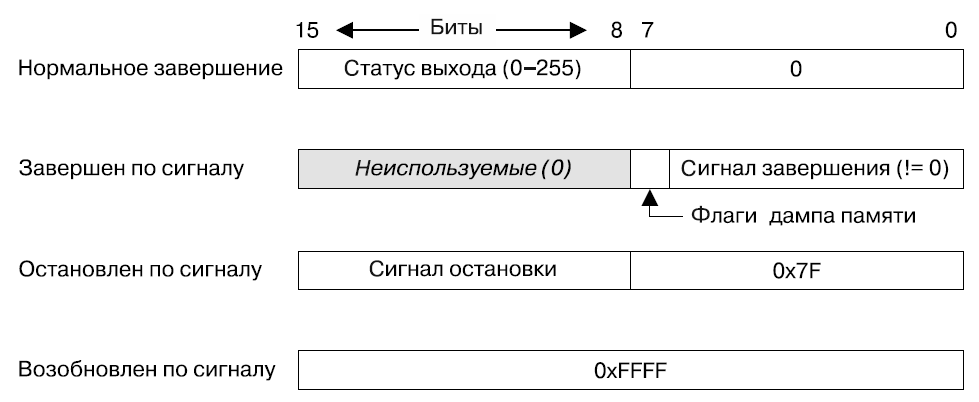

+ *нормальное завершение* - проверяется макросом `WIFEXITED()`; `WEXITSTATUS()` извлекает код, переданный потомком в `exit()` или возвращенный из `main()`;
+ *завершен сигналом* - проверяется макросом `WIFSIGNALED()`; `WTERMSIG()` извлекает номер сигнала, а `WCOREDUMP()` сообщает, создан ли *файл дампа ядра*;
+ *остановлен сигналом* - проверяется макросом `WIFSTOPPED()`; `WSTOPSIG()` извлекает номер сигнала;
+ *возобновлен сигналом* - проверяется макросом `IFCONTINUED()`.

### 6.3.6. Завершение процесса: `exit()`

При любом (штатном/аварийном) завершении процесса выполняются следующие действия:

+ закрываются открытые **дескрипторы файлов**;
+ снимаются удерживаемые **блокировки файлов** и **блокировки памяти**;
+ закрываются **именованные семафоры POSIX**;
+ закрываются **очереди сообщений POSIX**;
+ сбрасываются **отображения в память**;
+ если процесс является *контролирующим* в терминале, то всем процессам в *активной группе* отправляется сигнал `SIGHUP`, а *терминал* отключается от *сессии*;
+ если *группа процесса* становится *осиротевшей*, и в ней есть приостановленные процессы, то всем процессам группы отправляются сигналы `SIGHUP` и `SIGCONT`;

```C
void _exit(int status);
```

Выполняет штатное завершение процесса, передавая родителю *код завершения* `status` (используются *младшие 8 бит*). Для кода завершения определены константы `EXIT_SUCCESS=0` и `EXIT_FAILURE=1`.

```C
void exit(int status);
```

Обёртка над вызовом `_exit()`, выполняющая набор сервисных действий:

1. вызываются *обработчики выхода* `atexit()` и `on_exit()` в обратном относительно их регистрации порядке;
2. сбрасываются *буферы потоков вывода* `stdio`;
3. выполняется вызов `_exit()`.

#### 6.3.6.1. Обработчики выхода

**Обработчик выхода** - пользовательская функция, регистрируемая во время выполнения программы и вызываемая при *штатном* завершении процесса функцией `exit()` или возвратом `return` из `main()`.

Обработчики выхода вызываются в порядке, обратном регистрации. Если какой-либо из обработчиков не возвращает выполнение, то последующие обработчики не вызываются, а также не выполняются прочие действия `exit()` - сброс буферов потоков `stdio`.

В Linux вызов `exit()` *внутри* обработчика выхода *игнорируется*, однако по стандарту поведение программы в данном случае не определено, и в некоторых операционных системах может приводить к бесконечным рекурсивным вызовам обработчиков.

Максимальное количество *обработчиков выхода* ограничено `sysconf(_SC_ATEXIT_MAX)`.

Обработчики выхода **наследуются в дочерние процессы** в результате `fork()`, но **очищаются** вызовом `exec()`.

В *многопроцессных* приложениях, в которых потомки и родитель-мастер выполняют одинаковую программу, обычно только один процесс (зачастую, родитель) производит обработку выхода и очистку потоков через `exit()`, тогда как все остальные воркеры только возвращают свой статус в `_exit()`.

---

```C
typedef void(*exit_func_t)();

int atexit(exit_func_t func);
```

Добавляет указанную функцию `func` в список обработчиков выхода.

---

```C
typedef void(*exit_func_t)(int, void*);

int on_exit(exit_func_t func, void *arg);
```

Аналог функции `atexit()`, который позволяет указывать в качестве обработчика функцию с расширенной сигнатурой `func`, принимающую при своём вызове *код возврата* и произвольный аргумент `arg`.

Зарегистрированные вызовами `atexit()` и `on_exit()` обработчики *в один и тот же список*.

Вызов `on_exit()` не описан в стандарте и *не переносим*.

### 6.3.7. Сироты и зомби

+ **Процесс-сирота** - дочерний процесс, чей родитель завершился раньше. Для всех *осиротевших* процессов системы родителем становится процесс `init (PID = 1)`;

+ **Процесс-зомби** - дочерний процесс, завершившийся раньше, чем его родитель вызвал любую функцию ожидания статуса потомка из семейства `wait()`.

  Ядро освобождает все ресурсы *зомби*, оставляя только его запись в *таблице процессов* ядра - после вызова `wait()` родителем будет удалена и она. *Зомби* **нельзя убить** никаким сигналом - они могут накапливаться в системе и мешать созданию новых процессов.

  Если *зомби* становится *сиротой*, то его усыновляет процесс `init` и завершает вызовом `wait()`.

  *Зомби* не образуются, если родитель явно установил на это запрет: через диспозицию `SIG_IGN` или флаг обработчика `sigaction(SA_NOCLDWAIT)` для сигнала `SIGCHLD`.

## 6.4. Механизм управления заданиями командной оболочки

*Группы и сессии* - это абстракции, позволяющие реализовать в оболочке *механизм управления заданиями*:

1. когда *пользователь* входит в систему, то он получает *контролирующий терминал*, связанный с *оболочкой*, которая является лидером своей *сессии* и существует в своей отдельной *группе процессов*;

2. для любых запускаемых команд *оболочка* создаёт дочерние *процессы* и помещает их в отдельные *группы* в составе своей *сессии*. Если после команды располагается символ амперсанда `&`, то новая группа становится *фоновой*, а оболочка остаётся *активной*. Иначе всё происходит наоборот: группа дочернего процесса становится активной и читает ввод терминала, а оболочка отправляется в фон.

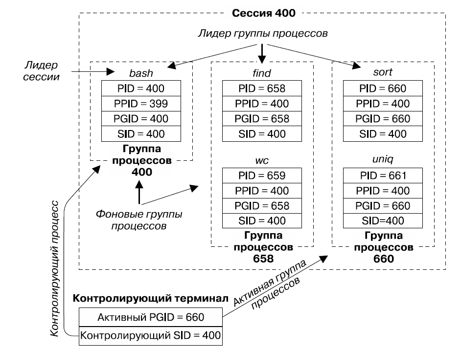

### 6.4.1. Группы процессов

**Группа процессов** - набор процессов, имеющих одинаковый идентификатор группы **Process Group ID (PGID)**.

Создавший группу процесс является её *лидером*, и для него *PID = PGID*. Дочерние процессы наследуют *группу* своего родителя. Время жизни *группы процессов* не ограничено временем жизни её *лидера*: группа свободно переживёт лидера и уничтожится, только когда её покинет последний участник (завершится или присоединиться к другой группе).

*Группа процессов* называется **осиротевшей**, если ни один из её членов не имеет *живого* родителя в *соседней группе данной сессии*.

*Группы-сироты*, *все* процессы которых выполняют работу, могут спокойно существовать в системе. Однако если после очередного выполнения некоторой операции ядро обнаруживает, что в системе образовалась *осиротевшая группу*, в которой содержится *минимум один приостановленный* процесс, то всем её членам будут отправлены сигналы `SIGHUP` и `SIGCONT` (их действие по умолчанию - разбудить и уничтожить).

Такое убийство **осиротевшей приостановленной группы** имеет логичное объяснение: процесс `init`, который становится родителем всех *сирот* в системе, только *дожидается* их завершения (чтобы в системе не плодились *зомби*), но НЕ умеет их *будить* - *приостановленный сирота* навсегда оказывается в *состоянии сна*.

Если группа процессов *приостановлена*, но у неё *существует родитель*, то она находится в зоне его ответственности: родитель сам в состоянии будить своих потомков сигналом `SIGCONT`.

Если группа *осиротела*, но в полном составе *продолжает выполнять работу*, то будить никого не требуется, и усыновляющий её `init` справляется с очисткой ресурсов, занимаемых группой, после её завершения.

Единственной проблемой является случай, если *работающая* осиротевшая группа решит заснуть, находясь под присмотром `init`. По этой причине ядро **блокирует** доставку **стоп-сигналов терминала** `SIGTSTP, SIGTTIN, SIGTTOU` в **осиротевшие группы**, если для них **НЕ установлены обработчики**. Исключением из этого правила является *неблокируемый* сигнал приостановки `SIGSTOP`, однако его использование по отношению к процессу, усыновленному `init`  - это осознанное решение администратора системы или программиста данного приложения.

---

```C
pid_t getpgrp();
```

Возвращает идентификатор группы *PGID* вызывающего процесса.

```C
int setpgid(pid_t pid, pid_t pgid);
```

Устанавливает идентификатор *PGID* процесса `pid` равным значению аргумента `pgid`: т.е. переносит указанный процесс в другую группу.

Если `pid = 0`, то под ним понимается вызывающий процесс. Если `pgid = 0`, то под ним понимается *PID* указанного процесса: т.е. создает для процесса новую группу, в которой он будет являться *лидером*.

Перемещение процесса между группами требует одновременного соблюдения следующих условий:

+ перемещён может быть только *вызывающий* процесс или его *дочерние*. Однако если дочерний уже сменил свою программу через `exec()`, то переместить его не удастся;
+ также перемещение должно происходить только в пределах *сессии*, и при этом перемещаемый не может быть *лидером сессии*.

### 6.4.2. Сессии

**Сессия** - набор *групп процессов*, имеющих одинаковый идентификатор сессии **Session ID (SID)**. Создавший сессию процесс является её *лидером*, и для него *PID = SID*. Дочерние процессы наследуют *сессию* своего родителя.

```C
pid_t getsid(pid_t pid);
```

Возвращает идентификатор сессии *SID* процесса `pid`. Если `pid = 0`, то под ним понимается вызывающий процесс.

```C
pid_t setsid();
```

Создаёт новую *сессию* (с созданием новой группы и установкой статуса лидера) для вызывающего процесса, если он НЕ является *лидером* своей *группы процессов*.

Созданная сессия НЕ будет иметь *контролирующий терминал*. Единственная получившаяся *группа процессов* созданной *сессии* по определению будет являться *осиротевшей*, т.к. родитель её перенесённого лидера остался внутри исходной сессии.

### 6.4.3. Контролирующие терминалы

Все процессы в сессии разделяют один и тот же **контролирующий терминал**, который у каждой сесии свой собственный. *Контролирующий терминал* устанавливается при первом открытии `open()` *терминального устройства* *лидером* сессии - он становится **контролирующим процессом** терминала. Любой процесс может получить доступ к текущему установленному для сессии *контролирующему терминалу*, открыв специальный файл `open("/dev/tty")`.

Контролирующий терминал **переживает** `exec()`, и **наследуется** в дочерний процесс при вызове `fork()`.

В любой момент времении только одна группа процессов сессии взаимодействует с *контролирующим терминалом* - является **активной**. *Сигнал*, сгенерированный в *терминале* (например, `SIGINT` или `SIGTSTP`), передаётся **всем** процессам активной группы.

Все прочие группы являются **фоновыми**. *Фоновые группы* НЕ могут *читать* с контролирующего терминала: при попытке они получают стоп-сигнал терминала `SIGTTIN` и приостанавливаются. *Фоновым группам* по умолчанию разрешено *писать* в контролирующий терминал, однако если для него был установлен флаг `TOSTOP`, то при попытке они получает стоп-сигнал терминала `SIGTTOU` и приостановятся.

При *утрате соединения* с контролирующим терминалом *лидеру* сессии отправляются сигналы `SIGHUP` и `SIGCONT`. Прочие процессы в активной и фоновых группах продолжают работать как ни в чем не бывало и узнают о потере терминала, только при попытке ввода/вывода в него.

Процесс может вручную отвязаться от *контролирующего терминала* вызовом `ioctl(TIOCNOTTY)`. если вызов производится *лидером сессии*, то от терминала отключается вся сессия, и сигналы `SIGHUP` и `SIGCONT` отправляются всей *активной группе*.
Если же вызов производится второстепенным процессом, то он отвязывает от терминала только себя (это никак не препятствует доставке ему сигнала разрыва соединения).

Если *лидер сессии завершается*, то установленный контролирующий терминал *отсоединяется* от *сессии*: в *активную группу* процессов отправляются сигналы `SIGHUP` и `SIGCONT`, а для *фоновых групп* выполняется описанная ранее проверка на появление среди них *осиротевших приостановленных*.

Особенности поведения сигналов терминала:

+ по соглашению если программа в момент запуска обнаруживает, что *сигнал терминала* `SIGHUP`, `SIGINT`, `SIGQUIT`, `SIGTTIN`, `SIGTTOU`, `SIGTSTP` игнорируется `SIG_IGN`, то ей не следует менять его диспозицию: *командные оболочки* таким образом сообщают процессу, что они не поддерживают механизм *управления заданиями*. Обрабатывать сигналы терминала в процессе имеет смысл только тогда, когда программа запускаются в оболочке, которая умеет отправлять подобные сигналы;
+ в рамках сессии `SIGCONT` отправляется *без проверки прав* - он может быть послан *из обычного* процесса *в привилегированный*;
+ `SIGTTIN` НЕ отправляется в процесс, если он *игнорируется* или *блокируется* им;
+ `SIGTTOU` НЕ отправляется в процесс даже при наличии флага терминала `TOSTOP`, если он *игнорируется* или *блокируется*;
+ определенные функции, манипулирующие терминалом, принудительно отправляют `SIGTTOU` в фоновый процесс, даже если у терминала НЕ было флага `TOSTOP`: это относится к вызовам `tcsetpgrp(), tcsetattr(), tcflush(), tcflow(), tcsendbreak(), tcdrain()`. Если `SIGTTOU` *блокируется* или *игнорируется*, то их вызов происходит успешно.
+ если для стоп-сигнала терминала `SIGTSTP` установлен обработчик, который должен выполнять некую прочую работу, но по-прежнему хочет приостанавливать процесс, то делать это необходимо следующим образом:

  + обработчик `SIGTSTP`, возможно, выполняет некую прочую работу;
  + затем необходимо произвести правильную приостановку процесса: обработчик сбрасывает диспозицию `SIGTSTP` по умолчанию `SIG_DFL`;
  + обработчик генерирует для себя новый `SIGTSTP`;
  + обработчик *разблокирует* `SIGTSTP` (если НЕ был установлен флаг `SA_NODEFER` вызова `sigaction()`) - в результате процесс приостанавливается *ожидающим* сгенерированным сигналом;
  + затем в какой-то момент времени в процесс поступает пробуждающий его `SIGCONT` (который также удаляет все дополнительные *ожидающие* `SIGTSTP`, если они успели прийти за это время);
  + обработчик сразу же *блокирует* `SIGTSTP`, чтобы застраховать себя от рекурсивных вызовов при возможном поступлении новых сигналов `SIGTSTP`. Блокировка гарантированно устанавливается, т.к. является первым после пробуждения местом переключения контекста ядро-пользователь (точка доставки сигнала), а cамо переключение происходит, когда сигнал уже находится в *сигнальной маске*;
  + обработчик снова устанавливает себя как диспозицию `SIGTSTP`;
  + обработчик, возможно, опять выполняет некую прочую работу;
  + при его завершении будет восстановлена исходная *сигнальная маска* (с разблокированным `SIGTSTP`), и обработчик будет вызван вновь, либо программа продолжит своё выполнение.

---

```C
char *ctermid(char *ttyname);
```

Возвращает *путевое имя*, по которому вызывающий процесс гипотетически может открыть *контролирующий терминал*. В Linux данный вызов всегда возвращает специальное имя `/dev/tty`.

Если аргумент `ttyname` указывает на строку длины минимум `L_ctermid`, то результирующий путь записывается в неё (на неё же будет указывать и возвращаемый функцией указатель). Если `ttyname = NULL`, то результирующий путь будет возвращаться в статически выделенном буфере, а сам вызов будет являться *НЕреентерабельным*.

---

```C
pid_t tcgetpgrp(int fd);
```

Возвращает *активную группу* контролирующего терминала, заданного своим файловым дескриптором `fd`. Аналогом является вызов `ioctl(TIOCGPGRP)`.

---

```C
int tcsetpgrp(int fd, pid_t pgid);
```

Устанавливает для контролирующего терминала, заданного своим файловым дескриптором `fd`, в качестве *активной* группу `pgid` из состава данной сессии. Аналогом является вызов `ioctl(TIOCSPGRP)`.

### 6.4.4. Задания командной оболочки

Если после команды указывается символ амперсанда `&`, то на запускается в *фоновой группе*. Каждому *заданию*, помещаемому в фон, присваивается *порядковый номер*. Управляющие команды *оболочки* могут обращаться к конкретным командам по их номерам в формате `%num`.

*Текущее задание* - последнее задание, выполняемые в *активном режиме*, или последнее задание *фонового режима* при отсутствии активной группы. К *текущему заданию* можно обратиться через `%%` (`%+`), а к предыдущему - `%`.

Управляющие команды оболочки:

+ `$ jobs` - выводит список *фоновых заданий*: текущее помечается символом `+`, а предыдущее - символом `-`;
+ `$ fg %num` - устанавливает указанное задание в качестве *активной группы* и возобновляет его при необходимости;
+ `$ bg %num` - возобновляет указанное *фоновое задание*;
+ `Ctrl+Z` - посылает *активному заданию* сигнал `SIGTSTP` и переводит его в *фон*;
+ `$ kill -SIG %num` - посылает указанному заданию заданный сигнал.

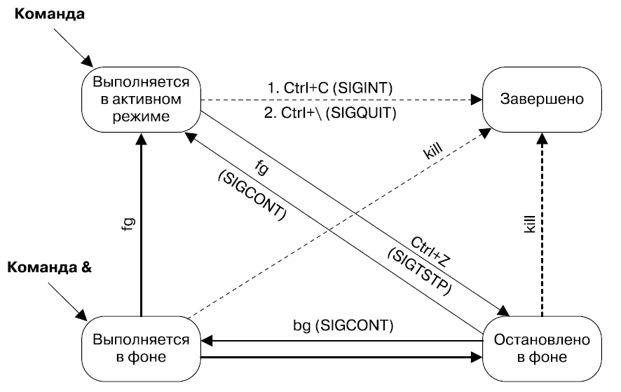

## 6.5. Планирование и приоритет процесса

В Linux по умолчанию используется **циклическое разделение времени**: каждому *процессу* (*потоку*, поскольку именно он является *KSE*) по очереди выделяется квант времени, на протяжении которого он может использоваться центральный процессор.

Данный механизм удовлетворяет требованиям:

+ *справедливость* - *каждый* процесс получает свою долю ресурсов процессора;
+ *отзывчивость* - процесс не ждёт слишком долго, прежде чем получит доступ к процессору.

У процессов нет прямого контроля над длительностью выделяемого им процессорного времени: они просто выполняют работу, пока не истечет их квант времени, или пока они сами не пожелают освободить занимаемые ими ресурсы (*сон*, завершение).

Набор правил, на основании которого *планировщик системы* распределяет процессорное время между процессами (*потоками*) называется **политикой планирования**. Linux поддерживает *одновременное* выполнение процессов, подчиняющихся различным *политикам планирования*:

+ `SCHED_OTHER` - *стандартное* разделение времени, по умолчанию используемое для прикладных пользоавтельских программ;
+ `SCHED_RR` и `SCHED_FIFO` - политики планирования *реального времени*, используемые для выполнения срочных системных задач с жёсткими временными ограничениями. Имеют *абсолютный приоритет* перед прочими политиками;
+ `SCHED_BATCH` - похожа на стандартную, но нацелена на *пакетное выполнение*;
+ `SCHED_IDLE` - похожа на стандартную, но имеет *наименьший приоритет* из всех.

**Политика планирования переживает** `exec()` и **наследуется** в дочерний процесс при вызове `fork()`.

Планирование процессов подчиняется системным ограничениям:

+ ограничения процессорного времени `RLIMIT_CPU` и `RLIMIT_RTTIME` заставляют ядро отправлять процессу сигнал `SIGXCPU` при их превышении;
+ ограничение приоритета `RLIMIT_RTPRIO` определяет, можно ли изменить политику планирования и приоритет процесса вызовом `sched_setscheduler()`.

### 6.5.1. Стандартная политика планирования

#### 6.5.1.1. Приоритет `nice`

Атрибут `nice`, позволяет процессу (*потоку*) задать свой приоритет выполнения, который будет приниматься во внимание *алгоритмом планирования ядра*: он является весовым коэффициентом, на основе которого процесс (*поток*) получает больше либо меньше процессорного времени.

Значение `nice` **переживает** `exec()` и **наследуется** в дочерние процессы вызовом `fork()`.

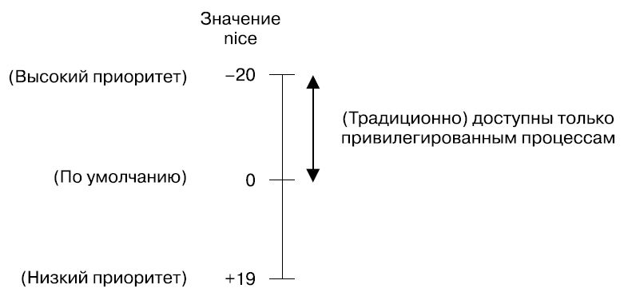

---

```C
int setpriority(int which, id_t who, int prio);
```

Устанавливает атрибут `nice` процесса, определенного значениями аргументов `which` и `who`.

Аргумент `which` принимает значения:

+ `PRIO_PROCESS` - использовать процесс (*поток*), идентификатор *PID* (*TID*) которого указан в аргументе `who`. Если `who = 0`, то используется вызывающий процесс (*поток*);
+ `PRIO_PGRP` - использовать всех участников *группы процессов*, идентификатор *PGID* которой указан в аргументе `who`. Если `who = 0`, то используется *текущая группа*. Данный вызов изменяет приоритет *всех потоков* процесса;
+ `PRIO_USER` - использовать все процессы, *реальный UID* которых указан в аргументе `who`. Если `who = 0`, то используется *текущий пользователь*. Данный вызов изменяет приоритет *всех потоков* процесса;

*Привилегированный* (`CAP_SYS_NICE`) процесс может изменить приоритет любой программы. *Обыкновенный* процесс может изменить приоритет либо у себя, либо у программы с совпадающим значением *действующего UID*.

Ограничение процесса `RLIMIT_NICE = 1...40` определяет по формуле `20-RLIMIT_NICE` максимальный приоритет, который может быть присвоен процессу.

---

```C
int getpriority(int which, id_t who);
```

Извлекает атрибут `nice` процесса, определенного значениями аргументов `which` и `who`. Если под критерий выбора попадает несколько процессов с различными значениями атрибута, то возвращается *наивысший приоритет*.

### 6.5.2. Планирование реального времени

Чувствительные к задержкам приложения, которые в силу своей специфики должны выполняться в *режиме реального времени*, предъявляют повышенные требования к планировщику. Они должны иметь возможности:

+ своевременно получать ресурсы процессора, при необходимости вытесняя прочие неприоритетные задачи. Это требуется, чтобы они могли гарантировать максимальное время реакции на интересующее их событие;
+ захватывать процессор в эксклюзивное использование;
+ определять строгий порядок выполнения своих процессов.

Режим реального времени, удовлетворяющий всем описанным требованиям, называется **жёстким**. Предоставляемый в Linux режим, который не предоставляет приложениям возможности гарантировать скорость реакции, называется **мягким** или **POSIX-режимом**.

Политики реального времени предоставляют `99` **приоритетов** выполнения: от `1` (низшего) до `99` (высшего). Политики *реального времени* равноценны между собой, но имеют абсолютный приоритет перед *стандартным* планированием.

Приоритет реального времени **переживает** `exec()` и **наследуется** в дочерний процесс при вызове `fork()`.

#### 6.5.2.1. Политика `SCHED_RR`

Отличительной особенность политики `SCHED_RR` является **использование строгих приоритетов**, позволяющих **четко задавать очередность** выполнения процессов: больший приоритет гарантирует первоочередность выполнения на процессоре. Процессы с одинаковым приоритетом выполняются в соответствии с *циклическим разделением времени*. Процесс получает квант времени и выполняется, пока НЕ:

+ израсходует весь свой квант;
+ или освободит ресурсы (сон, завершение, `sched_yield()`);
+ или будет **вытеснен** более приоритетным процессом.

Если процесс *вытесняется*, то после завершения высокоприоритетной задачи, он возвращается и дорабатывает оставшееся в его кванте время. В остальных случаях он возвращается в очередь выполнения в соответствии со своим приоритетом.

Причины *вытеснения*:

+ высокоприоритетный процесс оказался разбужен;
+ приоритет некого другого процесса был повышен и оказался больше данного процесса;
+ приоритет данного процесса был понижен и оказался меньше некого ожидающего своего выполнения в очереди.

#### 6.5.2.2. Политика `SCHED_FIFO`

Отличительной особенностью политики `SCHED_FIFO`, в дополнение к **строгим приоритетам**, является **отсутствие ротации квантов** времени. Процесс получает квант и выполняется, пока НЕ:

+ освободит ресурсы (сон, завершение, `sched_yield()`);
+ или будет **вытеснен** более приоритетным процессом.

Если процесс *вытесняется*, то после завершения высокоприоритетной задачи, он возвращается и продолжает работать столько, сколько ему требуется.

#### 6.5.2.3. POSIX-API планирования реального времени

```C
int sched_get_priority_min(int policy);

int sched_get_priority_max(int policy);
```

Возвращают доступный для политики реального времени `policy` диапазон приоритетов. Аргумент `policy` принимает значения `SCHED_RR` и `SCHED_FIFO`.

---

```C
struct sched_param {
    int sched_priority;
};

int sched_setscheduler(
    pid_t pid,
    int policy,
    const sched_param *param);

int sched_setparam(
    pid_t pid,
    const sched_param *param);
```

Данные вызовы устанавливают для процесса (*потока*) `pid` политику планирования `policy` (при наличии аргумента) и приоритет реального времени `param.sched_priority`. Если `pid = 0`, то используется вызывающий процесс (*поток*).

Аргумент `policy` принимает значения `SCHED_OTHER`, `SCHED_RR`, `SCHED_FIFO`, `SCHED_BATCH`, `SCHED_IDLE`. Дополнительно можно указывать битовый флаг `SCHED_RESET_ON_FORK`, который сбрасывает политику планирования в *дочернем* процессе:

+ если родитель выполнялся с политикой реального времени, то потомок получит стандартную `SCHED_OTHER`;
+ если родитель имел высокоприоритетное значение `nice < 0`, то в потомке оно сбросится к нулю.

Значение приоритета `param.sched_priority` для политик реального времени должно лежать в допустимом диапазоне. Для всех прочих политик оно должно равнять `0`.

Оба вызова помещают процесс в *конец очереди* выполнения, соответствующей указанным *политике* и *приоритету*.

*Привилегированный* процесс `CAP_SYS_NICE` может изменять политику планирования и приоритет любого *процесса*. *Обыкновенный* процесс может менять параметры планирования самого себя или процесса, *реальный* или *действующий UID* которого совпадает с его *действующим UID*. Также на обыкновенный процесс наложено ограничение `RLIMIT_RTPRIO`:

+ если `RLIMIT_RTPRIO != 0`, то процессу разрешено изменять политику и приоритет реального времени, который при этом не должен превышать  `RLIMIT_RTPRIO`;
+ если `RLIMIT_RTPRIO = 0`, то процессу разрешено понижать приоритет или переключиться на любую политику НЕ реального времени;

Политика `SCHED_IDLE`, установленная в *обыкновенном* процессе, не может быть изменена на другую.

---

```C
int sched_getscheduler(pid_t pid);

int sched_getparam(pid_t pid, sched_param *param);
```

Данные вызовы возвращают политику планирования и приоритет реального времени `param.sched_priority` (при наличии аргумента) процесса (*потока*) `pid`. Если `pid = 0`, то используется вызывающий процесс (*поток*).

---

```C
int sched_yield();
```

Данный вызов освобождает ресурсы, занимаемые вызывающим процессом (*потоком*), выполняющимся с политикой *реального времени*, и переносит его в конец очереди выполнения - это позволит процессу во главе очереди приступить к работе. Если вызывающий процесс (*поток*) единственный в очереди, то вызов ничего не делает.

---

```C
int sched_rr_get_interval(pid_t pid, timespec *tp);
```

Возвращает в `tp` длительность кванта времени, который был выделен процессу (*потоку*) `pid`, выполняющемуся с политикой `SCHED_RR`. Если `pid = 0`, то используется вызывающий процесс (*поток*).

### 6.5.3. Привязка к процессору

В ходе своей работы процесс (*поток*) может быть перенесён планировщиком системы с одного процессора на другой - это приведёт к дорогостоящему переносу данных между кэшами процессоров. Чтобы избегать подобных ситуаций, Linux осуществляет **мягкую привязку**, *стараясь* планировать выполнение процессов (*потоков*) на одних и тех же процессорах. Однако приложению также доступна и функция **жесткой привязки**, которая строго закрепит процесс за конкретным процессором или их группой.

Тип данных `cpu_set_t` хранит **маску родственных процессоров**, которая заполняется с помощью следующих макросов - инициализирует пустую *маску*, добавляет, удаляет и проверяет наличие в ней процессора:

```C
void CPU_ZERO(cpu_set_t *set);
void CPU_SET(int cpu, cpu_set_t *set);
void CPU_CLR(int cpu, cpu_set_t *set);
int CPU_ISSET(int cpu, cpu_set_t *set);
```

Процессоры в *маске родства* нумеруются с `0`, а константа `CPU_SETSIZE` ограничивает её вместительность.

По умолчанию процесс (*поток*) может планироваться на всех доступных системе процессорах - маска родства будет включать все процессоры.

**Маска родственных процессоров** для вызывающего *потока* **переживает** `exec()` и наследуется в дочерний процесс (*поток*) при вызове `fork()`.

---

```C
int sched_setaffinity(
    pid_t pid,
    size_t len,
    cpu_set_t *set);
```

Жёстко привязывает процесс (*поток*) `pid` к набору процессоров `set`. Аргумент `len = sizeof(cpu_set_t)`. Если `pid = 0`, то используется вызывающий процесс (*поток*).

*Привилегированный* процесс `CAP_SYS_NICE` может привязать любой процесс. *Обыкновенный* процесс может привязать самого себя или процесс, *реальный* или *действующий UID* которого совпадает с его *действующим UID*.

---

```C
int sched_getaffinity(
    pid_t pid,
    size_t len,
    cpu_set_t *set);
```

Возвращает набор родственных процессоров `set` процесса (*потока*) `pid`. Если `pid = 0`, то используется вызывающий процесс (*поток*).

## 6.6. Состояния сна процесса

При выполнении системных вызовов ядро может переводить процесс в различные **состояния сна**:

+ `TASK_INTERRUPTABLE` - процесс ожидает некоторое событие (сетевой ввод/вывод, прочие операции с неопределенным временем завершения). Если **сигнал** генерируется для процесса в этом состоянии, то операция завершается, процесс пробуждается, и сигнал доставляется. В выводе команды `ps` обозначается как `S-state`;
+ `TASK_UNINTERRUPTABLE` - процесс ожидает специфическое событие, которое требует непродолжительное время на свершение. Если **сигнал** генерируется, то он *не будет доставлен*, пока *процесс не проснётся*. Из-за неполадок в оборудовании или багов в коде ядра процесс может зависнуть в этом состоянии - его невозможно будет убить даже сигналом `SIGKILL`, и потребуется перезагрузка системы. В выводе команды `ps` обозначается как `D-state`;
+ `TASK_KILLABLE` - состояние, пришедшее на замену `TASK_UNINTERRUPTABLE` и позволяющее процессу проснуться и завершиться при получении *фатального* сигнала (т.е. такого, который убьёт процесс с учетом текущих *диспозиций сигналов* и *сигнальной маски*).

---

```C
unsigned int sleep(unsigned int seconds);
```

Приостанавливает вызывающий процесс на *не менее* `seconds` секунд или до момента поступления *сигнала*.

В операционных системах, отличных от Linux, может быть реализована через *сигнальный интервальный таймер*, поэтому её использование в них не следует смешивать с функциями данной категории (`setitimer(), alarm()`).

---

```C
int nanosleep(const timespec *request, timespec *remain);
```

Приостанавливает вызывающий процесс на *не меньшее* чем `request` время, задаваемое с точностью до *наносекунд* или до момента поступления *сигнала*.

Фактическое время сна округляется до кратного минимальному временному шагу *программных системных часов - jiffies*. Реальная наносекундная точность требует аппаратной поддержки и должна быть активирована через параметр конфигурации ядра `CONFIG_HIGH_RES_TIMERS`.

---

```C
int clock_nanosleep(
    clockid_t clockid,
    int flags,
    const timespec *request,
    timespec *remain);
```

Приостанавливает вызывающий процесс на определенный промежуток времени или до момента поступления *сигнала*.

Если аргумент `flags = 0`, то `request` задаёт *относительную длительность* сна. Если `flags = TIMER_ABSTIME`, то `request` задаёт *абсолютную временную метку* в будущем, по достижении которой процесс должен проснуться.

*Абсолютное значение* времени не подвержено накоплению избыточной длительности сна при перезапусках вызова в случае поступления сигналов с высокой частотой: т.к. *оставшаяся длительность* сна при перезапуске зачастую не кратна точности часов, то к каждый повторный сон будет содержать лишнюю прибавку, образованную округлением до шага часов в большую сторону. Однако *абсолютная временная метка* подвержена ручному переводу часов.

*Относительная длительность* не подвержена ручному переводу времени, однако снижает точность сна.

Аргумент `clockid` определяет часы, используемые для учета времени сна, и поддерживают значения: `CLOCK_REALTIME`, `CLOCK_MONOTONIC`.ы

## 6.7. Учет ресурсов процесса

Если в системе активирован опциональный компонент, осуществляющий учет ресурсов (параметр `CONFIG_BSD_PROCESS_ACCT`), то ядро записывает в общесистемный файл данные о каждом завершенном процессе.

Файл `/proc/sys/kernel/acct` определяет *нижнее ограничение* (запись статистики останавливается), *верхнее ограничение* (запись возобновляется) для свободного дискового просранства и *частоту* (в секундах) его опроса.

```C
#define ACCT_COMM 16
typedef u_int16_t comp_t;

struct acct {
    char ac_flag;
    u_int16_t ac_uid;
    u_int16_t ac_gid;
    u_int16_t ac_tty;
    u_int32_t ac_btime;
    comp_t ac_utime;
    comp_t ac_stime;
    comp_t ac_etime;
    comp_t ac_mem;
    comp_t ac_io;
    comp_t ac_rw;
    comp_t ac_minflt;
    comp_t ac_majflt;
    comp_t ac_swaps;
    u_int32_t ac_exitcode;
    char ac_comm[ACCT_COMM+1];
    char ac_pad[10];
};

int acct(const char *acctfile);
```

Включает (требуется привилегия процесса `CAP_SYS_PACCT`) общесистемный учет ресурсов процессов, принимая путь к обыкновенному существующему файлу `acctfile`, который будет использоваться для записи информации, или выключает его, если был передан `NULL`.

После включения файл заполняется структурами `acct` для каждого завершенного процесса:

+ тип `comp_t` - *сжатые такты системного времени* в формате с плавающей запятой: для перевода в секунды необходимо преобразовывать в целые числа `long long`, а затем делить на `sysconf(_SC_CLK_TCK)`;
+ `ac_flag` - флаги учета:
  + `AFORK` - процесс создан `fork()`, но не выполнил `exec()`;
  + `ASU` - процесс пользовался привилегиями администратора;
  + `AXSIG` - процесс завершен сигналом;
  + `ACORE` - процесс сгенерировал *файл дампа ядра*;
+ `ac_uid/ac_gid` - UID/GID процесса;
+ `ac_tty` - управляющий терминал процесса ($0$ для *демонов*);
+ `ac_btime/ac_utime/ac_stime/ac_etime` - начальное, процессорное (пользователь и ядро), реальное затраченное время процесса;
+ `ac_mem` - среднее потребление памяти;
+ `ac_minflt/ac_majflt/ac_swaps` - отказы страниц/количество сбросов в файл подкачки;
+ `ac_exitcode` - код завершения;
+ `ac_comm` - имя последней выполненной программы.

# 7. Потоки

**Поток (thread)** - наименьшая **единица планирования ядра (Kernel Scheduling Entity)**, которая может быть назначена на выполнение на процессоре. Потоки являются механизмом параллельного выполнения нескольких задач в рамках одного приложения. Любой процесс состоит *минимум из одного* потока.

Каждый поток имеет **собственный стек**, но все они **разделяют** следующие сегменты виртуальной памяти процесса:

+ **текст**;
+ **данные**;
+ **кучу**;
+ **аргументы командной строки**;
+ **переменные окружения**.

*Минимальный* размер выделяемого потоку стека определяется `sysconf(_SC_THREAD_STACK_MIN)`. Вручную размер стека может быть указан в *атрибутах* создания потока `pthread_attr_setstacksize()`.

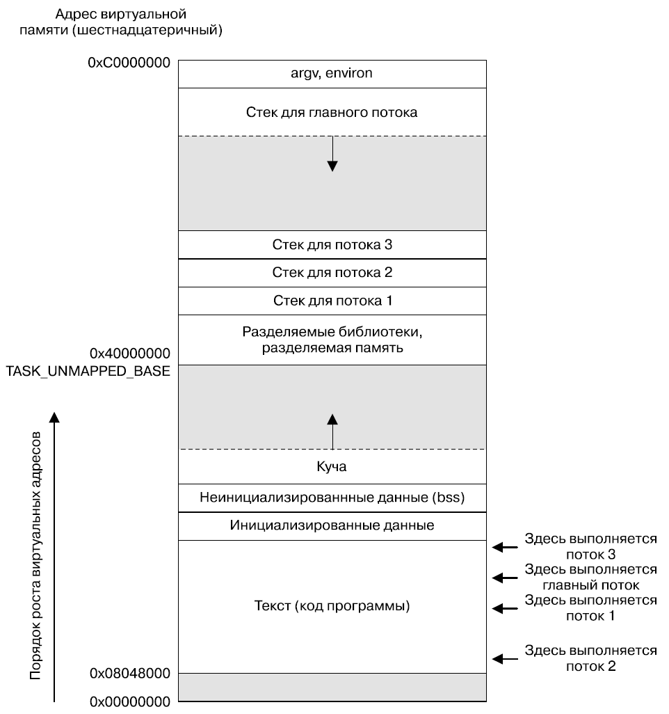

Также потоки **разделяют**, в частности, следующие атрибуты:

+ **UID**, **GID**, **дополнительные группы** процесcа;
+ **PID** и **PPID**;
+ группу процессов **PGID** и сессию **SID**;
+ **управляющий терминал**;
+ **umask**, **корневой** и **текущий каталоги**;
+ открытые **дескрипторы файлов**;
+ **диспозиции сигналов**;
+ **блокировки записей** `fcntl(F_SETLK)`;
+ **сигнальные таймеры** `setitimer()/timer_create()`;
+ **ограничения** и статистика потребления ресурсов системы;

**Уникальными** для потока являются:

+ идентификатор потока **TID**;
+ **сигнальная маска** `sigprocmask()`;
+ **альтернативный стек** `signalstack()`;
+ переменная `errno`;
+ возможности (**capabilities**);
+ политика планирования и приоритет `nice`;
+ привязка к ЦПУ;
+ настройки плавающей запятой;

Каждый поток имеет **уникальный в рамках все системы** идентификатор - **Thread Identifier (TID)**. Все потоки заданного *процесса* образуют **группу потоков выполнения**. Все члены одной *группы* имеют одинаковый **Thread Group Identifier (TGID)**, и фактически **TGID = PID**. Первый поток группы является **лидирующим**, и для него **TID = TGID**. Родителем всех потоков в группе является *родитель лидера*.

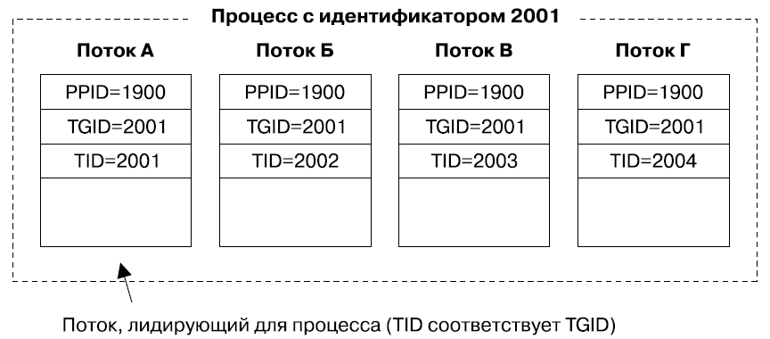

*Родитель группы* (т.е. родитель заданного процесса) получает `SIGCHLD`, когда *все* потоки группы завершают выполнение. *Лидер группы* (т.е. первый поток заданного процесса) не получает сигналов при завершении членов и НЕ может ожидать их с помощью `wait()` - потоки нужно **присоединять** через `pthread_join()`.

Если *какой-либо поток* группы вызывает `exec()`, то все *прочие потоки* **немедленно завершаются**, не выполняя никаких обработчиков выхода и деструкторов, *вызывающий поток* становится *лидером* (если изначально не был им) и начинает выполнять новую программу. Т.к. новая программа полностью заменяет адресное пространство процесса, то все хендлеры `thread_t` потоков из состава интерфейса POSIX-Threads перестают существовать.

Если *какой-либо поток* группы вызывает `fork()`, то только он **наследуется** в *дочерний процесс*. *Прочие потоки* в новом *процессе* перестают существовать, при этом их обработчики выхода и деструкторы *в нём* не вызываются - это грозит утечками памяти и приведением данных (например, *заблокированных мьютексов*) в нерабочее состояние. Хендлер `thread_t` *вызывающего потока* в новом процессе сохраняется, однако хендлеры на все остальные потоки инвалидируются.

Если *какой-либо поток* группы вызывает `exit()` или *главный поток* выполняет инструкцию `return` из функции `main()`, то *прочие потоки* **немедленно завершаются**, не выполняя никаких обработчиков выхода и деструкторов. *Главный поток* обработчики выхода выполнит.

Потоки создаются быстрее процессов, т.к. им не нужно копировать страницы виртуальной памяти родителя. Также потоки могут гораздо легче обмениваться информацией, чем процессы, т.к. они располагаются в едином адресном пространстве: достаточно применения средств синхронизации доступа к памяти.

В Linux потоки реализуются на основе описанного ранее вызова `clone()`.

Т.к. ни одна функция *POSIX-Threads* НЕ является безопасной для *обработчика сигнала*, то в *многопоточных* приложениях рекомедуется:

+ осуществлять *синхронный* приём сигналов в *основном потоке* приложения: *сигнальная маска первого потока* устанавливается на блокировку всех сигналов, а сам поток выполняет блокирующие вызовы `sigwaitinfo(), sigwait(), sigtimedwait(), signalfd()` для ручного извлечения *ожидающих сигналов* из набора `sigpending`;
+ все последующие порождаемые дочерние потоки будут наследовать полностью заблокированную маску основного потока, и поэтому ядро не будет рассматривать их как потенциальных адресатов сигналов - потоки смогут выполнять свою работу, не прерываясь.

## 7.1. Модели реализации потоков

Существует несколько моделей привязки *потоков* к **единицам планирования ядра (Kernel Scheduling Entity)**, собственно для которых планировщик ядра и выделяет такты процессорного времени:

1. *Реализация потоков на уровне пространства пользователя* **(Many-to-One)**: все операции по управлению потоками (создание, планирование, синхронизация) выполняются внутри данного процесса пользовательской библиотекой, а ядро о существовании поток даже не подозревает.

   Плюсы:

   + поскольку операции с потоками не требуют переключения в режим ядра, то это позволяет им выполняться с большей производительностью;
   + реализация потоков переносима между системами, т.к. не требует поддержки со стороны ядра;

    Минусы:

    + поскольку ядро не знает о потоках, то не может распределять их по разным процессорам, назначать им разный приоритет и т.д.;
    + блокирующие вызовы в одном потоке останавливают сразу весь процесс.

2. *Реализация потоков на уровне ядра* **(One-to-One)**: операции по управлению потоками реализованы как системные вызовы, и каждый поток привязан к своей единице планирования.

    Плюсы:

    + ядро планирует каждый поток отдельно, может распределять их по разным процессорам и т.д.;

    Минусы:

    + затраты на выполнение системного вызова и работу планировщика;

3. *Двухуровневая реализация потоков* **(Many-to-Many)**: операции с потоками распределены между ядром и пользовательской библиотекой, процессу выделяется несколько единиц планирования, к каждой из которых может быть привязано несколько потоков.

    Плюсы:

    + меньшее количество единиц планирования, чем в модели one-to-one, что приводит к лучшей масштабируемости при росте количества потоков;

    Минусы:

    + сложность взаимодействия между ядром и библиотекой потоков.

Linux применяет модель **one-to-one** и предоставляет две реализации: библиотеки LinuxThreads (*устаревшая*) и Native POSIX-Threads Library (NPTL). Команда оболочки `$ getconf GNU_LIBPTHREAD_VERSION` позволяет используемую в системе библиотеку потоков и её версию.

## 7.2. Интерфейс POSIX-Threads

**POSIX-Threads (PThreads)** - это предоставляемый пользователю унифицированный интерфейс (*API*) по управлению потоками, описанный в стандарте *Single Unix Specification*.

Испольщующие его программы должны компилироваться с ключом `cc -pthread` для возможности компоновки с библиотекой `libpthread`.

Основные типы данных интерфейса PThreads:

+ `pthread_t` - идентификатор потока;
+ `pthread_attr_t` - атрибуты потока;
+ `pthread_mutex_t` - мьютекс;
+ `pthread_mutexattr_t` - атрибуты мьютекса;
+ `pthread_cond_t` - условная переменная;
+ `pthread_condattr_t` - атрибуты условной переменной;
+ `pthread_key_t` - ключ данных потока;
+ `pthread_once_t` - контекст однократной инициализации;

### 7.2.1. Жизненный цикл потока

```C
typedef void*(*thread_func_t)(void*);

int pthread_create(
    pthread_t *thread,
    const pthread_attr_t *attr,
    thread_func_t thread_func,
    void *arg);
```

**Создаёт** *новый поток*, который параллельно текущему потоку выполняет функцию `thread_func`, принимающую аргумент `arg`.

Хендлер созданного потока записывается в `thread` до завершения вызова.

Аргумент `attr` содержит *атрибуты* создаваемого потока - парметры, определяющие:

+ местоположение и размер стека потока;
+ политику планирования и приоритет;
+ *присоединяемость/отсоединённость* и т.д.;

Переменные типа `pthread_attr_t` управляются своим собственными функциями: `pthread_attr_init()`, `pthread_attr_destroy()` и прочими.

Если `attr = NULL`, то поток создаётся с атрибутами *по умолчанию*.

---

Поток может **завершиться** по следующим причинами:

+ выполняемая потоком функция вернула значение через `return`;
+ поток вызвал завершающую его функцию `pthread_exit()`;
+ поток отменен через `pthread_cancel()`;
+ любой поток процесса выполнил `exit()`, завершающий всю программу;
+ главный поток процесса вернул значение из `main()`, что привело к завершению всей программы.

```C
void pthread_exit(void *retval);
```

Завершает вызывающий поток со значением `retval`, которое может быть получено другим потоком с помощью функции присоединения `pthread_join()`.

Значение, на которое указывает аргумент `retval` НЕ должно находиться на *стеке* завершаемого потока, т.к. занимаемая им память освобождается по окончании вызова.

---

```C
int pthread_join(pthread_t thread, void **retval);
```

**Присоединяет** указанный поток `thread`: ожидает его завершения и получает в `retval` указатель, переданный в `pthread_exit()` или инструкцию `return` функции потока.

Пока  завершенный поток не *присоединен*, он является аналогом *зомби* и занимает системные ресурсы (например, ограничение на число потоков приложения). По умолчанию все потоки являются **присоединяемыми**. Т.к. потоки не имеют иерархии, то *любой* поток может *присоединить* любой другой поток.

---

```C
int pthread_detach(pthread_t thread);
```

**Отсоединяет** указанный поток `thread`: помечает данный поток как *недоступный для присоединения*, вследствие чего занимаемые им ресурсы автоматически будут полностью освобождены ядром при его завершении.

Поток может *отсоединить сам себя*. *Отсоединенные* потоки нельзя пытаться *присоединять* - это приводит к *неопределенному поведению*.

---

```C
pthread_t pthread_self();
```

Возвращает потоку его собственный хендлер.

```C
int pthread_equal(pthread_t t1, pthread_t t2);
```

Сравнивает хендлеры потоков `t1` и `t2` на равенство.

### 7.2.2. Синхронизация

#### 7.2.2.1. Мьютексы

*Критический участок* - фрагмент кода, работающий с общими ресурсами разных потоков, выполнение которого должно быть *атомарным*.

**Мьютекс (mutual exclusion)** - примитив синхронизации, обеспечивающий эксклюзивное выполнение *критического участка*. Имеет два состояния: *открытое* и *закрытое* (заблокированное). В любой момент только один поток может держать мьютекс *закрытым*. Только поток, закрывший мьютекс, может его *открыть*.

Типом мьютекса в POSIX-Threads является `pthread_mutex_t`. Мьютекс может быть создан:

+ *статически*: инициализируется значением `PTHREAD_MUTEX_INITIALIZER`;
+ *динамически*: инициализируется функцией `pthread_mutex_init()`.

Переменные `pthread_mutexattr_t` указывают *атрибуты* мьютекса и управляется своим собственным набором функций: `pthread_mutexattr_init()`, `pthread_mutexattr_settype()`, `pthread_mutexattr_destroy()` и прочие.

Важнейшим атрибутом мьютекса является его тип:

+ `PTHREAD_MUTEX_NORMAL` - стандартный мьютекс без обнаружения *взаимной блокировки*; *повторное закрытие* одним и тем же потоком навсегда блокирует выполнение; *повторное открытие* или *открытие чужого* закрытого мьютекса в Linux возвращает ошибку, однако по стандарту приводит к неопределенному поведению;
+ `PTHREAD_MUTEX_ERRORCHECK` - мьютекс с проверкой ошибок для всех операций;
+ `PTHREAD_MUTEX_RECURSIVE` - *рекурсивный* мьютекс, допускающий *повторное закрытие* - требуется открыть соответствующее число раз (реализует концепцию счетчика закрытий);
+ `PTHREAD_MUTEX_DEFAULT` - тип мьютекса с атрибутами по умолчанию; в Linux совпадает с `PTHREAD_MUTEX_NORMAL`.

В Linux мьютексы реализуются на основе *фьютексов (Fast User Space Mutex)* - низкоуровнего системного примитива синхронизации, позволяющего реализовать атомарные блокировки в пространстве пользователя на основе вызова `futex()` и ассемблерных операций.

---

```C
int pthread_mutex_init(
    pthread_mutex_t *mutex,
    const pthread_mutexattr_t *attr);
```

Инициализирует с *атрибутами* `attr` ранее созданную переменную мьютекса `mutex`. После инициализации мьютекс является *открытым*.

Если `attr = NULL`, то используются атрибуты по умолчанию. После инициализации мьютекса в переменной атрибутов `pthread_mutexattr_t` больше нет надобности, и она может быть деинициализирована и уничтожена.

```C
int pthread_mutex_destroy(pthread_mutex_t *mutex);
```

Деинициализирует *открытый* мьютекс `mutex` - после этого занимаемую переменной мьютекса память можно освобождbть, либо инициализировать мьютекс заново.

---

```C
int pthread_mutex_lock(pthread_mutex_t *mutex);
```

*Закрывает* открытый мьютекс. Если мьютекс в настоящий момент закрыт *другим потоком*, то вызов блокируется до открытия. Повторное закрытие мьютекса типа `PTHREAD_MUTEX_NORMAL` одним и тем же потоком запрещено и в Linux приводит к *взаимной блокировке*. Если несколько потоков ожидают разблокировки мьютекса, то не определено, кому конкретно он достанется.

```C
int pthread_mutex_trylock(pthread_mutex_t *mutex);
```

Пытается закрыть мьютекс или сразу же возвращает ошибку `EBUSY`.

```C
int pthread_mutex_timedlock(
    pthread_mutex_t *mutex,
    const timespec *abstime);
```

Пытается закрыть мьютекс в течение промежутка времени `abstime`. Если захватить мьютекс так и не удалось, то возвращает ошибку `ETIMEDOUT`.

```C
int pthread_mutex_unlock(pthread_mutex_t *mutex);
```

*Открывает* ранее закрытый *данным потоком* мьютекс.

#### 7.2.2.2. Условные переменные

**Условная переменная** - примитив синхронизации, позволяющий потокам информировать друг друга об изменениях состояния общих ресурсов и ожидать таких уведомлений в состоянии сна.

Также для разделяемого ресурса должен быть определен *предикат*, который при получении оповещения будет проверять, действительно ли данные находятся в подходящем для работы с ними состоянии. Если данные не готовы, то необходимо возобновить ожидание. Наличие проверяющего пробуждение предиката требуется по причинам:

+ поток может быть не единственным получившим оповещение - необходимо проверять, является ли он его адресатом;
+ поток может быть разбужен и без оповещения - т.н. *spurious wakeup*, являющийся особенностью реализации операционных систем.

*Условные переменные* всегда применяются в паре с *мьютексами*: мьютекс контролирует доступ к ресурсу, а условная переменная занимается оповещением потоков.

Типом условной переменной в POSIX-Threads является `pthread_cond_t`. Условная переменная может быть создана:

+ *статически*: инициализируется значением `PTHREAD_COND_INITIALIZER`;
+ *динамически*: инициализируется функцией `pthread_cond_init()`.

Перед проведением *любой манипуляции* с условной переменной поток должен **закрывать мьютекс**.

---

```C
int pthread_cond_init(
    pthread_cond_t *cond,
    const pthread_condattr_t *attr);
```

Инициализирует с *атрибутами* `attr` ранее созданную условную переменную `cond`. Если `attr = NULL`, то используются атрибуты по умолчанию.

```C
int pthread_cond_destroy(pthread_cond_t *cond);
```

Деинициализирует условную переменную `cond`, которую более не ожидает ни один поток - после этого занимаемую условной переменной память можно освободить, либо инициализировать переменную заново.

---

```C
int pthread_cond_wait(
    pthread_cond_t *cond,
    pthread_mutex_t *mutex);
```

Принимает *закрытый вызывающим потоком* мьютекс `mutex`, открывает его и ожидает в блокировке оповещения через условную переменную `cond`. Получив оповещение, функция снова закрывает мьютекс и возвращает управление.

Все ожидающие потоки должны использовать одну и ту же условную переменную и мьютекс.

```C
int pthread_cond_timedwait(
    pthread_cond_t *cond,
    pthread_mutex_t *mutex,
    const timespec *abstime);
```

Аналог `pthread_cond_wait()`, позволяющий ожидать оповещения в течение времени `abstime`.

---

```C
int pthread_cond_signal(pthread_cond_t *cond);
```

Оповещают *по крайней мере один* поток, ожидающий на условной переменной `cond`. Оповещения теряются, если ни один поток не ожидает на условной переменной.

```C
int pthread_cond_broadcast(pthread_cond_t *cond);
```

Аналог `pthread_cond_signal()`, оповещающий *все* ожидающие потоки.

#### 7.2.2.3. Однократная инициализация

```C
typedef void(*once_func_t)();
int pthread_once(
    pthread_once_t *once_control,
    once_func_t once_func);
```

Выполняет однократный вызов функции `once_func()`, независимо от общего количества вызовов `pthread_once()` в потоках приложения.

Аргумент контекста `once_control`должен быть предварительно *статически* инициализирован значением `PTHREAD_ONCE_INIT`.

### 7.2.3. Данные уровня потока

Если некоторой функции, вызываемой из различных потоков, требуется хранить своё состояние, не ограничиваясь продолжительностью своего вызова, и при этом такое состояние должно быть уникальным для каждого потока, то можно воспользоваться механизмом создания **данных уровня потока (thread local storage)**:

1. функция должна с помощью `pthread_key_create()` создать **ключ данных**, через который будет осуществляться доступ к её *состояниям* в каждом отдельном потоке. *Ключ* функции должен создаваться лишь единожды при её первом вызове: следует использовать механизм *однократной инициализации* `pthread_once()`. Также необходимо сразу указывать *деструктор*, который при завершении потока будет автоматически удалять состояние функции в нем;
2. далее функция с помощью `malloc()` создаёт в куче *блок данных*, в котором она собирается хранить своё состояние для текущего потока. *Блок данных* выделяется один раз на всё время жизни потока: через `pthread_getspecific()` функция проверяет, зарегистрированы ли для текущего потока данные - если нет, то функция создаёт *блок* и связывает его с потоком и ключом через вызов `pthread_setspecific()`;
3. функция выполняет свою работу, при необходимости получая доступ к данным через `pthread_getspecific()`;
4. при завершении потока *блок данных* автоматически удалится зарегистрированным *деструктором*.

Типом *ключа данных* в POSIX-Threads является `pthread_key_t`. Максимальное количество доступных *ключей данных* для Linux ограничено `PTHREAD_KEYS_MAX = sysconf(_SC_THREAD_KEYS_MAX) = 1024`.

---

```C
typedef void(*destructor_t)(void*);

int pthread_key_create(
    pthread_key_t *key,
    destructor_t destructor);
```

Создаёт новый *ключ* `key` для *данных уровня потока*.

Если деструктор не требуется, то можно указать `destructor = NULL`. Если поток содержит несколько *блоков данных*, то порядок вызова их деструкторов не определен.

---

```C
int pthread_setspecific(pthread_key_t key, const void *value);
```

Связывает указатель на выделенный блок данных `value` с *ключом данных* `key` и вызывающим потоком.

---

```C
void *pthread_getspecific(pthread_key_t key);
```

Возвращает указатель на *данные* текущего потока, связанные с ключом `key`. Если с ключом для вызывающего потока не были зарегистрированы никакие данные, то возвращает `NULL`.

### 7.2.4. Отмена потока

**Отмена потока** заключается в отправке ему из другого потока *запроса* на немедленное завершение.

Под **состоянием отмены** потока понимается сама её возможность. Под **типом отмены** понимается реакция *допускающего* её потока на поступивший *запрос*.

**Состояние и тип отмены** потока **НЕ переживают** (сбрасываются по умолчанию) вызов `exec()`, но **наследуются** в дочерний процесс при вызове `fork()`.

**Точка отмены** - определенное место в коде, по достижении которого поток *соответствующего типа* может быть отменен. Точками отмены являются системные вызовы из списка, определенного стандартом и конкретной реализацией системы - обычно это блокирующие системные вызовы.

По стандарту *обязаны* являться точками отмены (прочие *могут* ими являться):

`accept()`, `nanosleep()`, `sem_timedwait()`, `aio_suspend()`, `open()`, `openat()`, `sem_wait()`, `clock_nanosleep()`, `pause()`, `send()`, `close()`, `poll()`, `sendmsg()`, `connect()`, `pread()`, `sendto()`, `creat()`, `pselect()`, `sigpause()`, `fcntl(F_SETLKW)`, `pthread_cond_timedwait()`, `sigsuspend()`, `fsync()`, `pthread_cond_wait()`, `sigtimedwait()`, `fdatasync()`, `pthread_join()`, `sigwait()`, `getmsg()`, `pthread_testcancel()`, `sigwaitinfo()`, `getpmsg()`, `putmsg()`, `sleep()`, `lockf(F_LOCK)`, `putpmsg()`, `system()`, `mq_receive()`, `pwrite()`, `tcdrain()`, `mq_send()`, `read()`, `usleep()`, `mq_timedreceive()`, `readv()`, `wait()`, `mq_timedsend()`, `recv()`, `waitid()`, `msgrcv()`, `recvfrom()`, `waitpid()`, `msgsnd()`, `recvmsg()`, `write()`, `msync()`, `select()`, `writev()`.

Если в потоке *соответствующего типа* не вызывается ни одна функция, являющаяся точкой отмены, то такой поток **не может быть отменен**.

---

```C
int pthread_cancel(pthread_t thread);
```

Отправляет потоку `thread` *запрос отмены* и сразу же возвращается.

---

```C
int pthread_setcancelstate(int state, int *oldstate);
```

Позволяет задавать через аргумент `state` **состояние отмены** вызывающего потока:

+ `PTHREAD_CANCEL_DISABLE` - поток нельзя отменить. Отправленный *запрос* будет ожидать, пока для потока не будет разрешена отмена;
+ `PTHREAD_CANCEL_ENABLE` - поток может быть отменен. Используется *по умолчанию*.

```C
int pthread_setcanceltype(int type, int *oldtype);
```

Позволяет задавать через аргумент `type` **тип отмены** вызывающего потока:

+ `PTHREAD_CANCEL_ASYNCHRONOUS` - поток может быть отменен в любой момент (возможно, даже мгновенно при поступлении запроса);
+ `PTHREAD_CANCEL_DEFERRED` - поток будет отменен по достижении **точки отмены**. Используется *по умолчанию*.

---

```C
typedef void(*cleanup_func_t)(void*)

void pthread_cleanup_push(cleanup_func_t routine, void *arg);
void pthread_cleanup_pop(int execute);
```

Функция `pthread_cleanup_push()` помещает **обработчик отмены** `routine` на соответствующий стек, а `pthread_cleanup_pop()` снимает обработчик с вершины, выполняя его при `execute != 0`.

*Обработчики отмены* вызываются *автоматически* при *отмене* потока (в порядке LIFO), принимая используемые при их регистрации указатели `arg` в качестве аргументов. Также обработчики вызываются при завершении потока вызовом `pthread_exit()`, но НЕ при выполнении инструкции `return` из функции потока.

В Linux оба этих вызова являются *макросами*, содержащими открывающую `{` и закрывающую скобки `}` - по этой причине `pthread_cleanup_push()` *всегда* должен сопровождаться `pthread_cleanup_pop()` *в том же блоке кода*.

---

```C
void pthread_testcancel();
```

Вызов данной функции в коде создаёт на её месте *точку отмены*. Поток может использовать её, если он не содержит других функций отмены.

# 8. Сигналы

**Сигнал** - оповещение процесса о некотором событии.

*Процесс* может отправить сигнал *другому процессу* (а также *самому себе*) в *любой требуемый момент*.

*Ядро* отправляет сигнал процессу в следующих случаях:

+ *аппаратное исключение* - оборудование зафиксировало выполнение недопустимой операции и уведомило ядро, а ядро оповестило процесс; например, обращение к недопустимому участку памяти, передача ошибочной инструкции и т.д.;
+ *определённое программное событие*; например, завершение дочернего процесса, срабатывание таймера, возможность ввода/вывода в файловом дескрипторе и т.д.;
+ *ввода символа, генерирующего сигнал*; например, *прерывание* `Ctrl+C`, *выход* `Ctrl+\` и т.д.

Все сигналы подразделяются на 2 группы:

+ **Стандартные** - стандарт четко перечисляет их список и назначение. Используются ядром для оповещения процесса и управления его периодом жизни. Процессы также могут отправлять стандартные сигналы. Каждому сигналу из этой группы присвоен *уникальный номер* в пределах `1 - 31`;
+ **Реального времени** - пользователь сам определяет их назначение, условия генерации и номер. Такие сигналы могут нести с собой дополнительные данные.

Независимо от типа сигнала его *жизненный цикл* состоит из следующих этапов:

1. *Генерация*;
2. *Ожидание доставки*;
3. *Доставка в процесс* - передача сигнала процессу, вызывающая выполнение процессом ответных действий.

Для каждого сигнала заранее определено **действие по умолчанию**, которое выполняется при его получении процессом:

+ *Игнорирование сигнала* - сигнал отбрасывается ядром без уведомления процесса;
+ *Мгновенное завершение* процесса - процесс завершается в обход логики выполняемой им программы;
+ *Мгновенное завершение с файлом дампа ядра* - при завершении процесса дополнительно будет создан **файл дампа ядра**, содержащий слепок его *виртуальной памяти*. Файл дампа может быть загружен в *отладчик* для последующего анализа;
+ *Приостановка* процесса;
+ *Возобновление* процесса.

Также процесс может явно определить, какое действие должно выполняться при получении указанного сигнала - установить **диспозицию сигнала**:

+ *Действие по умолчанию* - `SIG_DFL`;
+ *Игнорирование сигнала* - `SIG_IGN`;
+ *Перехват сигнала в обработчик*.

Характеристики сигналов, общие для *процесса*:

+ *диспозиция* сигналов: *обработчики* устанавливаются одинаковыми для всех потоков, а действие сигналов *(игнорирование/остановка/возобновление/завершение*) распространяется на весь процесс;
+ *сигнал* может быть отправлен как *процессу* в целом, так и конкретному *потоку* в частности. Сигнал направляется в *поток*, если:

  + сигнал сгенерирован *аппаратной ошибкой*, которая была вызвана выполнением инструкции в данном потоке: `SIGBUS, SIGFPE, SIGILL, SIGSEGV`;
  + сигнал является `SIGPIPE` при ошибки записи данным потоком в *конвейер*;
  + сигнал отправлен конкретному потоку функциями `pthread_kill(), pthread_sigqueue()`.

  В остальных случаях сигнал направляется всему *процессу*, а ядро само выбирает, в какой именно *поток* он будет доставлен: ядро рассматривает *незаблокировавшие* данный сигнал потоки, которые в настоящий момент работают или находятся в состоянии *прерываемого сна*.

Характеристики сигналов, специфичные для конкретного *потока*:

+ **сигнальная**: не существует общей сигнальной маски всего процесса. Вызов `sigprocmask()` управляет маской только вызывающего потока, а в *многопоточных* приложениях его поведение вообще **НЕ определено** - в них следует использовать `pthread_sigmask()`. *Сигнальная маска* наследуется в *дочерний поток* из *потока-родителя*;
+ ядро отдельно учитывает **ожидающие сигналы** всего процесса и конкретных потоков. Вызов `sigpending()` возвращает объединение ожидающих сигналов всего процесса и вызывающего потока. Направленный *конкретному потоку* сигнал может быть доставлен только ему;
+ у каждого потока собственный **альтернативный сигнальный стек**, который не наследуется при порождении новых потоков;
+ вызов `pthread_mutex_lock()` автоматически перезапускается после доставки сигнала;

## 8.1. Стандартные сигналы

| Сигнал               | Действие по умолчанию   | Генерация                                                                                                                                                                                         |
| :------------------- | :---------------------- | :------------------------------------------------------------------------------------------------------------------------------------------------------------------------------------------------ |
| `SIGKILL`            | завершает               | *принудительное завершение* процесса; **НЕ может быть проигнорирован, заблокирован или перехвачен обработчиком**                                                                                  |
| `SIGSTOP`            | приостанавливает        | *принудительная приостановка* выполняющегося процесса; **НЕ может быть проигнорирован, заблокирован или перехвачен обработчиком**; при доставке **удаляет ожидающий** `SIGCONT`                   |
| `SIGCONT`            | возобновляет            | *принудительное возобновление* приостановленного процесса; может быть перехвачен обработчиком, однако **всё равно запустит процесс**; при доставке **удаляет ЛЮБЫЕ ожидающие стоп-сигналы**       |
| `SIGTERM`            | завершает               | *корректное завершение* процесса; сигнализирует процессу, что тот должен освободить ресурсы и завершиться                                                                                         |
| `SIGABRT`            | завершает с дампом ядра | *аварийное завершение* процесса *для отладки*; генерируется вызовом `abort()` для последующего анализа созданного *дампа ядра*                                                                    |
| `SIGINT`             | завершает               | завершение процесса вводом *символа прерывания* `Ctrl+C`                                                                                                                                          |
| `SIGQUIT`            | завершает с дампом ядра | завершение процесса вводом *символа выхода* `Ctrl+\`                                                                                                                                              |
| `SIGTSTP`            | приостанавливает        | используется в оболочке, поддерживающей *управление заданиями*; приостанавливает *активную группу процессов* вводом *символа приостановки* `Ctrl+Z`; при доставке **удаляет ожидающий** `SIGCONT` |
| `SIGTTIN`            | приостанавливает        | используется в оболочке, поддерживающей *управление заданиями*; приостанавливает *фоновую группу процессов* при её попытке *чтения* с терминала; при доставке **удаляет ожидающий** `SIGCONT`     |
| `SIGTTOU`            | приостанавливает        | используется в оболочке, поддерживающей *управление заданиями*; приостанавливает *фоновую группу процессов* при её попытке *записи* в терминал; при доставке **удаляет ожидающий** `SIGCONT`      |
| `SIGCHLD`            | игнорируется            | генерируется по завершении (приостановке, возобновлении) дочернего процесса                                                                                                                       |
| `SIGIO`              | завершает               | генерируется при появлении возможности ввода/вывода в файловом дескрипторе                                                                                                                        |
| `SIGHUP`             | завершает               | генерируется ядром при потере соединения; использутся для завершения *заданий командной оболочки* или для перезагрузки *процессов-демонов*                                                        |
| `SIGALRM`            | завершает               | генерируется таймером `alarm()`                                                                                                                                                                   |
| `SIGPROF`            | завершает               | генерируется *профилирующим таймером* `setitimer()`, измеряющим время работы процесса в *режимах пользователя и ядра*                                                                             |
| `SIGVTALRM`          | завершает               | генерируется *виртуальным таймером* `setitimer()`, измеряющим время работы процесса в *режиме пользователя*                                                                                       |
| `SIXCPU`             | завершает с дампом ядра | отправляется процессу при *превышении ограничения* на время ЦПУ `RLIMIT_CPU`                                                                                                                      |
| `SIGXFSZ`            | завершает с дампом ядра | отправляется процессу при *превышении ограничения* на размер файла `RLIMIT_FSIZE`                                                                                                                 |
| `SIGPIPE`            | завершает               | генерируется при записи в пайп, fifo или сокет, который никто не читает                                                                                                                           |
| `SIGSEGV`            | завершает с дампом ядра | генерируется при доступе к недопустимому адресу виртуальной памяти процесса                                                                                                                       |
| `SIGBUS`             | завершает с дампом ядра | генерируется при ошибках доступа к оперативной памяти                                                                                                                                             |
| `SIGFPE`             | завершает с дампом ядра | генерируется при выполнении недопустимых арифметических операций с плавающей точкой                                                                                                               |
| `SIGSYS`             | завершает с дампом ядра | генерируется при выполнении недопустимого системного вызова                                                                                                                                       |
| `SIGILL`             | завершает с дампом ядра | генерируется при выполнении недопустимой машинной инструкции                                                                                                                                      |
| `SIGEMT`             | завершает               | генерируется при некоторых аппаратных ошибках                                                                                                                                                     |
| `SIGUSR1`, `SIGUSR2` | завершает               | сигналы пользователя, смысл которых он может определить самостоятельно                                                                                                                            |
| `SIGWINCH`           | игнорируется            | генерируется при изменении окна терминала                                                                                                                                                         |
| `SIGURG`             | игнорируется            | генерируется при появлении в сокете *срочных (urgent)* данных                                                                                                                                     |
| `SIGPWR`             | завершает               | сигнал сбоя подачи питания, который может генерироваться вручную для уведомления процессов о низком заряде батареи системы                                                                        |

---

+ Получение сигнала возобновления процесса `SIGCONT` удаляет *любые ожидающие* стоп-сигналы (`SIGSTOP`, `SIGTSTP`, `SIGTTIN` и `SIGTTOU`). Получение стоп-сигнала удаляет *ожидающий* сигнал возобновления. Это сделано во избежание возможных **состояний гонки (race condition**) при доставке сигналов. Однако сам сигнал возобновления всего-лишь разрешает процессу (потоку) запланироваться для выполнения на процессоре - если после получения `SIGCONT` процессу послать стоп-сигнал до момента старта его работы, он ожидаемо будет заморожен.

+ Сигнал `SIGCHLD` отправляется *процессу-родителю* каждый раз, когда один из его *потомков* завершает *(приостанавливает, возобновляет)* своё выполнение.

  По умолчанию `SIGCHLD` *игнорируется* родителем, однако для него можно установить *обработчик сигнала* `sigaction()`. Т.к. стандартные сигналы не ставятся в очередь, а возводятся битами маски, то внутри такого обработчика невозможно сказать, сколько потомков было завершено - необходимо производить многократный неблокирующий опрос состояния `waitpid(WNOHANG)`, пока данный вызов не сообщит об отсутствии доступных для чтения статусов потомков.

  Если для обработчика `SIGCHLD` был установлен флаг `sigaction(SA_NOCLDSTOP)`, то при *остановке/возобновлении* потомка сигнал генерироваться НЕ будет.

  Если для обработчика `SIGCHLD` был установлен флаг `sigaction(SA_NOCLDWAIT)`, то дочерние *процессы-зомби* будут автоматически удаляться ядром до доставки сигнала, и у родителя не будет возможности дождаться в `wait()` их статуса. В некоторых системах сигнал вообще не будет доставляться.

  Если для сигнала `SIGCHLD` *явно* установить диспозицию игнорирования `SIG_IGN`, то дочерние *процессы-зомби* будут автоматически удаляться ядром. Уже существущие на момент смены диспозиции зомби остаются нетронутыми. В этом случае у родительского процесса аналогично нет возможности дождаться в `wait()` статуса потомка.

+ Если процесс блокирует, игнорирует и осуществляет стандартный возврат из обработчика *аппаратно генерируемого* сигнала (`SIGBUS`, `SIGFPE`, `SIGILL` и `SIGSEGV`), то по стандарту его поведение не определено:

  + возврат обработчика - мы снова попадаем на ошибочную инструкцию и проваливаемся в бесконечный цикл обработки;
  + игнорирование или блокировка сигнала - непонятно, каким образом продолжать выполнение программы.

  По этой причине ядро Linux *аварийно завершает* процессы, *игнорирующие или блокирующие* доставку *аппаратных сигналов*. Единственным возможным способом их обработки является выполнение *нелокального перехода* из *обработчика* `siglongjump()`.

+ сигналы `SIGHUP`, `SIGCONT`, `SIGINT`, `SIGQUIT`, `SIGTTIN`, `SIGTTOU`, `SIGTSTP` находят своё применение в *механизме управления заданиями командной оболочки*. В его рамках сигналы `SIGHUP`, `SIGCONT` также используются для контроля времени жизни *осиротевших групп процессов*;

## 8.2. Наборы сигналов

Многие функции по работе с сигналами способны принимать их номера не поодиночке, а сразу целым *набором*.

---

Для создания *набора сигналов* используются следующие функции:

```C
int sigemptyset(sigset_t *set);
```

Создает *пустой* набор сигналов.

```C
int sigfillset(sigset_t *set);
```

Создает набор сигналов, содержащий *все* сигналы (включая сигналы реального времени).

---

За манипулирование содержимым набора сигналов отвечают следующие функции:

```C
int sigaddset(sigset_t *set, int sig);
```

Добавляет указанный сигнал в набор.

```C
int sigdelset(sigset_t *set, int sig);
```

Удаляет указанный сигнал из набора.

```C
int sigandset(
    sigset_t *set,
    sigset_t *left,
    sigset_t *right);
```

Находит *пересечение* двух наборов сигналов.

```C
int sigorset(
    sigset_t *set,
    sigset_t *left,
    sigset_t *right);
```

Находит *объединение* двух наборов сигналов.

```C
int sigismember(sigset_t *set, int sig);
```

Проверяет членство указанного сигнала в наборе.

```C
int sigisemptyset(const sigset_t *set);
```

Проверяет набор сигналов на пустоту.

## 8.3. Генерация сигналов

При отправке сигнала происходит проверка прав доступа *процесса-отправителя*:

+ привилегированный процесс (`CAP_KILL`) может послать сигнал в любой процесс;
+ непривилегированный процесс может послать сигнал только в процесс, *реальный или сохраненный UID* которого совпадают с *реальным или действующим UID* процесса-отправителя;
+ в процесс `init` (PID = 1) можно посылать только те сигналы, для которых он установил обработчики;
+ сигнал `SIGCONT` может свободно отправляться процессами *в рамках одной сессии* (проверки прав не выполняются).

Все события, приводящие к генерации сигналов, подразделяются на 2 класса:

+ *асинхронная генерация* - сигнал генерируется по причинам, не связанным с функционированием данного процесса: послан другим процессом, отправлен ядром в ответ на ввод/вывод и т.д. Заранее невозможно предсказать, когда сигнал будет возбужден и доставлен;
+ *синхронная генерация* - сигнал генерируется непосредственно из-за действий процесса: аппаратная ошибка или отправка сигнала *самому себе*. В этом случае сигнал доставляется **мгновенно** до завершения возбудившей его функции в тот поток, в котором она была вызвана (но только если сигнал не заблокирован *сигнальной маской* - в этом случае сигнал добавляется в список *ожидающих*).

---

```C
int kill(pid_t pid, int sig);
```

Отправляет сигнал `sig` в другой процесс на основании значения аргумента `pid`:

+ если `pid > 0`, то сигнал отправляется в указанный процесс;
+ если `pid = 0`, то сигнал отправляется во все процессы *данной группы*, включая вызывающий процесс;
+ если `pid < -1`, то сигнал отправляется во все процессы той группы, идентификатор которой равняется абсолютному значению аргумента `pid`;
+ если `pid = -1`, то сигнал отправляется во все процессы, в которые вызывающий процесс может отправлять сигналы (за исключением процесса `init` и самого вызывающего процесса).

Если значение `sig = 0`, то никакой сигнал не отправляется, а вместо этого выполняется описанная выше проверка прав доступа.

Если сигнал получен *хотя бы одним* получателем из набора, заданного аргументом `pid`, то вызов считается успешным.

---

```C
int killpg(pid_t pgrp, int sig);
```

Отправляет сигнал `sig` во все процессы указанной группы `pgrp`. Если значение `pgrp = 0`, то сигнал отправляется в группу вызывающего процесса (включая его самого).

---

```C
int raise(int sig);
```

Отправляет сигнал `sig` самому *вызывающему потоку*. Доставка сигнала происходит *мгновенно* - до завершения данного вызова!

---

```C
int pthread_kill(pthread_t thread, int sig);
```

Функция из состава интерфейса *POSIX-Threads*: отправляет сигнал `sig` *потоку* с хендлером `thread`, расположенному *в том же процессе*.

## 8.4. Доставка сигналов

Сигналы доставляются в процесс строго в момент переключения **из режима ядра в режим пользователя**:

+ *по завершении системного вызова* (блокирующие вызовы могут преждевременно завершаться с ошибкой `EINTR`);
+ в начале нового *кванта времени*, когда процесс (поток) снова *запланирован на выполнение* на процессоре.

Если необходимо *одновременно* доставить несколько *стандартных* сигналов, то по стандарту их взаимный порядок определяется конкретной реализацией ядра операцинной системы. Linux доставляет **стандартные** сигналы в порядке **возрастания их номеров**:

1. *маска ожидающих сигналов* сканируется от *младших битов к старшим*;
2. заблокированные сигналы пропускаются;
3. для активных сигналов анализируется их диспозиция:

    + *игнорирование* сигнала просто пропускается;
    + для дефолтных диспозиций *завершения* или *остановки* процесса сразу выполняется соответствующее действие;
    + дефолтная диспозиция *возобновления* просто пропускается, т.к. процесс уже разбужен;
    + для диспозиции *обработчика* формируется *сигнальный стековый кадр*;

4. затем запускается выполнение всех сформированных *стековых кадров обработчиков*.

Из-за LIFO природы стека сначала будут выполнены *обработчики* сигналов с *большими* номерами, хоть *меньшие* сигналы и были доставлены первыми. Нахождение в обработчике никак не препятствует дальнешей доставке сигналов (если не были установлены соответствующие флаги *блокировки*): если за время работы обработчика поступили новые активные сигналы, то он таким же образом по описанному алгоритму будут доставлены в процесс прямо посреди работы обработчика (если он совершает системный вызов) или по его завершении.

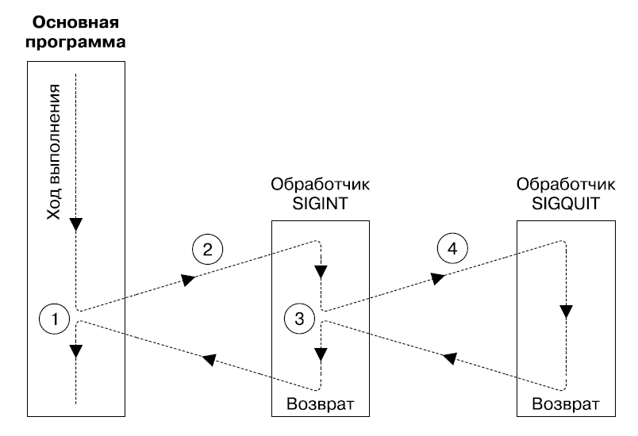

Ожидающие сигналы **реального времени** хранятся в **очереди**, поддерживают наличие дубликатов, порядок поступления и доставляются в строгой очередности:

+ *меньшие номера* сигналов приоритетнее;
+ из двух сигналов с *одинаковым номером* приоритетным является *первый поступивший* в очередь.

В своих классах и стандартные, и сигналы реального времени используют один и тот же описанный ваше алгоритм доствки - только для реального времени сканируется не маска, а опустошается очередь в соответствии с правилами.

Стандартные сигналы в Linux доставляются перед сигналами реального времени.

## 8.5. Блокировка и ожидание сигналов

### 8.5.1. Заблокированные и ожидающие сигналы

Когда процесс получает сигнал, то он добавляется в расположенный в ядре **набор ожидающих сигналов (sigpending)**. Также сигнал может оказаться в ожидающем наборе, если процесс, для которого он предназначен, еще *не запланирован для выполнения* на процессоре ядром.

Для **стандартных** сигналов **ожидающий набор** представляет из себя **маску** - невозможно определить порядок и количество дубликатов поступивших сигналов.

Для сигналов **реального времени** - **очередь** с приоритетом по номеру сигнала (меньше - приоритетнее) и времени поступления (для дубликатов).

---

```C
int sigpending(sigset_t *set);
```

Возвращает объединённый набор ожидающих сигналов (*стандартных* и *реального времени*) *всего процесса* и *вызывающего* потока.

---

Процесс может *заблокировать* доставку нежелательных для него сигналов - для этого они должны быть добавлены в **сигнальную маску**. *Собственная сигнальная маска* есть у каждого **потока** данного процесса, и в *многопоточных* приложениях для управления ею необходимо использовать специализированные функции интерфейса *POSIX-Threads*. В *однопоточных* приложениях допускается использование исторических вызовов, управляющих маской только текущего *вызывающего* потока.

Сигнал может оказаться в маске по следующим причинам:

+ сигнальная маска может быть явно задана вызовом `sigprocmask()`;
+ при активации *обработчика* вызвавший его сигнал автоматически добавляется в сигнальную маску - это определяется флагом `SA_NODEFER` вызова `sigaction()`;
+ при активации *обработчика* дополнительно могут быть заблокированы прочие сигналы - это определяется маской `sa_mask` вызова `sigaction()`.

Нахождение в *сигнальной маске* только **приостанавливает доставку** сигнала в процесс - он по-прежнему добавляется в *ожидающий набор* и будет доставлен при своем удаления из маски.

---

```C
int sigprocmask(
    int how,
    const sigset_t *set,
    sigset_t *oldset);
```

Изменяет сигнальную маску *вызывающего потока* определенным в аргументе `how` образом:

+ `SIG_BLOCK` - добавляет набор сигналов `set` в сигнальную маску;
+ `SIG_UNBLOCK` - удаляет набор сигналов `set` из сигнальной маски;
+ `SIG_SETMASK` - устанавливает набор сигналов `set` в качестве сигнальной маски.

Прошлое значение сигнальной маски возвращается в аргументе `oldset`. Для получения текущего значения маски в `oldset` без его изменения можно в аргумент `set` передать `NULL`.

Данный вызов можно использовать только в **однопоточных приложениях** - для *многопоточных* поведение *НЕ определено*.

---

```C
int pthread_sigmask(
    int how,
    const sigset_t *set,
    sigset_t *oldset);
```

Аналог вызова `sigprocmask()` из состава интерфейса POSIX-Threads, предназначенный для использования в **многопоточных приложениях**.

### 8.5.2. Приостановка процесса в ожидании сигнала

```C
int pause();
```

*Приостанавливает* процесс до тех пор, пока данный вызов не будет прерван доставкой некоторого сигнала, приводящей к выполнению обработчика или завершению процесса.

---

```C
int sigsuspend(const sigset_t *mask);
```

Заменяет *сигнальную маску* процесса указанным набором, затем *приостанавливает* процесс до получения некоторого сигнала и стандартного завершения его обработчика, после восстанавливает исходную сигнальную маску и возвращает ошибку `EINTR`.

---

```C
int sigwaitinfo(
    const sigset_t *set,
    siginfo_t *info);
```

Используется для *синхронной* доставки сигналов: *приостанавливает* процесс до тех пор, пока хотя бы один из перечисленных в `set` сигналов не окажется в *ожидающем наборе*, после удаляет его из ожидающих и возвращает его номер. Опустошение ожидающего набора подчиняется описанному ранее приоритету доставки сигналов.

Данный вызов *необходимо* использовать совместно с *предварительной блокировкой* `sigprocmask(set)` интересующих нас сигналов во избежание *состояния гонки (race condition)* между поступлением сигнала и его синхронным ожиданием: мы можем не успеть приостановить процесс, и доставка сигнала будет осуществлена согласно его диспозиции.

Если аргумент `info != NULL`, то он будет заполнен структурой `siginfo_t` с информацией о доставленном сигнале.

---

```C
int sigwait(
    const sigset_t *set,
    int *sig);
```

Более простой аналог вызова `sigwaitinfo()`, который в аргументе `sig` возвращает только номер сигнала вместо структуры `siginfo_t`.

---

```C
int sigtimedwait(
    const sigset_t *set,
    siginfo_t *info,
    const timespec *timeout);
```

Аналог вызова `sigwaitinfo()`, позволяющий указывать период ожидания сигнала. Если поля структуры `timespec` заполнены нулями, то вызов выполняет моментальный опрос и сразу возвращается.

---

```C
int signalfd(int fd, const sigset_t *set, int flags);

struct signalfd_siginfo {
    uint32_t ssi_signo;
    int32_t ssi_errno;
    int32_t ssi_code;
    uint32_t ssi_pid;
    uint32_t ssi_uid;
    int32_t ssi_fd;
    uint32_t ssi_tid;
    uint32_t ssi_band;
    uint32_t ssi_overrun;
    uint32_t ssi_trapno;
    int32_t ssi_status;
    int32_t ssi_int;
    uint64_t ssi_ptr;
    uint64_t ssi_utime;
    uint64_t ssi_stime;
    uint64_t ssi_addr;
};
```

Аналог вызова `sigwaitinfo()`, позволяющий считывать информацию об ожидающих сигналах из *сигнального файлового дескриптора* в виде набора структур типа `signalfd_siginfo`.

Если аргумент `fd = 1`, то возвращает новый дескриптор, иначе модифицирует существующий, который был создан прошлым вызовом.

Аргумент `flags` может содержать флаги:

+ `SFD_CLOEXEC` - установить для дескриптора `fd` флаг *close-on-exec*;
+ `SFD_NONBLOCK` - установить для дескриптора `fd` *неблокирующий* режим.

Из созданного *сигнального файлового дескриптора* необходимо считывать (через обыкновенный `read()`) хотя бы по одной структуре `signalfd_siginfo` (её поля аналогичны структуре `siginfo_t`) - соответствующий сигнал будет потребляться и удаляться из ожидающего набора.

*Cигнальный файловый дескриптор* обычно используют для доставки сигналов с использованием механизмов мультиплексирования ввода/вывода `select()/poll()/epoll()`.

## 8.6. Обработчики сигналов

**Обработчик сигнала** - функция, вызываемая процессом при получении сигнала.

Поступление сигнала, для которого зарегистрирован обработчик, приводит к следующей последовательности событий:

1. приостановка текущего выполняемого процессом кода;
2. выполнение обработчика *ядром от имени процесса* в *пространстве пользователя*;
3. возобновление выполнения кода программы с места его приостановки.

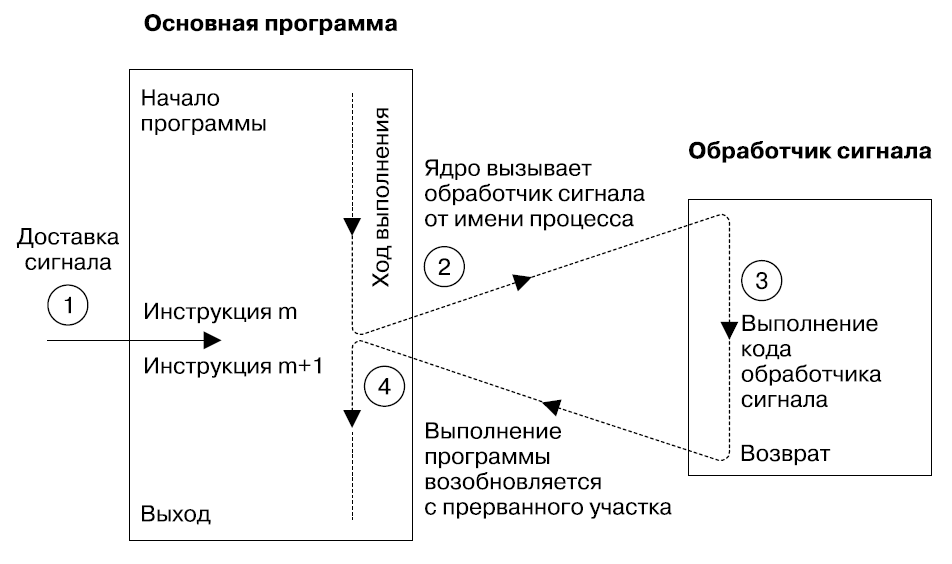

Естественно, обработчик внутри себя может вызывать другие функции, однако НЕ любая функция может быть свободно вызвана внутри обработчика.

Функция является **реентерабельной**, если она может быть повторно вызвана ДО своего завершения, и это НЕ повлияет на результаты её вызовов. Также говорят, что функция *реентерабельна*, если результаты её изначального и повторного, начатого ДО завершения изначального, вызовов совпадают с результатами последовательных (по порядку) вызовов данной функции.

Более мягким требованием к функции является **потоковая безопасность** - результаты одновременных вызовов функции *в разных потоках* совпадают с результатами последовательных вызовов функции *в одном потоке*.

Функция может стать *нереентерабельной*, если она модифицирует значения переменных *в своём окружении*. Если функция модифицирует только свои внутренние автоматические переменные (такие, к которым нет доступа НЕ из кода ДАННОГО КОНКРЕТНОГО вызова), то она ГАРАНТИРОВАННО является *реентерабельной*.

**Безопасной для асинхронного сигнала** является такая функция, которая может быть вызвана из его *обработчика* без нарушения работоспособности программы. Функция будет являться безопасной, если она:

+ **реентерабельна**;
+ **непрерываемая** - системные вызовы с конечным временем выполнения (не относящиеся к вводу/выводу), которые не переводят процесс в *состояние сна*.

Использование в обработчиках сигналов *небезопасных* функций, т.е. тех, которые модифицируют *глобальные* или *статические* переменные (в пространствах пользователя либо ядра), сопряжено с риском повреждения информации вследствие **гонки данных (data race)**. Действительно, если основная программа вызывает небезопасную функцию, которая в момент модификации данных в своём окружении прерывается обработчиком сигнала, вызывающим её же, то текущее состояние функции начинает перезаписываться поверх без предварительной деинициализации - это гарантированно приведет к сбою по возвращении из обработчика в основную программу.

В стандарте **Single UNIX Specification** приводится минимальный список безопасных системных вызовов и библиотечных функций. Единственная особенность - нужно следить за переменной **errno**, т.к. она может быть перезаписана в обработчике сигнала.

Переменные, обрабатываемые в основной программе и в обработчике сигнала, должны помечаться ключевым словом `volatile` во избежание их оптимизации компилятором. `sig_atomic_t` - целочисленный тип данных, специально определенный в стандарте с гарантией **атомарного чтения и записи**. Принимает значения в пределах `SIG_ATOMIC_MIN` и `SIG_ATOMIC_MAX`.

```C
volatile sig_atomic_t flag;
```

### 8.6.1. Установка диспозиций сигналов

```C
typedef void(*sighandler_t)(int);

sighandler_t signal(
    int sig,
    sighandler_t handler);
```

Устанавливает для указанного сигнала `sig` новую *диспозицию* `handler` и возвращает его предыдущую *диспозицию*.

Аргумент `handler` определяет одну из возможных диспозиций сигнала и может содержать:

+ указатель на *функцию-обработчик* сигнала;
+ константа `SIG_DFL` - *поведение по умолчанию*;
+ константа `SIG_IGN` - *игнорирование* сигнала.

Данный вызов **НЕ ПЕРЕНОСИМ** - вместо него следует использовать вызов `sigaction()`.

---

```C
struct sigaction
{
    union {
        void (*sa_handler)(int);
        void (*sa_sigaction)(int, siginfo_t*, void*);
    } __sigaction_handler;
    sigset_t sa_mask;
    int sa_flags;
    void (*sa_restorer)(void);
};

#define sa_handler __sigaction_handler.sa_handler
#define sa_sigaction __sigaction_handler.sa_sigaction

int sigaction(
    int sig,
    const struct sigaction *act,
    struct sigaction *oldact);
```

Устанавливает для указанного сигнала `sig` новую *диспозицию* `act` и возвращает его предыдущую *диспозицию* `oldact`.

Структура `sigaction`, описывающая диспозицию сигнала, содержит следующий набор полей:

+ `sa_handler` - содержит одну из возможных диспозиций сигнала:
  + указатель на *функцию-обработчик* сигнала;
  + *поведение по умолчанию* `SIG_DFL`;
  + *игнорирование* сигнала `SIG_IGN`;
+ `sa_sigaction` - указатель на функцию-обработчик с расширенной сигнатурой (используется ТОЛЬКО при установке флага `SA_SIGINFO`);
+ `sa_mask` - маска сигналов, *дополнительно блокируемых* **на время выполнения обработчика**. Вызвавший срабатывание обработчика сигнал *блокируется автоматически*.

  После возвращения из обработчика *сигнальная маска* **восстанавливает** своё **исходное значение**: обработчик может даже попытаться заблокировать прочие сигналы вручную через `sigprocmask()` - все эти изменения будут потеряны при выходе из него;

+ `sa_flags` - маска флагов, управляющих поведением вызова:
  + `SA_NOCLDSTOP` - если сигналом `sig` является `SIGCHILD`, то не генерировать `SIGCHILD` при *приостановке/возобновлении дочернего* процесса;
  + `SA_NOCLDWAIT` - если сигналом `sig` является `SIGCHILD`, то не превращать *дочерние* процессы в **зомби** при их *завершении*, а сразу удалять их;
  + `SA_NODEFER` - не блокировать автоматически сигнал `sig` на время выполнения его обработчика;
  + `SA_ONSTACK` - использовать для обработчика **альтернативный сигнальный стек** `signalstack()`;
  + `SA_RESETHAND` - сбросить диспозицию сигнала на *действие по умолчанию* ПЕРЕД активацией его обработчика;
  + `SA_RESTART` - **автоматически перезапустить** блокирующий системный вызов (с неопределенным временем завершения: ввод/вывод, синхронизация и проч.), который оказался прерван доставкой сигнала в процесс с ошибкой `EINTR`.

    ПОДДЕРЖИВАЮТ перезапуск:

    + ожидание дочернего процеса: `wait()`, `waitpid()`, `wait3()`, `wait4()` и `waitid()`;
    + ввод/вывод: `open()`, `read()`, `readv()`, `write()`, `writev()` и `ioctl()`;
    + сокеты: `accept()`, `accept4()`, `connect()`, `send()`, `sendmsg()`, `sendto()`, `recv()`, `recvfrom()` и `recvmsg()`; **НЕ перезапускаются**, если на сокете был установлен таймаут через `setsockopt()`;
    + очереди сообщений POSIX: `mq_receive()`, `mq_timedreceive()`, `mq_send()` и `mq_timedsend()`;
    + файловые блокировки: `flock()`, `fcntl()` и `lockf()`;
    + `futex(FUTEX_WAIT)`;
    + семафоры POSIX: `sem_wait()` и `sem_timedwait()`;
    + потоки POSIX: `pthread_mutex_lock()`, `pthread_mutex_trylock()`, `pthread_mutex_timedlock()`, `pthread_cond_wait()` и `pthread_cond_timedwait()`.

    НИКОГДА НЕ перезапускаются:

    + мультиплексирование ввода/вывода: `select()`, `pselect()`, `poll()`, `ppoll()`, `epoll_wait()` и `epoll_pwait()`;
    + `io_getevents()`;
    + семафоры и очереди сообщений SYSTEM V: `semop()`, `semtimedop()`, `msgrcv()` и `msgsnd()`;
    + `read(inotify)`;
    + ожидание доставки сигнала: `pause()`, `sigsuspend()`, `sigtimedwait()` и `sigwaitinfo()`.

  + `SA_SIGINFO` - использовать для функции-обработчика **расширенную сигнатуру** `sa_sigaction`, позволяющую передавать вместе с сигналом сопутствующие данные.

    Сигнатура обработчика в этом случае принимает вид:

    ```C
    struct {
        int si_signo;
        int si_code;
        int si_trapno;
        sigval si_value;
        pid_t si_pid;
        uid_t si_uid;
        int si_errno;
        void* si_addr;
        int si_overrun;
        int si_timerid;
        long si_band;
        int si_fd;
        int si_status;
        clock_t si_utime;
        clock_t si_stime;
    } siginfo_t;

    void (*sa_sigaction)(
        int /*sig*/,
        siginfo_t* /*siginfo*/,
        void* /*ucontext*/);
    ```

    Поля структуры `siginfo`:

    + `si_signo` - номер сигнала; совпадает с аргументом  `sig`;
    + `si_code` - код с информацией об источнике сигнала: `SI_ASYNCIO`, `BUS_ADREER`, `FPE_FLTDIV` и т.д.;
    + `si_value` - сопутствующие данные, отправленные в сигнал вызовом `sigqueue()`;
    + `si_pid` - PID процесса-отправителя сигнала;
    + `si_uid` - реальный UID процесса-отправителя сигнала;
    + `si_addr` - адрес памяти, вызвавшей генерацию сигнала об аппаратной ошибке: `SIGSEGV`, `SIGFPE` и т.д.;
    + `si_timerid`, `si_overrun` - описание сигналов *интервальных таймеров POSIX*: идентификтар таймера и счетчик повторных срабатываний;
    + `si_band`, `si_fd` - описание события ввода/вывода;
    + `si_status`, `si_utime`, `si_stime` - описание дочернего процесса для сигнала `SIGCHLD`.

    Аргумент `ucontext` - содержит указатель на структуру типа `ucontext_t` с информацией о пользовательском контексте процесса в момент перед активацией обработчика сигнала.

+ `sa_restorer` - служебное поле, используемое ядром для восстановления контекста процесса после обработки сигнала.

### 8.6.2. Нелокальный переход из обработчика

Иногда нужно завершить *обработчик сигнала*, вернувшись в конкретный участок программы, и при этом восстановить исходное значение *сигнальной маски* процесса, которая могла быть модифицирована обработчиком.

Например, это может потребоваться, чтобы восстановить работоспособность программы после получения сигнала, сгенерированного аппаратным исключением, и выполнить её *штатное завершение*. Однако продолжать стандартное выполнение программы, которая выполнила *нелокальный переход из обработчика*, НЕ рекомендуется, т.к. в этом случае не были произведена правильная деинициализация обработчика, и полный набор служебных структур ядра, описывающих контекст и состояние процесса, не был полностью возвращен в изначальное состояние режима пользователя.

```C
int sigsetjmp(
    sigjmp_buf env,
    int savesigs);

void siglongjmp(
    sigjmp_buf env,
    int val);
```

Устанавливает в теле функции цель, в которую затем можно вернуться из обработчика. Сигнальная маска, актуальная в момент задания точки возврата, может быть автоматически сохранена в аргумент `env` и восстановлена при совершении перехода, если аргумент `savesigs` $\neq$ 0.

---

```C
void abort();
```

Завершает вызывающий процесс с созданием файла **дампа ядра** путем отправки сигнала `SIGABRT`. Также сбрасывает и закрывает *потоки stdio*.

Игнорирование/блокировка `SIGABRT` защищает процесс только **внешних** сигналов, т.к. функция работает по следующему алгоритму, гарантирующему завершение процесса:

1. `abort()` отправляет первый сигнал `SIGABRT` в процесс;
2. если после этого выполнение функции продолжается: т.е. сигнал игнорируется через диспозицию `SIG_IGN`, блокируется сигнальной маской, или для него установлен обработчик, выполняющий обыкновенный возврат;
3. то `abort()` удаляет сигнал из маски, сбрасывает его диспозицию на поведение по умолчанию `SIG_DFL` и отправляет его повторно - повторная доставка гарантированно завершит процесс.

Единственный способ продолжить выполнение кода программы после вызова `abort()` - это определить для данного сигнала обработчик, выполняющий *нелокальный переход* `siglongjmp()`.

### 8.6.3. Альтернативный сигнальный стек

При активации обработчика ядро выделяет для него фрейм на стеке процесса. Если стек не может быть расширен (столкнулись с кучей, отображенной памятью, достигли ограничения), то процессу будет послан сигнал `SIGSEGV` - даже если установлен его обработчик, то и он не может быть вызван, поэтому просто произойдет аварийное завершение процесса. Для таких случаев ядру можно указать, что для вызова обработчика `SIGSEGV` (но также и любого другого сигнала) следует использовать отдельный выделенный участок памяти - **альтернативный сигнальный стек**. Это позволит такому обработчику выполнить очистку и корректно завершить процесс или попытаться восстановить его работоспособность.

Последовательность действий:

1. Заранее выделить непрерывный участок памяти, в котором будет размещаться альтернативный стек;
2. Применить системный вызов `signalstack()` для информирования ядра о его наличии;
3. При установке обработчика сигнала через `sigaction()` указать флаг `SA_ONSTACK` для информирования ядра, что кадры для него нужно выделять в альтернативном стеке;

```C
struct stack_t {
    void* ss_sp;
    int ss_flags;
    size_t ss_size;
};

int signalstack(
    const stack_t* sigstack,
    stack_t* old_sigstack);
```

Создаёт новый **альтернативный сигнальный стек** и возвращает предыдущий (если он использовался). Аргументы вызова могут принимать `NULL`, например, если просто требуется извлечь информацию о текущем альтернативном стеке.

Поля структуры:

+ `ss_sp` - начальный адрес альтернативного стека;
+ `ss_size` - размер альтернативного стека. существуют константы `SIGSTKSZ` для типичного и `MINSIGSTKSZ` минимального размеров;
+ `ss_flags` - содержит флаги на выбор:

  + `SS_ONSTACK` - если предыдущий стек возвращается с этим флагом, то процесс *прямо сейчас* выполняется на альтернативном стеке, и попытка создания нового приведет к ошибке;
  + `SS_DISABLE` - если предыдущий стек возвращается с этим флагом, то процесс не используется альтернативный стек. если флаг указан в новом стеке, то отключает использование альтернативного стека.

Ядро не изменяет размер альтернативного стека и не отслеживает его границы. При переполнении альтернативные кадры либо начнут перезаписывать окружающие данные, либо приведут к ошибке сегмента (если попали в невыделенную страницу памяти).

## 8.7. Сигналы реального времени

Дополнительный набор сигналов, который расширяет возможности оповещения пользовательских программ об интересующих их событиях:

+ предоставляет более обширный набор номеров пользовательских сигналов в дополнение к двум 2 стандартным `SIGUSR1` и `SIGUSR2`. Количество предоставляемых в Linux сигналов указано в константе `RTSIG_MAX = 33`. Номера таких сигналов лежат в пределах между `SIGRTMIN` и `SIGRTMAX`.
+ сигналы реального времени ставятся в **очередь** - можно определить количество доставленных сигналов и их порядок;
+ гарантируется очередность доставки: *меньшие номера* являются *более приоритетными*, *дубликаты* доставляются в *порядке добавления* в очередь. *Стандартные* сигналы всегда доставляются ПЕРЕД сигналами *реального времени*;
+ при отправке сигнала реального времени в него можно положить *дополнительные данные*.

Длина очереди сигналов реального времени равняется минимум `_POSIX_SIGQUEUE_MAX = 2`. Константа `RLIMIT_SIGPENDING` определяет мягкое ограничение на общее количество сигналов в очередях всех процессов конкретного *реального UID*.

Сигналы реального времени *необходимо* отправлять специально предназначенным для этого вызовом `sigqueue()`. Для обработчиков сигналов реального времени *необходимо* активировать *расширенную сигнатуру* через `sigaction(SA_SIGINFO)`.

```C
union sigval {
    int sival_int;
    void* sival_ptr;
};

int sigqueue(
    pid_t pid,
    int sig,
    const sigval value);
```

Отправляет сигнал *реального времени* `sig` в указанный процесс. Если `sig = 0`, то вместо отправки сигнала выполняет проверку прав процесса-отправителя на возможность его доставки получателю. Алгоритм проверки прав совпадает с описанным в вызове `kill()`.

Аргумент `pid` не может принимать отрицательные значения для отправки сигналов в другие *группы процессов*.

Аргумент с типом `sigval` содержит отправляемые вместе с сигналом данные. Чаще всего заполняют поле `sigval.sival_int`, содержащее целое число, т.к. указатель на память `sigval.sival_ptr` чаще всего теряет смысл при переходе между адресными пространствами процессов.

---

```C
int pthread_sigqueue(
    pthread_t thread,
    int sig,
    const union sigval value);
```

Аналогичная функция из состава интерфейса *POSIX-Threads*: отправляет *сигнал реального* времени `sig` в *поток* с хендлером `thread`, расположенный *в том же процессе*.

## 8.8. Отображение описаний сигналов

Текстовое описание всех стандартных сигналов содержится в специальном массиве, проиндексированном номерами сигналов:

```C
extern const char *const sys_siglist[];
```

Также описание сигналов может быть получено в результате вызова ряда функций.

---

```C
char *strsingnal(int sig);
```

Возвращает текстовое описание сигнала `sig`. Формат описания подчиняется настройкам установленной *локали*.

---

```C
void psignal(int sig, const char *msg);
```

Выводит в *стандартное устройство ошибок* `stderr` сообщение `msg`, сопровождаемое описанием сигнала `sig`. Формат вывода подчиняется настройкам установленной *локали*.

---

```C
void psiginfo(const siginfo_t* siginfo, const char *msg);
```

Выводит в *стандартное устройство ошибок* `stderr` сообщение `msg`, сопровождаемое описанием сигнала из структуры `siginfo`.

# 9. Разделяемые библиотеки

*Библиотека объектов* - единая сущность, объединяющая в себе несколько объектных файлов. Библиотеки могут быть:

+ **статическими** - `*.a`;
+ **динамическими** - `*.so`.

## 9.1. Статические библиотеки

**Статическая библиотека** - *файл-архив*, содержащий отдельные копии всех размещенных в нем объектных файлов. Для каждого объектного файла также хранятся его атрибуты: права доступа, идентификаторы пользователя и группы, время последнего изменения. При компоновке *статической библиотеки* с программой (выполняется утилитой `ld`, неявно вызываемой компилятором) объектные модули библиотеки физически копируются в тело бинарного файла программы.

Плюсы:

+ используемый в различных программах код можно один раз скомпилировать, а затем просто компоновать с программами;

Минусы:

+ т.к. каждая программа, использующая данную статическую библиотеку, хранит в своём файле её отдельный дубликат, то возникает перерасход дискового пространства;
+ т.к. каждая программа, использующая данную статическую библиотеку, загружает из своего файла в свою виртуальную память её отдельный дубликат, то возникает перерасход оперативной памяти;
+ при изменении статической библиотеки, все использующие её программы нужно заново с ней скомпоновать.

Статическим библиотекам принято давать имена вида `libname.a`.

### 9.1.1. Создание статических библиотек

Для создания и редактирования бинарных файлов статических библиотек используется следующая команда:

`$ ar <options> <archive> <object_file> ...`

Аргумент `<options>` содержит код операции с модификаторами и принимает значения:

+ `r (replace)` - помещает объектный файл в библиотеку, заменяя уже существующий в ней при его наличии;
+ `t (table of contents)` - выводит список содержащихся в библиотеке объектных файлов; модификатор `v (verbose)`;
+ `d (delete)` - удаляет указанный объектный файл из библиотеки.

Затем бинарный код библиотечного модуля должен быть встроен в исполняемый файл программы - это выполняется **статическим компоновщиком** `ld`, неявно вызываемым компилятором при сборке программы.

> При **статической компоновке** с программой **статического или динамического модуля** его имя может быть указано одним из следующих способов:
>
> + **полное имя** файла библиотеки: `/path/to/libname.a`;
> + **название библиотеки с префиксом `-l`**: `-lname`;
>
>   Файл библиотеки при этом должен находиться в одном из стандартных библиотечных каталогов.
>
> + **название библиотеки с префиксом `-l`** и **путь до библиотечного каталога с префиксом `-L`**: `-lname -L/path/to/lib/`.

Пример:

```bash
# собираем статическую библиотеку.
cd /path/to/foo/
gcc -c foo1.cpp foo2.cpp
ar r libfoo.a foo1.o foo2.o
# собираем программу.
cd /path/to/prog/
gcc -c prog1.cpp prog2.cpp
gcc -o prog prog1.o prog2.o -lfoo -L/path/to/foo/
```

## 9.2. Разделяемые библиотеки

**Разделяемая (динамическая) библиотека** - бинарный файл, объединяющий в себе *как единое целое* *адресно-независимый* код объектных файлов, из которых он состоит. Файлы разделяемых модулей хранятся отдельно, и загружаются в память процесса программы при его старте **динамическим компоновщиком** `/lib/ld-linux.so`. Все программы, использующие один разделямый модуль, отображают свои виртуальные страницы на единственный набор содержащих его физических страниц - это способствует экономному использованию оперативной памяти.

Плюсы:

+ отсутствует дублирование кода библиотеки в файлах программ на диске;
+ в оперативной памяти находится только один экземпляр кода разделяемой библиотеки;
+ содержимое файла библиотеки можно изменять без необходимости проводить повторную компоновку с файлами программ.

Минусы:

+ разделяемые библиотеки должны компилироваться с поддержкой *адресно-независимового кода (PIC)*, использование которого влечет дополнительные издержки при выполнении программ.

> При использовании разделяемой библиотеки общим является только её код - определенные в библиотеке **глобальные и статические переменные** предоставляются разным программам в виде **отдельных копий**.

Разделяемым библиотекам принято давать имена вида `libname.so`.

Для файлов библиотек (как и для любых исполняемых файлов) используется формат **ELF** - **Executable and Linking Format**.

Загруженные процессом разделяемые библиотеки можно посмотреть в файле `/proc/PID/maps`.

### 9.2.1. Создание разделяемых библиотек

Бинарные файлы разделяемых библиотек целиком создаются компилятором (и неявно вызываемым им **статическим компоновщиком** `ld`) путем передачи ему специальных параметров:

+ исходные коды разделяемой библиотеки должны компилироваться с флагом `-fPIC` - *адресно-независимый код (PIC)*, который может быть размещен в любом участке виртуальной памяти процесса;
+ полученные объектные файлы должны компоноваться в один файл библиотеки с флагом `-shared`.

Затем **имя библиотеки** должно быть встроену в метку `DT_NEEDED` ELF-заголовка исполняемого файла программы - это также выполняется **статическим компоновщиком** `ld`, неявно вызываемым компилятором при сборке программы. В качестве имени библиотеки можно использовать:

+ **реальное имя** библиотеки: `libbar.so`;
+ **псевдоним soname** библиотеки: `libalias.so`.

    Псевдоним **soname** является абстрактым именем, записываемым в метку `DT_SONAME` ELF-заголовка *бинарника библиотеки* в момент её собственной **статической компоновки**. Для передачи желаемого имени используется параметр `-Wl,-soname`. Также в файловой системе для soname должна быть создана соответствующая **(символическая) ссылка**, указывающая на реальный файл библиотеки. В момент статической компоновки исполняемого *файла программы* с библиотечным модулем псевдоним переносится в метку `DT_NEEDED` вместо реального имени библиотеки, указанного в командах сборки.

Затем при запуске программы **динамический компоновщик** `/lib/ld-linux.so` ищет все файлы библиотечных модулей, расположенные в **списке динамических зависимостей** (множество всех меток `DT_NEEDED`), и загружает их в виртуальную память процесса. Процесс загрузки является **рекурсивным**: если библиотечный модуль содержит собственный список зависимостей, то будет загружено всё дерево зависимостей. **Библиотеки, присутствующие в дереве зависимостей многократно, загружаются только один раз во время своей первой обработки компоновщиком!** При последующих обнаружениях загруженной библиотеки в дереве она просто игнорируется. *Динамический компоновщик* сам является разделяемой библиотекой и присутствует в списке зависимостей любых исполняемых файлов, использующих разделяемые библиотеки.

Пример:

```bash
# собираем разделяемую библиотеку.
cd /path/to/bar/
gcc -c -FPIC bar1.c bar2.c
gcc -shared -Wl,-soname,libalias.so -o libbar.so bar1.o bar2.o
# создаем символическую ссылку для soname.
ln -s /path/to/bar/libbar.so /path/to/alias/libalias.so
# собираем программу.
cd /path/to/prog/
gcc -c prog1.cpp prog2.cpp
gcc -o prog prog1.o prog2.o -lalias -L/path/to/alias/
```

Поиск библиотечных файлов **динамическим компоновщиком** выполняется в следующих местах:

+ каталоги, перечисленные в переменной окружения `LD_LIBRARY_PATH`; **НЕ рекомендуется использовать!**
+ стандартные библиотечные каталоги системы:
  + `/lib` - содержит библиотеки, необходимые во время загрузки системы;
  + `/usr/lib` - содержит большинство прикладных библиотек;
  + `/usr/local/lib` - содержит нестандартные или экспериментальные библиотеки;
+ каталоги, перечисленные в *файле конфигурации динамического компоновщика* `/etc/ld.so.conf` и перенесенные в его *кэш* `/etc/ld.so.cache`;
+ каталоги, перечисленные в *списке путей времени выполнения (rpath)*, который располагается в метках `DT_RPATH` или `DT_RUNPATH`.

    Список путей времени выполнения формируется в момент **статической компоновки** бинарного файла. Передача параметра `-Wl,-rpath` заполняет *устаревшую* метку `DT_RPATH`. Передача дополнительного параметра `-Wl,--enable-new-dtags` заполняет новую метку `DT_RUNPATH` (старая метка по-прежнему заполняется для обратной совместимости, а новые компоновщики просто её игнорируют). Разница между метками заключается в приоритете их просмотра: `DT_RPATH > LD_LIBRARY_PATH > DT_RUNPATH`.

    Параметр `-rpath` поддерживает специальную переменную `$ORIGIN` в составе пути, которая будет представлять **каталог, содержащий запускаемое приложение**.

    На этапе **статической компоновки** вместо параметра `-rpath` можно использовать переменную окружения `LD_RUN_PATH`, однако она учитывается, только если `-rpath` НЕ был задан.

    Пример:

    ```bash
    # собираем разделяемую библиотеку.
    cd /path/to/prog/to/bar/
    gcc -c -fPIC bar1.cpp bar2.cpp
    gcc -shared -o libbar.so bar1.o bar2.o
    # собираем программу.
    cd /path/to/prog/
    gcc -c prog1.cpp prog2.cpp
    gcc -Wl,--enable-new-dtags -Wl,-rpath,'$ORIGIN'/to/bar/ -o prog prog1.o prog2.o -lbar -L/path/to/prog/to/bar/
    ```

Порядок поиска **динамическим компоновщиком** файла разделяемой библиотеки в файловой системе строго задан:

1. Если запись, определяющая некоторую зависимость в метке `DT_NEEDED` бинарного файла, содержит символ-разделитель `/` (это может быть, если при статической компоновке вместо названия библиотеки было указано *путевое имя* её файла), то загрузка библиотеки выполняется непосредственно по данному путевому имени;
2. Иначе если бинарный файл содержит непустую метку `DT_RPATH`, а метка `DT_RUN_PATH` при этом отсутствует, то поиск зависимости выполняется в её каталогах в порядке их следования (заданном в момент статической компоновки);
3. Затем если задана переменная окружения `LD_LIBRARY_PATH`, то поиск зависимости выполняется в её каталогах в порядке их следования. Если запускаемая программа устанавливает биты *set-user-ID* или *set-group-ID*, то данная переменная **игнорируется в целях безопасности**;
4. Затем если бинарный файл содержит непустую метку `DT_RUNPATH`, то поиск зависимости выполняется в её каталогах в порядке их следования (заданном в момент статической компоновки);
5. Затем поиск зависимости выполняется в каталогах из кэша динамического компоновщика `/etc/ld.so.cache` в порядке их следования;
6. Затем поиск зависимости выполняется в каталоге `/lib` и после в `/usr/lib`.

### 9.2.2. Разрешение символов на этапе выполнения

#### 9.2.2.1. Формат ELF

Используемым на сегодняшний день форматом исполняемых бинарных файлов является **Executable and Linkable Format (ELF)**, общий для программ и библиотек (статических и разделяемых). Он определяет ряд заголовков с метаинформацией, помогающей ядру верно сконструировать процесс в памяти из образа программы на диске.

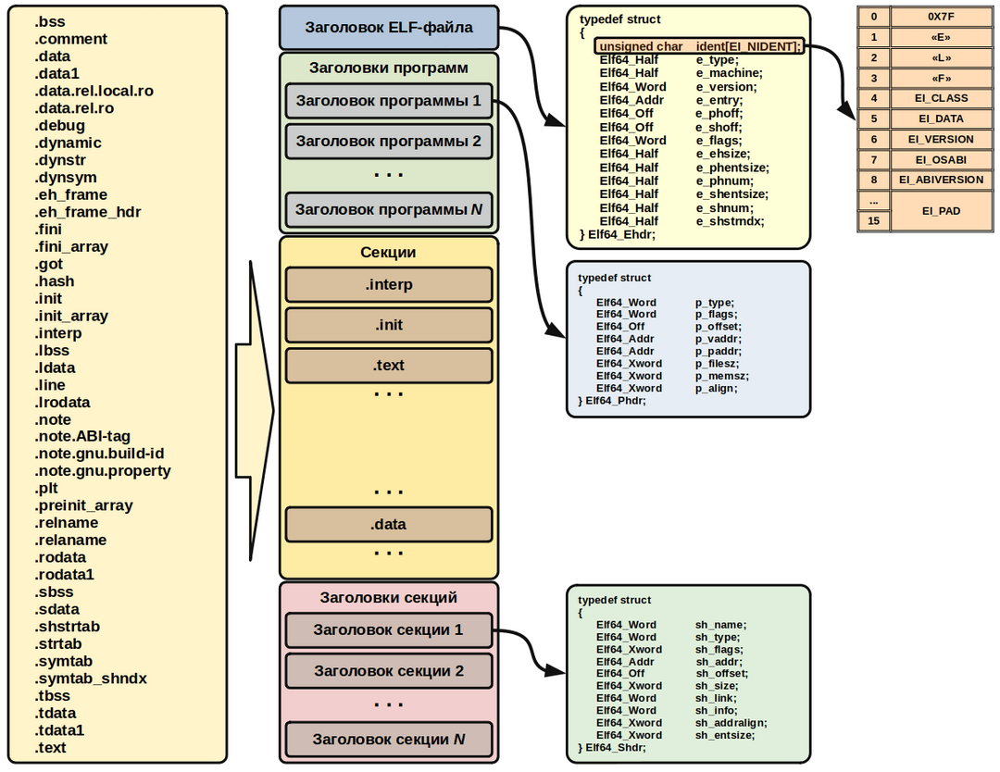

Первым таким заголовком является обязательный *заголовок ELF-файла* (**ELF Header**), всегда располагающийся в самом начале образа программы на нулевом смещении. Он предоставляет общее описание исполняемого файла и содержит следующий набор полей:

```C++
struct Elf64_Ehdr {
    unsigned char e_ident[EI_NIDENT];
    Elf64_Half e_type;
    Elf64_Half e_machine;
    Elf64_Word e_version;
    Elf64_Addr e_entry;
    Elf64_Off e_phoff;
    Elf64_Off e_shoff;
    Elf64_Word e_flags;
    Elf64_Half e_ehsize;
    Elf64_Half e_phentsize;
    Elf64_Half e_phnum;
    Elf64_Half e_shentsize;
    Elf64_Half e_shnum;
    Elf64_Half e_shstrndx;
};
```

+ `e_ident` - общая характеристика файла, закодированная в массив байт;
  + содержит 3 байта со значениями `ELF`, указывающими на использование бинарным файлом данного формата;
  + содержит информацию об *ABI* программы;
+ `e_entry` - точка входа исполняемого файла: виртуальный адрес первой инструкции;
+ `e_ehsize` - размер *ELF Header*;
+ `e_phoff` - смещение в файле, по которому располагается *ELF Program Header Table*;
+ `e_phentsize` - размер записи *ELF Program Header Table*;
+ `e_phnum` - число записей в *ELF Program Header Table*;

*Заголовки сегментов ELF-файла* располагаются в *таблице заголовков программы* (**ELF Program Header Table**). **ELF-сегмент** представляет собой *набор смежных фрагментов* кода или данных, который должен быть загружен в память процесса ядром с помощью вызова `mmap()`. Свойства и местоположение каждого *ELF-сегмента* описываются его *программным заголовком* (**ELF Program Header**), который имеет следующую структуру:

```C++
struct Elf64_Phdr {
    Elf64_Word p_type;
    Elf64_Word p_flags;
    Elf64_Off p_offset;
    Elf64_Addr p_vaddr;
    Elf64_Addr p_paddr;
    Elf64_Xword p_filesz;
    Elf64_Xword p_memsz;
    Elf64_Xword p_align;
};
```

+ `p_type` - тип данного сегмента:
  + `PT_LOAD` - сегмент, загружаемый в память процесса: *текст* или *данные* программы;
  + `PT_INTERP` - сегмент с путем до исполняемого файла **динамического компоновщика**;
+ `p_offset` - смещение в файле, по которому располагается сегмент;
+ `p_filesz` - размер сегмента в файле;
+ `p_vaddr` - виртуальный адрес в памяти процесса, по которому должен быть загружен данный сегмент;
+ `p_memsz` - размер, который сегмент должен иметь после загрузки в память процесса;
+ `p_flags` - флаги доступа к страницам памяти, в которые оказался загружен сегмент:
  + `PF_X` - разрешение на выполнение;
  + `PF_W` - разрешение на запись;
  + `PF_R` - разрешение на чтение.

Логически обособленный фрагмент кода или данных программы называется **ELF-секцией**. *ELF-сегмент* может содержать 0 или более *ELF-секций*. Бинарный исполняемый файл ELF-формата включает как минимум 4 *секции*:

+ `text` - программный код;
+ `rodata` - константные данные только для чтения;
+ `data` - инициализированные в момент компиляции изменяемые данные;
+ `bss` - неинициализированные данные, которые не занимают места в образе программы, а при загрузке обнуляются в памяти.

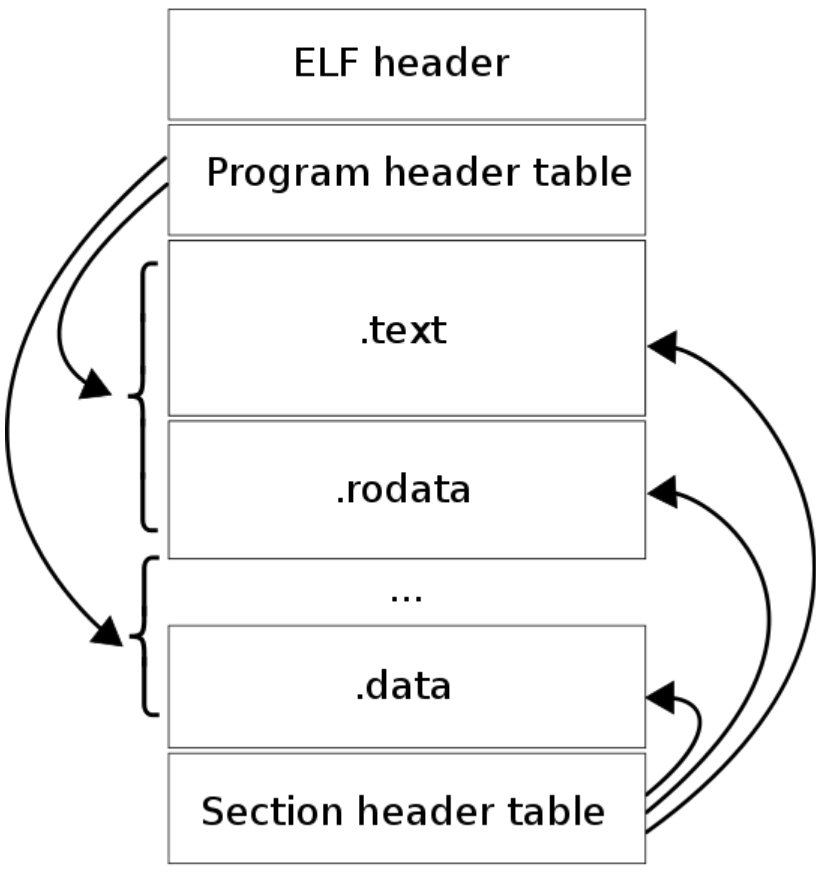

Свойства и расположение всех *ELF-секций* описывается в *таблице заголовков секций* (**ELF Section Header Table**). Деление образа программы с точностью до *секций* требуется только для обеспечения работы **динамического компоновщика**, выполняющего загрузку *динамических зависимостей* (разделяемых библиотек) программы. *Заголовок ELF-секции* (**ELF Section Header**) имеет следующую структуру:

```C++
struct Elf64_Shdr {
    Elf64_Word  sh_name;
    Elf64_Word  sh_type;
    Elf64_Xword sh_flags;
    Elf64_Addr  sh_addr;
    Elf64_Off   sh_offset;
    Elf64_Xword sh_size;
    Elf64_Word  sh_link;
    Elf64_Word  sh_info;
    Elf64_Xword sh_addralign;
    Elf64_Xword sh_entsize;
};
```

+ `sh_name` - имя секции;
+ `sh_type` - тип секции;
  + `SHT_PROGBITS` - секция содержит информацию, целиком определяемую и используемую программой (например, `text`, `data` и прочие);
  + `SHT_DYNAMIC` - секция содержит таблицу *динамических зависимостей* программы, в которую для каждой разделяемой библиотеки программы заносится запись с флагом `DT_NEEDED`.

#### 9.2.2.2. Symbol relocations

Все содержимое программы размещается в памяти её процесса по заранее определенным при её сборке адресам (механизм *Address space layout randomization* и *Position-independent executable (PIE)* программы не обсуждаем). Это возможно благодаря применению Linux *механизма виртуальной памяти*, позволяющего каждому процессу целиком использовать адресное пространство как своё собственное - бесконфликтное отображение виртуальных адресов на физические страницы оперативной памяти выполняет операционная система. В результате при **статической компоновке** программы из множества объектных файлов в места всех *ссылок* на *символы* (в места обращений к функциям и данным в коде) могут быть записаны их финальные фиксированные адреса - этот процесс называется *перемещением времени компоновки* (**link-time relocation**) и выполняется **статическим компоновщиком**. Любая последующая модификация кода программы во время выполнения невозможна, т.к. страницы с её *текстовым сегментом* в памяти процесса доступны только для чтения. Также для программы заранее известна *точка входа (entry point address)* - виртуальный адрес первой инструкции её текстового сегмента.

Разделяемые библиотеки ELF-формата часто называют **Dynamic Shared Objects (DSOs)**. Их особенностью является то, что при загрузке в различные процессы они размещаются в различных областях их памяти. Следовательно, адреса точки входа и символов библиотеки не могут быть известны заранее - они должны корректироваться с учетом структуры текущего виртуального пространства.

Существует 2 подхода к корректировке адресов содержимого DSO:

1. **Load-time relocation** - перемещение времени загрузки.

    При сборке DSO все её символы размещается по фиктивным адресам (очевидно, что точка входа тоже фиктивна). В места ссылок на символы записываются фиктивные значения. В ELF-секцию *DSO* `rel.dyn` помещается *таблица динамических перемещений*, и для каждой ссылки, требующей корректировки, в ней создаётся описывающая её запись. Внутри DSO корректировки требуют:

   + ссылки на данные - обращение к ним идет по абсолютным адресам, а не относительными смещениями;
   + ссылки на функции с *внешней* компоновкой - их определения видны вне родной *единицы трансляции*, и могут быть перезаписаны в программе или другой DSO. Для функций с *внутренней* компоновкой перемещение не требуется, т.к. обращение к ним происходит только в пределах одной единицы *трансляции* по относительному смещению.

    Также при необходимости ELF-секция `rel.dyn` может быть создана и для файла *программы*. Например, если программа *объявляет* в себе (через `extern`) *определенную* в библиотеке переменную, то ссылки на эту переменную в программе должны быть окончательно скорректированы уже во время *статической компоновки*, т.к. текстовый сегмент программы не допускает запись в рантайме. Поэтому в образе программы (в *сегменте данных*) для такой переменной будет сразу выделено место, а в таблице `rel.dyn` *программы* будет создана запись, инициализирующая её определенным в библиотеке значением. В корректировках, описываемых таблицей `rel.dyn` *библиотеки*, будет использоваться адрес переменной из образа программы.

    Затем при загрузке DSO в момент запуска программы **динамический компоновщик** разместит образ DSO в некоторой области виртуального пространства процесса, в результате чего все её символы приобретут свои фактические адреса. Затем будут выполнены все описываемые в таблицах `rel.dyn` корректировки ссылок.

    Данный подход **НЕ рекомендуется** использовать, т.к.:

   + корректировка адресов в коде DSO означает, что *её* текстовый сегмент в памяти процесса должен быть доступен для записи - это небезопасно;
   + модификация текстового сегмента DSO означает, что различные процессы не могут отображать свои виртуальные страницы на общий набор физических страниц с кодом DSO. Это нивелирует существенное преимущество разделяемых библиотек перед статическими;
   + Перемещение времени загрузки поддерживается не на всех архитектурах процессоров.

2. **Position-independent code (PIC)** - адресно-независимый код.

    Ссылки на символы происходят не напрямую, а через промежуточные структуры, расположенные в *сегменте данных* DSO. Используя те или иные специфичные для каждой архитектуры приёмы, можно закодировать эти ссылки таким образом, который не потребует дальнейшей модификации *текстового сегманта* DSO при её загрузке. Например, т.к. в момент **статической компоновки** уже известно относительное расположение всего содержимого библиотеки, то **статический компоновщик** может рассчитать и поместить в ссылку константное смещение сегмента данных DSO от текущий инструкции. При выполнении программы достаточно всего-лишь прибавить это смещение к фактическому адресу инструкции (программа может его определить с помощью различных приёмов) - это позволит узнать фактический адрес требуемой промежуточной структуры в загруженном сегменте данных DSO.

    Такое косвенное обращение к символам позволяет перенести требующие корректировки места из текстового сегмента DSO в сегмент её данных, который по своему существу поддерживает запись во время выполнения. Это нейтрализует недостатки *перемещения времени загрузки*:

    + текстовый сегмент DSO теперь не требует разрешения на запись, что согласуется с требованиями безопасности;
    + т.к. текстовый сегмент DSO теперь одинаковый для всех загружающих его процессов, то единственный набор содержащих его физических страниц памяти теперь может быть отображен на множество виртуальных страниц различных процессов;
    + т.к. корректировке теперь подвергаются представляющие каждый отдельный символ записи промежуточных структур, а не все прямые ссылки на символы в коде библиотеки (количество которых обычно намного больше количества символов), то загрузка DSO происходит быстрее;
    + однако косвенный переход через промежуточную структуру требует большего количества инструкций, чем прямое обращение к символу - это является издержкой использования адресно-независимого кода.

    Для обращения к *данным* DSO использует **Global Offset Table (GOT)** - *глобальную таблицу смещений*. Для неё в *сегменте данных* DSO создаётся логически обособленная секция под названием `got`, записи которой хранят адреса *переменных области данных*. Кроме того, в ELF-секцию `rel.dyn` помещается *таблица динамических перемещений*, описывающая корректировки всех адресов в таблице смещений. В процессе загрузки библиотеки корректировки будут исполнены и фактические адреса переменных окажутся в соответствующих им записях GOT.

    Адреса *функций с внешней компоновкой* также хранятся в таблице **GOT**, расположенной в секции `got.plt` (соседствует с таблицей адресов переменных). Однако их число, как правило, значительно больше числа переменных в области данных библиотеки. Кроме того, не все определённые в библиотеке функции обычно используются программой. Поэтому затраты времени на поиск всех определений и корректировку их адресов в момент старта библиотеки кажутся избыточными, и возникает желание их избежать. Для этих целей DSO применяет механизм **lazy binding** - поиск определения функции выполняется только в момент её первого вызова. Для его реализации в логически обособленную секцию *текстового сегмента* DSO под названием `plt` помещается **Procedure Linkage Table (PLT)** - *таблица компоновки процедур*. Каждая её запись содержит последовательность команд запуска соответствующей фунции. Вызов функции DSO в теле библиотеки или программы приводит к выполнению кода её ячейки PLT, который и осуществляет реальный вызов.

    PLT имеет следующее содержимое:

    + в первой записи всегда располагается вызов **резолвера**, выполняющего поиск определения функции и являющегося частью **динамического компоновщика**;
    + все последующие записи описывают команды вызова соответствующей функции:

      1. выполнить *jump* на адрес инструкции, указанный в ячейке данной функции в таблице *GOT*;
      2. подготовить аргументы резолвера;
      3. выполнить *jump* на первую запись *PLT*, что повлечет вызов резолвера для данной функции.

    Изначально каждая запись таблицы *GOT* содержат адрес инструкции подготовки аргументов резолвера из соответствующей записи *PLT*. Это формирует следующий поток выполнения:

    1. когда функция DSO впервые вызывается в теле библиотеки или программы начинается выполнение кода её записи в таблице *PLT*;
    2. происходит переход на инструкцию, указанную в ячейке данной функции в таблице *GOT*. Т.к. таблица GOT изначально содержит адреса соответствующих инструкций подготовки аргументов резолвера, то фактически запись PLT просто переходит на свою следующую команду;
    3. подготавливаются аргументы резолвера;
    4. происходит переход на инструкцию, указанную в первой записи *PLT*, и вызывается резолвер. Он находит определение искомой функции. Помещает его реальный адрес в соответствующую ячейку *GOT*: за это отвечает корректировка, описываемая в *таблице перемещений процедур*, специально созданной внутри ELF-секции DSO `rel.plt`. И вызывает саму функцию;

        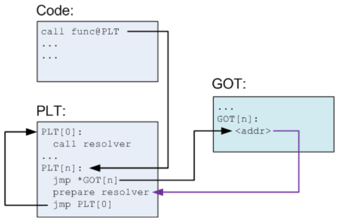

    5. когда функция DSO вызывается снова, то стандартно стартует выполнение кода её записи *PLT* и совершается прыжок на адрес в соответствующей ячейке *GOT*. Поскольку теперь там располагается фактический адрес функции, то сразу начинается её выполнение.

        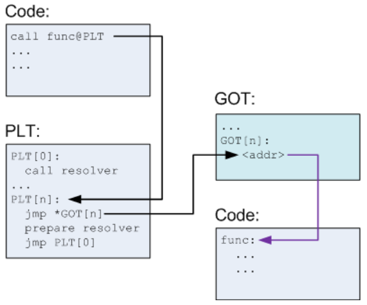

    Необходимость вызывать внешние функции библиотеки косвенно через команды ячеек PLT и запускать поиск их определений резолвером является причиной ЗАПРЕТА на создание в коде библиотек или программ *непосредственных указателей на внешне компнуемые функции DSO*. Чтобы на библиотечную функцию можно было создавать и использовать указатель, она должна быть обозначена как адресуемая (**addressable function**).

    Установка любого значения переменной окружения `LD_BIND_NOW` заставляет **динамический компоновщик** выполнить поиск определений функцией и заполнить таблицу GOT *сразу в момент загрузки библиотеки*. Установка переменной `LD_BIND_NOT`, в свою очередь, заставит его *вообще НЕ обновлять* таблицу GOT - поиск (нового) определения функции будет происходить при каждом её вызове.

#### 9.2.2.3. Порядок поиска определений символов

Механизм разрешения **динамическим компоновщиком** ссылок при выполнении *перемещения символов (symbol relocation)* намеренно спроектирован таким образом, чтобы выполнять поиск определений *во всем множестве* загруженных в память процесса бинарных объектов, а не только в том объекте, который содержит ссылку на символ. Данная логика обеспечивается созданием компоновщиком *глобальной области поиска* (**global lookup scope**), представляющей собой *упорядоченный список* загруженных объектов:

1. во главе списка всегда располагается объект *главной программы*;
2. затем следуют объекты всех *разделяемых библиотек*, используемых программой, в том порядке, в котором они были переданы в команду **статической компоновки**. Добавление библиотек и их собственных зависимостей в область поиска происходит рекурсивно *обходом в ширину*: сначала перечисляются все зависимости самой программы, затем зависимости первой библиотеки, второй библиотеки и так далее;
3. затем следуют объекты *разделяемых библиотек*, *динамически загруженных* в процессе работы программы вызовом `dlopen()` и добавленных в *глобальную область* его параметром `RTLD_GLOBAL` (вместе со своим собственным деревом зависимостей).

Когда библиотека динамически загружается вызовом `dlopen()` с параметром `RTLD_GLOBAL`, то она вместе со своим деревом зависимостей добавляется в *конец глобальной области поиска*. Определяемые ею символы будут доступны всем перемещениям в других библиотеках, также осуществляющим поиск в данной глобальной области. Если же библиотека загружается с параметром `RTLD_LOCAL`, то она вместе со своим деревом размещается в собственной *локальной области поиска* (**local lookup scope**). По своей структуре и способу заполнения локальная область повторяет глобальную (упорядоченный список, рекурсивный обход в ширину), однако она не видна перемещениям из других библиотек.

В соответствии с правилом однократной загрузки *собственные зависимости библиотеки* попадают в её *локальную область*, только если **загружаются впервые**! Если **зависимость уже находится** в **другой локальной области**, то механизм разрешения символов может **выпасть из текущей локальной области** и провалиться в соседнюю - в результате поиск определения символа ошибочно будет продолжаться в несоответствующей области!

Например, программа динамически загружает с параметром `RTLD_LOCAL` дерево зависимостей: `libA.so -> libCommon.so -> libSpec.so`. Затем самая базовая зависимость `libSpec.so` подменяется в файловой системе на другую версию (назовем её `libSpec'.so`) и происходит динамическая загрузка другого дерева: `libB.so -> libCommon.so -> libSpec'.so`. Т.к. `libCommon.so` уже загружена в память процесса, то она будет переиспользована. Если `libCommon.so` в новом дереве будет запустит разрешение символа, ожидаемого в `libSpec'.so`, то поиск провалится в загруженное ранее дерево и ошибочно результируется в `libSpec.so`! Такая проблема конфликта множества загруженных версий библиотек называется **Versioning Hell** или  **DLL Hell**.

Если в загруженной вместе со своими библиотеками программе оказывается **несколько определений** одного символа, то выбирается **первое обнаруженное** при обходе областей поиска. Если в результате всего обхода определение НЕ было обнаружено, то поиск считается неуспешным.

Разрешение имени символа при его *relocation* выполняется в следующей очередности:

+ для разрешения символьной ссылки, расположенной в *главной программе* или *динамически скомпонованной библиотеке*, выполняется обход *глобальной области*;
+ для разрешения символьной ссылки, расположенной в *динамически загруженной с параметром `RTLD_GLOBAL` библиотеке*, выполняется обход *глобальной области*;
+ для разрешения символьной ссылки, расположенной в *динамически загруженной с параметром `RTLD_LOCAL` библиотеке*, выполняется обход сначала *глобальной*, а затем соответствующей *локальной* области;

Способы модификации, описанных выше правил:

+ установка в вызов `dlopen()` дополнительного флага `RTLD_DEEPBIND` заставляет динамический компоновщик выполнять обход *локальной области* перед *глобальной* для разрешения сомвольных ссылок, расположенных в данной библиотеке и всех её **загруженных впервые** зависимостях;
+ сборка библиотеки с параметром `-Wl,-Bsymbolic` является аналогом параметра `RTLD_DEEPBIND`;

    ```bash
    gcc -c -fPIC bar1.cpp bar2.cpp
    gcc -shared -Wl,-Bsymbolic -o libbar.so bar1.o bar2.o
    ```

+ заполнение глобальной переменной `LD_PRELOAD` при запуске программы, заставляет динамический компоновщик переместить (и, следовательно, загрузить) указанную библиотеку на позицию *сразу после* объекта *основной программы* в *глобальной области поиска*;

### 9.2.3. Динамическая загрузка библиотек dlopen

**dlopen** - API *динамического компоновщика*, позволяющий осуществлять загрузку разделяемых библиотек из кода программы во время её выполнения. Этот процесс называют **динамической загрузкой**.

Программа, использующая интерфейс *dlopen*, должна быть собрана с параметром `-ldl` - это позволит скомпоновать её с библиотекой `libdl`.

---

```C
void* dlopen(const char *libfilename, int flags);
```

Загружает указанную библиотеку в виртуальную память процесса, возвращает её дескриптор и увеличивает счетчик открытых ссылок на неё. Поиск файла библиотеки осуществляется в точности с теми же правилами, которые были описаны выше для случая *динамической компоновки*: если аргумент `libfilename` содержит символ-разделить `/`, то он интерпретируется как путь непосредственно до файла библиотеки; в противном случае стартует поиск библиотеки в заданных каталогах. Если загружаемая библиотека зависит от других библиотек, то **дерево зависимостей** будет загружено целиком.

Аргумент `flags` является битовой маской флагов и принимает принимает следующие значения на выбор:

+ `RTLD_LAZY` - неопределенные ссылки на *функции* должны разрешаться только при обращении к ним; ссылка на *переменные* **всегда** разрешаются **незамедлительно**. Данный флаг соответствует поведению при выполнении *динамической компоновки*;
+ `RTLD_NOW` - все неопределенные ссылки разрешаются незамедлительно (до окончания данного вызова). Аналогом передачи данного флага является определение переменной среды `LD_BIND_NOW` с любым непустым значением (она имеет приоритет над `RTLD_LAZY`);

Дополнительные значения на выбор:

+ `RTLD_GLOBAL` - символы из текущей библиотеки и её дерева зависимостей можно использовать для разрешения ссылок из других библиотек, загружаемых процессов;
+ `RTLD_LOCAL` - противоположный по смыслу флаг. Используется **по умолчанию**, если ни один из этих двух флагов не задан явно;

Опциональные флаги-модификаторы:

+ `RTLD_NODELETE` - предотвращает выгрузку библиотеки из памяти при обнулении её счетчика ссылок. В результате глобальные и статические переменные библиотеки не будут заново инициализированы при новом вызове `dlopen()`, следующем за закрытием, обнулившем счетчик ссылок. Является аналогом параметра `-Wl,-znodelete` *динамической компоновки*;
+ `RTLD_NOLOAD` - не загружать библиотеку. Позволяет проверять, была ли она загружена ранее: при положительном ответе будет возвращен уже существующий дескриптор. Также позволяет на ходу ослаблять флаги библиотеки: например, изначальное `RTLD_LOCAL` можно изменить на менее строгое `RTLD_GLOBAL | RTLD_NOLOAD`;
+ `RTLD_DEEPBIND` - при разрешении ссылок текущей библиотеки отдавать предпочтение её собственным глобальным символам перед символами из загруженных ранее библиотек. Является аналогом параметра `-Wl,-Bsymbolic` *динамической компоновки*;

Если аргументу `libfilename` присвоено значение `NULL`, то функция возвращает дескриптор главной программы, называемый *глобальным символьным объектом*. При его использовании в вызове `dlsym()` поиск запрашиваемого сивмола сначала выполняется в главной программе, затем в разделяемых библиотеках, загруженных в процессе *динамической компоновки*, и только затем в библиотеках, загруженных динамически с указанием флага `RTLD_GLOBAL`.

Данная функция может быть многократно вызвана для одной и той же библиотеки - загрузка в память выполняется лишь при первом вызове. Однако счетчик ссылок будет инкрементироваться при каждом новом открытии - для выгрузки библиотеки из памяти процесса она должна быть закрыта соответствующее число раз.

---


### 9.2.4. Правила именования разделяемых библиотек

**Минорная версия** - последовательно инкрементируемый номер, присваиваемый каждой новой **совместимой** сборке библиотеки: предоставляющей одинаковый *интерфейс* и возвращающей идентичные результаты операций.

**Мажорная версия** - последовательно инкрементируемый номер, присваиваемый каждой новой **НЕсовместимой** сборке библиотеки.

При реализации схемы версионирования с библиотекой оказываются связаны 3 имени:

+ **реальное имя** - имя конкретного библиотечного файла. Составляется по образцу: `<name>.so.<major>.<minor>`;
+ **имя soname** - указывает на последнюю минорную версию в рамках данной мажорной. По одному на каждую мажорную версию. Используется динамическим компоновщиком для загрузки библиотеки в память процесса программы. Составляется по образцу: `<name>.so.<major>`;
+ **компоновочное имя** - указывает на имя soname последней мажорной версии. Существует в единственном экземпляре. Передаётся в команды статической компоновки, позволяя им не зависеть от версии библиотеки. Составляется по образцу: `<name>.so`.

Пример реализации схемы версионирования библиотеки:

```bash
# собираем разделяемую библиотеку.
cd /path/to/bar/
gcc -c -FPIC bar1.c bar2.c
gcc -shared -Wl,-soname,libbar.so.1 -o libbar.so.1.1 bar1.o bar2.o
# создаем символические ссылки.
ln -s libbar.so.1.1 libbar.so.1
ln -s libbar.so.1 libbar.so
# собираем программу.
cd /path/to/prog/
gcc -c prog1.cpp prog2.cpp
gcc -o prog prog1.o prog2.o -lbar -L/path/to/bar/
```

На примере выше сначала собирается библиотечный модуль с заданным реальным именем и *псевдонимом soname*. Несколько различных минорных версий библиотеки (в рамках одной мажорной) будут разделять одинаковый soname, каждая отличная мажорная версия будет иметь собственный soname.

Затем выполняется сборка программы с использованием *символической ссылки компоновочного имени* , и имя soname с мажорной версией оказывается встроено в программу.

Смена целевого файла *символической ссылки soname* позволяет регулировать, конкретно какая совместимая минорная версия будет фактически загружена в программу. Минорные версии можно менять на лету - нужен только перезапуск программы.

Смена целевого файла *символической ссылки компоновочного имени* позволяет регулировать, на какую из мажорных версий библиотеки должна настраиваться программа в момент её компоновки с библиотекой. Для смены мажорной версии потребуется пересобрать программу, но команды сборки компоновщика можно будет оставить прежними.

### 9.2.5. Совместное использование статических и разделяемых библиотек

Если в распоряжении **статического компоновщика** имеется оба типа библиотеки с одинаковым именем, то он по умолчанию отдает предпочтением разделяемому варианту.

Чтобы заставить статический компоновщик работать со статической библиотекой, можно:

+ указать полное имя файла библиотеки, включая расширение `.a`: `libname.a`;
+ указать параметр компоновщика `-static` - требовать и использовать статические библиотеки;
+ переключать предпочтения компоновщика через параметры `-Wl,-Bstatic` и `-Wl,-Bdynamic`:

    ```bash
    gcc -o prog prog.cpp -Wl,-Bstatic -lbar -Wl,-Bdynamic -lfoo
    ```

### 9.2.6. Команды оболочки для работы с разделяемыми библиотеками

+ `ldd (list dynamic dependencies)` - выводит список динамических зависимостей ELF-файла по тому же принципу, по которому их поиск осуществляет динамический компоновщик;
+ `ldconfig` - утилита, автоматизирующая процесс развёртывания различных версий библиотек в системе и выполняющая следующие действия:

    1. Проходит по каталогам из *файла конфигурации динамического компоновщика* `/etc/ld.so.conf`, а затем по `/lib` и `/usr/lib` и обновляет *файл кэша* `/etc/ld.so.cache`, помещая в него пути до последних минорных версий всех мажорных версий найденных библиотек. Динамический компоновщик использует этот кэш при запуске программы, чтобы каждый раз не тратить время на обход всех возможных мест размеещния библиотек. Каталог `/usr/local/lib` может по умолчанию присутствовать или отсутствовать в файле конфигурации компоновщика;

    2. Создает или обновляет символические ссылки soname для каждой найденной последней минорной версии;

        **Символическую ссылку компоновочного имени нужно создавать самостоятельно!**

    Параметры вызова команды:

  + `-p` - выводит содержимое кэша динамического компоновщика;
  + `-N` - предотвращает обновление кэша;
  + `-n` - предотвращает обновление кэша, а ссылки создаёт только в указанных каталогах;
  + `-X` - предотвращает создание символьных ссылок;

+ `objdump` и `readelf` - выводит ELF-заголовок и дизассемблированный код исполняемой программы, скомпилированного объекта, статической или разделяемой библиотеки;
+ `nm` - выводит список всех символов (функций, переменных), определенных внутри исполняемой программы или библиотеки.

# 10. Время

При выполнении процесса может представлять интерес замер двух различных типов времени:

+ **календарное время** - длительность реального временного промежутка, отсчитываемого от некоторого фиксированного момента в прошлом. Зачастую точкой отсчета является **Epoch (00:00, 1 января 1970 по UTC)**;
+ **время процесса** - продолжительность использования процессом центрального процессора с момента своего создания.

Реальная точность различных связанных со временем системных вызовов ограничена частотой *программных системных часов*, которые измеряют отрезки времени в единицах, называемых *мгновениями (jiffies)*. Если указываемые в таких вызовах таймауты не кратны временному шагу системы, то они будут округляться в больщую сторону. *Частота программных* часов ядра определяется его настройкой *Processor type and features:Timer frequency*. Параметр конфигурации ядра `CONFIG_HIGH_RES_TIMERS` позволяет активировать *аппаратные часы* высокой точности при их наличии.

## 10.1. Структуры данных для хранения времени

```C
struct timeval
{
    time_t tv_sec;
    suseconds_t tv_usec;
};
```

Структура `timeval` позволяет задавать время с точностью до *микросекунд*:

+ `tv_sec` - количество секунд;
+ `tv_usec` - количество дополнительных микросекунд.

---

```C
struct timespec
{
    time_t tv_sec;
    long tv_nsec;
};
```

Структура `timespec` позволяет задавать время с точностью до *наносекунд*:

+ `tv_sec` - количество секунд;
+ `tv_nsec` - количество дополнительных наносекунд.

## 10.2. Календарное время

Ядро предоставляет обширный набор функций по определению и изменению (требуется привилегия процесса `CAP_SYS_TIME`) установленного в системе календарного времени в различных форматах.

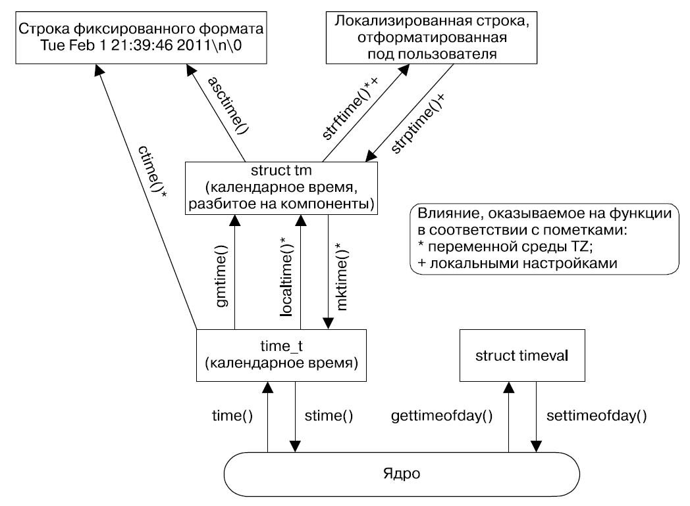

### 10.2.1. Формат timeval

```C
int gettimeofday(
    timeval *tv,
    timezone *tz);
```

Возвращает в аргументе типа `timeval` календарное время системы. Секунды `timeval.tv_sec` представлены в формате *unix time*.

Аргумент типа `timezone` является историческим рудиментом и должен принимать значение `NULL`.

---

```C
int settimeofday(
    const timeval *tv,
    const timezone *tz);
```

Устанавливает календарное время системы на основе переданного в аргументе типа `timeval` значения.

Аргумент типа `timezone` является историческим рудиментом и должен принимать значение `NULL`.

---

```C
int adjtime(
    timeval *delta,
    timeval *olddelta);
```

Подстраивает календарное время системы, **постепенно** добавляя к системным часам переданное в аргументе `delta` смещение. Если предыдущий процесс подстройки не был завершен, то в аргументе `olddelta` возвращается количество оставшегося недобавленного времени. Если какой-либо из аргументов не требуется, то ему можно присвоить значение `NULL`.

### 10.2.2. Формат unix time

Формат **unix time** представляет собой количество секунд, прошедших с **Epoch**.

---

```C
time_t time(time_t *timep);
```

Возвращает календарное время системы в формате *unix time*.

---

```C
int stime(const time_t *timeptr);
```

Устанавливает календарное время системы на основе переданного в формате *unix time* значения.

---

```C
char *ctime(const time_t *timep);
```

Преобразует календарное время из формата *unix time* в строковое представление вида `Wed Jun 8 14:22:34 2011`.

Возвращенная строка является *статически* выделенной, поэтому данная функция **нереентерабельна**! Реентерабельный аналог: `ctime_r()`.

### 10.2.3. Формат broken-down time

Формат **broken-down time** представляет собой структуру данных типа `tm`:

```C
struct tm
{
    int tm_sec;
    int tm_min;
    int tm_hour;
    int tm_mday;
    int tm_mon;
    int tm_year;
    int tm_wday;
    int tm_yday;
    int tm_isdst;
};
```

+ `tm_sec` - секунды (0–60);
+ `tm_min` - минуты (0–59);
+ `tm_hour` - часы (0–23);
+ `tm_mday` - день месяца (1–31);
+ `tm_mon` - месяц (0–11);
+ `tm_year` - год с 1900;
+ `tm_wday` - день недели (воскресенье = 0);
+ `tm_yday` - день в году (0–365; 1 января = 0);
+ `tm_isdst` - флаг летнего времени:
  + `> 0` - летнее время действует;
  + `= 0` - летнее время НЕ действует;
  + `< 0` - информация о летнем времени недоступна.

---

```C
struct tm *gmtime(const time_t *timep);
struct tm *localtime(const time_t *timep);
```

Преобразуют календарное время из формата *unix time* в формат *broken-down time*. Функция `gmtime()` возвращает время в *UTC*, а `localtime()` учитывает *часовой пояс и летнее время*.

Возвращенная структура является *статически* выделенной, поэтому данные функции **нереентерабельны**! Реентерабельный аналоги: `gmtime_r()` и `localtime_r()`.

---

```C
time_t mktime(struct tm *timeptr);
```

Преобразует календарное время из формата *broken-down time* в формат *unix time*. В процессе работы данной функции значения полей аргумента типа `tm` могут быть преобразованы для приведения к указанным в их описании диапазонам - это позволяет передавать в данную функцию аргумент, над которым были выполнены операции временной арифметики.

---

```C
char *asctime(const struct tm *timeptr);
```

Преобразуют календарное время из формата *broken-down time* в строковое представление вида `Wed Jun 8 14:22:34 2011`.

Возвращенная строка является *статически* выделенной, поэтому данная функция **нереентерабельна**! Реентерабельный аналог: `asctime_r()`.

---

```C
size_t strftime(
    char *outstr,
    size_t maxsize,
    const char *format,
    const struct tm *timeptr);
```

Преобразует календарное время из формата *broken-down time* в произвольное строковое представление `outstr`, указанного формата `format`. Аргумент `format` содержит заданные последовательности символов вида `%X` (*спецификаторы*), на место которых происходит подстановка значений структуры `timeptr`.

---

```C
char *strptime(
    const char *str,
    const char *format,
    struct tm *timeptr);
```

Преобразует календарное время из произвольного строкового представления `str` формата `format` в формат *broken-down time*. Аргумент `format` содержит заданные последовательности символов вида `%X` (*спецификаторы*) и определяет способ заполнения полей структуры типа `tm` на основе содержимого переданной строки. Желательно указывать в `str` строку, содержащую информацию о значениях *всех* полей структуры типа `tm`.

### 10.2.4. Часовые пояса

Программы, которым для работы требуется учитывать **часовой пояс** системы и **режим летнего времени**, могут получить данную информацию из файлов каталога `/usr/share/zoneinfo`. Он содержит по одному файлу с соответствующим именем на каждый часовой пояс: EST, CET, UTC, Iran и т.д. Формат файлов часовых поясов описывается в руководстве `tzfile(5)`, а для их создания используется утилита `zic`. **Местное время** системы определяется файлом `/etc/localtime`, являющимся ссылкой на один из файлов часовых поясов.

Чтобы указать часовой пояс системы при выполнении программы, следует в первую очередь присвоить **переменной окружения `TZ`** строку одного из следующих видов:

+ `TZ=":tzfile"`

    Содержит относительное путевое имя файла часового пояса `tzfile` в каталоге `zoneinfo`. Пример: `$ TZ=":Europe/Berlin"`

+ `TZ="std offset [dst [offset][, start-date[/time], end-date[/time]]]"`

    Содержит следующий набор полей:

  + `std` и `offset` - стандартный часовой пояс и его смещение от UTC;
  + `dst` и `offset` - часовой пояс с учетом режима летнего времени и его смещение от UTC;
  + `start-date` и `end-date` - даты перехода со стандартного на летнее время.

  Пример: `$ TZ="CET-1:00:00CEST-2:00:00,M3.5.0,M10.5.0"`

Затем программа осуществляет вызов функции `tzset()`, считывающей информацию из переменной окружения `TZ`.

---

```C
void tzset(void);
```

Проверяет значение переменной среды `TZ` и на её основе инициализирует значения следующих глобальных переменных:

+ `tzname` - названия стандартного и летнего часовых поясов;
+ `daylight` - ненулевое значение, если активен режим летнего времени;
+ `timezone` - смещение в секундах местного времени от UTC.

Если переменная среда `TZ` не была установлена, то данная функция заполняет её значение на основе файла `localtime`. Если переменная среды пустая или недействительная, то будет использован пояс UTC.

## 10.3. Время процесса

Длительность использования процессом центрального процессора подразделяется на две категории:

+ **время в пользовательском режиме** - потраченное на выполнения иструкций прикладного алгоритма программы;
+ **время в режиме ядра** - потраченное на выполнение системных вызовов, инициированных процессом.

Команда оболочки `time` позволяет вывести в терминале значения обеих категорий времени процесса.

---

```C
clock_t times(tms* buf);

struct tms
{
    clock_t tms_utime;
    clock_t tms_stime;
    clock_t tms_cutime;
    clock_t tms_cstime;
};
```

Возвращает в аргументе `buf` время, которое вызывающие процесс *затратил на выполнение* на центральном процессоре *с момента своего старта*.

Процессорное время в полях структуры `tms` разбито по категориям:

+ `tms_utime` - время работы в *пользовательском режиме*;
+ `tms_stime` - время работы в *режиме ядра*;
+ `tms_cutime` - время работы в *пользовательском режиме* завершившихся *дочерних процессов*, для которых было выполнено ожидание `wait()` (и аналоги);
+ `tms_cstime` - время работы в *режиме ядра* завершившихся *дочерних процессов*, для которых было выполнено ожидание `wait()` (и аналоги);

Возвращаемым значением функции является текущее значение *реального времени*, отсчитываемое от *некоторого заданного момента в прошлом* - по этой причине практический смысл имеет только дельта двух значений, полученных из последовательных вызовов в интересующем участке кода. Комбинацию процессорного и реально прошедшего времени, возвращаемых данным вызовом, можно использовать для рассчета утилизации процессора, однако тип `clock_t` не застрахован от переполнения - поэтому для извлечения реального времени рекомендуется использовать предназначенные для этого функции (`gettimeofday()` и аналоги).

Целочисленный тип данных `clock_t` хранит *тики часов*, количество которых в секунде определяется `sysconf(_SC_CLK_TCK)`.

---

```C
clock_t clock();
```

Возвращает общее время процесса в режимах пользователя и ядра, выраженное в `CLOCKS_PER_SEC = 10^6`.

## 10.4. Наносекундные часы POSIX

Для использования часов стандарта POSIX, предоставляющих функционал для измерения времени с *наносекундной* точность, пользовательская программа должна быть скомпилирована с ключом `-lrt` для возможности компоновки с *библиотекой реального времени* `librt`.

---

```C
int clock_gettime(clockid_t clockid, timespec* tp);
```

Возвращает время часов, заданных идентификатором `clockid`.

```C
int clock_getres(clockid_t clockid, timespec* res);
```

Возвращает *точность* часов, заданных идентификатором `clockid`.

```C
int clock_settime(clockid_t clockid, const timespec* tp);
```

Устанавливает время часов `clockid` с округлением до кратного точности `clock_getres()` с округлением в меньшую сторону.

Тип `clockid_t` хранит идентификатор часов и предоставляет следующие константы:

+ `CLOCK_REALTIME` - общесистемные часы *реального времени*, допускающие изменение;
+ `CLOCK_MONOTONIC` - *монотонно возрастающие* часы, измеряющие время с некоторого заданного момента в прошлом (для Linux со старта системы), не допускающие *ручное* изменение времени (допускают корректировку дрейфа часов системным демоном синхронизации времени);
+ `CLOCK_PROCESS_CPUTIME_ID` - часы, измеряющие процессорное (ядро + пользователь) время вызывающего *процесса*;
+ `CLOCK_THREAD_CPUTIME_ID` - часы, измеряющие процессорное (ядро + пользователь) время вызывающего *потока*;
+ `CLOCK_MONOTONIC_RAW` - часы на основе сырого аппаратным временем;
+ `CLOCK_REALTIME_COARSE/CLOCK_MONOTIC_COARSE` - аналоги часов соответствующего типа, функционирующие на основе программых, а не аппаратных часов, и обмениюващие точность измерения на быстродействие вызовов.

---

```C
int clock_getcpuclockid(pid_t pid, clockid_t* clockid);
```

Возвращает идентификатор часов `clockid`, измеряющих процессорное время (ядро + пользователь) *процесса* `pid`. Полученный идентификатор можно использовать в описанных выше вызовах для извлечения значения его времени.

```C
int pthread_getcpuclockid(pthread_t thread, clockid_t* clockid);
```

Возвращает идентификатор часов `clockid`, измеряющих процессорное время (ядро + пользователь) потока `thread`. Полученный идентификатор можно использовать в описанных выше вызовах для извлечения значения его времени.

# 11. Таймеры

## 11.1. Сигнальные интервальные таймеры (УСТАРЕЛИ)

Запущенный **сигнальный интервальный таймеры переживают** `exec()` и **НЕ наследуется в дочерние процессы** в результате `fork()`.

---

```C
struct itimerval {
    timeval it_interval;
    timeval it_value;
};

int setitimer(
    int which,
    const itimerval *new_value,
    itimerval *old_value);
```

Устанавливает для процесса *интервальный таймер* заданного `which` типа, который сработает по истечении таймаута `new_value.it_value`, отправит процессу соответствующий *сигнал* и после продолжит выполняться с интервалом `new_value.it_interval`, если тот имеет ненулевое значение.

Значение таймаута `new_value.it_value` уменьшается системой до нуля - в этот момент происходит срабатывание таймера. Если значение интервала `new_value.it_interval != 0`, то оно переносится в таймаут, и обратный отсчет запускается заново - таймер является периодическим.

Аргумент `which` определяет следующие типы таймеров:

+ `ITIMER_REAL` - отсчет ведется в *реально* прошедшем времени; процессу отправляется сигнал `SIGALRM`;
+ `ITIMER_VIRTUAL` - отсчет ведется в *процессорном* времени *пользовательского режима*; процессу отправляется сигнал `SIGVTALRM`;
+ `ITIMER_PROF` - отсчет ведется в *процессорном* времени *режимов пользователя и ядра*; процессу отправляется сигнал `SIGPROF`.

Процессу доступно **по одному таймеру каждого типа** - повторные вызовы будут переустанавливать уже запущенный таймер.

```C
unsigned int alarm(unsigned int seconds);
```

Более простой интерфейс для установки *однократного* сигнального интервального таймера *реального времени*. По истечении заданного количества секунд `seconds` процессу отправляется сигнал `SIGALRM`.

В Linux вызовы `setitimer()` и `alarm()` используют *один и тот же таймер*, поэтому их перекрёстные вызовы необходимо исключить.

---

```C
int getitimer(int which, itimerval *curr_value);
```

Возвращает время до срабатывания *сигнального интервального таймера* типа `which`.

## 11.2. Сигнальные интервальные таймеры POSIX

Для использования **сигнальных интервальных таймеров POSIX** пользовательская программа должна быть скомпилирована с ключом `-lrt` для возможности компоновки с *библиотекой реального времени* `librt`.

Запущенный **сигнальный интервальный таймер POSIX НЕ переживает** `exec()` и **НЕ наследуется в дочерние процессы** в результате `fork()`.

---

```C
struct sigevent {
    int sigev_notify;
    int sigev_signo;
    sigval sigev_value;
    union {
        pid_t _tid;
        struct {
            void (*_function)(sigval);
            void *_attribute;
        } _sigev_thread;
    } _sigev_un;
};
#define sigev_notify_function _sigev_un._sigev_thread._function
#define sigev_notify_attributes _sigev_un._sigev_thread._attribute
#define sigev_notify_thread_id _sigev_un._tid

int timer_create(
    clockid_t clockid,
    sigevent *evp,
    timer_t *timerid);
```

Создаёт интервальный POSIX-таймер `timerid`, отсчитывающий время с помощью часов `clockid`, чей идентификатор задаётся либо описанной выше константой, либо получается вызовом `clock_getcpuclockid()/pthread_getcpuclockid()`.

Аргумент `evp` определяет механизм уведомления процесса о срабатывании таймера.

Поле `sigevent.sigev_notify` задаёт способ уведомления:

+ `SIGEV_NONE` - без уведомления; процесс самостоятельно проверяет таймер через `timer_gettime()`;
+ `SIGEV_SIGNAL` - с помощью *сигнала* `sigevent.sigev_signo`: стандартного или реального времени (сопровождающие данные доступны в `sigevent.sigev_value`); сигнал доставляется *в любой из потоков* вызывающего процесса;
+ `SIGEV_THREAD` - при срабатывании таймера стартует новый поток с функцией `sigev_notify_function`, принимающей данные из `sigevent.sigev_value`; атрибуты потока указываются в `sigevent.sigev_notify_attributes`;
+ `SIGEV_THREAD_ID` - аналог `SIGEV_SIGNAL`, доставляющий *сигнал* в конкретный поток `sigevent.sigev_notify_thread_id` вызывающего процесса; потоки должны быть созданы с параметром `clone(CLONE_THREAD)`;

Если `evp = NULL`, то для вызова используется тип уведомления `SIGEV_SIGNAL` с *сигналом* `SIGALRM`.

Для *каждого* создаваемого в вызывающем процессе POSIX-таймера ядро заранее выделяет структуру для хранения *сигнала реального времени*, поэтому количество *POSIX-таймеров* процесса ограничено размером его *очереди сигналов реального времени*. Однако *дубликаты* сигналов реального времени, сгенерированные POSIX-таймерами, в очереди не сохраняются - вместо этого для них взводится *счетчик повторых срабатываний*, который можно узнать вызовом `timer_getoverrun()`.

---

```C
struct itimerspec {
    timespec it_interval;
    timespec it_value;
};

int timer_settime(
    timer_t timerid,
    int flags,
    const itimerspec *value,
    itimerspec *old_value);
```

Устанавливает интервальный POSIX-таймер `timerid`, который сработает через определенный с точностью до *наносекунд* промежуток времени `value.it_value`, уведомит процесс указанным при создании таймера способом и после продолжит выполняться с *относительным* интервалом `value.it_interval`, если тот имеет ненулевое значение.

Если аргумент `flags = 0`, то `value.it_value` задаёт *относительную задержку* таймера. Если `flags = TIMER_ABSTIME`, то `value.it_value` задаёт *абсолютную временную метку* таймаута в будущем.

*Абсолютный таймаут* подвержен ручному переводу системных часов, а *относительные задержка и интервал* - нет.

Точность таймера округляется до шага используемых им часов с округлением в большую сторону.

---

```C
int timer_gettime(timer_t timerid, itimerspec *curr_value);
```

Возвращает время до срабатывания таймера `timerid`.

---

```C
int timer_getoverrun(timer_t timerid);
```

Возвращает счетчик *повторных срабатываний* таймера `timerid`. Счетчик *сбрасывается* после доставки сигнала таймера. Вызов является *безопасным для обработчика* сигнала.

---

```C
int timer_delete(timer_t timerid);
```

Удаляет таймер `timerid`, останавливая его при необходимости. Сработавший ранее и ожидающей доставки *сигнал* сохраняется.

## 11.3. Интервальные таймеры timerfd

`timerfd` - это интерфейс интервальных таймеров с уведомлением о срабатывании через *файловый дескриптор*.

Отслеживание таймера осуществляется посредством *чтения* его файлового дескриптора: либо через обыкновенный `read()`, либо через мультиплесирование ввода/вывода `select()/poll()/epoll()`. Буфер для чтения должен вмещать `uint64_t`. Операция чтения либо возвращает положительное число произошедших срабатываний, либо блокируется (если не активирован *неблокирующий режим* - будет возвращена ошибка `EAGAIN`).

Запущенный **интервальный таймер timerfd переживает** `exec()` и **наследуется в дочерние процессы** в результате `fork()`. Поэтому по завершении работы с таймером его дескриптор необходимо закрыть через `close()` для освобождения ресурсов.

---

```C
int timerfd_create(int clockid, int flags);
```

Создаёт *файловый дескриптор таймера*, отсчитывающего время с помощью часов `clockid`.

Аргумент `clockid` содержит значения: `CLOCK_REALTIME`, `CLOCK_MONOTONIC`.

Аргумент `flags` содержит флаги:

+ `TFD_CLOEXEC` - установить для дескриптора флаг *close-on-exec*;
+ `TFD_NONBLOCK` - установить для дескриптора *неблокирующий* режим.

---

```C
int timerfd_settime(
    int fd,
    int flags,
    const itimerspec *new_value,
    itimerspec *old_value);
```

Аналог функции `timer_settime()`: устанавливает таймер, который сработает через определенный с точностью до *наносекунд* промежуток времени и будет повторяться, если для него задан период.

Аргумент `flags` может принимать значение `TFD_TIMER_ABSTIME` - в этом случае `new_value.it_value` задаёт абсолютную временную метку таймаута.

---

```C
int timerfd_gettime(int fd, itimerspec *curr_value);
```

Аналог функции `timer_gettime()`: возвращает время до срабатывания таймера `fd`.

# 12. Локализация

**Локаль** - совокупность параметров системы, определяемых языковыми и культурными нормами. Информация о всех имеющихся в системе локалях размещается в каталоге `/usr/share/locale` (либо `/usr/lib/locale`). Он содержит набор каталогов, каждый из которых описывает локаль определенной географической территории. Каталоги локалей имеют название следующего вида:

`language[_territory[.codeset]][@modifier]`

+ `language` - ISO-код языка;
+ `territory` - ISO-код территории (страны);
+ `codeset` - используемая кодировка символов;
+ `modifier` - уникальный признак, позволяющий отличать каталоги с совпадающими названиями.

Пример названия каталога локали: `de_DE.utf-8@euro`. Стандартная локаль UNIX-систем, определяющая их исторически сложившееся поведения, имеет название `POSIX` (либо синонимичное `C`). Полный список альтернативных имен локалей находится в файле `/usr/share/locale/locale.alias`.

Команда оболочки `locale` позволяет вывести различную информацию о локалях системы.

Cгруппированный по своему назначению набор требующих локализации параметров системы образует **категорию локали**:

+ `LC_CTYPE` - классификация символов (существующие буквы и цифры), правила преобразования верхнего и нижнего регистров;
+ `LC_COLLATE` - правила сортировки символов;
+ `LC_MONETARY` - правила форматирования денежных величин;
+ `LC_NUMERIC` - правила форматирования чисел;
+ `LC_TIME` - правила форматирования даты;
+ `LC_MESSAGES` - форматы сообщений, выводимых программой (например, утвердительные и отрицательные выражения).
+ `LC_ALL` - категория, объединяющая в себе все возможные категории локали.

---

```C
char *setlocale(int category, const char *locale);
```

Устанавливает для использования в процессе категорию `category` локали `locale`.

Если аргумент `locale` является пустой строкой, то в качестве используемых будут установлены те категории, которые были переданы в процесс в соответствующих переменных окружения. Например:

`LC_TIME=it_IT LC_NUMERIC=de_DE program`

Если аргумент `locale` имеет значение `NULL`, то функция только возвращает текущее используемое значение указанной категории.
